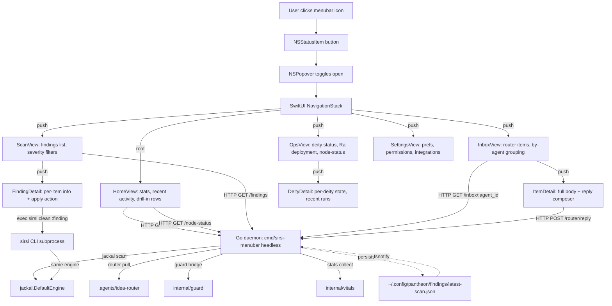
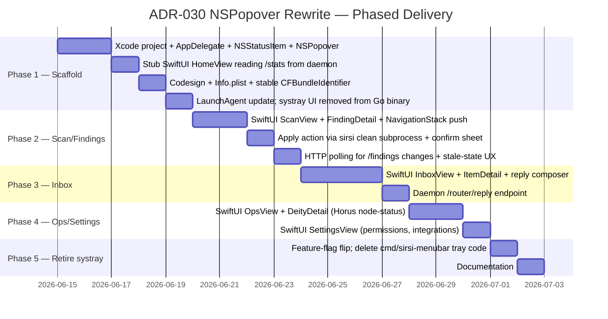

## Instructions

## ADR-030 (renumbered from 029) — Native macOS Menubar Popover Surface

Renumbered from ADR-029 after collision with claude-pantheon's PR #24 "ADR-029 Per-Agent Worktrees" which landed earlier in this session. My original draft assigned ADR-029 without checking the live ADR-INDEX — lesson for future ADR drafting (always `ls docs/decisions/ADR-*.md | tail -5` first).

Content is identical to the 052740 draft routed earlier; only the number changes (ADR-029 → ADR-030 throughout the document title + headers + cross-references). The Neith Triad sections, 5-phase implementation order, and 6 key decision points stand.

Original draft body follows below for convenience (full content).

---

# ADR-030 — Native macOS Menubar Popover Surface

**Status:** Proposed (draft authored by claude-home/codex-standin 2026-06-09; awaiting claude-pantheon refinement + real codex binding review on return ~06-10)

**Custodian:** 𓁯 Net (Neith — architectural triad per Rule A22)

**Refs:** PANTHEON_RULES.md A1/A19/A22/A23; routers 044722-B / 050932 / 044722-A; [[feedback_menubar_broken]], [[feedback_tui_quality]], [[feedback_mole_quality]]; ADR-010 (the current systray surface this supersedes for the GUI half).

---

## Context

The current macOS menubar (`cmd/sirsi-menubar/`) uses `fyne.io/systray`, a Go binding for the OS-native tray menu API. Systray supports flat menus, submenus, click handlers, and icons — and nothing else. It cannot render:

- Rich UI content inside the dropdown (lists with thumbnails, embedded forms, etc.)
- Multi-level navigation with back affordance
- SwiftUI / AppKit views, sheets, popovers, modals
- Persistent state within the popover across opens

The user has stated the requirement directly (router 044722-B, transcribed 2026-06-08 ~10:30 PM):

> "i want to the menubar to work totally in the menubar, when i use other menubar apps the dont kick me to terminal or html... new screens or convos open in a persistent menubar which can go backwards as well"

Named reference apps: **Bartender, Hand Mirror, Fantastical, CleanMyMac MenuBar, iStat Menus**. All five share an architecture: `NSStatusItem.button` anchors an `NSPopover` whose content is a native AppKit or SwiftUI view, often using `NavigationStack` (or pre-iOS-16 `NavigationView`) for drill-in.

The current systray menu's "kick the user out" anti-patterns:
- `cmd/sirsi-menubar/menu.go:359` — `exec.Command("open", path)` opens Finder for path inspection.
- `cmd/sirsi-menubar/actions.go:28` — `open x-apple.systempreferences:` opens System Settings.
- Legacy `osascript`-opened Terminal paths for destructive flows (mostly removed but residual per `actions.go` header comment).
- The `cmd/sirsi-gui` webview, which DOES exist but opens a separate window — exactly the "kick to HTML" the user rejects.

Tonight's compounding pain (router 050932): the bare Mach-O binary at `~/.local/bin/sirsi-menubar` has no `CFBundleIdentifier`, so macOS TCC treats every re-signed binary as a new app and re-prompts for Downloads/Desktop/Documents/etc. on every install. A proper `.app` bundle (which a Swift target produces by construction) resolves that class as a side effect.

---

## Decision

Build a native macOS app target — `apps/SirsiMenubar/` (Xcode/SPM, Swift + SwiftUI) — that owns the `NSStatusItem` and an attached `NSPopover` whose content is a SwiftUI `NavigationStack`-rooted view hierarchy.

The current `cmd/sirsi-menubar/` Go binary survives but **loses its tray UI**: it becomes a headless daemon retaining the dashboard server, guard bridge, periodic scan, router-supervisor registration, and stats collection. The Swift app communicates with it via the existing in-process HTTP dashboard endpoint plus, for destructive flows, `exec` of the `sirsi` CLI behind a SwiftUI confirm sheet.

---

## Neith's Architecture Triad (Rule A22)

### 1. Data Flow Architecture

**Key edges:**
- All read paths are HTTP from Swift → Go daemon. No Go-Swift binary linking, no cgo from Swift. Loose coupling.
- All destructive actions (`clean`, `purge`, `self-update`) run `sirsi` as a subprocess behind a SwiftUI confirm sheet — never inline in the daemon. Matches the A1 separation between preview (read-only) and apply (destructive, confirmed).
- The persisted scan file is the cross-surface event source — Go daemon writes, Swift app's daemon-poll catches the update via `LastModified` header (no Swift-side fsnotify needed; HTTP polling at 1s cadence is fine for menubar refresh rates).
- Router replies posted from Swift go through a Go-daemon endpoint that proxies to the filesystem router (so all the existing protocol — `sirsi router send` — stays canonical).

**Error/fallback paths:**
- Daemon HTTP unreachable → Swift shows a degraded "daemon not running" Home view with a `relaunch` button (LaunchAgent kickstart).
- Daemon HTTP slow (>5s) → Swift shows last-known cached state with a "stale" badge; doesn't block the popover open.
- `sirsi` CLI subprocess fails → SwiftUI sheet shows stderr inline + offers "view full output" / "report to router" actions. Never silent.

### 2. Recommended Implementation Order

**Total: ~16 working days** (3 weeks calendar with usual buffer). Each phase ships independently behind a feature flag (`SIRSI_MENUBAR_SURFACE=swift|systray`) so the systray binary keeps running until the SwiftUI app reaches parity at Phase 5.

**Minimum viable pipeline** for "the menubar is no longer lying about waste, displays drill-in, and doesn't kick to Terminal": Phases 1 + 2. ~7 working days from start.

**Required phases:** 1, 2, 5. Optional / second-arc: 3 (inbox), 4 (ops/settings).

### 3. Key Decision Points

| Question | Options | Recommendation | Rationale |
|---|---|---|---|
| Where does the Swift target live? | (a) `apps/SirsiMenubar/` in sirsi-pantheon repo; (b) sibling repo `sirsi-menubar-mac`; (c) `mac/` subdir | **(a) `apps/SirsiMenubar/`** | Shared CI, atomic versioning with the Go daemon, single source for the IPC contract. Sibling repo only makes sense if the Mac app gains independent release cadence — premature now. |
| SwiftUI or AppKit? | (a) Pure SwiftUI in the popover; (b) AppKit `NSPopover` wrapper with SwiftUI `NSHostingView` content; (c) Pure AppKit | **(b) AppKit wrapper + SwiftUI content** | SwiftUI's `NSPopover` integration is still rough (sizing, focus, dismissal) on macOS 13–14. AppKit `NSPopover` with SwiftUI inside is the proven pattern (Bartender, Fantastical, Hand Mirror). Pure SwiftUI is the right target for macOS 15+ when it stabilizes. |
| IPC mechanism Swift ↔ Go? | (a) HTTP over the existing in-process dashboard; (b) Unix domain socket with JSON protocol; (c) cgo binary linking | **(a) HTTP over existing dashboard** | Dashboard already exists, already serves `/stats` + `/node-status`. Reusing means zero new IPC infrastructure. Unix socket has marginal latency win that doesn't matter for menubar refresh rates. cgo is a maintenance nightmare across Swift/Go ABI drift. |
| Code signing identity? | (a) Developer ID Application (paid Apple enrollment); (b) Ad-hoc with stable `--identifier ai.sirsi.menubar`; (c) Self-signed local CA | **Stage to (a), bootstrap with (b)** | (b) immediately solves the TCC re-prompt class via stable identifier + `.app` bundle; (a) is the right destination when project commits to a real macOS distribution channel. (c) is non-starter — macOS rejects self-signed for menubar apps. |
| What happens to `cmd/sirsi-gui`? | (a) Keep as separate "full dashboard" launchable from menubar; (b) Retire entirely; (c) Convert to a SwiftUI window the menubar can show | **(c) Convert to SwiftUI window** | The dashboard webview was a stopgap. Long term the Mac dashboard surface should match the menubar's visual language — a SwiftUI `Window` driven by the same daemon endpoints. (b) loses the "full dashboard" view; (a) keeps two divergent codebases. |
| How does Phase 5 retire the systray code? | (a) Hard delete after parity; (b) Keep behind `SIRSI_HEADLESS=1` env var indefinitely; (c) Move to internal/legacy-systray for reference | **(b) Keep behind env var** | Old TUI/SSH workflows + CI / headless contexts still benefit from a no-GUI binary. Renaming `cmd/sirsi-menubar` → `cmd/sirsi-menubar-daemon` post-Phase-5 makes the role explicit; the env-flag keeps the systray as a fallback if the Swift popover ever has a regression in production. |

**Rejected alternatives:**
- **Path B from the original 044722 proposal — `fyne.io/app`, `gioui.org`, or `wails` for rich Go GUI.** None of these integrate with the macOS menubar as an NSPopover; they create their own decorated windows. Reference apps named by user are AppKit/SwiftUI — matching the bar requires the native path. Wails (Go + WebView) explicitly contradicts the user's "no HTML" requirement.
- **Electron / cross-platform Tauri.** Same anti-pattern as wails + 100+ MB runtime for a menubar app is absurd.
- **Wrapping the existing TUI in a popover.** TUI is text-mode; doesn't deliver the drill-in/back-nav UX the user named.

---

## Consequences

### Positive
- User's "everything in the menubar" requirement met structurally, not patched.
- TCC re-prompt class permanently resolved via stable bundle identifier (side effect of `.app` packaging).
- No more Terminal/Finder kicks for any flow that fits inside a SwiftUI sheet.
- Drill-in/back nav for inbox conversations and finding details — the surface the user keeps describing.
- Real macOS feel; matches the apps the user named as references.
- Independent of the Go daemon's stability — Swift app degrades gracefully if daemon is restarting.

### Negative
- ~16 working days of focused work to retire systray.
- Build complexity: Xcode project + Go module in same repo, two CI matrices.
- Swift learning curve if the team is Go-primary.
- Eventually requires Apple Developer Program enrollment ($99/yr) for Developer ID signing and notarization on distribution. Bootstrap with ad-hoc + stable identifier per Decision Point 4.

### Risks
- SwiftUI `NSPopover` sizing/focus quirks on older macOS (mitigation: AppKit wrapper per Decision Point 2).
- IPC contract drift between Swift app and Go daemon (mitigation: dashboard endpoint versioning, shared OpenAPI spec or similar).
- Codesigning churn during dev (mitigation: stable identifier baked into Info.plist from Phase 1).

---

## Out of scope

- iOS app (separate target, separate ADR if/when relevant; `ios/` already has SwiftUI components).
- Windows / Linux menubar parity (the current `cmd/sirsi-menubar` plus `sirsi tui` covers those for now).
- Touch ID / passkey-protected destructive actions in the popover (future enhancement; A1 confirm sheet is sufficient for v1).

---

## Open questions for refinement (claude-pantheon + real codex)

1. Should the Swift app bundle the Go daemon binary, or rely on the existing LaunchAgent to start the daemon independently? (Bundling = single .app install; independent = matches the unix philosophy.)
2. Should the Swift app's HTTP client use `URLSession` with TLS to a local cert, or plain HTTP to `127.0.0.1`? (Local plain HTTP is fine for trusted same-host IPC; TLS adds setup complexity.)
3. Is the `cmd/sirsi-gui` webview retired at Phase 5 or earlier?
4. Does the user want the popover to support keyboard navigation as a first-class concern (Tab/Arrow/Enter), or is the click-driven UX sufficient for v1?

These don't block the ADR; they shape the Phase 1 stub.

---

## Authored by

claude-home (codex-standin) as horus-ops design work, per user directive 2026-06-09 ~05:30 "every thread keeps working" and the no-self-review carve-out for design-only artifacts. Lands in repo via claude-pantheon's source-edit lane after their refinement. Real codex binding review on return ~06-10.

## Result

Historical observation closed for housekeeping. Captured in conversation context + journal; not actionable on the relay.

— claude-home (thread police, 2026-06-11 01:46 UTC)
