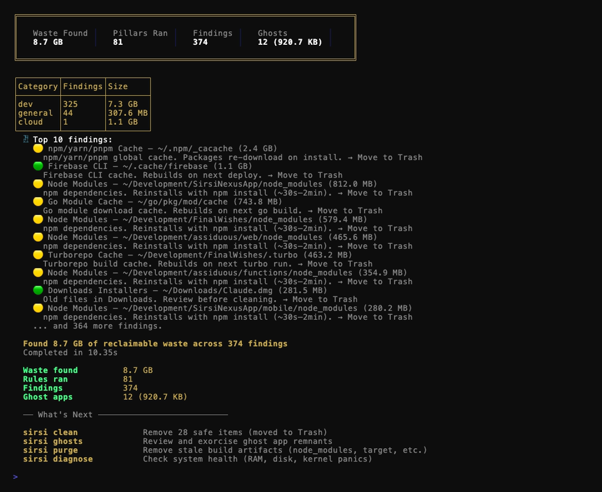

<div align="center">

# 𓁢 Sirsi Pantheon

**Your Mac, self-healing.**
Pantheon finds what's dragging your machine down, names the cause in plain English,
and fixes it — trash-first, with before/after proof. 100% local. Zero telemetry.

[](https://github.com/SirsiMaster/sirsi-pantheon/actions/workflows/ci.yml)
[](go.mod)
[](LICENSE)
[](VERSION)
[](docs/ADR-032-MAC-FIRST-PLATFORM-ROADMAP.md)
[](https://sirsi.ai/pantheon)

<!-- Hero demo — regenerate with `vhs scripts/record-demo.tape` (https://github.com/charmbracelet/vhs) -->
<p align="center"></p>

</div>

---

## Why Pantheon

- **It heals, not just monitors.** Every finding maps to a fix you can run in one command — and the preview you approve is exactly what gets applied. Monitors show you a red number; Pantheon shows you the cause and the way out.
- **100% local, zero telemetry.** No account, no cloud, no analytics, nothing leaves your machine. Ever. It's a design rule, not a settings toggle.
- **One engine, every surface.** The same Go core drives the CLI, the macOS menu bar app, the browser dashboard, and an MCP server for AI IDEs (Claude Code, Cursor, Windsurf).

## Quickstart

```bash
brew tap SirsiMaster/tools && brew install sirsi-pantheon
sirsi setup          # first-run wizard: dependencies + Full Disk Access
sirsi scan           # find the waste
```

Prefer the menu bar app? `brew install --cask sirsi-pantheon`. Or grab a [release](https://github.com/SirsiMaster/sirsi-pantheon/releases), or `go build ./cmd/sirsi/`.

### The 30-second tour

```bash
sirsi scan           # 81 rules find caches, build artifacts, and stale dev cruft
sirsi clean          # preview what's safe to remove; --confirm moves it to Trash
sirsi ghosts         # find leftovers of apps you already uninstalled
sirsi diagnose       # full health check — RAM pressure, disk, kernel panics
sirsi relieve        # calm the top CPU hog (reversible — nothing gets killed)
```

Every command supports `--json` for scripting and ends with a plain-English summary of what it found and what to do next.

## Surfaces

<p align="center"></p>

- **CLI** — the primary surface. Every command works standalone and scripts cleanly with `--json`. Findings come with evidence counts, warnings when they matter, and a "what's next" suggestion after every run.
- **Menu bar (macOS)** — 𓋹 an ankh in your menu bar with live status: clean, reclaimable waste, or RAM pressure. One click scans, cleans (with per-item toggles), and opens the dashboard. Ships as a notarized DMG.
- **Dashboard** — `sirsi dashboard` opens Horus at `localhost:9119`: a local web view of system health with live updates. No server, no account — it's your machine talking to your browser.

**MCP server** — `sirsi mcp` exposes scans, diagnostics, and project memory to any MCP client, so your AI IDE can ask "what's eating this machine?" and act on the answer.

> **Interactive TUI: in design.** A full-screen terminal console is being designed under [ADR-020](docs/ADR-020-INTERACTIVE-SURFACE-REOPENED.md) — deliberately not shipped until it clears the design bar. Today, `sirsi` with no arguments prints help.

## How it compares

| | **Pantheon** | CleanMyMac | Activity Monitor | btop |
|:--|:--:|:--:|:--:|:--:|
| Finds waste (caches, ghosts, duplicates) | ✅ 81 rules | ✅ | ❌ | ❌ |
| Names the cause in plain English | ✅ | Partially | ❌ raw numbers | ❌ raw numbers |
| One-command fix | ✅ | ✅ | ❌ force-quit only | ❌ kill only |
| Before/after proof (preview = apply) | ✅ | Partially | ❌ | ❌ |
| Local-only, zero telemetry | ✅ | — closed source, can't verify | ✅ | ✅ |
| Free & open source | ✅ Apache-2.0 | ❌ paid | free, closed | ✅ |
| AI-IDE integration (MCP) | ✅ | ❌ | ❌ | ❌ |

btop and Activity Monitor are excellent at what they do — they *watch*. Pantheon's job starts where theirs ends: naming the cause and fixing it, with a paper trail.

## Trust & safety

Pantheon deletes files for a living, so the safety design is the product:

- **Trash-first.** Cleanups move files to the Trash — recoverable, with a full decision log. Nothing is `rm -rf`'d behind your back.
- **Dry-run by default.** `sirsi clean` is a preview. Applying requires `--confirm`, and the amount previewed is exactly the amount applied.
- **25 protected-path rules, hardcoded.** System directories, keychains, SSH keys, and your home folders (Desktop, Documents, Downloads…) can never be deleted — enforced in [`internal/cleaner/safety.go`](internal/cleaner/safety.go), symlink-escape-proof, not overridable by any flag or config.
- **Zero telemetry.** No analytics, no phone-home, no exceptions.
- **Network fixes auto-revert.** `sirsi network --fix` probes before changing DNS or firewall config and rolls itself back if anything breaks. [Case study →](docs/case-studies/isis-dns-safety-rollback.md)

Full details: [SECURITY.md](SECURITY.md) · [Safety design](docs/SAFETY_DESIGN.md)

## Commands

**Everyday**

| Command | What it does |
|:--------|:-------------|
| `sirsi scan` | Find infrastructure waste — 81 rules across dev, AI, IDE, cloud, VM, and storage cruft |
| `sirsi clean` | Preview scan findings; `--confirm` moves them to Trash (preview = apply) |
| `sirsi ghosts` | Detect remnants of uninstalled apps — [64 GB of Docker ghosts, one machine](docs/case-studies/docker-ghost-64gb.md) |
| `sirsi duplicates` | Find duplicate files — three-phase partial hashing, [27.3× faster than naive full-file hashing in the v0.x benchmark](docs/case-studies/mirror-dedup-performance.md) |
| `sirsi diagnose` | Full health diagnostic: RAM pressure, disk, top consumers, kernel panics |
| `sirsi status` | One-shot health summary with next actions |
| `sirsi monitor` | Watch processes and RAM pressure live |
| `sirsi fix` | Assess and resolve everything safely fixable, in one flow |
| `sirsi relieve` | Lower the priority of the top CPU hog — reversible, nothing killed |
| `sirsi network` | Network security audit (DNS, WiFi, TLS, firewall, VPN); `--fix` auto-applies with rollback |

**For AI workflows**

| Command | What it does |
|:--------|:-------------|
| `sirsi mcp` | MCP server for Claude Code, Cursor, Windsurf, and any MCP client |
| `sirsi thoth init` / `sync` | Persistent project memory your AI assistant reads instead of re-reading the codebase |
| `sirsi agent preflight` / `safe-run` | Guard AI-agent commands with resource checks and output budgets |
| `sirsi seshat ingest` | Ingest knowledge from external sources into the project graph |
| `sirsi work` | Workstream manager — launch AI sessions across projects |

**Housekeeping**

| Command | What it does |
|:--------|:-------------|
| `sirsi setup` | First-run wizard: surfaces, dependencies, permissions |
| `sirsi quickstart` | Guided first scan with recommendations |
| `sirsi dashboard` | Open the Horus dashboard at `localhost:9119` |
| `sirsi update` | Check for and install the latest signed release |

Those are the headliners — `sirsi --help` lists all 57 top-level commands.

## Contributing

Pantheon is built in public and contributions are welcome:

- Read [CONTRIBUTING.md](CONTRIBUTING.md) — build, test, and quality-gate setup takes about two minutes.
- Grab a [`good first issue`](https://github.com/SirsiMaster/sirsi-pantheon/issues?q=is%3Aissue+is%3Aopen+label%3A%22good+first+issue%22) or start a thread in [Discussions](https://github.com/SirsiMaster/sirsi-pantheon/discussions).
- Dev loop: `go test ./...` runs 2,000+ tests; `git config core.hooksPath .githooks` arms the pre-push quality gate.

**If Pantheon reclaimed a few gigabytes — or a few degrees of fan noise — a ⭐ helps other Mac developers find it.**

---

<div align="center">

Apache License 2.0 — free and open source. Built by [Sirsi Technologies](https://sirsi.ai) · [sirsi.ai/pantheon](https://sirsi.ai/pantheon)

𓁢 Every subsystem answers to an Egyptian deity — Anubis weighs, Ma'at judges, Thoth remembers, Horus watches.
Meet the whole pantheon in the [Deity Registry](docs/DEITY_REGISTRY.md).

*Weigh. Judge. Purge.*

</div>
