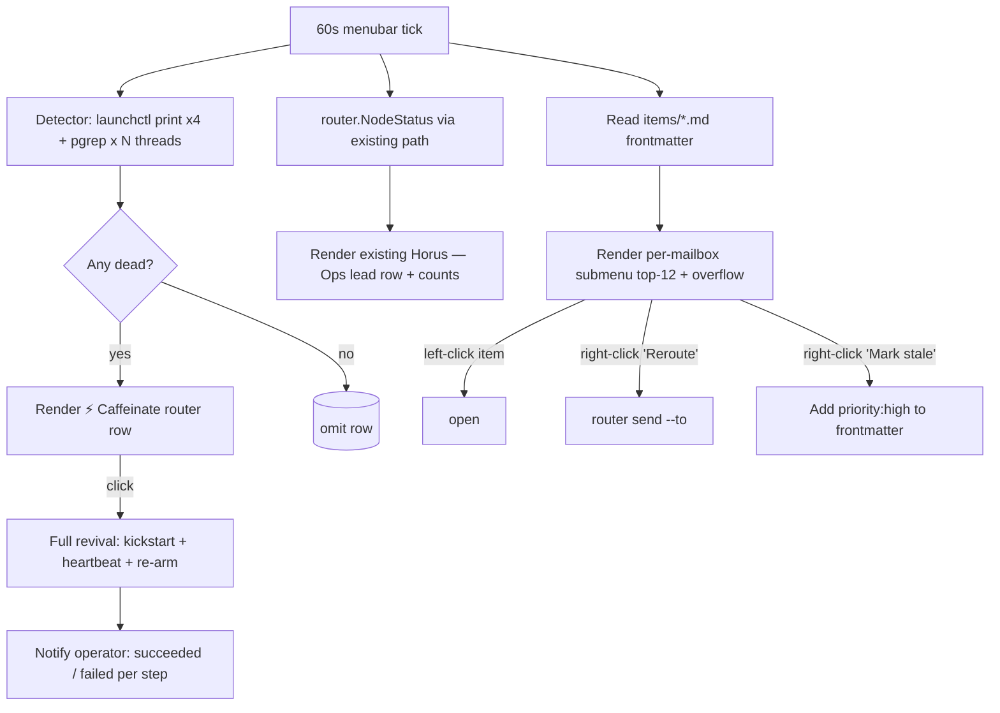

# ADR-027: Router Menubar Surface — Operator-Visible Inbox + Caffeinate

## Status
**Proposed** — June 8, 2026. Owner: claude-pantheon (sirsi-pantheon repo,
menubar lane per ruling `20260602-023813`). Routed to codex-pantheon for
arch-verify. /goal: menubar can show per-mailbox inbox items, operator can
override-act on stale items, one-click full-revival caffeinate restores the
supervisor stack when any piece goes dead.

## Context

ADR-026 step 4b shipped *Horus — Ops*: the menubar shows live thread counts,
queue depth, and a 🟢/🟡/🔴 lead-row glyph derived from `dashboard.Summarize`
(commits `08f78cb`/`d91acb1`). That answered "is anything pending?" — but
operators (Cylton) need three more capabilities surfaced where they already
look:

1. **Per-mailbox drill-down.** "claude-finalwishes has 3 pending" is the
   *headline*; the operator can't see *which* items without dropping into
   `sirsi router pull <agent>` in a terminal. Stale work is invisible until
   the agent wakes — by which time the operator has lost the chance to
   reroute or override.
2. **Operator override-act.** When an item is mis-routed, stale beyond an
   acceptable window, or blocked on a decision only the operator can make,
   the menubar should offer a fast path: open the item file, reroute it,
   raise a stale-priority marker. Note: we *cannot* literally force another
   agent to pull (A27 — each watcher pulls on its own cadence). What we *can*
   do is give the operator equal-or-better visibility + action than the
   target agent has, which is the actual semantic intent.
3. **Caffeinate the router when it's dead.** Today, when
   `com.sirsi.idea-router` / sweep / registry-police LaunchAgents fail, or a
   registered thread's `/loop` watcher dies (the F1 non-durability class
   ADR-024 Amendment 1 traced), the *operator only learns when items
   silently stop dispatching*. There should be a single-click "wake
   everything up" affordance that's *visible only when something is dead* —
   so the menubar tells the truth about supervisor health and offers the
   repair in one place.

## Decision

### Lane: extends Horus — Ops; new section "𓂀 Router — Inbox"
The existing `Horus — Ops` section stays as the *roll-up* (counts + drift
glyph). A new sibling section `𓂀 Router — Inbox` adds the per-mailbox + act
+ caffeinate surfaces. Same `setup.SirsiBinaryPath` and `MenubarBinaryPath`
patterns; no new resolver class. Hosted by the menubar's existing in-process
process — no new daemon, no LaunchAgent.

### 1. Per-mailbox drill-down — **direct filesystem read**
The menubar reads `.agents/idea-router/items/*.md` directly. The router IS
"five verbs over a directory of markdown files" (per `sirsi router` help) —
the menubar has the same disk, same repo, same source of truth. Going
through HTTP would be a serialize/deserialize round trip for data already
under the menubar's fingertips. Same one-read-model invariant as ADR-026.

Render shape (NSMenu-safe, bounded the same way `OpsSummary` is — top-N=12
per mailbox, "+N more…" overflow row):
```
𓂀 Router — Inbox ▸
   claude-finalwishes (3 open) ▸
      · STATUS CORRECTION: package audit not done    [3d]
      · ACCEPT router footprint findings              [4h]
      · PART 2 UNBLOCKED: branch protection           [12m]
   claude-pantheon (1 open) ▸
      · STATUS CORRECTION: package audit not done    [3d]
   codex-pantheon (0 open)                              ·
   · · ·
   ⚡ Caffeinate router            (hidden unless dead)
```

Each per-mailbox submenu reads the YAML frontmatter of every `items/*.md`
once per refresh tick (60s, piggybacking the existing stats loop — no new
timer). Bounded scan; no filesystem watcher needed at this scale (< few
hundred items typical).

### 2. Operator override-act — three click verbs per item
| Click | Action | Implementation |
| :--- | :--- | :--- |
| left | `open <items/id.md>` in default editor | `exec.Command("open", path)` (`open(1)` on macOS handles `.md` association) |
| right → "Reroute to…" | submenu of registered agent_ids → `sirsi router send` with same body, new `to:` | calls `setup.SirsiBinaryPath()` |
| right → "Mark stale" | rewrites the item's frontmatter to add `priority: high`; next inbox pull surfaces it first | direct YAML edit (item files are markdown, single-writer per A21 ensured by the operator-initiated nature) |

Stale highlighting (purely visual, no action): item with `opened: > 24h ago`
renders with a 🟡 prefix; > 72h with 🔴. Same icon ladder as the lead row.

### 3. Caffeinate router — full revival, hidden unless dead
A `⚡ Caffeinate router` row appears in the section **only when** the
detector finds at least one dead supervisor signal. Detector probes (cheap,
on the same 60s tick):

| Signal | Probe | Considered dead when |
| :--- | :--- | :--- |
| `com.sirsi.idea-router` LaunchAgent | `launchctl print gui/<uid>/com.sirsi.idea-router` | exit non-zero (not loaded) |
| `com.sirsi.idea-router-sweep` LaunchAgent | same | not loaded |
| `ai.sirsi.registry-police` LaunchAgent | same | not loaded |
| `ai.sirsi.codex-pantheon.heartbeat` | same | not loaded |
| Registered thread watcher | `pgrep -f thr-<id>` for each active thread in `threads.json` | zero matches |

**Click executes the full revival sequence** (operator-chosen — Recommended
in the design AskUser):
1. `launchctl kickstart -k gui/<uid>/<label>` for each detected-dead agent.
2. `sirsi thread heartbeat --thread <id>` for each stale-but-alive
   registered thread (the supervisor-hook idempotency pattern from
   `f66b7b3` — anchor-pid bound, no minting).
3. Re-arm the supervisor's `/loop` watcher hook instruction for any claude
   thread whose `pgrep` shows zero watchers — by calling `sirsi thread
   register --self --json` for that thread (which returns the canonical
   `arm_instruction` per ADR-024 D2).

Each step is best-effort; failures are toasted into the menubar's
notification log (`internal/notify`) so the operator sees what worked and
what didn't — never silent.

### Boundary
- **claude-pantheon's lane** (menubar source: `cmd/sirsi-menubar/`,
  `internal/setup/supervisor.go`, `internal/router` read-only).
- claude-home owns the read-model contract (ADR-026); this ADR consumes
  `router.NodeStatus` without changing its shape.
- Codex-pantheon arch-verifies.

## Neith's Triad (A22)

### Data Flow Architecture


### Recommended Implementation Order
1. **Slice A (visibility, no actuators):** read items + render per-mailbox
   drill-down + stale 🟡/🔴 highlighting. Pure read. No new endpoint.
   Acceptance: opening Anubis-screenshot-class items in the menubar mirrors
   `sirsi router pull <agent>` output.
2. **Slice B (operator actions):** left-click open, right-click Reroute /
   Mark stale. Each verb calls existing CLI verbs via
   `setup.SirsiBinaryPath()`. No new business logic.
3. **Slice C (caffeinate):** detector + full-revival actuator. Hidden until
   dead. Shipped behind a kill-switch env var `SIRSI_CAFFEINATE_DISABLE=1`
   for the first cut (so the operator can disable if a misfire is annoying).

Each slice is independently mergeable; A is the unblocker; B and C can land
in either order.

### Key Decision Points
| Question | Options | Recommendation |
| :--- | :--- | :--- |
| Item source | direct FS / HTTP endpoint | **direct FS** — same disk, no roundtrip, the router itself is "verbs over markdown files" |
| Force vs override | "force agent to pull" / "operator override-act" | **operator override-act** — A27 forbids forcing another watcher's pull; operator visibility + action is the stronger correct semantic |
| Caffeinate scope | conservative kickstart only / kickstart+heartbeat / full revival | **full revival** — single click matches "I want it working" intent; failures are toasted, never silent |
| Refresh cadence | 60s shared with stats / new timer | **60s shared** — second timer is the mds_stores flood class A27 addendum forbids |
| Detector visibility | always show row / show only when dead | **only when dead** — green-path silence is the operator signal that all is well |

## Acceptance tests
- **Slice A:** with 3 items in `claude-finalwishes` inbox, menubar
  `Router → claude-finalwishes (3)` submenu shows exactly those 3 titles
  with age tags; items older than 24h render with 🟡 prefix.
- **Slice B:** left-click on an item opens its `.md` file in the default
  editor; right-click Reroute to `claude-home` creates an item with `from:
  claude-pantheon`, `to: claude-home`, identical body; Mark stale rewrites
  the source item's frontmatter to add `priority: high` (verified by
  re-reading the file after the click).
- **Slice C:** unload `com.sirsi.idea-router` via `launchctl unload`; the
  `⚡ Caffeinate router` row appears within one 60s tick; click runs
  kickstart + heartbeat + re-arm; row disappears on next tick because all
  signals return to alive.
- Reload after fix: row stays hidden indefinitely.
- `SIRSI_CAFFEINATE_DISABLE=1` set: row stays hidden even when detector
  fires.

Refs: ADR-026 (Horus ops contract, this ADR's parent), ADR-024 Amendment 1
(reap-key + worker-lifecycle, the lifecycle this caffeinate respects),
ADR-025 (suspended threads — caffeinate must NOT auto-resume suspended),
ADR-022 (OS-truth liveness), PANTHEON_RULES.md A21/A22/A27/A28.
