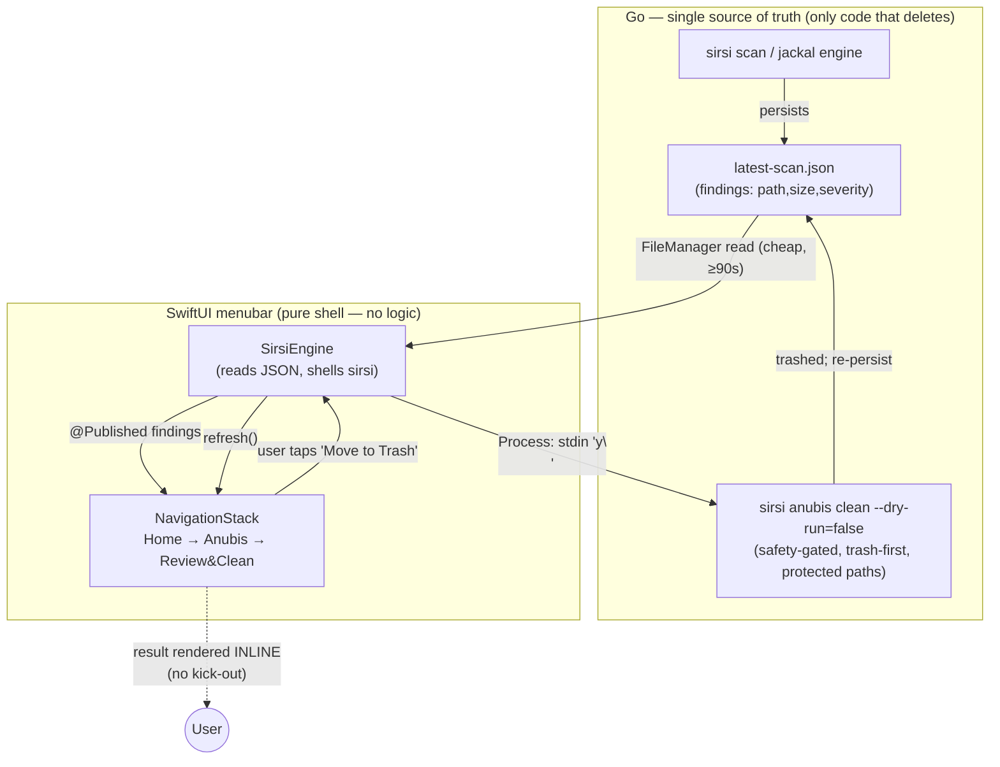

# ADR-030 — Native macOS Menubar Popover Surface (NSStatusItem + NSPopover + SwiftUI)

**Status:** Accepted (implemented 2026-06-10; binding review → claude-home per user directive while codex is out)
**Custodian:** 𓁯 Net (Neith — architectural triad, Rule A22)
**Supersedes:** the GUI half of ADR-010/ADR-027 (the `fyne.io/systray` dropdown) for the macOS menubar.
**Refs:** PANTHEON_RULES.md A1/A19/A23/A27; feedback_tui_is_the_session, feedback_menubar_broken, feedback_mole_quality; ADR-026 (Horus dashboard).

---

## Context

The macOS menubar shipped on `fyne.io/systray`, a Go binding for the OS-native tray **menu**. A tray menu can render flat items, submenus, and click handlers — and nothing else. It cannot keep a panel open, drill in with a back affordance, render a scrollable list/manifest, show progress, or display a result inline. Every "action" therefore degraded to one of two anti-patterns:

1. **Fire-and-forget subprocess** — a click shelled `sirsi <cmd>`, captured the output, and surfaced at most a one-line notification. The menu closed the instant you clicked, so anything the click "produced" (e.g. an armed confirm item) was invisible.
2. **Kick-out** — open Terminal/Finder/System Settings to actually show the user something.

The user's verbatim complaints (2026-06-08 → 06-10):
- *"ask anubis to clean waste… nothing happens."* (the dead-click — a click whose only effect was an unseen menu mutation)
- *"can I trust either option? I have zero visibility into what's being cleaned."* (a 39.2 GB confirm with no reviewable manifest)
- *"i want the menubar to work totally in the menubar… new screens or convos open in a persistent menubar which can go backwards as well."*

Named reference apps (all share one architecture): **Bartender, Hand Mirror, Fantastical, CleanMyMac MenuBar, iStat Menus** — each anchors an `NSPopover` to `NSStatusItem.button` and fills it with a native AppKit/SwiftUI view, typically a `NavigationStack` for drill-in.

The stopgaps shipped first (visible banners, safe-only scope, an opened manifest file — PR #31) made the systray surface *usable*, but they cannot deliver "everything in the menubar, with back." That requires a real popover. This ADR is the durable solution.

## Decision

Replace the systray dropdown on macOS with a **native NSStatusItem + NSPopover surface hosting a SwiftUI `NavigationStack`**, built as a SwiftPM executable and packaged as a Dock-less `.app` (`LSUIElement`) with a stable `CFBundleIdentifier = ai.sirsi.pantheon` (so TCC keys Full Disk Access on it across reinstalls — continuity with PR #17/#26).

**Hard architectural constraint — the surface owns zero business logic.** The Go `sirsi` binary remains the single source of truth and the *only* code that deletes: it persists the scan manifest to `~/.config/pantheon/findings/latest-scan.json` and exposes the safety-gated cleaner. The SwiftUI app is a **pure shell** — it *reads* that JSON to render and *shells* `sirsi` to act. No safety logic, no protected-path list, no cleaner is reimplemented in Swift. This is why a native surface does not violate the Go-first mandate: UI is the one capability Go lacks natively on macOS; everything beneath the pixels stays Go.

The Anubis clean flow is delivered end-to-end inline: **Home → Anubis → Review & Clean** renders the full safe manifest (path + size) in a scrollable list, a disclosure shows the excluded caution items, one button moves the safe set to Trash, and the result renders in place — all in the popover, with the native back button. Other deities (Horus/Ma'at/Thoth/Ra) are present as navigation rows and port over in follow-ups; the architecture is the deliverable, the Anubis flow proves it.

## Neith's Triad (Rule A22)

### 1. Data Flow Architecture

Error/fallback paths: a missing/corrupt JSON → title falls back to `𓁢`, no crash; a `sirsi` exec failure → the result line surfaces the error string inline; the app reading JSON needs no FDA (the *clean* runs in `sirsi`, which carries its own FDA grant).

### 2. Recommended Implementation Order

| Phase | Scope | Status |
|------|-------|--------|
| **1 (MVP — this ADR)** | SwiftPM target; NSStatusItem+NSPopover; NavigationStack; `SirsiEngine` (read JSON + shell sirsi); **Anubis Scan + Review&Clean inline**; `.app` packaging + stable-id sign + LaunchAgent install | ✅ done |
| 2 | Port Horus (health/ops read-only views), Ma'at (gate status), Thoth (memory sync) into nav rows | next |
| 3 | Recent Activity drill-in; FDA first-run card; settings | next |
| 4 | Retire `cmd/sirsi-menubar` (systray) on macOS once parity is reached; keep systray for Linux/Windows tray | after parity |

Minimum viable pipeline = Phase 1 (proves the architecture + solves the user's demonstrated pain). Phases 2–4 are additive and never block Phase 1.

### 3. Key Decision Points

| Question | Options | Recommendation |
|----------|---------|----------------|
| Native toolkit? | (a) keep systray; (b) Cocoa/AppKit menu; (c) **NSPopover + SwiftUI** | **(c)** — only option that gives a persistent, scrollable, drill-in/back panel matching the named reference apps. (a) structurally can't; (b) is heavier and dated. |
| Where does business logic live? | (a) duplicate selection/safety in Swift; (b) **Go owns it, Swift reads JSON + shells `sirsi`** | **(b)** — one cleaner, one safety list, one source of truth. Duplicating safety logic in Swift is a governance failure waiting to happen (A1). |
| Build system? | (a) Xcode project; (b) **SwiftPM `swift build`** | **(b)** — no `.xcodeproj` to maintain, scriptable in CI, lean (Rule 0). Programmatic `NSApplication`, no storyboard. |
| One-click delete scope? | (a) all reclaimable incl. caution; (b) **safe-only, caution via CLI** | **(b)** — a one-click surface must only ever touch regenerable, trash-first items (A1). Caution-tier stays a deliberate CLI action. |

Rejected: an Electron/web panel (heavy, non-native feel, against the "native menubar" requirement); a Tauri/webview surface (same).

## Consequences

**Positive:** the user's three complaints are structurally resolved — the panel stays open, drills in and back, and renders the manifest + result inline; one-click is safe-only and fully reviewable; Go stays the source of truth so there is no second cleaner to keep safe. TCC continuity via the stable bundle id.

**Costs / follow-ups:** a second UI codebase (Swift) for macOS only — mitigated by keeping it logic-free. Linux/Windows continue on systray until/unless a native surface is chosen there. Full deity parity (Phase 2–4) is outstanding. Ad-hoc signing (no Developer ID) is fine for local install; a real distribution channel is a separate decision.

**Verification:** `swift build -c release` clean; `.app` packaged + ad-hoc signed (`Identifier=ai.sirsi.pantheon`); launches Dock-less via LaunchAgent, stable single instance, reads the live scan; Anubis Review&Clean renders the manifest and trashes the safe set via `sirsi`. Acceptance gate (operator): click the icon → panel opens and stays → Anubis → Review & Clean shows the list → confirm trashes the safe set → result inline → back works.
