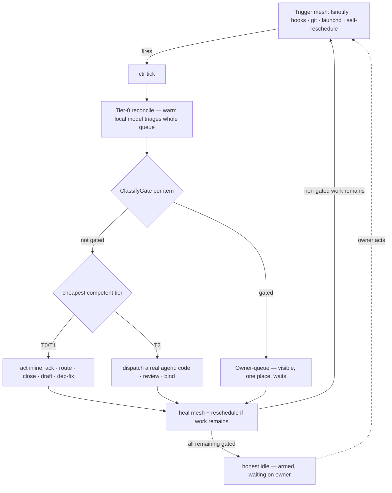

# ADR-039 — The Continuous Wake-and-Work Surface (Honest-Gate Autonomy)

**Status:** Accepted (owner directive 2026-07-14)
**Deciders:** Cylton (owner), claude-pantheon
**Related:** ADR-034 (Orchestration Brain), ADR-037 (Daemon-Owned Fabric), PANTHEON_RULES A27 (Heartbeat Loop), A29 (Brain), A30 (Model Tiering), A31 (CTR). Builds on #203 (`brain.AutonomousMode()`) and #207 (CTR).

---

## Context

The owner's goal: **"models in effort at all times except when there is an honest user gate."** A continuous surface where compute always flows at the cheapest competent tier, and the *only* thing that stops it is a decision that genuinely needs the owner.

Every prior attempt at continuity failed the same way: it welded continuity to a **resident daemon** — one long-lived process that had to stay alive to keep work moving. Those die silently (exit-78 config errors, OOM/Jetsam, leak-guard removals, launchd throttle) and when the single process dies, everything it fed goes dark and inboxes strand. A single point of failure cannot be a continuous surface. CTR (A31) already inverted the *wake* primitive from "resident daemon" to "on-demand tick"; this ADR extends that inversion to the whole **work** loop.

## Decision

Continuity comes from a **redundant, self-healing mesh of triggers**, each firing a tick, not from any resident process. Every tick both *does work* and *maintains the mesh that fires the next tick*. The loop runs full-auto (owner directive), and stops only per-item at a **deterministic honest gate**.

### Three layers

1. **Warm Tier-0 (always in effort).** A resident on-device model broker (`sirsi gemma serve`). Every tick triages the *whole* open queue at zero API token and does what Tier-0 can (ack, route, close, draft). This is the literal "models in effort at all times" — Tier-0 is never idle while work exists.
2. **The work loop (per tick).** `reconcile → classify-gate → act-at-tier → escalate`. Non-gated work is executed at the cheapest competent tier (Tier-0/1 inline; Tier-2 dispatches a real agent). Gated work parks in the owner-queue. The residue after a tick is *exactly* the owner-gated items — a non-gated item sitting still is a loop bug the tick surfaces (CTR's "stranded but workable" signal).
3. **The trigger mesh (never dies).** Redundant independent triggers, each firing a tick: fsnotify on `items/`, SessionStart / UserPromptSubmit hooks, a git post-commit hook, a launchd heartbeat, and **self-perpetuation** (a tick with remaining non-gated work guarantees the next tick). Each tick re-arms any dead trigger it finds. Any one trigger reviving the loop is sufficient, so no single death strands work.

### The honest gate (the only stop)

The boundary between "the loop may act" and "this needs the owner" is a **deterministic, hardcoded classifier** (`internal/router/gate.go`, `ClassifyGate`), NOT a model's judgment — a model can be talked out of a gate; a hardcoded table cannot (same posture as `internal/cleaner/safety.go`). It is deliberately **conservative**: a false gate costs the owner a glance; a missed gate could ship an irreversible action, so ambiguity gates. The Tier-0 model may only *add* gates (flag fuzzy business/ambiguity); it may never clear a hard gate.

Approved taxonomy (owner, 2026-07-14) — an item gates iff it matches:

| Class | What always stops for the owner |
|---|---|
| **Safety** | money movement, access-control/IAM grants, destructive deletion, credentials |
| **Founder** | terms, investor, valuation, cap table, pricing, brand/strategy |
| **Irreversible** | publish, send, merge-to-prod, deploy, release, outward-facing posts |
| **Escalate** | explicit ESCALATE / needs-owner marker, or item addressed to the owner |

Everything else — triage, route, ack, build, review, draft, self-verify, non-prod merge — flows.

### Autonomy switch (owner: full-auto)

Rides #203's `brain.AutonomousMode()` (single source of truth, default OFF):
- **ON (full-auto):** the loop executes *all* non-gated work end-to-end; only the gate taxonomy stops (per-item). Owner's choice for the continuous surface.
- **OFF:** the loop still triages continuously (Tier-0 always in effort) but every action becomes a proposal — i.e. everything is a gate. Safe default; still "always thinking."

The honest idle: when *every* remaining item is owner-gated, the loop legitimately quiesces — but stays **armed** (mesh live), so the instant the owner acts, it resumes. That is the only legitimate stop.

---

## Neith's Triad (A22)

### 1. Data Flow

### 2. Recommended Implementation Order

- **P1 — Honest-gate classifier** (`gate.go` + tests). ✅ **shipped.** The keystone every executor consults (regex/word-boundary, hardened against an under-gating audit).
- **P2 — Tiered executor (planner)** (`executor.go` — `PlanExecution`/`PlanAll`/`Actionable`/`OwnerQueue`). ✅ **shipped.** PURE decision: gate first → owner-queue; else autonomous-off → propose; else → dispatch to the target agent (T2). Side-effect free so P6 is provable; the actual dispatch (side effects) is P3, gated behind this planner.
- **P3 — The tick does work**: fold the planner's side effects into `ctr` (autonomous-ON) so each tick reconciles → plans → dispatches `Actionable()` via `WakePass`. Reuses CTR's surface + reconcile (#208). *Must land P6's guarantee first (below) — it does.* **Two mandatory design constraints from the P2 review — both now shipped (`ExecuteActionable` + `GateAction`):** (1) **the executor re-asserts the gate** — it consumes only `ExecPlan.Authorized()` (an unforgeable token minted solely by `PlanExecution`, unexported, lost across JSON), never a raw `Action` field, so a hand-built or decoded plan can never drive a side effect; (2) **dispatch-time gating ≠ action-time gating** — the item-text gate catches items that *name* a danger, but a benign item ("investigate the billing job and fix it") can dispatch an agent into an un-re-gated dangerous action. So the SAME `ClassifyGate` floor MUST ALSO sit at the woken agent's tool/action boundary (shell/deploy/money/IAM), giving the full-auto loop two independent lines of defense. Item-text gating alone is necessary but not sufficient.
- **P4 — Self-healing trigger mesh** (`sirsi conduit arm|disarm|status`). ✅ **shipped (macOS).** A launchd agent fires SHORT-LIVED `sirsi conduit tick` on a StartInterval AND on every `items/` change (WatchPaths), `KeepAlive=false` — no resident daemon to leak/hang/exit-78 (the inversion of what killed the old wake loops). A missed tick just fires again next interval/event. Linux/systemd + Windows Task Scheduler renderers next.
- **P5 — Owner-queue surface** (`sirsi router plan` [`--json`]). ✅ **shipped (CLI).** Runs the executor over the live queue and renders the honest split — needs-owner (grouped by gate class + reason), actionable, proposals — plus the "honest idle" state. Read-only. Menubar/Nexus renderers consume the same `--json` next.
- **P6 — Ma'at invariant** (`executor_test.go::TestExecutorNeverActsOnGated`). ✅ **shipped.** Test-enforced: the entire dangerous corpus, planned under autonomous=ON, is always `ActGate` and never `Actionable`; gate table non-empty (`TestGateTableArmed`). The safety rail exists BEFORE P3 flips the loop to act.

### 3. Key Decision Points

| Question | Options | Decision |
|---|---|---|
| Continuity mechanism | resident daemon / trigger mesh / both | **Trigger mesh + self-reschedule** (daemons proven to die silently) |
| Gate authority | model-decided / hardcoded table / hybrid | **Hardcoded conservative table**; model may only *add* gates (safety posture — a model can be talked out of a gate) |
| Autonomy boldness | propose-only / graduated / full-auto | **Full-auto** (owner, 2026-07-14): execute all non-gated work; gate taxonomy stops per-item |
| Gate taxonomy | tighter / as-proposed / looser | **As proposed** (owner): safety · founder · irreversible · escalate |
| Idle definition | time-based / queue-empty / all-gated | **All-remaining-gated** = honest idle; anything else idle is a loop bug |

---

## Consequences

- **Positive:** no single point of failure; compute always flowing at the cheapest tier; the owner sees exactly one queue of things that need them and nothing else stalls silently; every dangerous action is deterministically gated regardless of model behavior.
- **Negative / risks:** a conservative gate table over-gates (owner reviews some benign items) — accepted, the cost asymmetry favors it. Full-auto raises the blast radius of a bug in the tiered executor → mitigated by P6 (Ma'at test-enforced no-act-on-gated) and by the gate being deterministic. Trigger-mesh density must respect the Spotlight write-amplification + fork-storm lessons (drain-before-rearm, bounded cadence).
