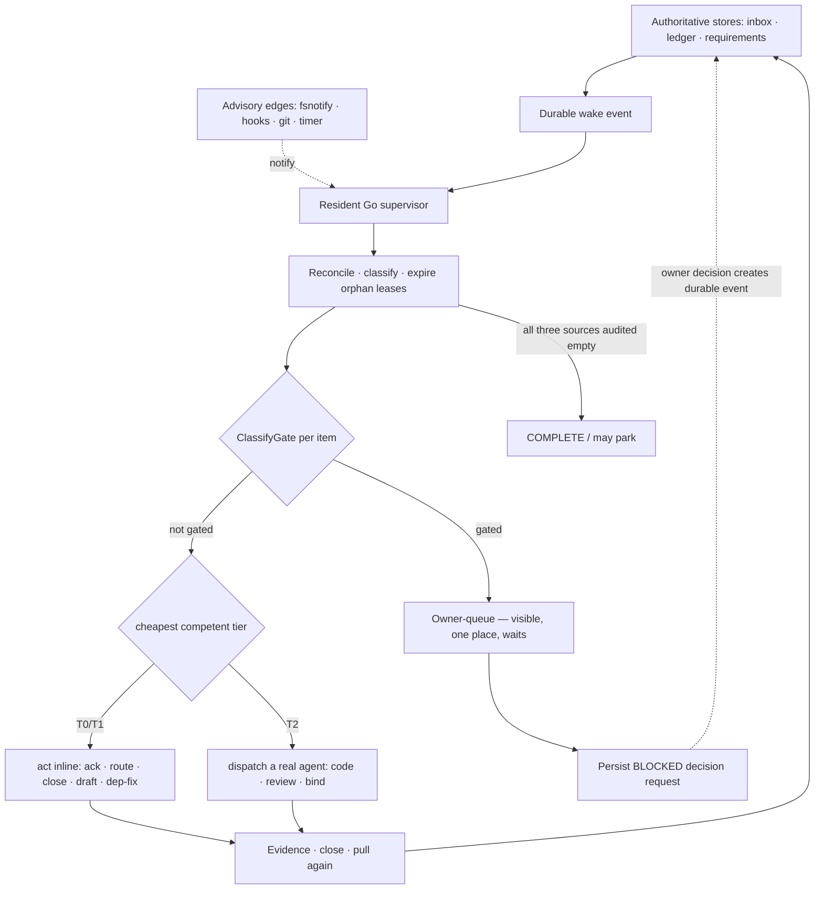

# ADR-039 — The Continuous Wake-and-Work Surface (Honest-Gate Autonomy)

**Status:** Accepted (owner directive 2026-07-14)
**Deciders:** Cylton (owner), claude-pantheon
**Related:** ADR-034 (Orchestration Brain), ADR-037 (Daemon-Owned Fabric), PANTHEON_RULES A27 (Heartbeat Loop), A29 (Brain), A30 (Model Tiering), A31 (CTR). Builds on #203 (`brain.AutonomousMode()`) and #207 (CTR).

---

## Context

The owner's goal: **"models in effort at all times except when there is an honest user gate."** A continuous surface where compute always flows at the cheapest competent tier, and the *only* thing that stops it is a decision that genuinely needs the owner.

Earlier continuity attempts confused the availability of one resident process with the durability of work. A process can die silently, but replacing it with timers does not remove the failure: a timer can fire while no worker claims anything. ADR-057 supersedes that false binary. Durable store state is authority; a restartable supervisor—resident or invoked on demand—reconciles it, and process/session liveness never proves execution.

## Decision

Continuity comes from the **durable Go supervision state machine and its
authoritative store**. Store transitions create durable wake events; the
resident supervisor delivers them through capability-declared adapters,
requires acknowledgment through a real work claim, and reconciles missed
events and expired leases. Hooks, filesystem notifications, session events,
git hooks, and timers may accelerate or recover delivery, but none is an
authority and no LLM is responsible for re-arming the system. This paragraph
supersedes the original trigger-mesh-as-authority decision in this ADR and is
binding through ADR-057.

### Three layers

1. **Deterministic authority (always resident).** The Go supervisor owns the
   three-source runnable predicate, leases, wake events, reconciliation, and
   lane classification. It runs without any model provider.
2. **Provider-neutral work loop.** `reconcile -> gate -> lease -> wake adapter ->
   claim acknowledgment -> execute -> evidence -> close -> pull again`.
   Competency and policy may select a local or remote model, but selection does
   not change work truth or lifecycle semantics.
3. **Trigger mesh (advisory edges).** fsnotify, hooks, git, timers, and session
   events may notify the Go supervisor. The durable event remains pending when
   every edge fails, and reconciliation repairs it. No edge may declare work
   delivered, complete, or safe to park.

### The honest gate (the only stop)

The boundary between "the loop may act" and "this needs the owner" is a **deterministic, hardcoded classifier** (`internal/router/gate.go`, `ClassifyGate`), NOT a model's judgment — a model can be talked out of a gate; a hardcoded table cannot (same posture as `internal/cleaner/safety.go`). It is deliberately **conservative**: a false gate costs the owner a glance; a missed gate could ship an irreversible action, so ambiguity gates. The Tier-0 model may only *add* gates (flag fuzzy business/ambiguity); it may never clear a hard gate.

Approved taxonomy (owner, 2026-07-14) — an item gates iff it matches:

| Class | What always stops for the owner |
|---|---|
| **Safety** | money movement, access-control/IAM grants, destructive deletion, credentials |
| **Founder** | terms, investor, valuation, cap table, pricing, brand/strategy |
| **Irreversible** | publish, send, merge-to-prod, deploy, release, outward-facing posts |
| **Escalate** | explicit ESCALATE / needs-owner marker, or item addressed to the owner |

Everything else — triage, route, ack, build, review, draft, self-verify, non-prod merge — flows.

### Autonomy switch (owner: full-auto)

Rides #203's `brain.AutonomousMode()` (single source of truth, default OFF):
- **ON (full-auto):** the loop executes *all* non-gated work end-to-end; only the gate taxonomy stops (per-item). Owner's choice for the continuous surface.
- **OFF:** the loop still triages continuously (Tier-0 always in effort) but every action becomes a proposal — i.e. everything is a gate. Safe default; still "always thinking."

Owner-gated work is a truthful **BLOCKED** state, not completion. The affected
item may wait for its recorded decision, while the supervisor continues every
independent runnable item. A lane may park as COMPLETE only when the shared
three-source predicate is false after a recorded canon audit.

---

## Neith's Triad (A22)

### 1. Data Flow

### 2. Recommended Implementation Order

- **P1 — Honest-gate classifier** (`gate.go` + tests). ✅ **shipped.** The keystone every executor consults (regex/word-boundary, hardened against an under-gating audit).
- **P2 — Tiered executor (planner)** (`executor.go` — `PlanExecution`/`PlanAll`/`Actionable`/`OwnerQueue`). ✅ **shipped.** PURE decision: gate first → owner-queue; else autonomous-off → propose; else → dispatch to the target agent (T2). Side-effect free so P6 is provable; the actual dispatch (side effects) is P3, gated behind this planner.
- **P3 — The tick does work**: fold the planner's side effects into `ctr` (autonomous-ON) so each tick reconciles → plans → dispatches `Actionable()` via `WakePass`. Reuses CTR's surface + reconcile (#208). *Must land P6's guarantee first (below) — it does.* **Two mandatory design constraints from the P2 review:** (1) **the executor re-asserts the gate** — SHIPPED via `ExecuteActionable` — it consumes only `ExecPlan.Authorized()` (an unforgeable token minted solely by `PlanExecution`, unexported, lost across JSON), never a raw `Action` field, so a hand-built or decoded plan can never drive a side effect; (2) **dispatch-time gating ≠ action-time gating** — the item-text gate catches items that *name* a danger, but a benign item ("investigate the billing job and fix it") can dispatch an agent into an un-re-gated dangerous action. The `GateAction(text)` primitive exists for this second line, **but it is not yet universally enforced**: the woken agents are separate Claude/gemma processes that don't run this Go floor at their own tool boundary, so it can only be enforced where an agent's side effects pass through a Go chokepoint — the autonomous auto-apply **remediation levers** (`sirsi` verbs gated on `AutonomousMode()`, ADR-033 / #203 consumers). Wiring `GateAction` into those levers is the outstanding P3 follow-on; until then the enforced line of defense is dispatch-time only. Item-text gating alone is necessary but not sufficient — this is recorded as a known limitation, not a solved problem.
- **P4 — Self-healing trigger mesh** (`sirsi conduit arm|disarm|status`). ✅ **shipped (macOS).** A launchd agent fires SHORT-LIVED `sirsi conduit tick` on a StartInterval AND on every `items/` change (WatchPaths), `KeepAlive=false` — no resident daemon to leak/hang/exit-78 (the inversion of what killed the old wake loops). A missed tick just fires again next interval/event. Linux/systemd + Windows Task Scheduler renderers next.
- **P5 — Owner-queue surface** (`sirsi router plan` [`--json`]). ✅ **shipped (CLI).** Runs the executor over the live queue and renders the honest split — needs-owner (grouped by gate class + reason), actionable, proposals — plus the "honest idle" state. Read-only. Menubar/Nexus renderers consume the same `--json` next.
- **P6 — Ma'at invariant** (`executor_test.go::TestExecutorNeverActsOnGated`). ✅ **shipped.** Test-enforced: the entire dangerous corpus, planned under autonomous=ON, is always `ActGate` and never `Actionable`; gate table non-empty (`TestGateTableArmed`). The safety rail exists BEFORE P3 flips the loop to act.

### 3. Key Decision Points

| Question | Options | Decision |
|---|---|---|
| Continuity mechanism | resident Go supervisor / trigger mesh / both | **Resident Go supervisor is authority; trigger mesh is advisory and recovery-only** |
| Gate authority | model-decided / hardcoded table / hybrid | **Hardcoded conservative table**; model may only *add* gates (safety posture — a model can be talked out of a gate) |
| Autonomy boldness | propose-only / graduated / full-auto | **Full-auto** (owner, 2026-07-14): execute all non-gated work; gate taxonomy stops per-item |
| Gate taxonomy | tighter / as-proposed / looser | **As proposed** (owner): safety · founder · irreversible · escalate |
| Idle definition | time-based / queue-empty / all-gated / three-source audited empty | **Only three-source audited empty permits park; gated work is BLOCKED, not COMPLETE** |

---

## Consequences

- **Positive requirement (not yet production-accepted):** durable work survives process failure and a restartable supervisor detects idle-with-work; the owner sees one evidence-backed queue. This is not a claim that process availability is infallible or that every adapter is already conformant; those remain explicit ADR-057 acceptance gates.
- **Negative / risks:** a conservative gate table over-gates (owner reviews some benign items) — accepted, the cost asymmetry favors it. Full-auto raises the blast radius of a bug in the tiered executor → mitigated by P6 (Ma'at test-enforced no-act-on-gated) and by the gate being deterministic. Trigger-mesh density must respect the Spotlight write-amplification + fork-storm lessons (drain-before-rearm, bounded cadence).
