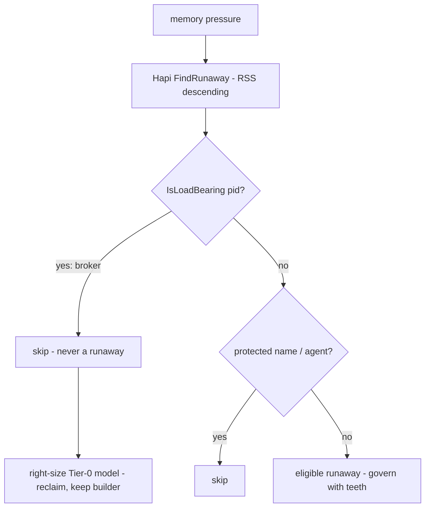

# ADR-040 — Do No Harm To The Running Host (Load-Bearing Recognition)

**Status:** Accepted (owner directive 2026-07-14)
**Deciders:** Cylton (owner), claude-pantheon
**Related:** PANTHEON_RULES A32 (this rule), A1 (Safety First), A5 (VRAM/GPU Safety), A24 (Ra window ProtectGlyph), ADR-031-A/B/C (resource governance), ADR-039 (continuous work surface). Provenance: the 2026-07-14 RAM incident.

---

## Context

While working, an agent nearly reclaimed RAM by killing the process holding 25.8 GB — which turned out to be the **local-model broker itself** (`sirsi gemma serve`, running as `Python`). It was resized instead of killed, but the near-miss exposed a real inversion in the system:

1. **Hapi's runaway-killer (`FindRunaway`) protects by process NAME** (`isProtectedReniceTarget`, `hapiIsAgent`). The gemma broker runs as `Python`, matches neither, and is the single largest RSS on the machine — so under memory pressure Hapi would select the model server as the runaway and suspend/kill it.
2. **The broker registered itself as *governed* — explicit consent to be killed** under pressure. Pantheon's own resource governor treated the Tier-0 substrate as expendable.

Killing the broker breaks Pantheon: the router's reconcile, the continuous loop, and gemma-the-builder all depend on it. And the true root cause of the pressure was never "too many processes" — it was an **oversized Tier-0 model** (a 25 GB 12B where a 2 GB 3B belongs). The right response to that is to **right-size**, not to kill a serving process mid-work.

## Decision

**An agent — or the continuous loop, or any Pantheon governor — MUST NOT kill or starve load-bearing Pantheon infrastructure while the system is working.** The canonical load-bearing service is the local-model broker; more may be added.

1. **Recognition by pidfile, not name.** `internal/guard.LoadBearingPIDs()` reads the infrastructure pidfiles (`~/.sirsi/gemma-server.pid`, `gemma-worker.pid`), excludes dead PIDs (a stale pidfile never protects a reused PID — the PID-alive lesson), and returns the protected set. `IsLoadBearing(pid)` is the single authority every kill/suspend path consults.
2. **Routine reclaim skips it.** `FindRunaway` never selects a load-bearing PID, even as top RSS. Right-sizing — not killing — is the first-line response to an oversized broker.
3. **Right-size over kill.** An oversized Tier-0 model is fixed by swapping to a smaller one (`~/.sirsi/gemma-model.conf` → a 3-4B; `sirsi gemma serve --stop && sirsi gemma serve`), reclaiming the RAM while keeping the builder. Killing the broker is an absolute last resort at true emergency (machine about to Jetsam) — never a routine reclaim, and **never something an agent does mid-work.**
4. **Verify before any kill.** Read the full argv of a RAM/CPU hog before signalling it (`ps -p <pid>`), and confirm it is not load-bearing. "Biggest RSS" is not "kill me."
5. **Gemma-the-builder is bound the same.** When the local model does build/triage work, its instructions carry this constraint: do not kill or starve Pantheon infrastructure; resize/reconfigure, never SIGKILL a serving process.

## Neith's Triad (A22)

### Data flow

### Implementation order
- P1 — `LoadBearingPIDs`/`IsLoadBearing` + `FindRunaway` skip + tests. ✅ this ADR's PR.
- P2 — a `sirsi doctor` finding: broker is top RSS + oversized ⇒ recommend right-size (the lever), not kill.
- P3 — the gemma work-prompt guardrail wired at the dispatch/serve boundary.

### Key decisions
| Question | Options | Decision |
|---|---|---|
| Recognize the broker how | by name / by pidfile | **pidfile** (it runs as `Python`; name-matching misses it) |
| Pressure response to an oversized broker | suspend/kill / right-size | **right-size** (keep the builder); kill only at true-emergency last resort |
| Who may kill load-bearing infra mid-work | any agent / nobody | **nobody** — agents never kill it while working |

## Consequences
- **Positive:** the model substrate the whole system relies on can't be killed by a routine reclaim or a careless agent; the real fix (right-size) is the codified response; a general recognition seam (`IsLoadBearing`) exists for future load-bearing services.
- **Negative / bounded:** at genuine emergency, protecting the broker means Hapi reclaims from the next-largest process instead — acceptable, since killing the substrate to save the host defeats the purpose; the true-emergency last-resort path remains explicit and separate.
