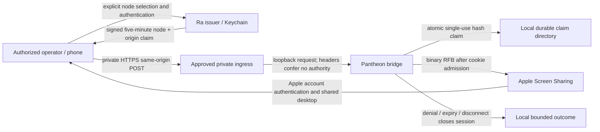

# ADR-064: Private desktop recovery authority

## Status
Proposed security decision — 2026-10-05. This document prepares a concrete
choice; it does not mint production authority or authorize an ingress change.
Implementation owner: Pantheon/Ra. Node guardian: Horus. Hardware proof: SHA.

## Context
The existing loopback browser-to-RFB bridge at 0a64369c supports approved
nodes, exact HTTPS origins, Ed25519 capabilities, durable replay claims and
Apple authentication through pinned noVNC. Synthetic negotiation is not phone
control, production issuer authority, or independent-path recovery evidence.
A transport identity header is not an authenticated operator.

## Decision proposed for security acceptance
1. Ra owns an operator-authorized issuer. The operator authenticates with an
   existing Apple Keychain protected identity and explicitly selects an enrolled
   node and approved ingress origin. An agent or proxy header cannot grant this
   identity. No agent creates a production signing key as part of this change.
2. Each enrolled gateway has one operator-approved HTTPS origin per anchor,
   private tailnet ACL restricted to named operator devices, HTTPS/WSS only,
   and a loopback backend. No Funnel/public ingress, general TCP proxy, wildcard
   origin, port-5900 publication or Screen Sharing permission change.
3. Issuer signs the existing exact claims: key_id, login, node_id, origin,
   purpose=pantheon.desktop-recovery, expires_at_unix and a cryptographically
   random 256-bit nonce. Issue at most five minutes of authority. A bridge
   session cannot outlive the signed expiry; request a fresh admission for each
   session or alternate anchor. Submit only through same-origin POST or the
   existing single Authorization header, never a URL.
4. Keep Ed25519 private material in the issuer's OS Keychain; gateways store
   public keys only. Enrollment records exact operator, node, approved endpoint
   and key fingerprint. Rotation introduces a new key id; revocation removes
   the public key and restarts the bridge, terminating existing sessions.
   Losing issuer/Keychain access denies new sessions; it never activates a
   fallback shared secret. Key creation/enrollment needs owner security consent.
5. Each gateway's replay directory is operator-owned, mode 0700, local and
   durable. Create-only hash-derived nonce claims survive restart. Claim files
   contain expiry only, no capability/Apple credential. Retain claims until a
   separate reviewed, dry-run-capable expiry collector exists. Removing claims
   is not rollback. Current source does not validate ownership/mode: deployment
   must check these and independent security review must bind them before use.
6. Local audit records only operator id, node id, key id, decision code and
   timestamps; never capability, cookie, desktop pixels, keystrokes, password,
   private paths or process arguments. Retention is operator-controlled. Audit
   integration is a remaining source requirement, not a present feature claim.
7. Apple Screen Sharing performs its own account authentication. No credential
   brokerage or persistence. Preserve local keyboard/mouse ownership; default
   view-only until the operator elects control, shared desktop only. Independent
   proof must confirm Apple active-desktop semantics and key/button release on
   explicit disconnect, expiry, browser loss and ingress loss. Closing a TCP
   socket alone is not evidence that Apple released held input.
8. Alternate anchors are separately enrolled with exact approved origins and
   issuer keys. Never resume/replay an existing cookie or admission on a peer.
   Qualify LAN/Wi-Fi/TB/tailnet separately: two paths through the same router,
   power source, or sole issuer are not independent anchors. No reboot, SIP or
   FileVault weakening, or disabling a working access route for qualification.
9. Rollback stops only the recovery bridge and its approved ingress route,
   closes all sessions and removes the issuer public key. Retain replay/audit
   evidence and the existing host access configuration. Never kill unrelated
   services or alter Apple authentication/protection.

## Data Flow Architecture

## Failure and authority boundaries
Missing/revoked key, wrong node/origin, replay, expired admission and malformed
credentials deny admission. Private ingress loss closes transport; recovery on
another anchor requires fresh authorization. FileVault pre-unlock and remote
restart are outside this active-desktop slice (ADR-063). SHA observations gate
intensive compute separately; HOLD/UNKNOWN does not declare desktop unreachable.

## Alternatives considered
- Trust Tailscale headers: rejected; local request forgery crosses operator
  authority. Tailnet transport remains useful with independent authorization.
- New remote-desktop framework: rejected; reuse the existing Apple/noVNC bridge.
- Public ingress or reusable static bearer: rejected; wider exposure and replay.

## Consequences and acceptance
No paid remote client dependency is introduced. Operator enrollment, issuer,
audit, approved origins and real phone proof remain required. Security decision
acceptance must name the actual issuer operator, enrolled M1/M5 identities,
anchor origins, Keychain key lifecycle and ACL policy; this draft invents none.
SHA must run denial/replay/expiry, real Apple login/control/disconnect and a
measured alternate-anchor failure test. Ma'at validates source and prerequisites.
Publish accepted source and evidence to Stack Lab, Owner Reading Room and
Workspace with provenance; publication is incomplete until all three exist.

## References
SIRSI_MANIFESTO.md §§6,10,15; PANTHEON_RULES.md A1/A11/A16/A35;
ADR-063; docs/user-guides/mobile-desktop-recovery.md;
ledger pantheon-mobile-desktop-recovery.
