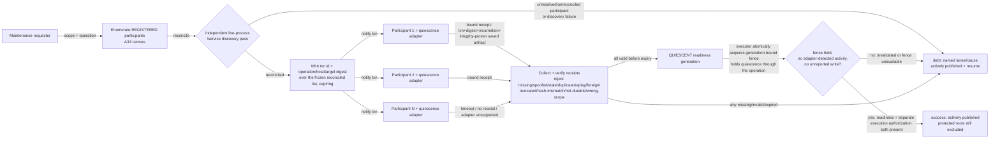

# ADR-079: Save-Before-Maintenance Contract — Durable Maintenance Transaction Primitive

## Status
**Proposed** — 2026-10-09 (Ra draft, from SSA proposal `20261009-145113`; ledger `ra/rs-42-save-before-maintenance-contract`). Rev2 2026-10-09: SSA review (`CHANGES_REQUESTED`, head `a52e3deb`) found the P1 census claim, the `QUIESCENT` definition, the P2 receipt-authentication claim, and the recovery/protected-state boundary all narrower than what the originating contract required — each corrected (A35: scope the check to the claim). Rev3 2026-10-09: SSA round 3 (`CHANGES_REQUESTED`, head `5db59a8e`) found rev2's corrections still insufficient in four places — disclosing the coverage gap is not the same as blocking on it; invalidation-on-report doesn't close the check-to-act race; saved-artifact "identity" needs integrity/durability proof, not reference existence; and `success` needs reframing as one of two *jointly* necessary conditions, never a standing green light a replay can resurrect — each corrected below. Owner/SSA bind still pending.

## Context
A32 recorded a near-miss: an agent almost killed `sirsi gemma serve` (25.8 GB load-bearing broker) to "reclaim RAM," because nothing checked whether the process was load-bearing before acting. The fix in A32/ADR-040 was recognition-by-pidfile for that one known process. It does not generalize: any future scoped cleanup (cache purge, cache eviction, disk sweep) still has no way to ask *every* live participant "are you safe to touch right now?" before acting — it either hardcodes another exemption list or trusts a human to remember.

SSA proposed a general primitive instead of another exemption: before a scoped maintenance operation runs, every registered-and-live participant in its scope must durably prove — not merely claim — that it has checkpointed, and the operation proceeds only once all of them have. This is the save-before-maintenance contract. It is a coordination primitive only; it does **not** itself authorize any cleanup. Horus stays launchctl-disabled for the duration, per the originating proposal — that's a standing constraint carried from the task, not re-derived here.

## Decision
A four-phase transaction, built on the existing thread registry (A33 census) and ledger/lease substrate (ADR-057), not reinvented. Each phase below states its claim and its boundary explicitly, per the review's central finding: a claim this contract makes must match what it actually checks, not what it would be convenient to assume.

1. **Enumerate** — read the live thread registry for every *registered* participant in the requested scope (A33 census), **then reconcile it against an independent live-process/service discovery pass** (registry UNION actually-observed live processes/services on the scoped host, using whatever discovery capability already exists — no new scanner subsystem required if an existing one suffices). **Disclosing registry-only coverage as a gap is not sufficient on its own; an unresolved gap must block readiness, not merely be named beside a success.** Concretely:
   - **P1** (registered-list collection alone) is an explicitly **incomplete preservation slice** — it may run and produce evidence, but it never claims and never grants `QUIESCENT`/readiness by itself;
   - a **readiness-capable** phase (P2/P3) MUST perform the reconciliation: any participant the independent discovery pass finds that the registry does not (unregistered, inaccessible, or otherwise unmapped), and any failure of the discovery pass itself, becomes a **named, blocking gap** — the transaction cannot reach `QUIESCENT` while one exists; unresolved coverage is `debt`, never a disclosed-but-ignored footnote;
   - produces a **fixed participant list** (registry ∪ independently-discovered live set), snapshotted at mint time (phase 2) — later phases never silently re-derive "who's in scope," they operate against that frozen list;
   - treats a **failed or incomplete discovery** (router unavailable, census read errors, the independent discovery pass itself failing, a partial registry) as a transaction-failing condition in its own right, surfaced as `debt: discovery-incomplete`, never silently proceeding on whatever subset was readable;
   - is provable by unit test only for deterministic type/list/reconciliation handling (given a registry snapshot and a discovery-pass result, does Enumerate produce the right fixed list, does it fail closed on a read error or an unresolved discovery mismatch) — this is a test of the reconciliation *logic*, not a guarantee that the underlying discovery mechanism itself has no blind spot; a blind spot in the discovery mechanism remains bounded by that mechanism's own coverage, a separate and already-tracked concern (A33), not something this ADR's unit tests can prove shut.

2. **Mint** — issue an expiring txn id + a digest of the exact operation (what will be touched: scope boundaries, affected hosts/targets, expiry) bound to the frozen participant list from phase 1. The digest is the thing participants are agreeing to, not a free-text description.

3. **Notify & collect** — push the txn to every enumerated participant; each must return a **receipt that is authenticated and bound**, not merely "a message was acked." Concretely, a valid receipt must bind together, and the collector must verify:
   - the txn id and the operation/host/target digest from phase 2 (so a receipt for a different transaction, host, or target can never be accepted here);
   - the participant's **actual authenticated host/session/participant incarnation** at receipt time — not just its lane identity, so a session that **restarted or was replaced** between enumeration and receipt is a *different* incarnation and its receipt (or silence) is evaluated as such, never conflated with the original;
   - the **identity of what was actually saved, with integrity and durability proof, not a bare reference** — for each required saved-state category (memory/journal/progress/worktree/unfinished-task obligations/evidence, or, for a service-type participant, that service's own supported checkpoint adapter), the receipt carries either (a) the **actual immutable content identity** — hash + size of the persisted bytes — or (b) a **qualified adapter receipt** from a recognized checkpoint mechanism that itself attests integrity, plus in both cases **confirmation that durable publication actually completed** (the write reached stable storage, not merely "was issued"). Name-only or existence-and-match of a reference is explicitly **not** sufficient — it cannot prove the checkpoint survived a crash or actually covers the files it claims to;
   - freshness against **this** txn's expiry — a receipt is rejected, not merely "not preferred," if it is **missing, spoofed** (not actually from the enumerated participant's authenticated session), **stale** (produced for an earlier/different txn), **duplicate or replayed** (same receipt resubmitted), or from a **foreign session** impersonating a registered one; a receipt is additionally rejected if its saved-artifact proof is **truncated**, has a **hash mismatch**, is **not yet durable**, is of the **wrong scope** (covers different files than the txn required), or comes from an **unsupported/unqualified service adapter**.

   Authentication for "produced by the enumerated participant" reuses the **canonical router authenticated send/respond identity** (the same session/machine-id authentication this fabric already uses elsewhere, e.g. the registering-session proof in ADR-072 C3) — a heartbeat/ack arriving on a lane's existing channel proves the lane is alive, it does **not** by itself prove the saved-state claim; the two are checked separately. **This ADR does not invent a new signing/trust scheme.** Where a receipt's saved-state proof ultimately rests on Thoth's own durability/trust guarantee, that guarantee is a **hard blocking dependency**, not a disclosed-and-bypassed one: if Thoth's own durability for a given checkpoint cannot be established, the receipt resting on it does not count toward quiescence, full stop — this ADR does not weaken that requirement by wording, and does not itself invent Thoth's internal signing/trust contract (that specification remains Thoth's to provide; this ADR only consumes and enforces it as blocking).

4. **Decide & publish** — the txn reaches `QUIESCENT` only if *every enumerated live participant* (phase 1's frozen, reconciled list) returns a receipt valid under phase 3's checks before expiry, **and that readiness still holds at the moment any later executor actually acts on it.** `QUIESCENT` is a **readiness generation**, not a one-time flag.

   **Detection cannot rely on self-reporting, and a re-check alone does not close the check-to-act race.** Rev2 invalidated readiness on activity *reported* after a receipt and asked the executor to *re-check* before acting — both necessary, neither sufficient, because an unreported write, or a write landing between the final re-check and the first destructive action, still escapes undetected:
   - each participant type requires a **supported quiescence adapter** actively capable of watching for disqualifying activity (writes, new sessions, resumption) for the duration the readiness generation is relied on — not a passive wait for a report that may never arrive;
   - a **missing adapter capability, a watcher failure, or any gap in continuous coverage fails that participant's readiness closed** — a participant is never assumed quiescent by default merely because nothing was reported;
   - the readiness generation is invalidated by any of: a participant write or resumed activity (detected by its adapter, not merely self-reported); a new or replaced participant appearing in scope; the operation's host/target set changing; the txn's expiry elapsing; the router or discovery substrate becoming unavailable (an outage invalidates, it does not freeze "last known good");
   - the **executor must atomically acquire and validate a generation-bound fence, and hold required participants quiescent for the duration of the scoped operation** — closing the window between the final validation and the first destructive action, not merely re-checking immediately before it. If this fencing cannot be enforced for a given participant (no adapter exists, or the adapter cannot hold quiescence through the operation), **readiness is unavailable for any operation touching that participant**, full stop — this is a consumption contract binding on whatever later implements the executor, even though this ADR keeps the executor's own implementation out of scope.
   - Required negative controls (folds into C6-style fixtures at implementation): an **unreported write** (a participant mutates state without its adapter detecting it — must still be caught, or the adapter is disqualified as unsupported), a **watcher-loss** (the adapter itself fails mid-window — must fail closed, not default-quiescent), and a **write-after-final-check** (a mutation lands strictly between the executor's last validation and its first destructive action — must be prevented by the fence, not merely detected after the fact).

   Any missing, invalid, late, or invalidated receipt fails the txn closed. The outcome (`success` / `debt: <unresponsive or invalidating lanes>` / `resume`) **is actively published to every enumerated participant** — not merely recorded as a ledger note that happens to mention a resume path; publication is itself a required, verifiable delivery, in both the success and the failure case.

   **`success` and execution authorization are two jointly necessary conditions, not a green light.** Readiness evidence (`success`) and a separately supplied scoped execution authorization are **both** required; readiness alone authorizes no maintenance action, and an authorization alone without *current* readiness evidence is equally insufficient — neither one stands in for the other. Critically: **a replayed terminal `success` record returns the historical decision only.** Idempotent replay (phase 4's own idempotency, reusing the ADR-072 C4 key+digest pattern) means a retried decide-and-publish call gets back the same record it already committed — it never recreates present-moment readiness, and it never clears intervening expiry or invalidation. A caller holding an old `success` receipt past its generation's validity must mint a **fresh** transaction; the old receipt is not a reusable green light.

   **Recovery and protected-state boundary:**
   - **Router loss mid-transaction cancels the transaction** — there is no partial-quiescence credit carried across an outage; a resumed router starts a fresh enumeration/mint, never resumes with stale phase-1/2 state.
   - **Restart is idempotent at the actual executor boundary, not just the receipt-bookkeeping layer**: re-running a transaction that already reached a terminal state (`success`/`debt`) returns that recorded outcome rather than re-executing receipt collection — and, separately, the thing that performs the scoped maintenance action itself (the executor) must also be restart-safe, never re-running the destructive action a second time because the coordination layer alone was idempotent. The ADR-072 C4 key+digest pattern covers the bookkeeping layer; the executor's own restart-safety is an explicit, separate requirement on whatever later implements it.
   - **A non-responding, registered lane blocks the transaction** until it produces a **fresh valid receipt under a current, unexpired txn** — **a heartbeat alone cannot clear this block**; liveness is not saved-state proof.
   - **Protected recovery roots are non-disposable even after a `success` outcome**: credentials, transcripts, live databases, Thoth's own stores, and session roots are never in scope for any cleanup this contract gates, regardless of checkpoint state — `success` is necessary-but-not-sufficient (see above), and the separate execution authorization still categorically excludes these roots.
   - **Failure publishes a resume path, actively**: a `debt`/failed txn's record (frozen reconciled participant list, digest, which receipts were valid, which were missing/invalid/invalidated) is both retained *and delivered* to affected participants, so a retry can state exactly what changed without re-discovering the whole scope, and no participant is left inferring the outcome from silence.

### Data Flow Architecture

### Recommended Implementation Order
1. **P1 — Enumerate (preservation-only) + mint** (required, minimum viable slice, explicitly NOT readiness-capable): wrap the existing A33 census as participant source; fail closed (not silent-subset) on discovery error; txn id + digest type with expiry. No notify yet, no reconciliation yet — provable by unit test for list/type/fail-closed handling only; this slice may run and produce evidence but never grants `QUIESCENT` (see Decision §1).
2. **P2 — Reconciliation + notify + integrity-bound receipt collection** (required, first readiness-capable phase): add the independent live-process/service discovery pass and registry-union reconciliation (unresolved = blocking `debt`, Decision §1); wire notify to each lane's existing heartbeat/ack channel for liveness, but gate saved-state acceptance on the canonical authenticated send/respond identity plus the txn/digest/incarnation/integrity-proven-saved-artifact binding in Decision §3; reject missing/spoofed/stale/duplicate/replayed/foreign/truncated/hash-mismatch/not-durable/wrong-scope/unsupported-adapter receipts explicitly, with a negative-control test per rejection class; Thoth-durability-dependent receipts block on an unestablished Thoth guarantee.
3. **P3 — Quiescence adapters + generation-bound fence + fail-closed decision + active publish** (required): per-participant-type quiescence adapters capable of detecting disqualifying activity through the readiness window (missing/failing adapter = that participant's readiness unavailable); the executor's atomic fence acquisition/validation closing the check-to-act race, with unreported-write/watcher-loss/write-after-final-check negative controls; router-loss cancellation and bookkeeping-layer idempotent restart (reusing the ADR-072 C4 key+digest pattern) **plus** a stated, separate restart-safety requirement on the executor itself; `success`/`debt`/`resume` states both written back as ledger task updates **and** actively published to every enumerated participant, with the qualification-matrix cause named.
4. **P4 — Owner-named partial-quiescence policy** (optional, deferred): only if the owner later decides some lanes may be excluded from a given txn; v1 ships with no such exception.

### Qualification Matrix
> Added per review: each row is a failure/edge class the contract must name and handle explicitly, not leave as an unstated assumption. "Required behavior" is binding on P1-P3; a slice that doesn't yet implement a row's behavior must say so, not claim the row covered.

| Class | Detected by | Required behavior |
|---|---|---|
| Unregistered/out-of-band process (registry misses it, discovery finds it) | Independent live-process/service discovery pass, reconciled against the registry (Decision §1) | **Blocking** `debt`; readiness is unavailable until reconciled — a disclosed-but-unresolved gap is not sufficient, it must stop the txn |
| Discovery/router failure during enumeration or reconciliation | Enumerate's own error path | Transaction fails closed as `debt: discovery-incomplete`; no partial-subset proceed |
| Save failure (participant attempts checkpoint, fails) | Participant's own report, or receipt timeout | Treated identically to a missing receipt: txn fails closed for that lane |
| Stale / spoofed / duplicate / replayed / foreign-session receipt | Phase 3 binding checks (txn id, digest, authenticated incarnation, freshness) | Rejected outright; never accepted as satisfying the lane's obligation |
| Truncated / hash-mismatch / not-yet-durable / wrong-scope saved artifact, or unsupported/unqualified service adapter | Phase 3 integrity/durability verification (Decision §3) | Rejected outright; a reference existing or matching by name is not sufficient proof |
| Thoth durability/trust guarantee cannot be established for a receipt that relies on it | Phase 3 collector check against Thoth's own dependency | Receipt does not count toward quiescence; blocking, never optional by wording |
| Unreported write / watcher-loss / write strictly between final check and first destructive action | Per-participant quiescence adapter + executor's generation-bound fence (Decision §4) | Must be caught or prevented by the fence, not merely detected after the fact; a missing/failing adapter makes that participant's readiness unavailable |
| Writes, new/replaced participants, or target changes after save | Readiness-generation invalidation (Decision §4), detected by adapters, not self-report alone | Invalidates `QUIESCENT`; the executor's fence, not just a pre-action re-check, must hold through the operation |
| Router loss / restart mid-transaction | Router availability monitoring | Cancels in-flight txn (no stale resume); bookkeeping restart is idempotent via key+digest lookup; the executor itself must also be restart-safe, separately |
| Replayed terminal `success`/`debt` record past its generation's validity | Idempotency key+digest lookup returning the historical record | Returns the historical decision only; never recreates present-moment readiness or clears expiry/invalidation — a fresh txn is required |
| Non-responding registered lane | Receipt collection timeout | Blocks the txn; cleared only by a fresh valid receipt under a current txn, never by a bare heartbeat |
| Protected recovery roots (credentials, transcripts, live DBs, Thoth, session roots) | Scope definition, enforced independent of checkpoint state | Categorically excluded from any cleanup this contract ever gates, even after `success` |
| Terminal outcome (`success`/`debt`) not delivered to a participant | Publication delivery check, not just ledger retention | `success`/`debt`/`resume` must be actively published to every enumerated participant, not merely recorded |

### Key Decision Points
| Question | Options | Recommendation |
|---|---|---|
| What counts as a valid "authenticated receipt"? | (a) bare ack boolean (b) signed Thoth checkpoint reference the collector verifies exists (c) receipt payload bound to txn/digest/incarnation/saved-artifact *reference*, authenticated via the canonical router session identity (d) (c) plus the saved artifact's own integrity/durability proof (hash+size or qualified adapter receipt), with Thoth's durability guarantee blocking where relied on | **(d)** — (b) was round-1's finding; (c) was round-2's finding, itself found insufficient in round 3: binding to a reference is not the same as proving that reference survived a crash or is actually durable |
| What counts as "proven" participant coverage? | (a) A33 census membership implies universal host coverage (b) census membership scoped to registered participants, with non-registration merely disclosed as a standing gap (c) registry reconciled against an independent live-process/service discovery pass, with any unresolved mismatch a *blocking* gap | **(c)** — (a) was the review's P1 round-1 finding; (b) was the review's P1 round-2 finding (a disclosed-but-ignored gap still lets maintenance proceed on a host with an unaccounted-for live participant) |
| What happens to an unresponsive-but-registered lane? | (a) exclude it silently and proceed (b) fail the whole txn closed, publish as `debt`, cleared only by a fresh valid receipt (c) wait indefinitely (d) clear the block with a bare heartbeat | **(b)** — fail-closed; (d) was explicitly rejected by the review (liveness is not saved-state proof) |
| Does `QUIESCENT` remain valid until an executor acts on it? | (a) yes, a one-time flag once all receipts arrive (b) invalidated by subsequently *reported* activity, re-checked immediately before the executor acts (c) invalidated by adapter-*detected* activity (not self-report), with the executor atomically holding a generation-bound fence through the whole operation | **(c)** — (a) was round-1's P3 finding; (b) was round-2's finding (a report-only check still misses an unreported write or a write landing in the gap between the final check and the first destructive action) |
| What proves a saved artifact is real? | (a) a checkpoint reference exists (b) the reference exists and matches by name (c) immutable content hash+size, or a qualified adapter receipt, plus confirmed durable publication, with Thoth's own durability treated as a hard blocking dependency where relied on | **(c)** — (a)/(b) were the review's successive P2/P3 findings: neither proves the checkpoint survived a crash or covers its declared scope |
| Does this primitive also authorize the cleanup it gates? | (a) yes, `success` triggers cleanup directly (b) no, `success` alone is sufficient to unlock a separate authorization step (c) readiness evidence (`success`) and a separately supplied scoped execution authorization are both necessary; a replayed `success` returns only the historical decision and never re-authorizes after invalidation | **(c)** — (b) was round-2's framing, corrected by round 3: readiness and authorization are two conditions, neither sufficient alone, and idempotent replay must never be read as re-establishing present-moment readiness |

## Alternatives Considered
1. **Best-effort notify with a timeout-assumes-safe fallback** — rejected: indistinguishable from the synthetic-bool shortcut the task explicitly rules out; a wedged lane that never responds would pass silently.
2. **Quorum/majority-safe (e.g., accept if 90% of lanes checkpoint)** — rejected for v1: no owner-stated policy yet for which lanes are safe to abandon; defaults to fail-closed until one exists (see P4).
3. **New bespoke authentication/signing scheme for receipts** — rejected: Thoth already produces checkpoint records; reuse that (Rule 0) instead of minting a second proof mechanism — but reuse means citing what the record covers and checking it exists/matches, not treating its mere existence as proof (Decision §3).
4. **Treating A33 census membership as whole-host coverage** — rejected per review: census proves registered-participant coverage only (Decision §1, Key Decision Points).
5. **Disclosing registry-only coverage as a named-but-nonblocking gap** — rejected per round-3 review: naming the gap without reconciling against an independent discovery pass still lets maintenance proceed on a host with an unaccounted-for live participant; the gap must block, not merely be disclosed (Decision §1).
6. **`QUIESCENT` as a one-time flag** — rejected per review: a flag that never re-checks after receipt collection is indistinguishable from a stale-readiness bug until the next incident (Decision §4).
7. **Invalidation by self-report plus a pre-action re-check** — rejected per round-3 review: still leaves a check-to-act race (an unreported write, or a write landing strictly between the final check and the first destructive action, escapes); the executor must hold an atomic generation-bound fence through the operation instead (Decision §4).
8. **Saved-artifact proof by reference existence/name-match** — rejected per round-3 review: proves a reference exists, not that the underlying bytes are durable, complete, or in scope; requires content hash+size or a qualified adapter receipt instead (Decision §3).

## Consequences
- **Positive**: maintenance becomes safe-by-construction *for the reconciled participant set, under the full qualification matrix* — this is conditional on P2/P3 actually implementing the discovery reconciliation, the integrity-bound receipts, the quiescence-adapter fencing, and active publication above, not merely on receipt existence or a disclosed gap; it generalizes A32's pidfile fix and gives Fleet Safety a reusable primitive for any future scoped cleanup.
- **Negative**: every maintenance op now pays a reconciliation pass, a notify-and-collect round trip, and an executor-side atomic fence held for the operation's duration; one non-responding lane, one unreconciled live process, or one participant with no supported quiescence adapter blocks fleet-wide cleanup until resolved or the owner names an exception policy (P4).
- **Risk**: if receipt verification is ever weakened to a bare boolean or reference-existence check, if the discovery reconciliation is skipped in favor of registry-only disclosure, if `QUIESCENT` is read as a self-report-invalidated flag instead of an adapter-watched, fence-held generation, or if a replayed `success` is ever read as re-establishing present-moment readiness, the whole contract degrades back to one of the rejected alternatives with no visible symptom until the next incident. Coverage remains bounded by the actual discovery mechanism's own completeness — a separate, already-tracked concern (A33) — not by this ADR's wording.

## References
- A32 (Do No Harm To The Running Host) — the incident this generalizes.
- A33 (Universal Thread Census) — participant enumeration source; also the boundary of what "enumerate" can prove (Decision §1).
- A35 (Scope The Check To The Claim) — governs every claim/boundary correction in this revision.
- ADR-057 (Operational Enforcement) — lease/evidence pattern reused, not reinvented.
- ADR-040 — the pidfile-recognition fix this primitive generalizes beyond one process.
- ADR-072 C3/C4 (Universal Thread Naming) — the authenticated-session-identity and idempotency-key+digest patterns this ADR reuses for receipt authentication and idempotent restart, rather than inventing new ones.
- Ledger: `ra/rs-42-save-before-maintenance-contract`.
