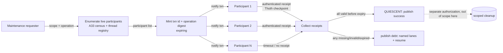

# ADR-079: Save-Before-Maintenance Contract — Durable Maintenance Transaction Primitive

## Status
**Proposed** — 2026-10-09 (Ra draft, from SSA proposal `20261009-145113`; ledger `ra/rs-42-save-before-maintenance-contract`). Owner/SSA bind pending.

## Context
A32 recorded a near-miss: an agent almost killed `sirsi gemma serve` (25.8 GB load-bearing broker) to "reclaim RAM," because nothing checked whether the process was load-bearing before acting. The fix in A32/ADR-040 was recognition-by-pidfile for that one known process. It does not generalize: any future scoped cleanup (cache purge, cache eviction, disk sweep) still has no way to ask *every* live participant "are you safe to touch right now?" before acting — it either hardcodes another exemption list or trusts a human to remember.

SSA proposed a general primitive instead of another exemption: before a scoped maintenance operation runs, every registered-and-live participant in its scope must durably prove — not merely claim — that it has checkpointed, and the operation proceeds only once all of them have. This is the save-before-maintenance contract. It is a coordination primitive only; it does **not** itself authorize any cleanup. Horus stays launchctl-disabled for the duration, per the originating proposal — that's a standing constraint carried from the task, not re-derived here.

## Decision
A four-phase transaction, built on the existing thread registry (A33 census) and ledger/lease substrate (ADR-057), not reinvented:

1. **Enumerate** — read the live thread registry for every participant in the requested scope (not a hardcoded list; A33's census is what makes "every" true).
2. **Mint** — issue an expiring txn id + a digest of the exact operation (what will be touched, scope boundaries, expiry). The digest is the thing participants are agreeing to, not a free-text description.
3. **Notify & collect** — push the txn to every enumerated participant; each must return an **authenticated receipt** — a real Thoth sync/checkpoint record it can produce, not a bare `{ok: true}` — proving it actually saved state, not just that it received the message.
4. **Decide & publish** — the txn reaches `QUIESCENT` only if *every* enumerated live participant returns a valid receipt before expiry. Any missing, invalid, or late receipt fails the txn closed. The outcome (`success` / `debt: <unresponsive lanes>` / `resume`) publishes back to the ledger. A `success` outcome authorizes nothing beyond itself — the actual cleanup step is a separate, later authorization, exactly as the originating task scopes it ("no cache cleanup authorized by this task alone").

### Data Flow Architecture

### Recommended Implementation Order
1. **P1 — Enumerate + mint** (required, minimum viable slice): wrap the existing A33 census as participant source; txn id + digest type with expiry. No notify yet — provable by unit test alone.
2. **P2 — Notify + authenticated receipt collection** (required): wire to each lane's existing heartbeat/ack channel (ADR-057 lease pattern); receipt = a real Thoth checkpoint reference, verified to exist, not a boolean.
3. **P3 — Fail-closed decision + publish to ledger** (required): all-or-nothing quiescence; `debt`/`resume` states written back as ledger task updates.
4. **P4 — Owner-named partial-quiescence policy** (optional, deferred): only if the owner later decides some lanes may be excluded from a given txn; v1 ships with no such exception.

### Key Decision Points
| Question | Options | Recommendation |
|---|---|---|
| What counts as a valid "authenticated receipt"? | (a) bare ack boolean (b) signed Thoth checkpoint reference the collector verifies exists (c) full receipt payload replay | **(b)** — matches the task's explicit "not a synthetic bool"; avoids inventing a new signing scheme beyond what Thoth already produces |
| What happens to an unresponsive-but-registered lane? | (a) exclude it silently and proceed (b) fail the whole txn closed, publish as `debt` (c) wait indefinitely | **(b)** — fail-closed; a silent exclusion is exactly the false-assurance shape A35 was written to stop, and matches A32's "do no harm" default |
| Does this primitive also authorize the cleanup it gates? | (a) yes, `success` triggers cleanup directly (b) no, `success` only unlocks a separate authorization step | **(b)** — explicit in the originating task ("no cache cleanup authorized by this task alone"); keeps the blast-radius of this ADR to coordination only |

## Alternatives Considered
1. **Best-effort notify with a timeout-assumes-safe fallback** — rejected: indistinguishable from the synthetic-bool shortcut the task explicitly rules out; a wedged lane that never responds would pass silently.
2. **Quorum/majority-safe (e.g., accept if 90% of lanes checkpoint)** — rejected for v1: no owner-stated policy yet for which lanes are safe to abandon; defaults to fail-closed until one exists (see P4).
3. **New bespoke authentication/signing scheme for receipts** — rejected: Thoth already produces checkpoint records; reuse that (Rule 0) instead of minting a second proof mechanism.

## Consequences
- **Positive**: maintenance becomes safe-by-construction instead of relying on a hardcoded exemption list per incident (generalizes A32's pidfile fix); gives Fleet Safety a reusable primitive for any future scoped cleanup.
- **Negative**: every maintenance op now pays a notify-and-collect round trip; one non-responding lane blocks fleet-wide cleanup until it heartbeats or the owner names an exception policy (P4).
- **Risk**: if receipt verification is ever weakened to a bare boolean, the whole contract degrades back to the rejected alternative #1 with no visible symptom until the next incident.

## References
- A32 (Do No Harm To The Running Host) — the incident this generalizes.
- A33 (Universal Thread Census) — participant enumeration source.
- A35 (Scope The Check To The Claim) — governs the fail-closed decision design.
- ADR-057 (Operational Enforcement) — lease/evidence pattern reused, not reinvented.
- ADR-040 — the pidfile-recognition fix this primitive generalizes beyond one process.
- Ledger: `ra/rs-42-save-before-maintenance-contract`.
