# ADR-079: Save-Before-Maintenance Contract — Durable Maintenance Transaction Primitive

## Status
**Proposed** — 2026-10-09 (Ra draft, from SSA proposal `20261009-145113`; ledger `ra/rs-42-save-before-maintenance-contract`). Rev2 2026-10-09: SSA review (`CHANGES_REQUESTED`, head `a52e3deb`) found the P1 census claim, the `QUIESCENT` definition, the P2 receipt-authentication claim, and the recovery/protected-state boundary all narrower than what the originating contract required — each is corrected below (A35: scope the check to the claim). Owner/SSA bind still pending.

## Context
A32 recorded a near-miss: an agent almost killed `sirsi gemma serve` (25.8 GB load-bearing broker) to "reclaim RAM," because nothing checked whether the process was load-bearing before acting. The fix in A32/ADR-040 was recognition-by-pidfile for that one known process. It does not generalize: any future scoped cleanup (cache purge, cache eviction, disk sweep) still has no way to ask *every* live participant "are you safe to touch right now?" before acting — it either hardcodes another exemption list or trusts a human to remember.

SSA proposed a general primitive instead of another exemption: before a scoped maintenance operation runs, every registered-and-live participant in its scope must durably prove — not merely claim — that it has checkpointed, and the operation proceeds only once all of them have. This is the save-before-maintenance contract. It is a coordination primitive only; it does **not** itself authorize any cleanup. Horus stays launchctl-disabled for the duration, per the originating proposal — that's a standing constraint carried from the task, not re-derived here.

## Decision
A four-phase transaction, built on the existing thread registry (A33 census) and ledger/lease substrate (ADR-057), not reinvented. Each phase below states its claim and its boundary explicitly, per the review's central finding: a claim this contract makes must match what it actually checks, not what it would be convenient to assume.

1. **Enumerate** — read the live thread registry for every *registered* participant in the requested scope (A33 census). **This is NOT a claim of whole-host coverage.** A33's census maps registered agent-class processes; it has no visibility into an unregistered, out-of-band process (an IDE session, a manual shell, a service that never registered) — such a process's unsaved work is a **named, standing gap**, not something the enumeration silently covers. Enumeration therefore:
   - produces a **fixed participant list**, snapshotted at mint time (phase 2) — later phases never silently re-derive "who's in scope," they operate against that frozen list;
   - treats a **failed or incomplete discovery** (router unavailable, census read errors, a partial registry) as a transaction-failing condition in its own right, surfaced as `debt: discovery-incomplete`, never silently proceeding on whatever subset was readable;
   - is provable by unit test only for deterministic type/list handling (given a registry snapshot, does Enumerate produce the right fixed list, does it fail closed on a read error) — **that is not, and cannot be, a test of actual whole-host coverage**; whole-host coverage is bounded by A33's own registration completeness, a separate and already-tracked concern (A33), not something this ADR can prove shut.

2. **Mint** — issue an expiring txn id + a digest of the exact operation (what will be touched: scope boundaries, affected hosts/targets, expiry) bound to the frozen participant list from phase 1. The digest is the thing participants are agreeing to, not a free-text description.

3. **Notify & collect** — push the txn to every enumerated participant; each must return a **receipt that is authenticated and bound**, not merely "a message was acked." Concretely, a valid receipt must bind together, and the collector must verify:
   - the txn id and the operation/host/target digest from phase 2 (so a receipt for a different transaction, host, or target can never be accepted here);
   - the participant's **actual authenticated host/session/participant incarnation** at receipt time — not just its lane identity, so a session that **restarted or was replaced** between enumeration and receipt is a *different* incarnation and its receipt (or silence) is evaluated as such, never conflated with the original;
   - the **identity of what was actually saved** (e.g. the specific Thoth memory/journal checkpoint reference, the worktree/unfinished-task state, the evidence bundle) — existence of *a* checkpoint reference is not proof it covers what this txn needs saved; the receipt names what it covers;
   - freshness against **this** txn's expiry — a receipt is rejected, not merely "not preferred," if it is **missing, spoofed** (not actually from the enumerated participant's authenticated session), **stale** (produced for an earlier/different txn), **duplicate or replayed** (same receipt resubmitted), or from a **foreign session** impersonating a registered one.

   Authentication for "produced by the enumerated participant" reuses the **canonical router authenticated send/respond identity** (the same session/machine-id authentication this fabric already uses elsewhere, e.g. the registering-session proof in ADR-072 C3) — a heartbeat/ack arriving on a lane's existing channel proves the lane is alive, it does **not** by itself prove the saved-state claim; the two are checked separately. **This ADR does not invent a new signing/trust scheme.** If a receipt's saved-state proof ultimately rests on a Thoth-produced record, this ADR treats that record as *data the receipt names and the collector can check exists/matches*, and explicitly does **not** claim to have verified Thoth's own internal signing/trust contract — that primitive, if one is needed beyond existence-and-match checking, is Thoth's to specify, named here as an open dependency rather than assumed.

4. **Decide & publish** — the txn reaches `QUIESCENT` only if *every enumerated live participant* (phase 1's frozen list) returns a receipt valid under phase 3's checks before expiry, **and that readiness still holds at the moment any later executor actually acts on it.** `QUIESCENT` is a **readiness generation**, not a one-time flag: it is invalidated by any of —
   - a participant write or resumed activity reported after its own receipt (a save followed by more writes is no longer "saved");
   - a new or replaced participant appearing in scope after enumeration;
   - the operation's host/target set changing after mint;
   - the txn's expiry elapsing;
   - the router or discovery substrate becoming unavailable after enumeration (an outage doesn't freeze readiness as "last known good," it invalidates it).

   A later executor **MUST re-check the readiness generation at its own execution boundary** — it never treats a `success` published earlier as a standing green light; separate authorization (phase 4's `success`) is necessary but, per this correction, **not sufficient** on its own at execution time without that re-check. Any missing, invalid, late, or **invalidated** receipt fails the txn closed. The outcome (`success` / `debt: <unresponsive or invalidating lanes>` / `resume`) publishes back to the ledger.

   **Recovery and protected-state boundary** (previously missing, added per review):
   - **Router loss mid-transaction cancels the transaction** — there is no partial-quiescence credit carried across an outage; a resumed router starts a fresh enumeration/mint, never resumes with stale phase-1/2 state.
   - **Restart is idempotent**: re-running a transaction that already reached a terminal state (`success`/`debt`) returns that recorded outcome rather than re-executing or double-counting receipts — the same idempotency-vs-concurrency separation already built for ADR-072 C4 (a durable key+digest lookup, not a fresh race each retry) is the intended reuse, not a new mechanism.
   - **A non-responding, registered lane blocks the transaction** until it produces a **fresh valid receipt under a current, unexpired txn** — per the review's explicit correction, **a heartbeat alone cannot clear this block**; liveness is not saved-state proof.
   - **Protected recovery roots are non-disposable even after a `success` outcome**: credentials, transcripts, live databases, Thoth's own stores, and session roots are never in scope for any cleanup this contract gates, regardless of checkpoint state — `success` unlocks a *separate* cleanup authorization (unchanged from Rev1), and that separate authorization still excludes these roots categorically.
   - **Failure publishes a resume path**: a `debt`/failed txn's record (frozen participant list, digest, which receipts were valid, which were missing/invalid) is retained so a retry can state exactly what changed, not re-discover the whole scope from nothing.

### Data Flow Architecture

```mermaid
flowchart LR
    A[Maintenance requester] -->|scope + operation| B[Enumerate REGISTERED live participants\nA33 census + thread registry\nfixed snapshot; discovery failure = debt]
    B -->|frozen participant list| C[Mint txn id + operation/host/target digest\nexpiring]
    C -->|notify txn| D1[Participant 1]
    C -->|notify txn| D2[Participant 2]
    C -->|notify txn| Dn[Participant N]
    D1 -->|bound receipt: txn+digest+incarnation+saved-artifact id| E[Collect + verify receipts\nreject missing/spoofed/stale/duplicate/replay/foreign]
    D2 -->|bound receipt| E
    Dn -->|timeout / no receipt| E
    E -->|all valid before expiry| F[QUIESCENT readiness generation]
    F -->|re-check at executor boundary: no new writes/participants/target changes/expiry/router loss| H{still valid?}
    H -->|yes| I[publish success\nseparate cleanup authorization, protected roots excluded]
    H -->|no: invalidated| G[publish debt: named lanes/cause + resume]
    E -->|any missing/invalid/expired| G
```

### Recommended Implementation Order
1. **P1 — Enumerate + mint** (required, minimum viable slice): wrap the existing A33 census as participant source, producing a **frozen** list; fail closed (not silent-subset) on discovery error; txn id + digest type with expiry. No notify yet — provable by unit test for list/type/fail-closed handling only, explicitly not for whole-host coverage (see Decision §1).
2. **P2 — Notify + bound receipt collection** (required): wire to each lane's existing heartbeat/ack channel for liveness, but gate saved-state acceptance on the canonical authenticated send/respond identity plus the txn/digest/incarnation/saved-artifact binding in Decision §3; reject missing/spoofed/stale/duplicate/replayed/foreign receipts explicitly, with a negative-control test per rejection class.
3. **P3 — Fail-closed decision + readiness-generation invalidation + publish** (required): all-or-nothing quiescence as a generation that invalidates on new writes/participants/target changes/expiry/router loss; executor-boundary re-check; router-loss cancellation and idempotent restart (reusing the ADR-072 C4 key+digest pattern); `debt`/`resume` states written back as ledger task updates with the qualification-matrix cause named.
4. **P4 — Owner-named partial-quiescence policy** (optional, deferred): only if the owner later decides some lanes may be excluded from a given txn; v1 ships with no such exception.

### Qualification Matrix
> Added per review: each row is a failure/edge class the contract must name and handle explicitly, not leave as an unstated assumption. "Required behavior" is binding on P1-P3; a slice that doesn't yet implement a row's behavior must say so, not claim the row covered.

| Class | Detected by | Required behavior |
|---|---|---|
| Unregistered/out-of-band process (no registry entry) | Not detectable by census itself | Named standing gap (Decision §1); never counted as covered, never silently assumed safe |
| Discovery/router failure during enumeration | Enumerate's own error path | Transaction fails closed as `debt: discovery-incomplete`; no partial-subset proceed |
| Save failure (participant attempts checkpoint, fails) | Participant's own report, or receipt timeout | Treated identically to a missing receipt: txn fails closed for that lane |
| Stale / spoofed / duplicate / replayed / foreign-session receipt | Phase 3 binding checks (txn id, digest, authenticated incarnation, freshness) | Rejected outright; never accepted as satisfying the lane's obligation |
| Writes, new/replaced participants, or target changes after save | Readiness-generation invalidation (Decision §4) | Invalidates `QUIESCENT`; re-check required before any executor acts |
| Router loss / restart mid-transaction | Router availability monitoring | Cancels in-flight txn (no stale resume); restart is idempotent via key+digest lookup, not re-execution |
| Non-responding registered lane | Receipt collection timeout | Blocks the txn; cleared only by a fresh valid receipt under a current txn, never by a bare heartbeat |
| Protected recovery roots (credentials, transcripts, live DBs, Thoth, session roots) | Scope definition, enforced independent of checkpoint state | Categorically excluded from any cleanup this contract ever gates, even after `success` |

### Key Decision Points
| Question | Options | Recommendation |
|---|---|---|
| What counts as a valid "authenticated receipt"? | (a) bare ack boolean (b) signed Thoth checkpoint reference the collector verifies exists (c) full receipt payload bound to txn/digest/incarnation/saved-artifact identity, authenticated via the canonical router session identity | **(c)** — (b) alone was the review's P2 finding: existence of *a* checkpoint reference does not prove it covers *this* txn, nor that it came from the enumerated participant's current incarnation; (c) closes both gaps without inventing a new signing scheme (Thoth's own record is still the payload) |
| What counts as "proven" participant coverage? | (a) A33 census membership implies universal host coverage (b) census membership is scoped to registered participants only, with non-registration named as a standing gap | **(b)** — (a) was the review's P1 finding (a live unregistered IDE with unsaved work would pass silently under (a)) |
| What happens to an unresponsive-but-registered lane? | (a) exclude it silently and proceed (b) fail the whole txn closed, publish as `debt`, cleared only by a fresh valid receipt (c) wait indefinitely (d) clear the block with a bare heartbeat | **(b)** — fail-closed; (d) was explicitly rejected by the review (liveness is not saved-state proof) |
| Does `QUIESCENT` remain valid until an executor acts on it? | (a) yes, a one-time flag once all receipts arrive (b) no, a readiness generation invalidated by subsequent writes/participant/target changes/expiry/router loss, re-checked at the executor boundary | **(b)** — (a) was the review's P3 finding: a checkpoint followed by resumed writes must not still read as safe |
| Does this primitive also authorize the cleanup it gates? | (a) yes, `success` triggers cleanup directly (b) no, `success` only unlocks a separate authorization step, with protected recovery roots categorically excluded even then | **(b)** — explicit in the originating task ("no cache cleanup authorized by this task alone"); keeps the blast-radius of this ADR to coordination only |

## Alternatives Considered
1. **Best-effort notify with a timeout-assumes-safe fallback** — rejected: indistinguishable from the synthetic-bool shortcut the task explicitly rules out; a wedged lane that never responds would pass silently.
2. **Quorum/majority-safe (e.g., accept if 90% of lanes checkpoint)** — rejected for v1: no owner-stated policy yet for which lanes are safe to abandon; defaults to fail-closed until one exists (see P4).
3. **New bespoke authentication/signing scheme for receipts** — rejected: Thoth already produces checkpoint records; reuse that (Rule 0) instead of minting a second proof mechanism — but reuse means citing what the record covers and checking it exists/matches, not treating its mere existence as proof (Decision §3).
4. **Treating A33 census membership as whole-host coverage** — rejected per review: census proves registered-participant coverage only; an unregistered process is a named gap, not an assumed non-issue (Decision §1, Key Decision Points).
5. **`QUIESCENT` as a one-time flag** — rejected per review: a flag that never re-checks after receipt collection is indistinguishable from a stale-readiness bug until the next incident (Decision §4).

## Consequences
- **Positive**: maintenance becomes safe-by-construction *for registered participants, under the full qualification matrix* — this is conditional on P1-P3 actually implementing the readiness-generation invalidation and bound-receipt checks above, not merely on receipt existence; it generalizes A32's pidfile fix and gives Fleet Safety a reusable primitive for any future scoped cleanup.
- **Negative**: every maintenance op now pays a notify-and-collect round trip, plus an executor-boundary re-check; one non-responding lane blocks fleet-wide cleanup until it produces a fresh valid receipt or the owner names an exception policy (P4).
- **Risk**: if receipt verification is ever weakened to a bare boolean or reference-existence check (dropping the txn/digest/incarnation/saved-artifact binding), or if `QUIESCENT` is read as a one-time flag instead of a re-checked generation, the whole contract degrades back to the rejected alternatives with no visible symptom until the next incident. Unregistered-process coverage remains a standing, disclosed gap regardless of implementation quality — it is bounded by A33's registration completeness, not by this ADR.

## References
- A32 (Do No Harm To The Running Host) — the incident this generalizes.
- A33 (Universal Thread Census) — participant enumeration source; also the boundary of what "enumerate" can prove (Decision §1).
- A35 (Scope The Check To The Claim) — governs every claim/boundary correction in this revision.
- ADR-057 (Operational Enforcement) — lease/evidence pattern reused, not reinvented.
- ADR-040 — the pidfile-recognition fix this primitive generalizes beyond one process.
- ADR-072 C3/C4 (Universal Thread Naming) — the authenticated-session-identity and idempotency-key+digest patterns this ADR reuses for receipt authentication and idempotent restart, rather than inventing new ones.
- Ledger: `ra/rs-42-save-before-maintenance-contract`.
