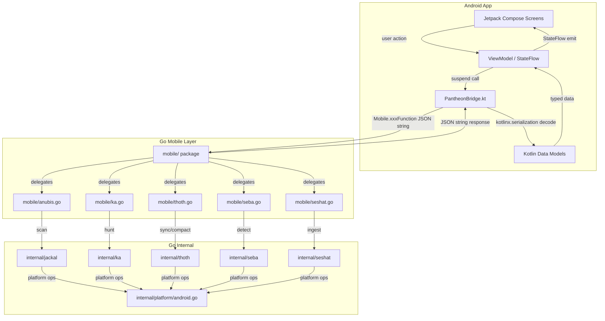
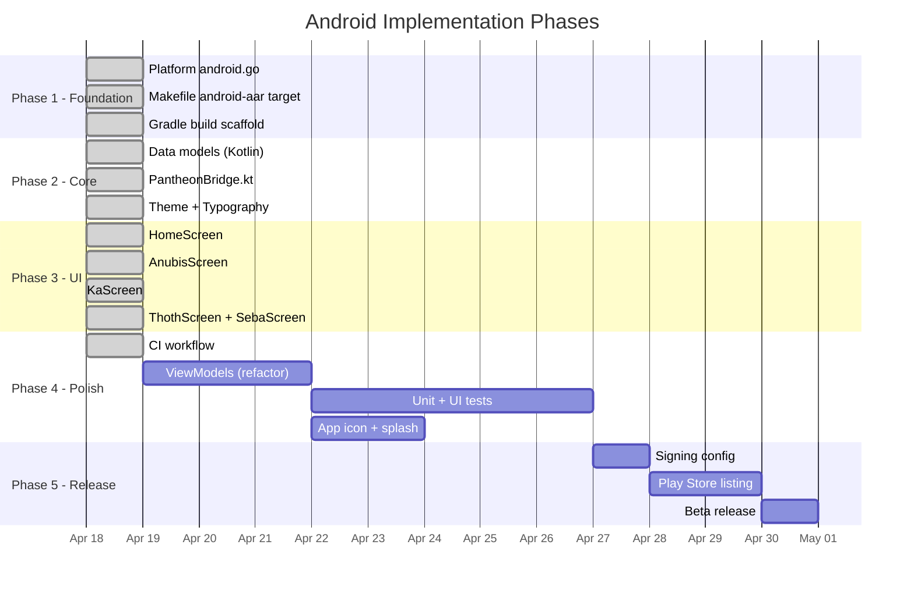

# Android Architecture Design

**Custodian:** Net (Neith) -- The Weaver  
**Status:** v0.16.0  
**Scope:** Pantheon Android companion app

---

## 1. Data Flow Architecture

### Data Transformation Chain

| Step | Input | Output | Where |
|------|-------|--------|-------|
| 1 | User tap | Coroutine launch | Screen composable |
| 2 | Function call | JSON options string | PantheonBridge.kt |
| 3 | JSON options string | Go struct | mobile/*.go |
| 4 | Go scan/detect | Go result struct | internal/* |
| 5 | Go result struct | JSON response string | mobile/mobile.go (successJSON) |
| 6 | JSON response string | BridgeResponse<T> | PantheonBridge.kt (decode) |
| 7 | Typed Kotlin data class | UI state | ViewModel / StateFlow |

---

## 2. Recommended Implementation Order

### Minimum Viable Pipeline

Phases 1-3 constitute the minimum viable Android app. The app can build, install, and invoke all Go mobile functions via the bridge. Phase 4 adds production polish (ViewModels, tests, branding assets). Phase 5 is distribution.

---

## 3. Key Decision Points

| Question | Options | Recommendation |
|----------|---------|----------------|
| UI framework | Jetpack Compose vs XML Views | **Jetpack Compose** -- modern, declarative, matches SwiftUI parity with iOS app. No XML layouts needed. |
| JSON parsing | Gson vs Moshi vs kotlinx.serialization | **kotlinx.serialization** -- compile-time safe, no reflection, multiplatform-ready, matches the `@SerialName` annotation pattern used by Go JSON tags. |
| State management | LiveData vs StateFlow vs Compose state | **Compose mutableStateOf** for initial scaffold; upgrade to **ViewModel + StateFlow** in Phase 4 for lifecycle awareness and testability. |
| Navigation | Fragment Navigation vs Compose NavHost | **Compose NavHost** -- single-activity architecture, no fragments, type-safe routes. |
| Go binding | JNI manual vs gomobile | **gomobile** -- generates AAR automatically, same toolchain as iOS xcframework. Zero JNI boilerplate. |
| Min SDK | API 21 (5.0) vs API 26 (8.0) | **API 26** -- drops legacy support burden, enables Java 8 desugaring-free APIs, covers 95%+ of active devices. |
| Theme | Light+Dark vs Dark-only | **Dark-only** -- matches Pantheon brand identity (gold on black). Egyptian aesthetic requires dark background. |
| Concurrency | RxJava vs Coroutines | **Kotlin Coroutines** -- native language support, structured concurrency, `Dispatchers.IO` for Go bridge calls. |
