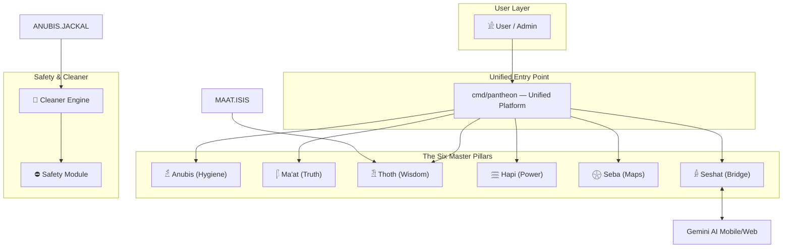
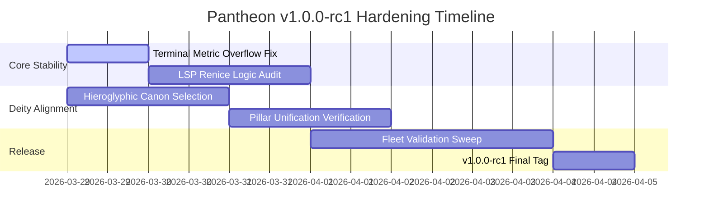

# Architecture Design — Sirsi Pantheon
**Version:** 2.1.0
**Date:** March 29, 2026
**Custodian:** 𓁯 Net (The Weaver)

---

## 1. System Overview

Sirsi Pantheon is a unified infrastructure intelligence and DevSecOps platform built on a **Deity-First Architecture**. It operates on the "One Install. All Deities." standard, where a single hardened binary manages the entire workstation and fleet lifecycle.

### 1.1 The Six Master Pillars
The Pantheon is organized into six divine pillars, each assigned a canonical Ancient Egyptian Hieroglyph. This consolidation removes architectural fragmentation and ensures absolute aesthetic purity across all interfaces.

- **𓁢 ANUBIS (Hygiene)**: Infrastructure hygiene, ghost app hunting (Ka), file deduplication (Mirror), and resource protection (Guard).
- **𓆄 MA'AT (Governance)**: Codebase auditing (Scales), QA standards, and autonomous remediation (Isis).
- **𓁟 THOTH (Knowledge)**: Persistent project memory, rule-grounded intelligence, and the zero-token brain ledger.
- **𓈗 HAPI (Compute)**: Hardware optimization, GPU/VRAM flow, and ANE/NPU acceleration (Sekhmet).
- **𓇽 SEBA (Mapping)**: Infrastructure topology, project registry (Book), and fleet discovery (Scarab).
- **𓁆 SESHAT (Scribe)**: Knowledge bridge (Gemini/NotebookLM), MCP context server, and AI sync.

```
                    ┌─────────────────────────────┐
                    │         USER / ADMIN         │
                    │     (runs `sirsi` CLI)    │
                    └──────────────┬──────────────┘
                                   │
                    ┌──────────────▼──────────────┐
                    │       PANTHEON PLATFORM     │
                    │                             │
                    │  ┌────────┐  ┌───────────┐  │
                    │  │ Anubis │  │   Ma'at   │  │
                    │  │(Clean) │  │  (Truth)  │  │
                    │  └────────┘  └───────────┘  │
                    │  ┌────────┐  ┌───────────┐  │
                    │  │ Thoth  │  │   Hapi    │  │
                    │  │(Memory)│  │ (Power)   │  │
                    │  └────────┘  └───────────┘  │
                    │  ┌────────┐  ┌───────────┐  │
                    │  │  Seba  │  │  Seshat   │  │
                    │  │ (Map)  │  │ (Bridge)  │  │
                    │  └────────┘  └───────────┘  │
                    │                             │
                    │       Transport Layer       │
                    │  (SSH / gRPC / kubectl)     │
                    └──────┬──────┬───────┬───────┘
                           │      │       │
                    ┌──────▼─┐ ┌──▼────┐ ┌▼────────┐
                    │ agent  │ │ agent │ │  agent   │
                    │ (VM)   │ │ (Pod) │ │  (NAS)   │
                    └────────┘ └───────┘ └──────────┘
```

---

## 2. Pillar Architecture

### 2.1 Anubis — The Hygiene Pillar (𓁢)
- **Engine:** Jackal (File Scanning), Ka (Ghost Detection).
- **Scope:** Workstation hygiene, cache purging, orphan application hunting.
- **Functions:** `weigh`, `judge`, `ka`, `mirror`, `guard`.

### 2.2 Ma'at — The Governance Pillar (𓆄)
- **Engine:** Scales (Policy Auditing), Isis (Remediation).
- **Scope:** Code quality, ADR compliance, autonomous healing of lint/test wounds.
- **Functions:** `audit`, `scales`, `heal`.

### 2.3 Thoth — The Intelligence Pillar (𓁟)
- **Engine:** Brain (Neural Weights), Ledger (Persistent Context).
- **Scope:** Zero-token context savings, rule-grounded AI intelligence.
- **Functions:** `sync`, `install-brain`.

### 2.4 Hapi — The Compute Pillar (𓈗)
- **Engine:** Sekhmet (ANE Acceleration), Yield (Resource Management).
- **Scope:** GPU/VRAM optimization, hardware profiling, NPU-driven workflows.
- **Functions:** `scan`, `profile`, `compute`.

### 2.5 Seba — The Mapping Pillar (𓇽)
- **Engine:** Scarab (Discovery), Book (Project Registry).
- **Scope:** Visual dependency graphs, fleet discovery, VLAN/subnet mapping.
- **Functions:** `scan`, `book`, `fleet`.

### 2.6 Seshat — The Scribe Pillar (𓁆)
- **Engine:** Gemini Bridge, MCP Server.
- **Scope:** Bidirectional sync between Gemini, NotebookLM, and Antigravity IDE.
- **Functions:** `sync`, `list`, `server`.

---

## 3. Deployment & Distribution

### 3.1 One Install. All Deities.
The `sirsi` binary is the single source of truth. It is statically compiled for macOS (ARM64/Intel) and Linux.

### 3.2 Registry (docs/index.html)
The public registry provides a high-fidelity visual map of the 6 Master Pillars. All icons and metrics are dynamically reported from the CLI's internal stats engine.

---

## 4. Data Flow Architecture ⚠️ MANDATORY (Neith's Triad §1)



## 5. Recommended Implementation Order ⚠️ MANDATORY (Neith's Triad §2)



## 6. Key Decision Points ⚠️ MANDATORY (Neith's Triad §3)

| Decision | Options | Recommendation | Rationale |
| :--- | :--- | :--- | :--- |
| **Pillar Count** | 12 Standalone vs 6 Integrated | **6 Integrated** | Reduces cognitive load and simplifies the CLI hierarchy while maintaining all functionality. |
| **LSP Thresholds** | Static (1GB) vs Dynamic (% of total) | **Static (1GB)** | Third-party LSPs should remain lean. Host LSP is excluded from this threshold as it handles core AI reasoning. |
| **Branding Anchor** | Pyramid vs Deity Icon | **Pyramid (𓇳)** | The Pyramid represents the unified platform root, while Deities represent specialized modules. |

---

*𓁯 This document follows Neith's Architecture Triad (Rule A22). Updated to v2.2.0 for the v1.0.0-rc1 Stability Hardening (Session 37).*
