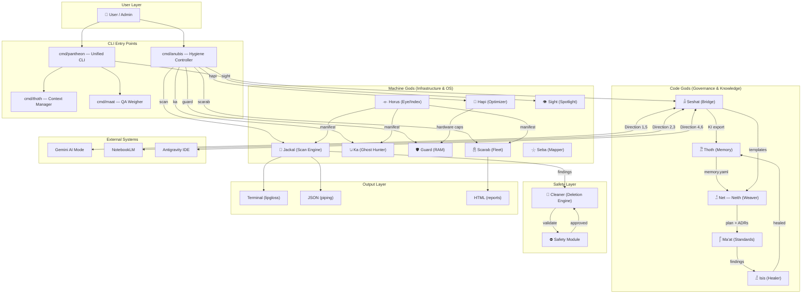
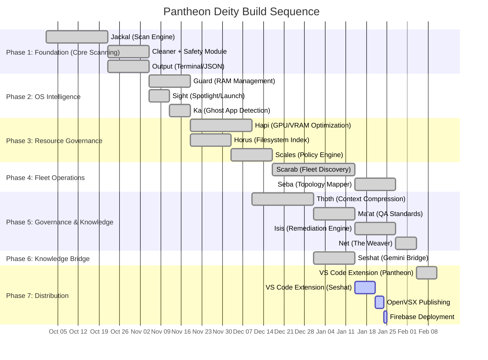

# Architecture Design — Sirsi Pantheon
**Version:** 2.0.0
**Date:** March 28, 2026
**Custodian:** 𓁯 Net (The Weaver)

---

## 1. System Overview

Sirsi Anubis is an infrastructure hygiene platform built on an **agent-controller architecture**. It operates in two modes:

1. **Local mode** — the `anubis` binary runs directly on a workstation, scanning and cleaning the local machine.
2. **Fleet mode** — the `anubis` binary acts as a controller, deploying lightweight `anubis-agent` binaries to remote targets (VMs, containers, bare metal) and orchestrating fleet-wide scans.

### 1.1 The Pantheon Hierarchy
The Sirsi Pantheon follows a dual-cluster governance model overseen by **Ra** (Hypervisor) and **Net** (The Weaver). See [PANTHEON_HIERARCHY.md](PANTHEON_HIERARCHY.md) for the full canonical ruleset.

- **𓀭 THE CODE GODS**: Governance, Knowledge, Plan, & Healing (Net, Thoth, Ma'at, Isis).
- **𓀰 THE MACHINE GODS**: Infrastructure, Safety, OS, & Hardware (Horus, Anubis, Ka, Sekhmet, Hapi, Scarab, Seba).

```
                    ┌─────────────────────────────┐
                    │         USER / ADMIN         │
                    │     (runs `anubis` CLI)      │
                    └──────────────┬──────────────┘
                                   │
                    ┌──────────────▼──────────────┐
                    │       ANUBIS CONTROLLER     │
                    │                             │
                    │  ┌────────┐  ┌───────────┐  │
                    │  │ Jackal │  │   Guard   │  │
                    │  │ (Scan) │  │   (RAM)   │  │
                    │  └────────┘  └───────────┘  │
                    │  ┌────────┐  ┌───────────┐  │
                    │  │  Hapi  │  │   Sight   │  │
                    │  │(Optim) │  │(Spotlight)│  │
                    │  └────────┘  └───────────┘  │
                    │  ┌────────┐  ┌───────────┐  │
                    │  │ Scarab │  │  Scales   │  │
                    │  │(Fleet) │  │ (Policy)  │  │
                    │  └────────┘  └───────────┘  │
                    │                             │
                    │       Transport Layer       │
                    │  (SSH / gRPC / kubectl /    │
                    │   docker exec)              │
                    └──────┬──────┬───────┬───────┘
                           │      │       │
                    ┌──────▼─┐ ┌──▼────┐ ┌▼────────┐
                    │ agent  │ │ agent │ │  agent   │
                    │ (VM)   │ │ (Pod) │ │  (NAS)   │
                    └────────┘ └───────┘ └──────────┘
```

---

## 2. Module Architecture

### 2.1 Jackal — Local Scan Engine (🐺)

**Package:** `internal/jackal/`

The Jackal is the core scanning engine. It discovers artifacts on the local filesystem using a registry of `ScanRule` implementations.

```go
// ScanRule is the interface every scan rule must implement.
type ScanRule interface {
    // Name returns the human-readable name of the rule.
    Name() string

    // Category returns the category (general, dev, ai, vms, ides, cloud, storage).
    Category() Category

    // Platform returns which platforms this rule applies to (darwin, linux, windows).
    Platform() []string

    // Scan discovers artifacts and returns findings without side effects.
    Scan(ctx context.Context, opts ScanOptions) ([]Finding, error)

    // Clean removes the artifacts identified by Scan. Requires confirmation.
    Clean(ctx context.Context, findings []Finding, opts CleanOptions) (CleanResult, error)

    // EstimateSize returns the estimated size of artifacts without full scan.
    EstimateSize(ctx context.Context) (int64, error)
}
```

**Data flow:**
```
User runs `anubis weigh`
  → Rule Registry loads applicable rules (filtered by platform + category)
  → Each rule's Scan() method is called concurrently
  → Findings are aggregated, sorted by size
  → Output renders findings via lipgloss terminal table

User runs `anubis judge --confirm`
  → Findings from last scan are loaded
  → Each rule's Clean() method is called sequentially
  → Safety module validates each path before deletion
  → Results rendered with freed space totals
```

### 2.2 Scarab — Fleet Sweep Engine (🪲)

**Package:** `internal/scarab/`

The Scarab handles remote scanning across networks, containers, VMs, and storage backends.

**Sub-packages:**
- `discovery.go` — Subnet and VLAN host discovery
- `topology.go` — VLAN trunk, relay, aggregation awareness
- `sweep.go` — Parallel fleet scanning orchestration
- `container.go` — Docker/Kubernetes container scanning
- `vm.go` — VM guest agent and SSH-based scanning
- `storage.go` — NFS/SMB/iSCSI/S3 storage scanning
- `transport/` — SSH, gRPC, and bastion transport implementations

### 2.3 Scales — Policy Engine (⚖️)

**Package:** `internal/scales/`

The Scales evaluate scan findings against user-defined policies (YAML-based) and enforce fleet-wide rules.

**Policy structure:**
```yaml
policies:
  - name: "No stale node_modules"
    scope: all
    rule:
      type: dev_artifact
      pattern: "node_modules"
      stale_days: 14
    action: delete
    notify: slack:#dev-ops
```

### 2.4 Hapi — Resource Optimizer (🌊)

**Package:** `internal/hapi/`

Hapi manages VRAM, GPU memory, and storage optimization.

**Sub-packages:**
- `vram.go` — GPU memory auditing and optimization
- `metal.go` — Apple Metal / MLX unified memory management
- `cuda.go` — NVIDIA CUDA VRAM management
- `snapshots.go` — APFS/ZFS snapshot pruning
- `compress.go` — File/directory compression analysis
- `dedup.go` — Duplicate file detection
- `tier.go` — Hot/warm/cold storage tiering recommendations
- `balance.go` — Resource flow balancing

---

## 3. Supporting Modules

### 3.1 Guard — RAM Management (🛡️)

**Package:** `internal/guard/`

- `audit.go` — Process grouping and memory analysis
- `slayer.go` — Orphan process termination (Node, LSP, Docker)
- `protector.go` — Memory reservation and budget enforcement

### 3.2 Sight — Spotlight & Launch Services (👁️)

**Package:** `internal/sight/`

- `launchservices.go` — Ghost app detection and Launch Services rebuild (macOS-specific)

### 3.3 Cleaner — Deletion Engine

**Package:** `internal/cleaner/`

- `engine.go` — Unified deletion engine (dry-run, confirm, trash-vs-delete)
- `safety.go` — Protected paths validation, hardcoded deny list

### 3.4 Output — Terminal Rendering

**Package:** `internal/output/`

- `terminal.go` — lipgloss-styled terminal output (gold + black theme)
- `json.go` — JSON output for piping / scripting
- `markdown.go` — Markdown report generation
- `html.go` — HTML fleet report generation

---

## 4. Binary Architecture

### 4.1 anubis (Controller)

**Package:** `cmd/anubis/`

The main CLI binary. Contains all modules and can operate in both local and fleet modes.

```
anubis
├── weigh     → Jackal scan
├── judge     → Jackal clean
├── guard     → Guard RAM management
├── sight     → Sight Spotlight/Launch Services
├── hapi      → Hapi VRAM/storage optimization
├── scarab    → Scarab fleet operations
│   ├── discover  → Network discovery
│   ├── sweep     → Fleet scan
│   ├── container → Docker/K8s
│   ├── vm        → VM scanning
│   ├── storage   → NFS/SMB/S3
│   ├── deploy    → Agent deployment
│   └── report    → Fleet reporting
├── scales    → Scales policy engine
│   ├── enforce   → Policy enforcement
│   ├── validate  → Policy validation
│   └── verdicts  → Show verdicts
└── profile   → Profile management
```

### 4.2 anubis-agent (Agent)

**Package:** `cmd/anubis-agent/`

Lightweight binary deployed to remote targets. Implements a fixed command set — never executes arbitrary commands.

**Security model:**
- Statically compiled, zero external dependencies
- Fixed command set (scan, clean, report)
- Results streamed back via gRPC or stdout (JSON)
- Self-update mechanism from controller
- No shell access, no arbitrary command execution

---

## 5. Configuration

### 5.1 User Config
```
~/.config/anubis/
├── config.yaml       — User preferences
├── rules.yaml        — Custom scan rules
├── policies.yaml     — Custom policies
├── profiles/         — Developer profiles
│   ├── default.yaml
│   └── finalwishes.yaml
└── network.yaml      — Network topology
```

### 5.2 Default Config
```
configs/
├── default_rules.yaml
├── default_policies.yaml
└── network_example.yaml
```

---

## 6. Data Flow Summary

```
┌──────────┐    ┌──────────┐    ┌──────────┐    ┌──────────┐
│  Config  │───▶│  Scan    │───▶│  Report  │───▶│  Clean   │
│  (YAML)  │    │ (Rules)  │    │ (Output) │    │ (Delete) │
└──────────┘    └──────────┘    └──────────┘    └──────────┘
                     │                               │
                     │         ┌──────────┐          │
                     └────────▶│  Safety  │◀─────────┘
                               │  Module  │
                               └──────────┘
```

**Key invariant:** The Safety Module is consulted before EVERY deletion operation. There is no code path that bypasses it.

---

## 7. Data Flow Architecture ⚠️ MANDATORY (Neith's Triad §1)

> Net decrees: Show how data moves through the system.



**Key invariant:** No deletion bypasses the Safety Module. No architecture document bypasses Neith's Triad.

---

## 8. Recommended Implementation Order ⚠️ MANDATORY (Neith's Triad §2)

> Net decrees: Show how to build this incrementally.



**Minimum Viable Pipeline:** Phase 1 delivers local scan + safe deletion (`anubis weigh` + `anubis judge`).

---

## 9. Key Decision Points ⚠️ MANDATORY (Neith's Triad §3)

> Net decrees: Show what forks were encountered and why each path was chosen.

| Question | Options | Recommendation |
|----------|---------|----------------|
| **Single binary or multi-binary?** | Single monolith / Multi-binary (controller + agent) / Daemon | **Multi-binary** — `pantheon` (unified) + `anubis` (controller) + `anubis-agent` (lightweight remote). Agent must be statically compiled with zero deps for fleet deployment. |
| **Scan architecture: serial or concurrent?** | Serial scan / Concurrent goroutines / Worker pool | **Concurrent goroutines** — Each `ScanRule.Scan()` runs in its own goroutine with `context.Context` for cancellation. Bounded by `runtime.NumCPU()`. |
| **Policy language?** | YAML / JSON / OPA Rego / CUE | **YAML** — Human-readable, familiar to SREs, sufficient for rule matching. OPA rejected for complexity overhead. |
| **Safety enforcement: advisory or hard block?** | Hard deny-list / Advisory warnings / Configurable | **Hard deny-list** — Protected paths are NEVER deletable, even with `--force`. Advisory for edge cases. No exceptions. |
| **Terminal UI framework?** | lipgloss / bubbletea / termui | **lipgloss** — Composable styling without full TUI overhead. Gold-on-black Pantheon aesthetic. bubbletea reserved for future interactive mode. |
| **Fleet transport protocol?** | SSH only / gRPC only / Hybrid | **Hybrid** — SSH for initial agent deployment + gRPC for structured scan results. Bastion proxy support for air-gapped networks. |
| **Context compression format?** | YAML (Thoth) / JSON / Protobuf | **YAML** — `.thoth/memory.yaml` is human-auditable. Token savings measured via Accountability Engine. Protobuf rejected for lack of human readability. |
| **Deity coupling model?** | Tight coupling / Loose with shared bus / Independent with optional integration | **Independent with optional integration** — Every deity runs standalone. Combined efficiency via Horus manifest + Thoth memory when Weave is active. |
| **Extension distribution?** | VS Code Marketplace / OpenVSX / Private VSIX | **OpenVSX** — Open-source marketplace. Accessible from VS Code, Codium, and Antigravity IDE. Private VSIX as fallback. |
| **Knowledge bridge direction?** | Gemini-only / Antigravity-only / Full bidirectional | **Full bidirectional (6 directions)** — Gemini ↔ NotebookLM ↔ Antigravity. Seshat handles all six flows to eliminate knowledge silos. |

---

*𓁯 This document follows Neith's Architecture Triad (Rule A22). All three mandatory sections are present.*
