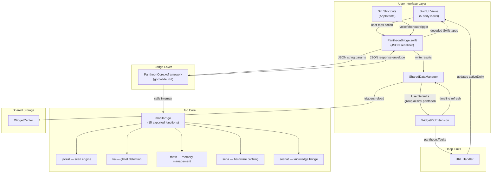

# Architecture Design — Pantheon iOS
**Version:** 1.0.0
**Date:** April 13, 2026
**Custodian:** 𓁯 Net (The Weaver)

---

## 1. System Overview

Pantheon iOS is a native SwiftUI application that brings the Pantheon infrastructure hygiene platform to iPhone and iPad. It wraps the existing Go core via gomobile's `PantheonCore.xcframework`, providing both a rich GUI with deity-specific views and a TUI terminal emulator mode.

### 1.1 Context Diagram

```
┌──────────────────────────────────────────────────────────────┐
│                        Sirsi Ecosystem                       │
│                                                              │
│  ┌──────────────┐   ┌──────────────┐   ┌──────────────────┐ │
│  │  macOS CLI   │   │  iOS App     │   │  Ra Fleet Agent  │ │
│  │  (sirsi)     │   │  (this doc)  │   │  (sirsi-agent)   │ │
│  └──────┬───────┘   └──────┬───────┘   └──────┬───────────┘ │
│         │                  │                   │             │
│         └──────────────────┼───────────────────┘             │
│                            │                                 │
│                   ┌────────▼────────┐                        │
│                   │  Go Core        │                        │
│                   │  (internal/*)   │                        │
│                   └─────────────────┘                        │
└──────────────────────────────────────────────────────────────┘
```

The iOS app is one of three distribution surfaces (macOS CLI, iOS app, fleet agent) that share the same Go core. The iOS layer adds SwiftUI views, WidgetKit extensions, Siri Shortcuts, and platform-specific integrations (CloudKit, APNs, App Groups).

### 1.2 iOS Sandbox Constraints

Unlike the macOS CLI which has full filesystem access, iOS operates under App Sandbox:
- **Anubis/Ka**: Scan scope limited to the app's Documents/Caches
- **Thoth**: Full functionality for repos opened via Files.app
- **Seba**: Full hardware detection via sysctl + Metal APIs
- **Seshat**: Source availability depends on iOS permissions

---

## 2. Module Architecture

### 2.1 PantheonCore.xcframework — Go Bridge

**Package:** `mobile/` (Go), `bin/ios/PantheonCore.xcframework` (output)

15 exported Go functions compiled to an iOS framework via gomobile. Each function accepts string parameters (JSON options) and returns a JSON string response envelope:

```go
type Response struct {
    OK    bool            `json:"ok"`
    Data  json.RawMessage `json:"data,omitempty"`
    Error string          `json:"error,omitempty"`
}
```

### 2.2 PantheonBridge.swift — Swift Deserializer

**Package:** `ios/Pantheon/Services/PantheonBridge.swift`

Thin bridge that calls `MobileXxx()` functions from PantheonCore and deserializes JSON responses into typed Swift structs. Uses `Task.detached` for CPU-bound Go calls to avoid blocking the main actor.

### 2.3 SharedDataManager — App Group Container

**Package:** `ios/Shared/SharedDataManager.swift`

Manages the `group.ai.sirsi.pantheon` App Group container. The main app writes scan results and hardware data to shared `UserDefaults`; widgets read from this cache. Writing triggers `WidgetCenter.shared.reloadTimelines()` to refresh widgets.

### 2.4 WidgetKit Extension — Home & Lock Screen

**Package:** `ios/PantheonWidgets/`

Two widgets (Anubis scan summary, Seba hardware profile) supporting four families:
- `systemSmall` / `systemMedium` — home screen
- `accessoryCircular` / `accessoryRectangular` — lock screen

Interactive buttons (iOS 17+) backed by `AppIntent` allow triggering scans directly from the widget.

### 2.5 SwiftUI Views — Deity Interfaces

**Package:** `ios/Pantheon/Views/Deities/`

Five deity-specific views, each following the same pattern:
1. `DeityHeader` with glyph, name, and description
2. Primary action button (scan, detect, sync, etc.)
3. Results display (cards, rows, expandable details)
4. Error state with retry, loading skeleton with shimmer

### 2.6 Adaptive Layout — iPhone & iPad

**Package:** `ios/Pantheon/App/ContentView.swift`

Uses `@Environment(\.horizontalSizeClass)` to switch between:
- **iPhone** (compact): `TabView` with deity tabs
- **iPad** (regular): `NavigationSplitView` with sidebar + detail

---

## 3. Data Flow Architecture (Neith's Triad §1)



**Key invariant:** All Go ↔ Swift communication uses JSON serialization through the `BridgeResponse<T>` envelope. No raw pointers or memory sharing crosses the FFI boundary. Go functions are called on detached tasks to prevent main-thread blocking.

---

## 4. Recommended Implementation Order (Neith's Triad §2)

```mermaid
gantt
    title Pantheon iOS Implementation
    dateFormat YYYY-MM-DD

    section Phase 1: Foundation (DONE)
    Go mobile bridge (15 functions)       :done, p1a, 2026-04-09, 1d
    SwiftUI scaffold (5 deity views)      :done, p1b, 2026-04-09, 1d
    iOS platform layer (build tag)        :done, p1c, 2026-04-09, 1d
    Bridge tests (17 tests)               :done, p1d, 2026-04-10, 1d

    section Phase 2: App Polish (DONE)
    App icon (Eye of Horus)               :done, p2a, 2026-04-10, 1d
    WidgetKit (Seba + Anubis)             :done, p2b, 2026-04-10, 1d
    Siri Shortcuts (3 intents)            :done, p2c, 2026-04-10, 1d

    section Phase 3: Platform Integration (DONE)
    App Group shared container            :done, p3a, 2026-04-13, 1d
    Deep links (pantheon:// URL scheme)   :done, p3b, 2026-04-13, 1d
    Lock screen widgets                   :done, p3c, 2026-04-13, 1d
    Interactive widget buttons            :done, p3d, 2026-04-13, 1d
    iPad NavigationSplitView              :done, p3e, 2026-04-13, 1d
    AccentColor + Assets.xcassets         :done, p3f, 2026-04-13, 1d
    Loading skeletons + error states      :done, p3g, 2026-04-13, 1d
    SwiftUI previews                      :done, p3h, 2026-04-13, 1d
    TestFlight pipeline (Fastlane + CI)   :done, p3i, 2026-04-13, 1d

    section Phase 4: Cloud Integration
    iCloud sync (CloudKit for Thoth)      :p4a, 2026-04-14, 3d
    Push notifications (APNs for Ra)      :p4b, after p4a, 2d
    App Store Connect setup               :p4c, after p4b, 1d

    section Phase 5: Distribution
    TestFlight beta deployment            :p5a, after p4c, 1d
    App Store submission                  :p5b, after p5a, 2d
```

**Minimum Viable Pipeline:** Phases 1-3 deliver a fully functional app with all 5 deity views, widgets, deep links, and iPad support. The app builds and archives but requires Apple Developer provisioning for device deployment.

**Current status:** Phases 1-3 complete. Phase 4 requires Apple Developer portal configuration (CloudKit container, APNs certificate).

---

## 5. Key Decision Points (Neith's Triad §3)

| Question | Options | Recommendation |
|----------|---------|----------------|
| **Go ↔ Swift bridge protocol?** | A) cgo with C headers / B) gomobile JSON / C) gRPC over local socket | **B) gomobile JSON** — simplest FFI, no C interop complexity, JSON is debuggable. gomobile generates the xcframework directly. Rejected A for complexity, C for overhead. |
| **Widget data source?** | A) Call Go bridge directly in widget / B) App Group shared storage / C) Background App Refresh + Core Data | **B) App Group shared storage** — widgets have limited execution time; calling Go bridge is slow. App writes cached results to shared UserDefaults, widgets read instantly. Fallback to direct Go call if no cache exists. |
| **iPad layout strategy?** | A) Separate iPad target / B) Adaptive layout with size classes / C) Catalyst | **B) Adaptive layout** — single codebase, `NavigationSplitView` for regular width, `TabView` for compact. Zero code duplication. Rejected A for maintenance burden, C for poor SwiftUI support. |
| **URL scheme vs Universal Links?** | A) Custom URL scheme (`pantheon://`) / B) Universal Links (`sirsi.ai/pantheon/`) / C) Both | **A) Custom URL scheme** — no web server required, works offline, sufficient for widget → app navigation. Universal Links require AASA file hosting and domain verification. Can add B later for web integration. |
| **TestFlight pipeline?** | A) Raw xcodebuild + altool / B) Fastlane / C) Xcode Cloud | **B) Fastlane** — proven, scriptable, integrates with GitHub Actions. Handles signing, archiving, and upload in one tool. Rejected A for verbosity, C for vendor lock-in and cost. |
| **Swift concurrency model?** | A) GCD / OperationQueue / B) Swift async/await with actors / C) Combine | **B) Swift async/await** — modern, first-class in Swift 6 with strict concurrency. Go bridge calls use `Task.detached` to avoid main actor blocking. `@MainActor` on `AppState` ensures thread-safe UI updates. Rejected A for boilerplate, C for complexity. |
| **Code signing management?** | A) Manual profiles / B) Fastlane match / C) Xcode automatic signing | **B) Fastlane match** (planned) — centralized signing via private Git repo. Enables CI signing without manual provisioning. Currently building with `CODE_SIGNING_ALLOWED=NO` until Apple Developer account is configured. |

---

## 6. File Inventory

| Layer | Count | Files |
|-------|-------|-------|
| Go bridge | 7 source + 6 test | `mobile/*.go`, `mobile/*_test.go` |
| Swift app | 22 files | Views, models, services, theme, previews |
| Shared | 2 files | `SharedDataManager.swift`, `WidgetIntents.swift` |
| Widgets | 3 files | Anubis + Seba widgets, bundle |
| Config | 5 files | `project.yml`, entitlements (×2), `Info.plist`, `Fastfile` |
| Assets | 2 colorsets | AppIcon, AccentColor |
| CI | 1 workflow | `.github/workflows/ios.yml` |
| **Total** | **48 files** | |

---

## 7. Security Considerations

- **Sandbox**: iOS app sandbox prevents system-wide scanning. Anubis/Ka scope is limited to app container.
- **Entitlements**: App Group (`group.ai.sirsi.pantheon`) is the only cross-process sharing mechanism.
- **No telemetry**: Consistent with Rule A11 — zero analytics, zero phone-home.
- **Code signing**: Required for device deployment. CI uses `CODE_SIGNING_ALLOWED=NO` for build verification.
- **Bridge safety**: All Go functions are read-only during scan phase; destructive operations (clean/purge) require explicit user confirmation in the Swift UI layer.

---

## 8. References

- `PANTHEON_RULES.md` — Governance rules (Rules A1-A25)
- `docs/ARCHITECTURE_DESIGN.md` — Core platform architecture
- `docs/SAFETY_DESIGN.md` — Safety protocol for destructive operations
- `docs/NEITH_ARCHITECTURE_TEMPLATE.md` — Template for this document
- `ios/README.md` — Build instructions and project structure
- ADR: gomobile bridge decision (implicit in Phase 1 implementation)

---
*𓁯 This document follows Neith's Architecture Triad (Rule A22). All three mandatory sections are present.*
