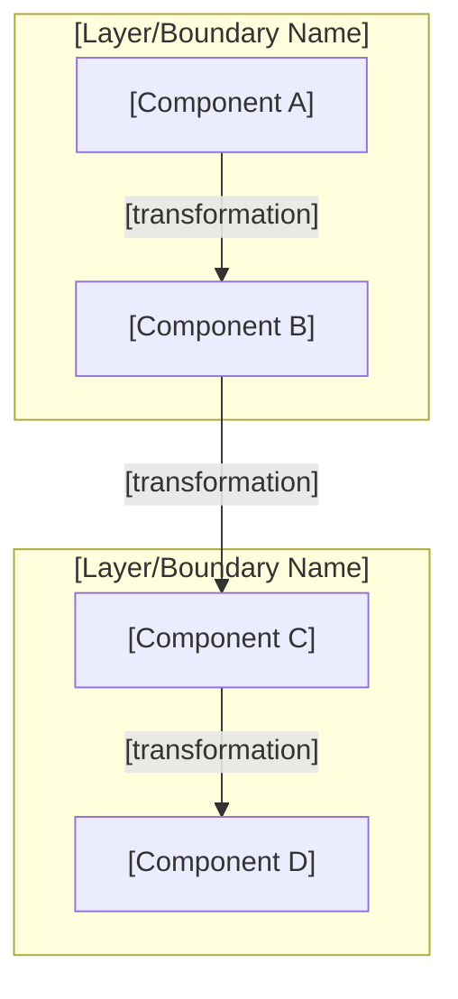

# 𓁯 Neith's Architecture Design Template
**Version:** 1.0.0
**Date:** March 28, 2026
**Custodian:** 𓁯 Net (The Weaver)

> *"The Weave demands clarity. Every architecture must show how data flows, in what order it should be built, and what decisions were made along the way."*

---

## How to Use This Template

Copy this template for every new `ARCHITECTURE_DESIGN.md` in the Sirsi portfolio. **All three Triad sections are mandatory** per Rule A22. The remaining sections are recommended but may be adapted to the project's needs.

---

# Architecture Design — [System Name]
**Version:** [SemVer]
**Date:** [Date]
**Custodian:** [Deity or Team]

---

## 1. System Overview

[High-level description of what this system does, who uses it, and why it exists.]

### 1.1 Context Diagram

[Where does this system fit in the larger ecosystem? What are its boundaries?]

---

## 2. Module Architecture

[Describe each module/package with its responsibility, interface, and dependencies.]

### 2.1 [Module Name] — [Codename/Role]

**Package:** `[path]`

[Description of what this module does.]

---

## 3. Data Flow Architecture ⚠️ MANDATORY (Neith's Triad §1)

> Net decrees: Show how data moves through the system.



**Key invariant:** [State the most important safety/correctness property of this flow.]

---

## 4. Recommended Implementation Order ⚠️ MANDATORY (Neith's Triad §2)

> Net decrees: Show how to build this incrementally.

```mermaid
gantt
    title [System Name] Implementation
    dateFormat  YYYY-MM-DD
    section Phase 1: Foundation
    [Core component]          :p1, [date], [duration]
    [Supporting component]    :p1b, after p1, [duration]
    section Phase 2: Integration
    [Dependent component]     :p2, after p1b, [duration]
    section Phase 3: Polish
    [Optional enhancement]    :p3, after p2, [duration]
```

**Minimum Viable Pipeline:** Phase 1 delivers [describe what's demo-able].

---

## 5. Key Decision Points ⚠️ MANDATORY (Neith's Triad §3)

> Net decrees: Show what forks were encountered and why each path was chosen.

| Question | Options | Recommendation |
|----------|---------|----------------|
| **[Decision 1]?** | Option A / Option B / Option C | **[Choice]** — [rationale] |
| **[Decision 2]?** | Option A / Option B | **[Choice]** — [rationale] |
| **[Decision 3]?** | Option A / Option B / Option C | **[Choice]** — [rationale] |

---

## 6. Configuration

[Describe config files, environment variables, and user settings.]

---

## 7. Security Considerations

[Describe auth, data privacy, and safety invariants.]

---

## 8. References

- [Related ADRs]
- [Related canonical documents]
- [External resources]

---
*𓁯 This document follows Neith's Architecture Triad (Rule A22). All three mandatory sections are present.*
