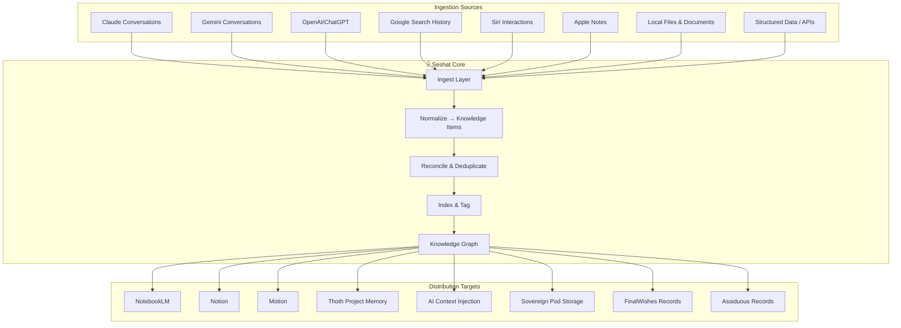
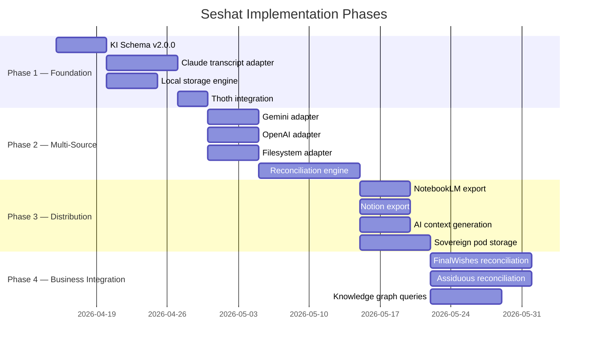

# 𓁆 Seshat — Universal Knowledge Grafting Engine
**Version:** 2.0.0 (Architecture Redesign)  
**Date:** April 2, 2026  
**Status:** Specification — replaces v1.0.0 Gemini Bridge scope

---

## 1. Identity

**Seshat** — Goddess of writing, wisdom, and measurement. The keeper of records and inventor of writing itself.

In the Pantheon, Seshat is the **universal knowledge grafting layer** — she ingests, reconciles, and distributes knowledge across every source and target in the Sirsi ecosystem.

### Position in the Pantheon

| Deity | Relationship to Seshat |
|-------|----------------------|
| **Sirsi** (creator deity) | Seshat is Sirsi's scribe — she records and reconciles all knowledge that flows through the ecosystem |
| **Thoth** 𓁟 | Project-level memory keeper. Seshat feeds Thoth with reconciled knowledge; Thoth persists it per-project |
| **Ma'at** 𓆄 | Governs quality of Seshat's reconciled output (no hallucinated references, no stale data) |
| **Ra** 𓇶 | Enterprise orchestrator — will use Seshat for fleet-wide knowledge distribution |
| **Osiris** 𓋹 | Session checkpoint guardian — Seshat can recover knowledge from Osiris snapshots |

---

## 2. Mission

Seshat solves one problem: **knowledge is scattered.**

People search Google, ask Siri, converse with Claude, Gemini, and ChatGPT, take notes in Apple Notes, organize in Notion, research in NotebookLM — and none of it talks to each other. When an AI assistant needs context, it starts from zero every session.

Seshat collects, reconciles, and distributes that knowledge so:
- AI assistants have full context (not just the current session)
- On-prem sovereign pods can be hydrated from years of cloud intelligence
- Business applications (FinalWishes, Assiduous) can reconcile records from disparate sources
- Users own their intelligence across every platform

---

## 3. Architecture

### 3.1 Data Flow



### 3.2 Core Pipeline

1. **Ingest** — Source-specific adapters extract raw knowledge (conversations, searches, notes, records)
2. **Normalize** — Convert to a universal Knowledge Item (KI) schema with provenance tracking
3. **Reconcile** — Deduplicate, merge, and resolve conflicts across sources (same topic discussed in Claude and Gemini → one reconciled KI)
4. **Index** — Tag with topics, entities, timestamps, and source provenance
5. **Graph** — Build a queryable knowledge graph connecting related KIs
6. **Distribute** — Push reconciled knowledge to target systems via target-specific adapters

### 3.3 Key Design Principles

- **Source adapters are plugins** — adding a new source (e.g., Perplexity) means writing one adapter, not changing the core
- **Target adapters are plugins** — same pattern for distribution targets
- **Provenance is mandatory** — every KI tracks where it came from, when, and how it was reconciled
- **Reconciliation is the hard part** — this is where Seshat's real value lives. Same question asked to Claude and Gemini produces two answers; Seshat reconciles them into one KI with both perspectives
- **Privacy by default** — knowledge stays local unless explicitly distributed. Zero telemetry.

---

## 4. Knowledge Item Schema (v2.0.0)

```go
// KnowledgeItem is the universal unit of knowledge in Seshat.
type KnowledgeItem struct {
    ID          string            `json:"id"`          // UUID
    Title       string            `json:"title"`
    Summary     string            `json:"summary"`
    Content     string            `json:"content"`     // Full text/markdown
    Topics      []string          `json:"topics"`      // Auto-tagged + manual
    Entities    []Entity          `json:"entities"`    // People, orgs, concepts
    Sources     []Provenance      `json:"sources"`     // Where this came from
    References  []Reference       `json:"references"`  // Links to files, URLs, other KIs
    Confidence  float64           `json:"confidence"`  // 0.0-1.0 reconciliation confidence
    CreatedAt   time.Time         `json:"createdAt"`
    ModifiedAt  time.Time         `json:"modifiedAt"`
    AccessedAt  time.Time         `json:"accessedAt"`
    Schema      string            `json:"schema"`      // "2.0.0"
}

// Provenance tracks where a piece of knowledge originated.
type Provenance struct {
    Source      string    `json:"source"`      // "claude", "gemini", "google-search", etc.
    SourceID    string    `json:"sourceId"`    // Conversation ID, search query, note ID
    ExtractedAt time.Time `json:"extractedAt"`
    Raw         string    `json:"raw"`         // Original text before normalization
}

// Entity is a named entity extracted from knowledge.
type Entity struct {
    Name  string `json:"name"`
    Type  string `json:"type"`  // "person", "org", "concept", "product", "location"
}

// Reference links a KI to external resources.
type Reference struct {
    Type  string `json:"type"`  // "file", "url", "knowledge_item", "conversation"
    Value string `json:"value"`
    Label string `json:"label"`
}
```

---

## 5. Source Adapters (Planned)

| Source | Adapter | Priority | Method |
|--------|---------|----------|--------|
| **Claude** | `claude` | P0 | Parse `.jsonl` transcripts from `~/.claude/` |
| **Gemini** | `gemini` | P1 | Google Takeout export / API |
| **OpenAI/ChatGPT** | `openai` | P1 | Export / API |
| **Google Search** | `google-search` | P2 | Takeout / Chrome history |
| **Siri** | `siri` | P2 | Shortcuts integration / local logs |
| **Apple Notes** | `apple-notes` | P2 | AppleScript / SQLite |
| **Local Files** | `filesystem` | P1 | Walk + extract (markdown, PDF, text) |
| **Structured Data** | `api` | P1 | REST/GraphQL adapters per service |

---

## 6. Target Adapters (Planned)

| Target | Adapter | Priority | Method |
|--------|---------|----------|--------|
| **Thoth** | `thoth` | P0 | Direct integration — feed project memory |
| **NotebookLM** | `notebooklm` | P1 | Upload as sources (50 max per notebook) |
| **Notion** | `notion` | P1 | Notion API — create/update pages |
| **Motion** | `motion` | P2 | Motion API — task/project context |
| **Apple Notes** | `apple-notes-out` | P2 | AppleScript / Shortcuts |
| **AI Context** | `ai-context` | P0 | Generate context files for Claude, Gemini, etc. |
| **Sovereign Pod** | `sovereign` | P1 | Local knowledge store for on-prem deployment |
| **FinalWishes** | `finalwishes` | P1 | Record reconciliation for estate planning |
| **Assiduous** | `assiduous` | P1 | Record reconciliation for real estate |

---

## 7. CLI Commands (Planned)

```
sirsi seshat ingest <source>     Ingest knowledge from a source adapter
sirsi seshat reconcile           Run reconciliation across all ingested KIs
sirsi seshat search <query>      Search the knowledge graph
sirsi seshat list                List all Knowledge Items
sirsi seshat export <target>     Export reconciled knowledge to a target
sirsi seshat status              Show ingestion stats, graph size, health
sirsi seshat adapters            List available source and target adapters
```

---

## 8. Recommended Implementation Order



---

## 9. Key Decision Points

| Question | Options | Recommendation |
|----------|---------|----------------|
| **Storage backend for KI graph** | SQLite / BadgerDB / flat JSON files | SQLite — queryable, single-file, works on sovereign pods |
| **Reconciliation strategy** | Exact dedup only / Semantic similarity / LLM-assisted | Start with exact + fuzzy dedup; add LLM-assisted reconciliation in Phase 2 |
| **Source adapter interface** | Go plugin / embedded adapters / external processes | Embedded adapters (Go interfaces) — single binary, no plugin loading complexity |
| **Knowledge graph model** | Property graph / Triple store / Document + tags | Document + tags (KI schema) with reference edges — simple, sufficient for v1 |
| **Privacy model** | All local / opt-in cloud sync / encrypted sync | All local by default, opt-in encrypted export to specific targets |

---

## 10. Business Applications

### FinalWishes
Seshat reconciles estate planning data from multiple sources — legal documents, financial records, personal notes, conversations with advisors. She ensures that the FinalWishes application has a complete, deduplicated view of a user's estate information regardless of where it was originally captured.

### Assiduous
Seshat reconciles real estate data — property records, market research, client conversations, inspection reports. She feeds Assiduous with a unified knowledge base that agents and clients can query.

### Sovereign Intelligence Pods
When deploying on-prem Apple Silicon pods, Seshat is the **hydration engine** — she collects years of scattered cloud intelligence (Claude conversations, Gemini research, Google searches, notes) and distills it into the local knowledge store. The pod starts informed, not blank.

---

## 11. Migration from v1.0.0

The existing Seshat code (`internal/seshat/seshat.go`, `syncer.go`) is Antigravity-specific. Migration path:

1. Preserve the `KnowledgeItem` concept but upgrade to v2.0.0 schema (add provenance, confidence, entities)
2. Replace Antigravity-specific paths with a pluggable adapter interface
3. Keep the VS Code extension (`extensions/gemini-bridge/`) as-is for now — it becomes one adapter among many
4. The core reconciliation engine is new work

---

*𓁆 She who measures the foundation stones. She who records the words of the gods.*
