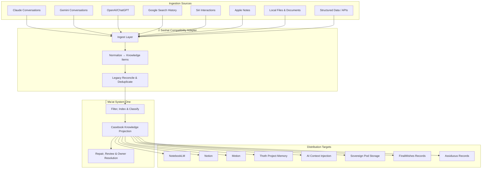
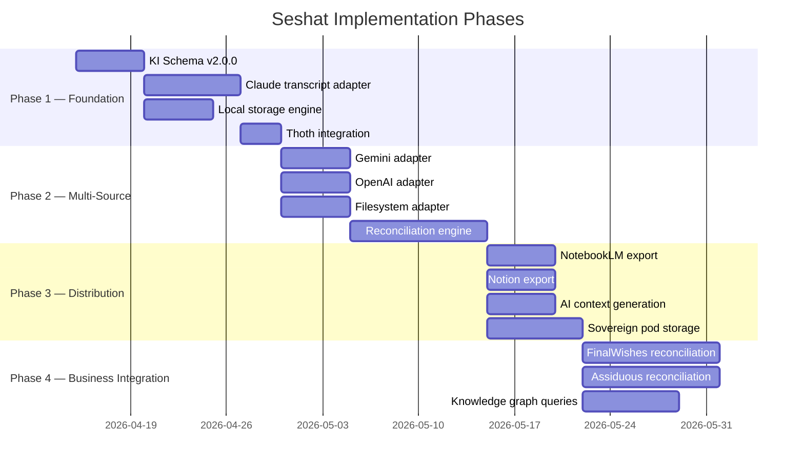

# 𓁆 Seshat — Legacy Knowledge Ingestion Adapter
**Version:** 2.1.0 (Ma'at System One alignment)
**Date:** September 28, 2026
**Status:** Compatibility specification — supersedes Seshat as a user-facing knowledge plane

> **Canonical ownership:** Ma'at owns every user-facing knowledge projection, Casebook entry, assessment, recovery route, and decision record. Seshat may retain existing ingestion adapters and local-cache maintenance behind the `sirsi maat knowledge` boundary only. It does not own a dashboard action, native-app screen, MCP surface, router authority, independent store, or direct user workflow.

---

## 1. Identity

**Seshat** — Goddess of writing, wisdom, and measurement. The keeper of records and inventor of writing itself.

In the Pantheon, Seshat is a **legacy ingestion compatibility layer**. It can ingest and normalize approved local sources for Ma'at; Ma'at filters, classifies, records, and projects the resulting knowledge through the one System One surface.

### Position in the Pantheon

| Deity | Relationship to Seshat |
|-------|----------------------|
| **Ma'at** 𓆄 | Sole user-facing owner: validates, filters, classifies, records, and projects knowledge via System One and Casebook |
| **Thoth** 𓁟 | Project memory consumer; receives only Ma'at-approved, provenance-bound material |
| **Ra** 𓇶 | Routes receipts and work; does not grant Seshat a parallel knowledge authority |
| **Osiris** 𓋹 | May provide recovery inputs subject to Ma'at validation |

---

## 2. Mission

Seshat solves one bounded compatibility problem: **approved legacy knowledge inputs need a migration path into Ma'at.**

People search Google, ask Siri, converse with Claude, Gemini, and ChatGPT, take notes in Apple Notes, organize in Notion, research in NotebookLM — and none of it talks to each other. When an AI assistant needs context, it starts from zero every session.

Seshat can collect and normalize permitted inputs so Ma'at can:
- present one evidence-bound, sensitivity-filtered knowledge surface
- preserve user control over local data and refresh scope
- attach repair, review, and owner-resolution paths to every actionable finding
- prevent a second cache, dashboard, or decision authority from emerging

---

## 3. Architecture

### 3.1 Data Flow


```mermaid
graph TD
    subgraph Sources ["Ingestion Sources"]
        CL[Claude Conversations]
        GM[Gemini Conversations]
        OA[OpenAI/ChatGPT]
        GS[Google Search History]
        SI[Siri Interactions]
        AN[Apple Notes]
        FS[Local Files & Documents]
        DB[Structured Data / APIs]
    end

    subgraph Seshat ["𓁆 Seshat Compatibility Adapter"]
        IN[Ingest Layer]
        NM[Normalize → Knowledge Items]
        RC[Legacy Reconcile & Deduplicate]
    end

    subgraph Maat ["𓆄 Ma'at System One"]
        IX[Filter, Index & Classify]
        GR[Casebook Knowledge Projection]
        RR[Repair, Review & Owner Resolution]
    end

    subgraph Targets ["Distribution Targets"]
        NL[NotebookLM]
        NO[Notion]
        MO[Motion]
        TH[Thoth Project Memory]
        AI[AI Context Injection]
        SP[Sovereign Pod Storage]
        FW[FinalWishes Records]
        AS[Assiduous Records]
    end

    CL --> IN
    GM --> IN
    OA --> IN
    GS --> IN
    SI --> IN
    AN --> IN
    FS --> IN
    DB --> IN

    IN --> NM
    NM --> RC
    RC --> IX
    IX --> GR
    GR --> RR

    GR --> NL
    GR --> NO
    GR --> MO
    GR --> TH
    GR --> AI
    GR --> SP
    GR --> FW
    GR --> AS
```

### 3.2 Core Pipeline

1. **Ingest** — Source-specific adapters extract raw knowledge (conversations, searches, notes, records)
2. **Normalize** — Convert to a universal Knowledge Item (KI) schema with provenance tracking
3. **Reconcile** — Deduplicate, merge, and resolve conflicts across sources (same topic discussed in Claude and Gemini → one reconciled KI)
4. **Index** — Tag with topics, entities, timestamps, and source provenance
5. **Ma'at classify** — Filter, index, and attach evidence and sensitivity policy in the shared System One model
6. **Ma'at project** — Present one knowledge projection and a bounded repair, review, or owner-resolution route; adapters never distribute directly to a user surface

### 3.3 Key Design Principles

- **Source adapters are plugins** — adding a new source (e.g., Perplexity) means writing one adapter, not changing the core
- **Target adapters are plugins** — same pattern for distribution targets
- **Provenance is mandatory** — every KI tracks where it came from, when, and how it was reconciled
- **Ma'at is the authority boundary** — Seshat may prepare compatibility inputs, but Ma'at owns classification, user-visible projection, decision journaling, and all recovery guidance
- **Privacy by default** — knowledge stays local unless explicitly distributed. Zero telemetry.

---

## 4. Knowledge Item Schema (v2.0.0)

```go
// KnowledgeItem is the universal unit of knowledge in Seshat.
type KnowledgeItem struct {
    ID          string            `json:"id"`          // UUID
    Title       string            `json:"title"`
    Summary     string            `json:"summary"`
    Content     string            `json:"content"`     // Full text/markdown
    Topics      []string          `json:"topics"`      // Auto-tagged + manual
    Entities    []Entity          `json:"entities"`    // People, orgs, concepts
    Sources     []Provenance      `json:"sources"`     // Where this came from
    References  []Reference       `json:"references"`  // Links to files, URLs, other KIs
    Confidence  float64           `json:"confidence"`  // 0.0-1.0 reconciliation confidence
    CreatedAt   time.Time         `json:"createdAt"`
    ModifiedAt  time.Time         `json:"modifiedAt"`
    AccessedAt  time.Time         `json:"accessedAt"`
    Schema      string            `json:"schema"`      // "2.0.0"
}

// Provenance tracks where a piece of knowledge originated.
type Provenance struct {
    Source      string    `json:"source"`      // "claude", "gemini", "google-search", etc.
    SourceID    string    `json:"sourceId"`    // Conversation ID, search query, note ID
    ExtractedAt time.Time `json:"extractedAt"`
    Raw         string    `json:"raw"`         // Original text before normalization
}

// Entity is a named entity extracted from knowledge.
type Entity struct {
    Name  string `json:"name"`
    Type  string `json:"type"`  // "person", "org", "concept", "product", "location"
}

// Reference links a KI to external resources.
type Reference struct {
    Type  string `json:"type"`  // "file", "url", "knowledge_item", "conversation"
    Value string `json:"value"`
    Label string `json:"label"`
}
```

---

## 5. Source Adapters (Planned)

| Source | Adapter | Priority | Method |
|--------|---------|----------|--------|
| **Claude** | `claude` | P0 | Parse `.jsonl` transcripts from `~/.claude/` |
| **Gemini** | `gemini` | P1 | Google Takeout export / API |
| **OpenAI/ChatGPT** | `openai` | P1 | Export / API |
| **Google Search** | `google-search` | P2 | Takeout / Chrome history |
| **Siri** | `siri` | P2 | Shortcuts integration / local logs |
| **Apple Notes** | `apple-notes` | P2 | AppleScript / SQLite |
| **Local Files** | `filesystem` | P1 | Walk + extract (markdown, PDF, text) |
| **Structured Data** | `api` | P1 | REST/GraphQL adapters per service |

---

## 6. Target Adapters (Planned)

| Target | Adapter | Priority | Method |
|--------|---------|----------|--------|
| **Thoth** | `thoth` | P0 | Direct integration — feed project memory |
| **NotebookLM** | `notebooklm` | P1 | Upload as sources (50 max per notebook) |
| **Notion** | `notion` | P1 | Notion API — create/update pages |
| **Motion** | `motion` | P2 | Motion API — task/project context |
| **Apple Notes** | `apple-notes-out` | P2 | AppleScript / Shortcuts |
| **AI Context** | `ai-context` | P0 | Generate context files for Claude, Gemini, etc. |
| **Sovereign Pod** | `sovereign` | P1 | Local knowledge store for on-prem deployment |
| **FinalWishes** | `finalwishes` | P1 | Record reconciliation for estate planning |
| **Assiduous** | `assiduous` | P1 | Record reconciliation for real estate |

---

## 7. CLI Commands (Planned)

```
sirsi seshat ingest <source>     Ingest knowledge from a source adapter
sirsi seshat reconcile           Run reconciliation across all ingested KIs
sirsi seshat search <query>      Search the knowledge graph
sirsi seshat list                List all Knowledge Items
sirsi seshat export <target>     Export reconciled knowledge to a target
sirsi seshat status              Show ingestion stats, graph size, health
sirsi seshat adapters            List available source and target adapters
```

---

## 8. Recommended Implementation Order


```mermaid
gantt
    title Seshat Implementation Phases
    dateFormat YYYY-MM-DD

    section Phase 1 — Foundation
    KI Schema v2.0.0           :p1a, 2026-04-15, 5d
    Claude transcript adapter  :p1b, after p1a, 7d
    Local storage engine       :p1c, after p1a, 5d
    Thoth integration          :p1d, after p1b, 3d

    section Phase 2 — Multi-Source
    Gemini adapter             :p2a, after p1d, 5d
    OpenAI adapter             :p2b, after p1d, 5d
    Filesystem adapter         :p2c, after p1d, 5d
    Reconciliation engine      :p2d, after p2a, 10d

    section Phase 3 — Distribution
    NotebookLM export          :p3a, after p2d, 5d
    Notion export              :p3b, after p2d, 5d
    AI context generation      :p3c, after p2d, 5d
    Sovereign pod storage      :p3d, after p2d, 7d

    section Phase 4 — Business Integration
    FinalWishes reconciliation :p4a, after p3d, 10d
    Assiduous reconciliation   :p4b, after p3d, 10d
    Knowledge graph queries    :p4c, after p3d, 7d
```

---

## 9. Key Decision Points

| Question | Options | Recommendation |
|----------|---------|----------------|
| **Storage backend for KI graph** | SQLite / BadgerDB / flat JSON files | SQLite — queryable, single-file, works on sovereign pods |
| **Reconciliation strategy** | Exact dedup only / Semantic similarity / LLM-assisted | Start with exact + fuzzy dedup; add LLM-assisted reconciliation in Phase 2 |
| **Source adapter interface** | Go plugin / embedded adapters / external processes | Embedded adapters (Go interfaces) — single binary, no plugin loading complexity |
| **Knowledge graph model** | Property graph / Triple store / Document + tags | Document + tags (KI schema) with reference edges — simple, sufficient for v1 |
| **Privacy model** | All local / opt-in cloud sync / encrypted sync | All local by default, opt-in encrypted export to specific targets |

---

## 10. Business Applications

### FinalWishes
Seshat reconciles estate planning data from multiple sources — legal documents, financial records, personal notes, conversations with advisors. She ensures that the FinalWishes application has a complete, deduplicated view of a user's estate information regardless of where it was originally captured.

### Assiduous
Seshat reconciles real estate data — property records, market research, client conversations, inspection reports. She feeds Assiduous with a unified knowledge base that agents and clients can query.

### Sovereign Intelligence Pods
When deploying on-prem Apple Silicon pods, Seshat is the **hydration engine** — she collects years of scattered cloud intelligence (Claude conversations, Gemini research, Google searches, notes) and distills it into the local knowledge store. The pod starts informed, not blank.

---

## 11. Migration from v1.0.0

The existing Seshat code (`internal/seshat/seshat.go`, `syncer.go`) is Antigravity-specific. Migration path:

1. Preserve the `KnowledgeItem` concept but upgrade to v2.0.0 schema (add provenance, confidence, entities)
2. Replace Antigravity-specific paths with a pluggable adapter interface
3. Keep the VS Code extension (`extensions/gemini-bridge/`) as-is for now — it becomes one adapter among many
4. The core reconciliation engine is new work

---

*𓁆 She who measures the foundation stones. She who records the words of the gods.*
