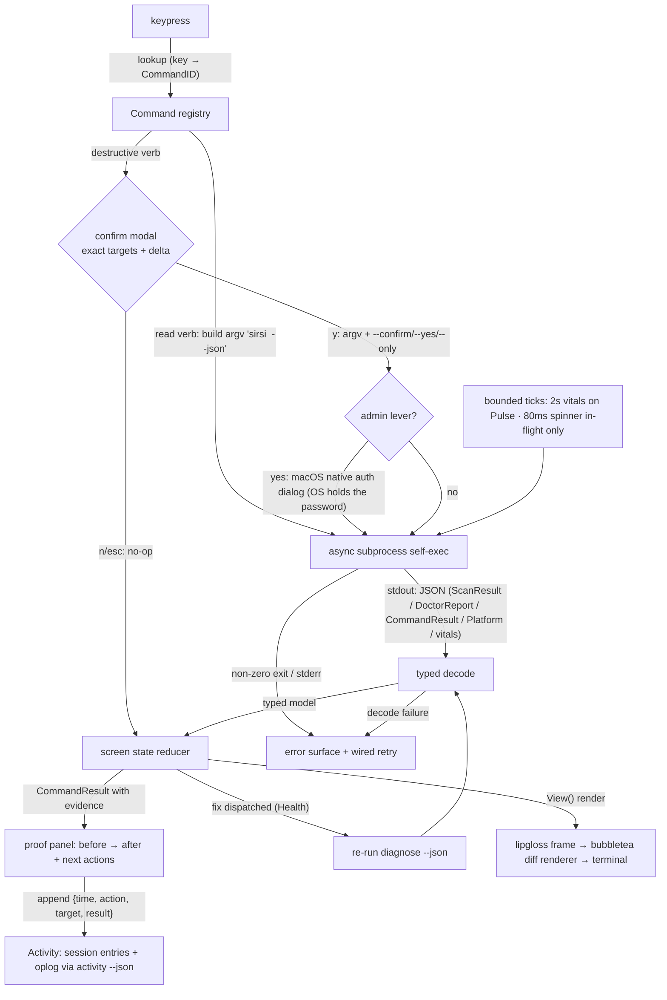

# TUI Design Proof v2 — Five-Screen Operator Console

| Field | Value |
| :--- | :--- |
| **Status** | **v2 DRAFT — awaiting independent review** (ADR-020 gate: claude-home binds; codex SME). No new `internal/tui/` code lands before this clears. |
| **Author** | claude-pantheon (lane: TUI-DESIGN, v1 release sprint) · 2026-07-01 |
| **Basis** | PRD `docs/prd/RELEASE_V1_STAR_GRADE.md` Phase 2A (owner-directed five-screen scope) |
| **Supersedes-in-scope** | The 2026-05-31 v1 proof (Gate 1 cleared by codex-pantheon; Gate 2 scaffold landed at `internal/tui/`). v2 re-scopes the console from proof-of-craft fixture views to the five product screens. §0 lists exactly what carries forward as binding. |
| **Governs** | [ADR-020](ADR-020-INTERACTIVE-SURFACE-REOPENED.md) (Hybrid C gate), [ADR-033](ADR-033-REMEDIATION-CATALOG.md) (Three-Outcome Law), [ADR-018](ADR-018-NATIVE-MAC-APP.md) (v0.22 deletion stands) |
| **Quality bar** | Mole-grade, measurable (§7) — `docs/PHASE1_MOLE_INSPECTION.md` |
| **Brand** | PANTHEON_RULES §2.7 (Rule A10): Gold `#C8A951` · Black `#0F0F0F` · Deep Lapis `#1A1A5E` · *"Weigh. Judge. Purge."* |

> **Premise.** v0.22's TUI died of scope creep and unwired chrome — "utterly unreleasable" (ADR-018).
> ADR-020's law: the proof is the gate; there is no second chance to discover "unreleasable" after
> the Go is written. This document is that gate for the v1 release console: **five screens, no more**,
> every key wired, every action ending in proof.

---

## 0. Provenance — what carries forward, what changes

The 2026-05-31 Gate-1 proof cleared codex review and its Gate-2 scaffold exists at `internal/tui/`
(five primitives: Frame/Pane/Table/Palette/Toast · binary split-tree with the three named layouts ·
Command registry with generated status-bar hints · View/reducer contract · linear no-altscreen
renderer · glyph policy). **These rules remain binding and are inherited, not relitigated:**

| Inherited rule (v1 proof §) | One-line restatement |
| :--- | :--- |
| Glyph Rules **G1–G3** (§2.3) | Hieroglyphs (U+13000+) never layout-bearing; deity identity = color + name + BMP-safe sigil; probe-gated flair only in non-layout cells (splash, help). Box-drawing = light set only. |
| Semantic color ladder (§2.4) | Six tokens (`brand/accent/ok/warn/danger/dim`), truecolor→256→16→attribute degrade, `NO_COLOR` honored, color never the sole carrier of meaning. |
| Dispatch registry (§3.4) | Every key resolves through the `Command` registry; status-bar hints are *generated from* registered commands — a rendered hint is provably wired. |
| Accessibility (§5) | `--no-altscreen` linear mode; text severity tokens; high-contrast toggle; reduced motion; focus never color-only. |
| Cell discipline (§2.2) | Minimum 80×24; below it, a single centered notice — never a broken render. Table rows single-line, truncate with `…`, never wrap. |

**What v2 changes (owner-directed via the PRD):**

1. **The screens are products, not fixtures.** The scaffold's proof views (Scan table / Ra deploy /
   Router inbox) and `sirsi tui`'s live Threads/Inbox views are **retired from the default console**.
   The v1 console is the five screens in §2 — the monitor→identify→**FIX** loop (ADR-033), which is
   the app's core value, rendered interactively.
2. **`sirsi` (no args, TTY) opens the console.** This amends the scaffold-era assumption that no-args
   keeps printing help. The owner decided the default surface in the PRD (exit criterion 1). Non-TTY
   behavior is unchanged (§1).
3. **The TUI reads ONLY existing CLI `--json` contracts.** Go stays the brain — scanning, cleaning,
   diagnosing, remediating all live in the engine behind the CLI verbs. The TUI is a **renderer +
   dispatcher**: it renders JSON the CLI already emits and dispatches the exact commands the engine
   already gates (ADR-033 catalog, Rule A1 preview==apply). §5 is the complete contract inventory,
   including the explicit "requires new `--json` flag" list.

---

## 1. Mission

**`sirsi` with no arguments, on a TTY, opens the operator console.** That first keystroke is the
star-magnet: one-line install → `sirsi` → jaw-drop inside 60 seconds (PRD /goal). This is the surface
of the README hero GIF and the YC demo.

| Invocation | Behavior |
| :--- | :--- |
| `sirsi` — stdin **and** stdout are TTYs | Launch the console (alt-screen), landing on **Pulse** |
| `sirsi` — piped, redirected, CI, non-TTY | Print help, exit 0 — **byte-identical to today**. Scripts never see ANSI alt-screen codes. |
| `sirsi tui` | Same console, explicit (becomes an alias of the no-args path — one code path, not two) |
| `SIRSI_NO_TUI=1 sirsi` | Help, always — the operator's opt-out |
| `sirsi help` / `sirsi --help` | Help, always (unchanged) |

**The 60-second demo arc the console must carry** (PRD Phase 3.1): slow Mac → `sirsi` → Pulse names
the hog → `r` relieve → before/after MB delta on screen → `s` scan → toggle review → clean → freed
proof → `q`. Every beat is a screen or key in this document; nothing in the arc is aspirational.

---

## 2. The Five Screens — the cap is LAW

Scope creep killed v0.22 (PRD Risks). The v1 console has **exactly five screens**. Adding a sixth
requires a new ADR — not a PR comment, an ADR. Every screen answers one operator question and leads
with one number.

| # | Screen | Operator question | Lead metric | Primary verb | Engine source |
| :-- | :--- | :--- | :--- | :--- | :--- |
| 1 | **Pulse** (home) | "Why is my Mac slow *right now*?" | RAM used / pressure | `r` relieve | vitals sample (§5 gap V1) + `relieve --memory` |
| 2 | **Waste** | "What junk can I reclaim?" | GB reclaimable | `s` scan → `c` clean | `scan --json` + `clean --only/--confirm` |
| 3 | **Ghosts** | "What did uninstalled apps leave behind?" | ghost apps · GB | `c` clean per app | ka findings + `clean --only` |
| 4 | **Health** | "Is anything wrong, and what fixes it?" | health score /100 | `enter` = the finding's own fix | `diagnose --json` (ADR-033 catalog) |
| 5 | **Activity** | "What did Pantheon actually do?" | actions today | `enter` inspect | operations ledger (§5 gap V4) |

**Memory-first is law** (owner directive 2026-06-26): Pulse is the home screen, RAM leads every
summary, disk waste is screen 2 — never the headline.

**ADR-033 binds every screen:** every alarm-colored row carries a *current, fixable* condition and a
real lever (ACTION), or names the cause with the exact manual step (GUIDANCE), or is plain info with
no alarm color (INFO). "If nothing can clear it, it must not alarm." The TUI never invents a fix: it
dispatches the `fix` command string the engine put on the finding.

### Screen flows

**Pulse** — RAM gauge + pressure word (`nominal/warn/critical` from the engine's pressure sample),
top memory hogs **named** (basename, not PID soup — plain-English GUI rule), each hog row labeled
with what you can honestly do (quit it / governed agent / protected system process). `r` opens the
relieve flow: preview (names the hog, states what `purge` will do, admin-auth note) → confirm →
native macOS admin dialog → **before/after proof panel** (free GB before → after, pressure before →
after). Nothing killed, ever — exactly `sirsi relieve --memory`'s semantics.

**Waste** — `s` runs the scan (streamed progress row, elapsed timer), results grouped by rule with
per-group **and per-item toggles** (`space`), drill-in (`enter`) to path level — the same
scan → review → clean flow the menubar ships in PR #130. `c` opens the clean confirm modal listing
*exactly* the toggled set and its total; apply dispatches `clean --only <path>…` (narrow-only law:
the `--only` flag can shrink scope, never widen it — preview==apply, Rule A1). Trash-first is stated
in the modal. Ends in the **freed proof panel**: items moved, GB reclaimed, skipped-protected count.

**Ghosts** — per-app residual groups (app name, residual count, size), `enter` drills into the
residual paths (type-tagged: cache/log = safe, preferences/app-data = caution and toggled off by
default), `c` cleans the selected app's residuals via `clean --only`. Same confirm + proof machinery
as Waste — built once, reused.

**Health** — `d` runs `diagnose`; findings render with severity, message, detail, and the finding's
own `fix` command. The action key label is **honest by `fixKind`** (engine-supplied, never
TUI-guessed): `instant` → "Fix now", `relief` → "Relieve the live cause", `guidance` → "Show me how"
(renders the manual step, dispatches nothing). Trend/info findings render plain — no alarm color, no
fix key (Three-Outcome Law). After any fix the TUI re-runs `diagnose` and shows the finding cleared,
downgraded, or honestly still-present-as-history.

**Activity** — the provenance ledger, newest first: timestamp, action, target, result (bytes freed /
proof delta / error). Two feeds merged: the persistent operations log (every destructive op, §5) and
this session's dispatched CommandResults. Read-only; `enter` expands the full result (summary,
evidence, next actions). This is where trust is earned — the user can always answer "what did it do?"

---

## 3. Full Keymap

Every key the console responds to is on this page. **There is no hidden state:** an unlisted key does
nothing except flash `unmapped — press ? for keys` in the status bar. No modes, no chords, no vim
trap. All keys dispatch through the inherited Command registry (§0), so every hint shown is wired by
construction.

### Global (every screen, every state)

| Key | Action |
| :-- | :--- |
| `tab` / `shift-tab` | Next / previous screen (Pulse → Waste → Ghosts → Health → Activity, wraps) |
| `1` `2` `3` `4` `5` | Jump to Pulse / Waste / Ghosts / Health / Activity |
| `s` | Scan — switches to Waste and starts a scan |
| `c` | Clean — switches to Waste review (on Waste/Ghosts: opens the clean confirm for the toggled set) |
| `g` | Ghosts — switches to Ghosts |
| `r` | Relieve — switches to Pulse and opens the relieve preview |
| `d` | Diagnose — switches to Health and runs the diagnostic |
| `u` | Update — refresh the current screen's data |
| `?` | Help overlay — this keymap, rendered (motto footer: *Weigh. Judge. Purge.*) |
| `q` | Quit (confirm modal only if an operation is in flight) |
| `Ctrl-C` | Same as `q` — graceful teardown, alt-screen restored (deferred restore, panic-safe) |
| `esc` | Dismiss modal / close drill-in / clear filter — never quits from top level |

### Per-screen

| Key | Screens | Action |
| :-- | :--- | :--- |
| `↑`/`↓` (`k`/`j`) | all lists | Move selection |
| `home` / `end` | all lists | Jump to top / bottom |
| `enter` | Pulse | Hog detail (full path, RSS, honest options) |
| `enter` | Waste, Ghosts | Drill into group → per-item list; `esc` backs out |
| `enter` | Health | Run the selected finding's fix (via confirm) or render its guidance |
| `enter` | Activity | Expand the ledger entry (full CommandResult) |
| `space` | Waste, Ghosts | Toggle the selected item/group in or out of the clean set |
| `a` | Waste, Ghosts | Toggle all in the current list |
| `/` | all lists | Filter the focused list (typed text; `esc` clears) |

### Confirm modal (destructive actions only)

| Key | Action |
| :-- | :--- |
| `y` | Confirm — dispatch the exact previewed command |
| `n` / `esc` | Cancel — nothing runs, nothing changes |

Destructive dispatch is **never single-keystroke** (inherited law): `c`/`enter` opens the modal
naming the exact targets and the dry-run delta; only `y` executes. Reversibility is stated in the
modal (trash-first / re-caches / resets-on-exit). Admin levers (`purge`, `tmutil`) additionally route
through the **native macOS admin-auth dialog** — the password goes to the OS, never to sirsi
(ADR-033).

While a filter (`/`) is active, typed characters go to the filter box — the only text-input state in
the console, always visible as a rendered input row, always exited with `esc`/`enter`.

---

## 4. Wireframes — every screen, every state

Rendered at 80×24 (the floor; layouts stretch to fill wider/taller terminals). Color is annotated
`‹token›` per the inherited ladder (§0). Chrome is identical on all screens: **row 1** = screen strip
(the five names; the active one bracketed + `brand` gold — this strip is *generated from the same
screen registry that `tab`/`1–5` dispatch through*, so unlike v0.22's tabs it cannot be decorative);
**row 24** = status bar (context keys `dim` · mode chip `accent` · headline number `brand`).

### 4.1 Pulse — main

```
┌ ◉ Pantheon ─ [1 Pulse]  2 Waste  3 Ghosts  4 Health  5 Activity ── 14:32:07 ┐
│                                                                             │
│  MEMORY                                     pressure: ‹warn›ELEVATED        │
│  ‹brand›██████████████████████████████░░░░░░░░  30.1 / 36.0 GB used         │
│  free 2.6 GB · cached 3.3 GB · swap 1.2 GB                                  │
│                                                                             │
│  TOP MEMORY USERS                                                           │
│   #  PROCESS                MEM      CPU   WHAT YOU CAN DO                  │
│  ▸1  Chrome               6.8 GB     12%   quit it, or r relieves pressure  │
│   2  codex                4.1 GB      3%   AI agent — governed              │
│   3  Xcode                3.3 GB      1%   quit it if you're done building  │
│   4  WindowServer         1.9 GB      4%   system — protected, leave it     │
│   5  Slack                1.2 GB      2%   quit it, or r relieves pressure  │
│                                                                             │
│  ‹dim›Next: memory is tight — r flushes inactive caches (asks your admin    │
│  ‹dim›password once), names the hog, and proves the before → after. Nothing │
│  ‹dim›is killed.                                                            │
│                                                                             │
│                                                                             │
│                                                                             │
│                                                                             │
└─────────────────────────────────────────────────────────────────────────────┘
 r relieve · ↑↓ pick · enter detail · u update · ? keys · q quit  ‹accent›PULSE ‹brand›30.1 GB
```

### 4.2 Pulse — the proof moment (after `r` → `y` → macOS admin dialog)

The wow beat of the README GIF: the numbers move, on screen, with provenance.

```
┌ ◉ Pantheon ─ [1 Pulse]  2 Waste  3 Ghosts  4 Health  5 Activity ── 14:32:41 ┐
│                                                                             │
│  MEMORY                                     pressure: ‹ok›NOMINAL           │
│  ‹brand›████████████████████████░░░░░░░░░░░░░░  24.5 / 36.0 GB used         │
│  free 8.2 GB · cached 1.1 GB · swap 1.2 GB                                  │
│                                                                             │
│  ┌─ ‹ok›RELIEVED — proof ─────────────────────────────────────────────┐     │
│  │  Free memory    2.6 GB  →  8.2 GB      ‹ok›(+5.6 GB freed)         │     │
│  │  Pressure       ‹warn›ELEVATED  →  ‹ok›NOMINAL                     │     │
│  │  Top user       Chrome (6.8 GB) — quit it to free more             │     │
│  │                                                                    │     │
│  │  Flushed inactive caches. macOS re-caches as it needs to — the     │     │
│  │  pressure relief is the point. Nothing was killed.                 │     │
│  │                                                                    │     │
│  │  ‹dim›next: s scan reclaims disk too · d checks overall health     │     │
│  └────────────────────────────────────────────────────────────────────┘     │
│                                                                             │
│  TOP MEMORY USERS                                                           │
│  ▸1  Chrome               6.8 GB     12%   quit it, or r relieves pressure  │
│   2  codex                4.1 GB      3%   AI agent — governed              │
│                                                                             │
└─────────────────────────────────────────────────────────────────────────────┘
 esc dismiss · r again · s scan · ? keys · q quit          ‹accent›PULSE ‹ok›+5.6 GB
```

### 4.3 Pulse — empty (healthy) / loading / error states

Content region only (chrome as above). **Empty** = genuinely healthy is a first-class success render,
not a blank screen. **Error** always names the cause and a wired retry.

```
EMPTY (healthy)                          LOADING (first vitals sample)
│  MEMORY            pressure: ‹ok›OK │  │  MEMORY                            │
│  ██████░░░░░░░░  10.2/36.0 GB used  │  │  ‹dim›░░░░░░░░  sampling…  ⠿       │
│                                     │  │                                    │
│  ‹ok›Memory is comfortable.         │  │  ‹dim›Reading memory vitals        │
│  Nothing is hogging your Mac.       │  │  ‹dim›(first sample takes <1s)     │
│  ‹dim›s scan finds disk waste ·     │  │                                    │
│  ‹dim›d runs a health check         │  │                                    │

ERROR (vitals sample failed)
│  ‹danger›Couldn't read memory vitals: sirsi vitals exited 1                 │
│  ‹dim›stderr: sysctl: unknown oid 'hw.memsize'                              │
│                                                                             │
│  u retries · Activity (5) has the full error · q quits cleanly              │
```

### 4.4 Waste — main (after a scan, review state)

```
┌ ◉ Pantheon ─ 1 Pulse  [2 Waste]  3 Ghosts  4 Health  5 Activity ─ scan 12s ago ┐
│                                                                             │
│  SELECT WHAT TO CLEAN            ‹brand›24.8 GB selected of 29.3 reclaimable│
│                                                                             │
│      GROUP                        SIZE     ITEMS   TIER                     │
│  ▸[x] Xcode derived data        14.0 GB       3    ‹ok›safe                 │
│   [x] Orphaned node_modules      9.7 GB      31    ‹ok›safe                 │
│   [x] Docker dangling images     1.1 GB       8    ‹ok›safe                 │
│   [ ] Homebrew cache             2.1 GB      64    ‹warn›caution            │
│   [ ] App crash reports          0.3 GB     112    ‹warn›caution            │
│   [ ] AI model weights          67.0 GB       2    ‹dim›protected — listed, │
│                                                    ‹dim›never one-click     │
│                                                                             │
│  ‹dim›space toggles · enter opens a group to toggle single items ·          │
│  ‹dim›everything goes to the Trash first — recoverable until you empty it.  │
│                                                                             │
│                                                                             │
│                                                                             │
│                                                                             │
└─────────────────────────────────────────────────────────────────────────────┘
 space toggle · enter drill in · a all · c clean · / filter · u rescan  ‹accent›WASTE ‹brand›24.8 GB
```

### 4.5 Waste — confirm modal and freed proof

```
CONFIRM (opened by c)                        PROOF (after y)
│ ┌─ Clean 42 items — 24.8 GB? ─────────┐ │  │ ┌─ ‹ok›CLEANED — proof ──────────────┐ │
│ │ Moves to Trash (recoverable):       │ │  │ │  Items moved to Trash        42    │ │
│ │  Xcode derived data   14.0 GB   3   │ │  │ │  Space reclaimed      ‹ok›24.6 GB  │ │
│ │  node_modules          9.7 GB  31   │ │  │ │  Skipped (protected)          1    │ │
│ │  Docker images         1.1 GB   8   │ │  │ │                                    │ │
│ │                                     │ │  │ │  Recoverable in the Trash until    │ │
│ │ Exactly this list runs — the        │ │  │ │  you empty it.                     │ │
│ │ preview IS the apply (never wider). │ │  │ │  ‹dim›next: g ghosts · d health ·  │ │
│ │                                     │ │  │ │  ‹dim›u verifies with a rescan     │ │
│ │        ‹danger›y clean  ·  n cancel │ │  │ └────────────────────────────────────┘ │
│ └─────────────────────────────────────┘ │
```

### 4.6 Waste — empty / loading / error states

```
EMPTY (no scan yet)                       EMPTY (scan found nothing)
│  No scan results yet.               │   │  ‹ok›Clean machine. 21 rules ran — │
│                                     │   │  ‹ok›nothing worth reclaiming.     │
│  ‹brand›s starts a scan (~10–30s).  │   │  ‹dim›u rescans · g checks ghosts  │
│  ‹dim›It reads sizes, deletes       │
│  ‹dim›nothing, and asks before      │   ERROR (scan failed)
│  ‹dim›any cleanup.                  │   │  ‹danger›Scan failed: exit 1        │
│                                     │   │  ‹dim›stderr: permission denied:    │
LOADING (scan in flight)                  │  ‹dim›~/Library/…  (2 rules errored,│
│  Scanning…  ⠿  00:12 elapsed        │   │  ‹dim›partial results kept)         │
│  ‹dim›21 rules · sizes read,        │   │  u retries · 5 Activity has the log │
│  ‹dim›nothing touched               │
```

### 4.7 Ghosts — main + drill-in

```
┌ ◉ Pantheon ─ 1 Pulse  2 Waste  [3 Ghosts]  4 Health  5 Activity ──── 5 apps ┐
│                                                                             │
│  LEFTOVERS FROM UNINSTALLED APPS              ‹brand›1.9 GB reclaimable     │
│                                                                             │
│      APP                        RESIDUALS      SIZE                         │
│  ▸[x] Parallels Desktop               12     1.2 GB                         │
│   [x] Zoom                             7   318.4 MB                         │
│   [x] OldBrewCask                      4   201.7 MB                         │
│   [ ] Adobe Creative Cloud             9   180.2 MB   ‹warn›has app data    │
│   [x] SomeGame                         2    64.1 MB                         │
│                                                                             │
│  ├─ Parallels Desktop — 12 residuals ─────────────────────────────────────  │
│  │ [x] ~/Library/Caches/com.parallels…            842.0 MB  ‹ok›cache       │
│  │ [x] ~/Library/Logs/parallels.log                12.4 MB  ‹ok›log         │
│  │ [ ] ~/Library/Preferences/com.parallels….plist   4.1 KB  ‹warn›prefs     │
│  │ ‹dim›caches and logs are safe; preferences and app data start            │
│  │ ‹dim›unticked — keep them if you might reinstall.                        │
│                                                                             │
│                                                                             │
└─────────────────────────────────────────────────────────────────────────────┘
 space toggle · enter open/close app · c clean · a all · u rescan  ‹accent›GHOSTS ‹brand›1.9 GB
```

Confirm + proof reuse the Waste modals verbatim (same components, same laws). States:

```
EMPTY                                     LOADING                ERROR
│ ‹ok›No ghosts. Every installed    │    │ Hunting ghosts… ⠿ │  │ ‹danger›Ghost scan failed:     │
│ ‹ok›app owns its files.           │    │ ‹dim›reading app  │  │ exit 1 — u retries ·           │
│ ‹dim›u rescans · s full scan      │    │ ‹dim›residuals    │  │ 5 Activity has the full error  │
```

### 4.8 Health — main

```
┌ ◉ Pantheon ─ 1 Pulse  2 Waste  3 Ghosts  [4 Health]  5 Activity ─ score 74 ┐
│                                                                             │
│  HEALTH — ‹warn›ATTENTION (74/100)              ‹dim›diagnosed 14:35:02     │
│                                                                             │
│      FINDING                 STATE                ACT                       │
│  ▸‹warn›RAM pressure         elevated, live      enter → Relieve the cause  │
│   ‹warn›Disk space           41 GB free (11%)    enter → Fix now (clean)    │
│   ‹warn›Local snapshots      6 snapshots, ~9 GB  enter → Fix now (reclaim)  │
│   ‹dim›Jetsam events (7d)    3 days saw kills    ‹dim›trend — informs only  │
│   ‹dim›Kernel panic (7d)     1 on Jun 27         enter → Show me how        │
│   ‹ok›Sirsi processes        healthy             —                          │
│                                                                             │
│  ‹dim›▸ RAM pressure — used RAM is high enough that macOS may start         │
│  ‹dim›killing apps (Jetsam). Relieve flushes inactive caches — reversible,  │
│  ‹dim›asks admin once, then re-checks this finding.                         │
│                                                                             │
│                                                                             │
│                                                                             │
│                                                                             │
└─────────────────────────────────────────────────────────────────────────────┘
 ↑↓ pick · enter act · d re-diagnose · / filter · ? keys        ‹accent›HEALTH ‹warn›74/100
```

Action labels are verbatim honest per `fixKind` (§2): after a fix, `diagnose` re-runs and the row
shows `‹ok›cleared`, `‹warn›downgraded`, or `‹dim›still present (history — decays as clean days
pass)`. Trend rows have **no** ACT entry and **no** alarm color — the Three-Outcome Law rendered.

```
EMPTY (all green)                         LOADING               ERROR
│ ‹ok›100/100 — nothing needs you.  │    │ Diagnosing… ⠿     │  │ ‹danger›Diagnose failed: exit 1 │
│ 12 checks ran; all healthy.       │    │ ‹dim›12 checks:   │  │ ‹dim›stderr tail rendered here  │
│ ‹dim›d re-checks · s finds waste  │    │ ‹dim›RAM, disk,   │  │ d retries · 5 Activity has the  │
│                                   │    │ ‹dim›crashes…     │  │ full error                      │
```

### 4.9 Activity — main

```
┌ ◉ Pantheon ─ 1 Pulse  2 Waste  3 Ghosts  4 Health  [5 Activity] ── 6 today ┐
│                                                                             │
│  WHAT PANTHEON DID                          ‹dim›newest first · local-only  │
│                                                                             │
│   WHEN            ACTION              TARGET                RESULT          │
│  ▸14:36:12  clean               42 items → Trash      ‹ok›24.6 GB freed     │
│   14:32:41  relieve --memory    inactive caches       ‹ok›+5.6 GB free      │
│   14:31:05  scan                21 rules              29.3 GB found         │
│   13:10:33  reclaim-snapshots   6 APFS snapshots      ‹ok›8.9 GB freed      │
│   12:44:19  clean               1 item → Trash        ‹danger›failed: locked│
│   09:15:02  diagnose            12 checks             score 71 → 74         │
│                                                                             │
│  ├─ 14:36:12 clean ───────────────────────────────────────────────────────  │
│  │ Cleaned 42 items. Reclaimed 24.6 GB. Skipped 1 (protected).              │
│  │ ‹dim›evidence: Xcode derived data 14.0 GB · node_modules 9.7 GB · …      │
│  │ ‹dim›every destructive op is also in ~/Library/Logs/sirsi/operations.log │
│                                                                             │
│                                                                             │
│                                                                             │
└─────────────────────────────────────────────────────────────────────────────┘
 ↑↓ pick · enter expand · / filter · u reload                ‹accent›ACTIVITY ‹brand›6 today
```

```
EMPTY                                     LOADING               ERROR
│ Nothing yet. Every action Pantheon │   │ Reading ledger… ⠿ │  │ ‹danger›Couldn't read the ledger │
│ takes — cleans, relieves, fixes —  │   │                   │  │ (permissions?). The log lives at │
│ is recorded here with its proof.   │   │                   │  │ ~/Library/Logs/sirsi/…           │
│ ‹dim›s scan · r relieve · d health │   │                   │  │ u retries                        │
```

---

## 5. Data Contracts — what each screen reads and dispatches

**Law: the TUI consumes only `sirsi <verb> --json` output and dispatches only catalog-gated `sirsi`
commands.** It self-execs the `sirsi` binary as a subprocess (async, never blocking the render loop)
and decodes the same JSON any script would see — zero TUI-private logic, zero drift surface (this
was v0.22's stale-verb failure; see §9 decisions). `--json` is a root persistent flag
(`cmd/sirsi/main.go`), so every contract below is real today unless flagged.

### Per-screen contract table

| Screen | Read | Shape (real fields) | Dispatch |
| :--- | :--- | :--- | :--- |
| **Pulse** gauge | **GAP V1** — `sirsi vitals --json` (new) | see gap list | — (2s tick) |
| Pulse next-step line | `sirsi insight --json --no-ai` | `insight.Platform{signals[]{deity,glyph,status,severity 0–2}, actions[]{priority,title,why,command}, worst, source}` — deterministic; `--no-ai` keeps the hot path off the 90s Gemma budget | actions[].command verbatim |
| Pulse relieve | `sirsi relieve --memory --json` (preview) | `output.CommandResult{command, summary, status:"preview", evidence[]{label,value}: Top memory user / Free memory / Pressure, next_actions[]{label,command,description}}` | `sirsi relieve --memory --confirm --json` → `status:"ok"`, evidence `Free before/Free after/Pressure X → Y` (the proof panel renders these verbatim); errors → `status:"error"`, `errors[]` |
| Pulse CPU relieve (hog row) | `sirsi relieve --json` / `sirsi relieve "<name>" --json` | same CommandResult shape; `--min-cpu` default 15 | `sirsi relieve "<name>" --confirm --json` |
| **Waste** scan | `sirsi scan --json` | `jackal.ScanResult{Findings[]{RuleName, Category, Description, Path, SizeBytes, FileCount, Severity(safe/caution/warning), IsDir, LastModified}, TotalSize, ReclaimableSize, RulesRan, RulesWithFindings, Errors[]}` — `ReclaimableSize` (safe+caution only) is the headline; warning-tier (model weights) is listed, never one-click (engine law). Scan persists findings; clean loads that same set (`jackal.Persist`/`LoadLatest`) | — |
| Waste clean preview | `sirsi clean --json` (dry-run is the default) + `--only <path>` (repeatable; **can only narrow, never widen** — lands with PR #130, PRD Phase 1.4 merges it before build days) + `--include-caution` for caution-tier toggles | `CommandResult{summary:"Dry run: N items (X GB) would be cleaned", evidence: Cleanable items / Reclaimable space, next_actions}` | apply: `sirsi clean --confirm --only … --json` → `CommandResult{summary:"Cleaned N items. Reclaimed X.", evidence, warnings: skipped-protected}` — **GAP V2**: `--confirm` still blocks on a stdin `[y/N]` prompt |
| **Ghosts** | `sirsi ghosts --json` → `CommandResult{summary, evidence[]{label: app, value: "N residuals, size"}, next_actions}` — display strings, **not** structured residuals → **GAP V3**. v1 fallback: `sirsi scan --json` filtered to `RuleName=="ka_ghost"` (path-level findings, `Description: "Ghost: <app> (<type>)"`, caution tier for prefs/app-data) | as left | `sirsi clean --confirm --only <residual paths> --json` (same engine, trash-first, protected-path guards) |
| **Health** | `sirsi diagnose --json` | `guard.DoctorReport{timestamp, duration, findings[]{check, severity 0–3 (OK/Info/Warn/Critical), message, detail, trend, activeDays, fix, fixKind(instant/relief/guidance)}, score 0–100, status(green/amber/red)}` — `status` follows the LIVE-vs-TREND rubric; the TUI renders it, never re-derives | each finding's `fix` string verbatim + `--json` (e.g. `sirsi relieve --memory`, `sirsi clean --include-caution`, `sirsi reclaim-snapshots`, `sirsi spotlight-exclude ~/Development`, `sirsi self-update`); re-verify = re-run `diagnose --json` |
| Health snapshots fix | `sirsi reclaim-snapshots --json` (preview: snapshot count, disk free now) | `CommandResult` | `sirsi reclaim-snapshots --confirm --json` (native admin-auth; proof = disk free before/after) |
| **Activity** | **GAP V4** — `sirsi activity --json` (new). Today the ledger is plain text: `~/Library/Logs/sirsi/operations.log` (`internal/oplog`: `ts  action  path (bytes)`, every destructive op, `SIRSI_NO_OPLOG=1` opt-out) | see gap list | — (read-only screen) |

Session-local entries (this run's dispatched CommandResults) are appended to Activity in memory —
no new contract needed; the disk ledger provides history across sessions.

### Requires new `--json` flag (the explicit gap list)

Small, engine-side CLI additions — plain CLI features with standalone value, reviewable
independently of any TUI code. None create new levers; they expose existing internals.

| # | Contract | Why the TUI needs it | What exists today |
| :-- | :--- | :--- | :--- |
| **V1** | `sirsi vitals --json` (new command) → `{total_bytes, used_bytes, free_bytes, cached_bytes, swap_used_bytes, pressure: "nominal"\|"warn"\|"critical", top[]{name, pid, rss_bytes, cpu_percent}}` | Pulse's gauge + named hogs on a 2s tick needs a <100ms sample. `diagnose --json` runs the full 12-check diagnostic (seconds) — wrong tool for a gauge | `guard.SampleNodeCapacity()` + `guard.SampleMemory()` already power `relieve --memory`'s evidence; no CLI JSON surface |
| **V2** | `sirsi clean --yes` (new flag): with `--confirm`, skip the interactive `[y/N]` stdin prompt | The TUI renders its own confirm modal; the CLI prompt would deadlock a subprocess dispatcher. Scope safety unchanged: `--only`/`--include-caution` still govern the set; preview==apply law untouched | `clean --confirm` blocks on `bufio` stdin read (`cmd/sirsi/anubis.go` runJudge) |
| **V3** | `sirsi ghosts --json` structured mode → `{ghosts[]{app_name, total_size_bytes, residuals[]{path, type, size_bytes, file_count}}}` | Per-app drill-in + per-item toggles need paths and types, not display strings | `ka.Scanner` has the full structure in memory; `--json` currently emits only CommandResult evidence strings. Documented fallback: scan `ka_ghost` findings |
| **V4** | `sirsi activity --json` (new command) → `{entries[]{time, action, target, bytes, source}}` reading the oplog (+ optionally last persisted CommandResults) | The Activity screen is the trust ledger; parsing free-text log lines in the TUI would be a private contract — the exact drift this design bans | `internal/oplog` writes plain text; no reader exists |
| *(non-gating)* | Scan progress events (NDJSON stream) | Live per-rule progress bar during scan | v1 ships spinner + elapsed + rule count instead — honest and sufficient |

---

## 6. Technology Choice

**Decision: `bubbletea` v2 + `lipgloss` v2.** Both are already direct dependencies
(`charm.land/bubbletea/v2 v2.0.7`, `charm.land/lipgloss/v2 v2.0.3` in `go.mod`), and lipgloss is
already the mandated CLI styler (Rule A10) — one styling system across CLI and TUI, one brand
implementation.

| Option | Verdict | Why |
| :--- | :--- | :--- |
| **bubbletea + lipgloss** | **chosen** | Elm/reducer architecture is exactly the `internal/tui` scaffold's View/reducer contract (Gate 2); `lipgloss` already renders the brand; `teatest` gives golden-frame + scripted-interaction tests; async `tea.Cmd` matches subprocess dispatch; zero new deps |
| tview/tcell | rejected | Imperative widget tree fights the reducer scaffold; second styling system beside lipgloss; golden-frame testing is DIY |
| gocui | rejected | Minimal styling, no test harness, layout model too poor for the Mole bar |
| Raw ANSI + own diff renderer | rejected | Building a renderer is v0.22-class scope creep; bubbletea's is proven |

The v0.22 caveat, answered directly: **bubbletea did not sink v0.22 — unwired chrome and unbounded
scope did.** The framework returns; the failure modes are banned structurally (§0 inherited rules,
five-screen cap, contract-only data).

**Startup budget: <100ms to first frame** (perceived-instant; the README GIF's first beat).
No network, no model, no full scan on launch. First frame renders the Pulse chrome with a
`sampling…` gauge; the vitals subprocess (V1, <100ms itself) and `insight --json --no-ai` resolve
asynchronously into frames 2+. Enforced by a CI time-to-first-frame test (M-series runner baseline,
generous 2× margin), not by hope.

**60fps feel.** Keypress → visible state change <50ms, always: input is never queued behind I/O.
All subprocess exec runs as async `tea.Cmd`s; `Update()` never blocks. Ticks are bounded and scoped:
2s vitals tick on Pulse only, 80ms spinner tick only while an operation is in flight, zero ticks
idle on other screens (no `mds_stores`-style churn; ADR-020 amendment guardrail). bubbletea's diff
renderer handles frame delivery; animation is limited to the spinner and is reduced-motion-aware
(§0 inherited).

**Theme tokens** (single source, `internal/tui` theme table — every color below already exists in
the inherited ladder with 256/16/attr degrades):

| Token | Value | Use (Rule A10 alignment) |
| :--- | :--- | :--- |
| `brand` | `#C8A951` gold | Headline numbers, active screen, gauge fill, selected counts |
| `bg` | `#0F0F0F` black | Frame background (terminal default respected in non-truecolor) |
| `accent` | `#1A1A5E` lapis | Mode chip, focus border, filter box |
| `ok` | green | Proof deltas, healthy, success |
| `warn` | amber | Caution tier, attention findings |
| `danger` | red | Errors, destructive confirm key |
| `dim` | gray | Chrome, guidance copy, hints, protected/info rows |

Hieroglyphs stay CLI/docs flair per G1–G3; the TUI's identity mark is the safe sigil `◉` + the word
*Pantheon* in gold. Deity names appear in copy (plain-English GUI law: deity names stay, jargon dies).

---

## 7. Quality Bar & Release Gate

"Mole-grade" is measurable or it is marketing. The console ships when ALL of these hold:

| Bar | Measure | Verified by |
| :--- | :--- | :--- |
| **No flicker** | Zero visible repaint artifacts in a 60s vhs capture of the full demo arc at 30fps | Recorded capture review + golden-frame determinism (two renders of one state are byte-identical) |
| **Resize-safe** | Correct render at every size ≥80×24; below floor → single centered notice, never a torn frame; live resize mid-operation never panics | Golden frames at 80×24 / 100×30 / 120×40 / 200×60; scripted resize-during-scan test |
| **Every action ends in result + next-action** | Structural: every dispatch resolves to a rendered `CommandResult` panel (summary + evidence + next actions) or a named error surface with a wired retry key | Dispatch-table test: iterate every registered command → assert terminal state ∈ {proof panel, guidance panel, error panel} |
| **Zero dead-ends** | Every screen in every state (main/empty/loading/error/modal) has ≥1 wired verb in its status bar; `?` and `q` work everywhere | Keymap completeness test (below) |
| **Latency** | <100ms first frame; <50ms keypress→response; ops >2s show elapsed + spinner (Rule A10) | CI budget tests |
| **Honesty** | Fix labels from `fixKind` verbatim; alarm colors only on current+actionable rows; proof numbers only from engine evidence, never computed in the TUI | Golden frames pin the labels; contract tests pin the sources |

**Test plan** (lands with the build, not after — Ma'at ≥85 applies to `internal/tui` like everywhere):

1. **Golden-frame tests** — `teatest` + golden files for each screen × {main, empty, loading, error,
   confirm, proof} × two sizes (80×24, 120×40), fed by pinned JSON fixtures. The wireframes in §4
   become the golden fixtures — this document is executable.
2. **Scripted interaction tests** (`teatest`) — the full demo arc as a test: launch → Pulse →
   `r` → cancel → `s` → toggle → `c` → `y` (fixture-backed) → proof frame; plus back-out paths
   (`esc` from every modal and drill-in).
3. **Keymap completeness test** — every key in §3 produces a state change or a visible response;
   every key NOT in §3 produces exactly the unmapped-hint flash. Proves "no hidden state" mechanically.
4. **Non-TTY fallback test** — `sirsi` with piped stdout: byte-identical help output, exit 0, zero
   ANSI alt-screen sequences; `SIRSI_NO_TUI=1` same.
5. **Contract-drift tests** — decode pinned real outputs of `diagnose/scan/clean/ghosts/relieve/
   insight/reclaim-snapshots --json` into the TUI's decoders; a shape change breaks CI, not the
   user's session. Runtime decode failure renders the error surface (§4), never a crash.
6. **Confirm-gating test** — destructive commands structurally cannot dispatch without passing
   through confirm-modal state (mirrors the scaffold's confirm-as-state model and the dashboard's
   E2 discipline).
7. **Teardown test** — panic inside `Update`/`View` restores the terminal (deferred alt-screen
   teardown), exits non-zero with a plain-text error. A TUI that eats the terminal is unreleasable.

**Release gate sequence (ADR-020):** this proof clears independent review (claude-home binds; codex
SME) → owner design-bless (PRD owner-gate 3) → contract gaps V1–V4 land as reviewed CLI PRs → TUI
build (days 3–5) → owner click-through of the demo arc → README GIF recorded → PRD exit criterion 1.

---

## 8. Non-Goals (v1)

Named so scope creep has to fight canon, not a vibe:

- **No config editing** — no settings screens, no TOML editors. `sirsi setup` owns configuration.
- **No fleet views** — Ra deploy/status stays CLI + dashboard; fleet is the paid tier's surface later.
- **No AI chat** — insight's deterministic line renders on Pulse; no conversational panel. Gemma
  narration stays CLI-side (`insight` without `--no-ai`).
- **No router/thread/agent-ops screens** — the Gate-2 fixture views (Threads, Router Inbox) are out
  of the v1 console; agent-operations parity is its own workstream.
- **No mouse requirement** — 100% keyboard-complete; mouse (click-to-select, wheel scroll) is an
  optional enhancement if free, never load-bearing.
- **No theming/config for the TUI itself** — one gold-on-black theme; `NO_COLOR` and high-contrast
  degrade paths only.
- **No Windows/Linux-specific TUI work** — Mac-first roadmap; the code stays portable but the levers
  (purge, tmutil) are macOS and v1 verifies on macOS only.
- **No new levers** — the TUI adds zero remediation capability; anything it fixes, the CLI could
  already fix (ADR-033 catalog is the single brain).

---

## 9. Neith's Triad (Rule A22)

### 9.1 Data Flow Architecture



Boundaries: everything left of EXEC is the TUI (renderer + dispatcher, zero domain logic); everything
behind the subprocess line is the engine (scan rules, remediation catalog, safety gates, protected
paths) — unchanged and shared with CLI, menubar, and dashboard.

### 9.2 Recommended Implementation Order — three build days

Minimum viable pipeline = **Day 3 alone** (Pulse + chrome is a demoable memory-first console).
Days 4–5 are required for the PRD but each day ends shippable.

| Day | Deliverable | Depends on |
| :-- | :--- | :--- |
| **Pre** (with/before build, plain CLI PRs — no `internal/tui` code) | Contract gaps V1–V4: `vitals --json`, `clean --yes`, structured `ghosts --json`, `activity --json`. Each is small (expose existing internals), independently reviewable, and has standalone CLI value | This proof cleared |
| **Day 3** | Frame chrome (screen strip, status bar, help overlay, unmapped-key hint), keymap dispatch on the existing registry, no-args TTY launch + non-TTY fallback + `SIRSI_NO_TUI`, **Pulse** complete (gauge, hogs, relieve flow, proof panel, all four states), golden-frame harness bootstrapped | V1 (vitals) |
| **Day 4** | **Waste** (scan → toggle review → drill-in → confirm → clean → freed proof) and **Ghosts** (reuses Waste's toggle/confirm/proof components; per-app grouping) | V2 (`--yes`), V3 or scan-fallback, #130 merged (`--only`) |
| **Day 5** | **Health** (diagnose render, fixKind-honest dispatch, re-verify loop) + **Activity** (ledger merge) + polish pass: full golden matrix, latency budgets in CI, teardown/panic test, vhs GIF recording for the README | V4 (activity), Days 3–4 components |

### 9.3 Key Decision Points

| Question | Options | Recommendation & rationale (rejected alternatives recorded) |
| :--- | :--- | :--- |
| Framework | bubbletea+lipgloss · tview · gocui · raw ANSI | **bubbletea+lipgloss** — already deps, reducer fit with the Gate-2 scaffold, teatest harness. Rejected: tview (imperative, second style system), gocui (no bar-clearing layout/test story), raw ANSI (renderer scope creep). |
| Data access | self-exec `sirsi --json` subprocess · in-process function calls · dashboard HTTP | **Subprocess against `--json` contracts** — the TUI eats the exact public contract, so drift is impossible (v0.22's stale-verb failure) and fixtures make it fully testable. Rejected: in-process calls (bypass the frozen contract, invite TUI-private logic paths); dashboard HTTP (needs a running server; ADR-020 closure explicitly kept the TUI IPC-free). |
| Default surface | `sirsi` no-args → console (TTY-gated) · keep printing help | **Console** — PRD exit criterion 1, owner-decided; the earlier "still prints help" stance was an open question (ADR-020 OQ3) now closed. Non-TTY help is byte-preserved, so scripts and CI are untouched. |
| Confirm UX | TUI modal + `--yes` · type-the-target-name · dashboard-style two-phase token | **TUI modal + `--yes`** — targets are trash-first/reversible and preview==apply is engine-enforced, so a named-target modal with a single deliberate `y` is honest; admin levers still hit the native macOS auth dialog. Rejected: type-to-confirm (friction theater for reversible ops), token flow (designed for stateless HTTP, redundant inside one process's modal state). |
| Ghosts data source | new structured `ghosts --json` (V3) · parse scan `ka_ghost` findings | **V3 structured flag**, with the scan-derived fallback documented — parsing app names out of `Description` strings is a private contract in disguise. Fallback keeps Day 4 unblocked if V3 review lags. |
| Screen count | 5 hard cap · extensible | **5 is LAW** — a sixth screen requires an ADR. Scope creep is the named killer of v0.22 (PRD Risks); the cap is the mitigation, so the cap gets canon force. |

---

*Gate: this document must clear independent review (claude-home binds; codex SME) and the owner's
design bless before any new `internal/tui/` code lands (ADR-020). The wireframes above are the
golden-frame fixtures of the build — what was reviewed is what ships.*
