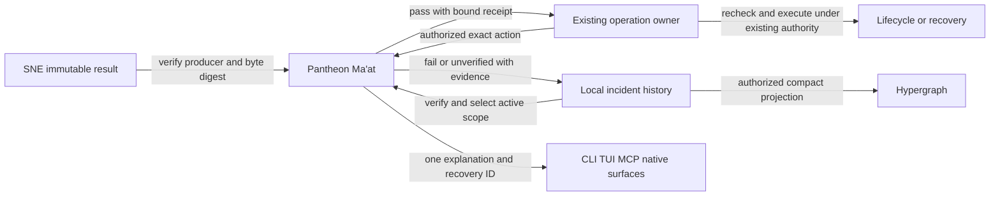

# Pantheon Ma'at failure memory and admission contract

Date: 2026-09-11. Classification: `platform-foundation`.
Owner: Pantheon engineering. SNE engineering authority: `codex-inference`.
Status: contract and integration plan; executable integration is not yet qualified.
Origin: router item `20260911-063933-codex-inference-sirsi-software-admin-review-ma-at-pantheon-boundary`.

Pantheon must prevent a verified operational defect from recurring in the same
scope, preserve the evidence, and explain a specific recovery to its operator.
This contract adopts [SNE's Ma'at policy](../../../sirsi-native-rebuild/docs/engineering/MAAT_FAILURE_MEMORY_AND_RECIPE_PREFLIGHT_POLICY.md)
for Pantheon's own operations. A check passing means only that its declared
preconditions passed. It does not certify inference correctness, parity, speed,
release qualification, or authorization to perform an operation.

## Authority and compatibility

Pantheon owns Engine ABI compatibility, installation, update, rollback, model
lifecycle, host admission, diagnostics, and recovery. Nexus owns intent and
selection. SNE owns computation. Hypergraph may project incident receipts but
does not become their authority or an execution controller.

Pantheon may consume immutable SNE Ma'at results and contribute privacy-safe
incident evidence or request a guard through `codex-inference`. It must not
create, change, build, benchmark, promote, retire, or replace SNE source,
runtimes, recipes, profiles, components, candidates, or binaries. Installing an
already authorized package is a Pantheon lifecycle action, not SNE promotion.
No incident record can grant authority, consent, a new executable, or a fallback.

The initial SNE wire vocabulary is `sirsi.maat.failure-signature-registry.v1`:
`guards`, and `memory_index` keyed by normalized failure SHA-256. An entry carries
`guard_id`, `recipe_id`, `evidence_sha256`, `failure_class`, `scope_hash`, and
`active`. Guard fields are `id`, `applies_to`, `forbidden_regex`,
`required_regex`, `origin`, and `rule`. The result vocabulary is
`sirsi.maat.preflight-result.v1` with `verdict`, `passed`, and `failed`.

Keep SNE objects byte-for-byte and hash them locally. Do not add fields to these
v1 objects: the producer uses strict decoding. Pantheon stores provenance and
operational metadata in its own versioned envelope. A legacy `active:false`
alone cannot distinguish superseded from retired; retain it as inactive with
unknown disposition and require its author's transition evidence. Do not invent
a successor. SNE normalization is producer-owned; until a versioned signature
preimage and fixture are supplied, preserve the producer key as an opaque ID
and do not claim cross-producer signature equivalence.

## Incident and evidence protocol

Pantheon's envelope schema is `pantheon.maat.incident.v1`. Required fields are
`signature_sha256`, `normalization_version`, `signature`, `scope_hash`, `scope`,
`guard_id`, `work_item_id`, `failure_class`, `evidence_sha256`, `evidence_ref`,
`origin_repo`, `recorded_at`, `status`, and `previous_event_sha256`.
`successor_ref` is required for superseded or retired records and points to
immutable correction or retirement evidence. `status` is exactly `active`,
`superseded`, or `retired`. First events have a null previous digest; subsequent
events name the current event digest and are committed with compare-and-swap.
Concurrent transitions must conflict and retry against newly verified history.

Use lowercase SHA-256 over exact object bytes for evidence and event identities.
The signature has exactly six ASCII string fields: `normalization_version`
(`pantheon.maat.signature.v1`), `origin_repo` (`sirsi-pantheon`), `failure_class`,
`component`, `stage`, and `invariant`. Its normalized bytes are compact UTF-8
JSON with keys in ASCII lexical order, no whitespace or trailing newline,
and only ASCII identifiers matching `[a-z0-9][a-z0-9._/-]*`. Reject duplicate
keys, unknown fields, invalid encodings and trailing JSON. Hash these bytes;
do not normalize diagnostic prose into an identity.

Scope is separately hashed using the same canonical encoding, with fixed keys
`action`, `component`, `profile`, `package_sha256`, `model_sha256`, `host_class`,
and `stage`. Each is a nonempty string. Identity fields are lowercase SHA-256;
an explicit `*` means any value only in an incident selector, never an action
identity. Other selector fields use the identifier grammar above or `*`.
All populated selectors are conjunctive, exact matches; no implicit globbing,
substring matches, omitted-field widening, or model-name-only matching.
An unknown required action identity yields `unverified`, not a non-match.
Repeat occurrences retain one signature key with separate immutable evidence
events. A corrected tuple outside the affected scope proceeds through its own
checks without deleting the rejected history.

Evidence objects are create-only, bounded, regular files in a private local
content-addressed store. Derive digests from opened file descriptors, reject
symlinked path components and special files, and verify the same descriptor's
identity through the read. Publish evidence durably before appending its event;
sync file and directory metadata before publishing the current index. Recover
from the event history, never from a partial current pointer. Existing bytes
at a digest path must match; mismatch is corruption. The index is a rebuildable
lookup projection, not a second incident authority. Retention may not remove
referenced evidence or history. Verify hashes on every evidence consumption.

Hashing proves identity, not trust. Accept SNE results only from the configured
authorized producer and the exact admitted package/recipe identity; validate
the package's existing signature and provenance contract independently. Do not
execute commands, follow network URLs, or fetch arbitrary paths found in a
foreign receipt. Unsupported schemas or unavailable required evidence produce
`unverified` for the dependent operation, with a recovery explanation.

## Deterministic admission

1. Capture the authorized action and its exact tuple through the existing
   Pantheon operation owner. Read the current verified incident generation.
2. Select applicable active incidents using scope above. The caller cannot
   omit a known required guard by submitting an empty guard list.
3. Verify required local inputs and immutable foreign evidence. Derive catalog
   hashes from filesystem identities; never accept hand-transcribed digests as
   catalog production. Compare writer and reader through a full round trip.
4. Run only registered typed checks. Any subprocess uses a pinned executable,
   explicit argument vector, bounded timeout/output, declared working directory,
   and controlled environment. A string from an incident is never executable.
5. Emit `pantheon.maat.admission.v1`: operation ID and action digest, tuple,
   registry generation, selected signature/event digests, guard implementation
   digests, per-check outcomes, evidence digests, observation time and expiry,
   overall `pass`, `fail`, or `unverified`, reason code, and recovery action ID.
6. The existing lifecycle controller revalidates operation identity, consent,
   incident generation and volatile host preconditions immediately before its
   mutation. Changed input or expired evidence requires fresh preflight.
   Serialize this with the controller's existing operation ownership mechanism.
7. Persist failures as compact evidence before composing a related successor.
   Deterministic checks replace repeated manual vigilance; an explanation alone
   never marks prevention implemented.

Only `pass` satisfies this gate, and only for this action. `fail` or `unverified`
blocks the dependent action, while independent read-only diagnostics, export,
and separately qualified recovery remain available. Missing incident storage
does not silently become an empty registry. Emergency containment uses its
existing explicit authority and records evidence; Ma'at must not prevent the
supervisor from stopping an unsafe admitted child.

## Required scope coverage

| Scope | Required preflight and identity | Deterministic rejection and recovery proof |
|---|---|---|
| Engine ABI | ABI version, connector capabilities, session and served tuple, receipt binding | Reject mismatched ABI, changed served identity, unsupported requested capability and invalid terminal receipt; recover by selecting an explicitly compatible admitted tuple |
| Installation | Signed catalog, package and manifest digests, license/consent, relocatable dependencies, target ownership | Reject malformed/changed files and unsafe paths before activation; interruption retains the prior installation and a resumable stage receipt |
| Update | Current and target package identities, compatibility, consent, staged verification, operation generation | Reject stale or incomplete target; atomic activation and readiness check precede success; preserve the last qualified installation |
| Rollback | Exact retained package plus compatible state, fresh admission, current incident scope | Reject corrupt or newly disqualified rollback; no blind downgrade; verify restored identity and readiness with a receipt |
| Model lifecycle | Model/manifest/license, profile/precision/mode, residency and ownership, required runtime | Reject wrong tuple, duplicate lifecycle authority or unsupported capability; start/stop/remove through the existing supervisor only |
| Host admission | Fresh device/OS/session and resource observations, declared memory/swap and accelerator requirements | Unknown/expired or inadmissible state blocks launch; explain the failed observation and retry after a new valid sample, without changing model or route |
| Diagnostics | Explicit local scope, allowed fields, immutable incident and action identities | Reject unsafe export contents; preserve local redacted evidence, report missing evidence honestly, never auto-upload |
| Recovery | Existing recovery class and mode, process generation, durable phase, complete SNE tuple where relevant | Resume only a registered durable action; reject unsupported restore or stale process identity; prove replacement readiness, bounded retries and preserved state |

These are acceptance requirements, not assertions that all hooks are deployed.
Tests must show one matched defect rejected before mutation and one unrelated
scope admitted per row, plus evidence tampering, unavailable storage, schema
drift, concurrent transitions, stale preflight, interrupted publication and
recovery without cloud. Tests must not launch SNE or touch models to prove the
contract. SNE's supervisor remains its sole lifecycle owner; generic application
recovery must not become a second SNE restart controller.

## Operator experience and privacy

All surfaces consume one engine result. The operator sees what action was
prevented, why, the affected tuple, freshness, the evidence reference, and one
registered recovery action with its consent requirement. Empty means no matching
known incidents, never universal safety. Loading, unavailable evidence and
failure are distinct. Recovery reports its verified outcome and preserves the
original incident. CLI JSON and native/TUI/MCP projections share reason codes.

Incident signatures, exported envelopes and support bundles exclude prompts,
generated text, caches, weights, credentials, raw environment values, network
configuration, machine identifiers and user paths. Keep full diagnostics local
under the existing policy; record only approved redacted evidence in shared
memory. Private SNE source and source-derived diagnostic content must not enter
the public Pantheon repository. Content hashes themselves do not authorize
disclosure. Cross-repo contributions use explicitly scoped router receipts.

## Data Flow Architecture

## Recommended Implementation Order

1. **Required, contract and fixtures, estimate 2 hours:** Pantheon engineering
   implements the versioned envelope, canonicalization golden vectors, exact
   scope matching and strict SNE v1 reader under `internal/maat`. Confirm SNE
   producer normalization and event linkage with `codex-inference`; no SNE edits.
2. **Required, durable memory, estimate 3 hours:** use one local append-only
   incident store and rebuildable digest index, verify evidence on read, enforce
   transition ownership, crash order and conflict handling. Prove tamper, symlink,
   interruption and concurrent-writer behavior in isolated fixtures.
3. **Required, operation integration, estimate 4 hours:** attach preflight to
   existing Engine ABI, setup/update, model lifecycle, supervisor and recovery
   seams. Reuse their locks/consent and typed action interfaces. Add the eight
   positive/negative scope pairs above; prove no mutation on rejected admission.
4. **Required, product and qualification, estimate 3 hours:** project one result
   through existing surfaces, verify privacy-safe support, keyboard/accessibility
   and recovery states, run full repo tests/vet and dashboard/SNE integration,
   obtain independent review and validate the completion proof before release.
5. **Required, human access:** maintain this repo contract and Desktop mirror;
   import a rendered and verified reading edition to Sirsi Google Workspace.
   Native document publication is currently blocked on the documents skill's
   unavailable managed workspace dependency runtime. Record its URL here when
   available. These estimates are engineering estimates, not delivery promises.

Minimum useful executable slice is phases 1–3 for one admitted operation;
full coverage and product claims require phase 4 across every affected scope.
No rollout is authorized by a draft receipt or by this plan alone.

## Key Decision Points

| Question | Options | Recommendation |
|---|---|---|
| Where does incident authority live? | One central cross-repo registry or repo-owned histories with verified references | Repo-owned history preserves one owner per action and SNE's exclusive source authority |
| How does legacy v1 evolve? | Inject lifecycle fields or preserve v1 inside a versioned local envelope | Preserve producer bytes; an envelope avoids strict-decoder incompatibility and invented status transitions |
| What may a failed check block? | All work or only the dependent action | Exact action and scope; preserve independent diagnostics and qualified recovery |
| Who performs recovery? | Ma'at directly or the existing controller | Existing controller preserves consent, process-generation ownership and one lifecycle authority |

## Commercialization Gate

User: Mac operator and consuming Sirsi application. Pain: repeating known
installation, compatibility and recovery failures with no durable explanation.
Workflow: request an operation, receive a precise prevention or execute it with
evidence, then recover and verify. Value: reduce support recurrence and protect
trust in local AI, supporting Pantheon adoption and Nexus retention. Trust:
local private evidence and existing consent; no new telemetry or authority.
Support owner: Pantheon engineering; SNE guard requests go to `codex-inference`.
Success measure: every accepted incident has a reproducible rejection in its
scope and an admitted unrelated-scope control. Done evidence: phase 1–4 test
receipts, independent review, installed workflow proof and completion validation.
This document delivers the contract and plan, not a launchable implementation.

## Human access

Canonical source: `docs/architecture/MAAT_PANTHEON_FAILURE_MEMORY_CONTRACT.md`
in `sirsi-pantheon`.
Desktop mirror: `/Users/thekryptodragon/Desktop/Sirsi - Owner Reading Room/Pantheon Maat failure memory contract.md`.
Google Workspace: pending, blocked on managed document creation and render
runtime availability. Recovery: provide that runtime, render and inspect the
reading edition, import as a native Google Doc and link its URL in both homes.

Related authority: [Manifesto](../../../SIRSI_MANIFESTO.md),
[commercialization](../COMMERCIALIZATION_GATE.md),
[application recovery](PANTHEON_APPLICATION_RECOVERY_CONTRACT_20260821.md).
