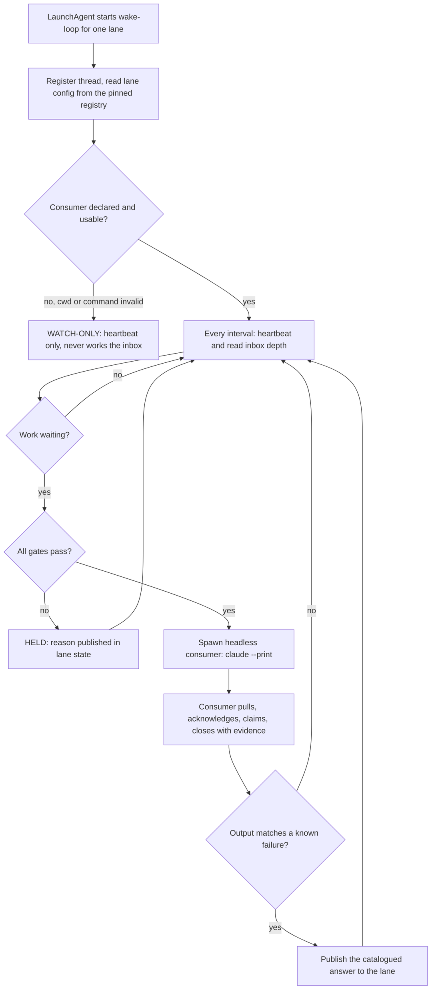
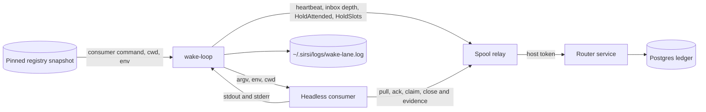
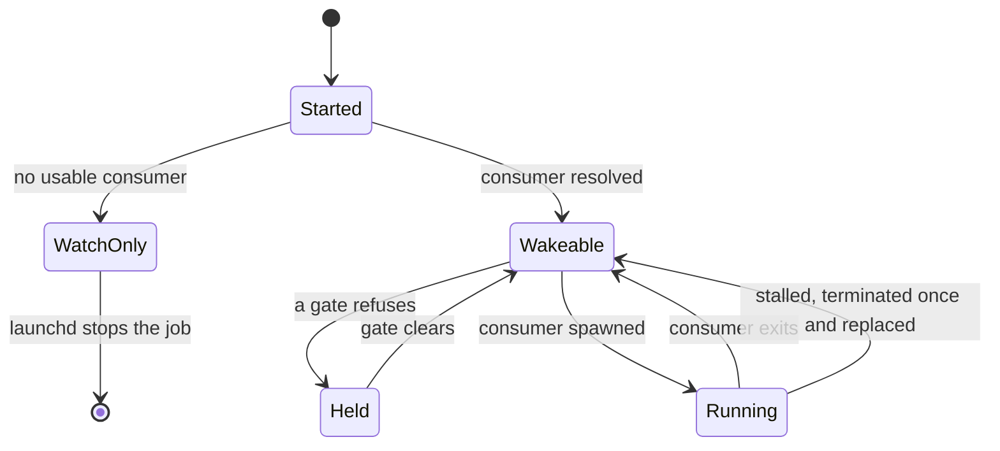

# RA-P01 — Wake loop (reactive inbox consumer)

Owner: Ra. Source: `internal/router/wake.go`, `consumer.go`, `consumerslots.go`. Revision: main `c1a78077`.
State labels: **implemented** = in source on main; **observed** = seen in a live log; **undeployed** = merged but not running (PR #639 gates).

## Logical view

Gates, in order of evaluation: quarantine, idle CPU at least 10%, measurement window, no-progress back-off *(undeployed, #639)*, hourly spawn ceiling *(undeployed, #639)*, attended hold, host consumer cap (one per five cores; 2 on the M1, 3 on the M5).

## Data view

Trust boundary: the consumer never holds the host token; only the relay does. Paths in the registry are rebased onto the local home when another machine's home does not exist here.

## State view

## Failure and recovery
- Invalid cwd or missing command: WATCH-ONLY, lane reads WATCH_ONLY, nothing is spawned (by design: a consumer that cannot start must not read as armed).
- Consumer error or signal: logged, next cycle may spawn again, subject to the gates.
- Stalled consumer: terminated once and replaced (test `TestStalledConsumerIsTerminatedOnceAndReplaced`).
- Quarantine: no loop spawns anything until it is lifted. Recovery of an unknown failure class is by hand today (OPEN, see RA-P02).
