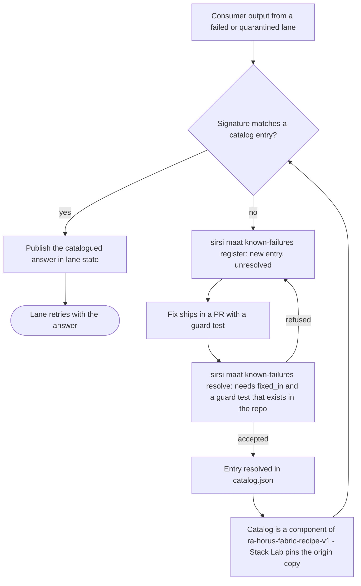
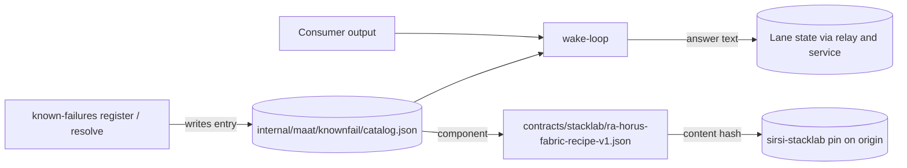

# RA-P02 — Known-failure loop (Ma'at registers, Stack Lab remembers)

Owner: Ra, with claude-pantheon for Ma'at. Source: `internal/maat/knownfail/`, `cmd/sirsi/maatknownfail.go`, recognition in `internal/router/wake.go`. Revision: main `c1a78077`.

## Logical view

Implemented: matching, registration, resolve refusal without `fixed_in` and an existing guard test. Not implemented: an entry that applies its own fix (OPEN).

## Data view

## Failure and recovery
- Resolve without a guard test that exists: refused.
- No match: the failure stays a hand repair until registered. This is the gap the loop exists to close.
- Git calls strip the hook's `GIT_*` environment so the guard-test check cannot be fooled by a hook context.
