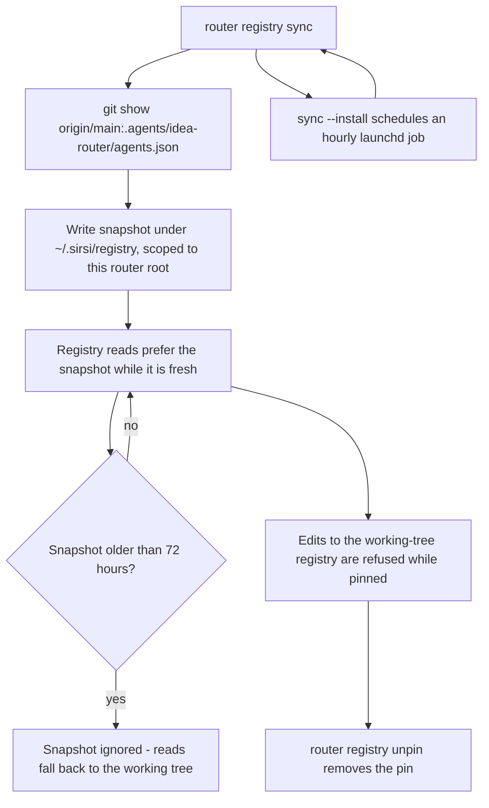
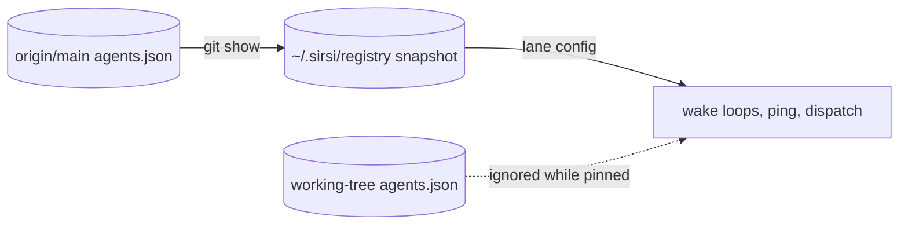

# RA-P03 — Origin-pinned agent registry (A37)

Owner: Ra. Source: `internal/router/registrysnapshot.go`, `cmd/sirsi/routerregistrycmd.go`. Revision: main `c1a78077`.

## Logical view

## Data view

Observed 2026-10-05: lanes read WATCH_ONLY because registry paths were another machine's home; fixed by path rebase in the resolver (#982), not by editing the pinned file.

## Failure and recovery
- git or origin unreachable: the existing fresh snapshot keeps serving, up to 72 hours.
- Stale or missing snapshot: falls back to the working tree. Whether that fallback should instead fail closed is OPEN.
