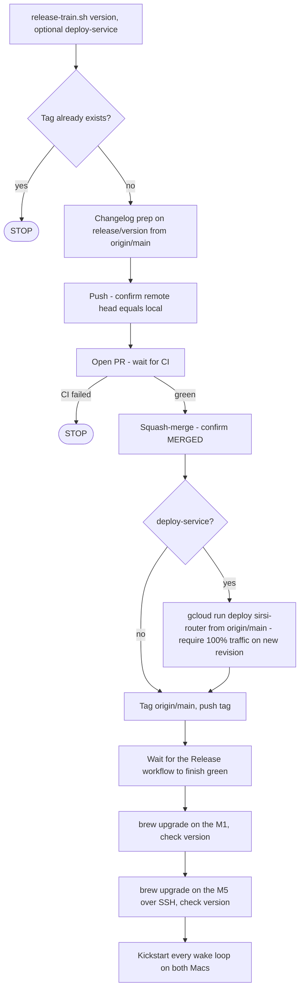
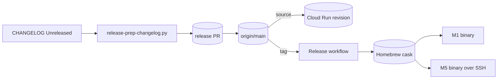

# RA-P04 — Release train

Owner: Ra. Source: `scripts/release-train.sh`, `scripts/release-prep-changelog.py`. Revision: main `c1a78077`. Observed: v0.24.69 run on 2026-10-05.

## Logical view

Every step is a hard stop. Service deploy precedes the tag so a new Store method exists server-side before clients ship.

## Data view

## Failure and recovery
- Tag collision (observed 2026-10-05: another line tagged v0.24.70-86): STOP, no force. Reconciliation is by merging the lines (PR #983), not by retagging.
- Combined push that fails lint no longer proceeds: each step verifies its own result.
- Rollback of a bad release: OPEN, not scripted.
