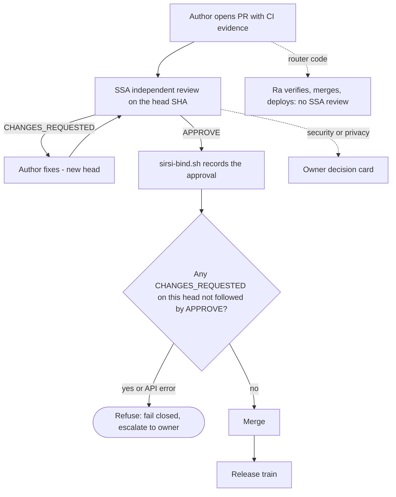
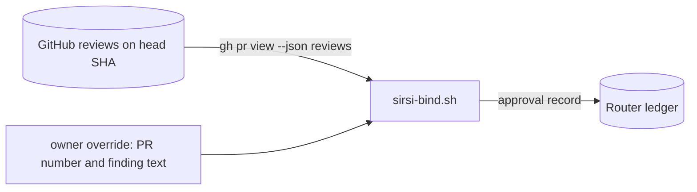

# RA-P05 — Review and bind (A34)

Owner: sirsi-software-admin (SSA) for review, Ra for router-code decisions. Source: `scripts/bind/sirsi-bind.sh`, `scripts/router/sirsi-claude-worker.sh`. Status: Ra's understanding, to be confirmed by SSA (sent 2026-10-05).

## Logical view

## Data view

## Failure and recovery
- A directive that predates a rejection cannot clear it; only a new head with a new review, or a named owner override (`--override-pr`, `--override-finding`).
- GitHub API error: treated as uncleared.
- SHA (sirsi-hardware-admin) role in review: unmapped, OPEN.
