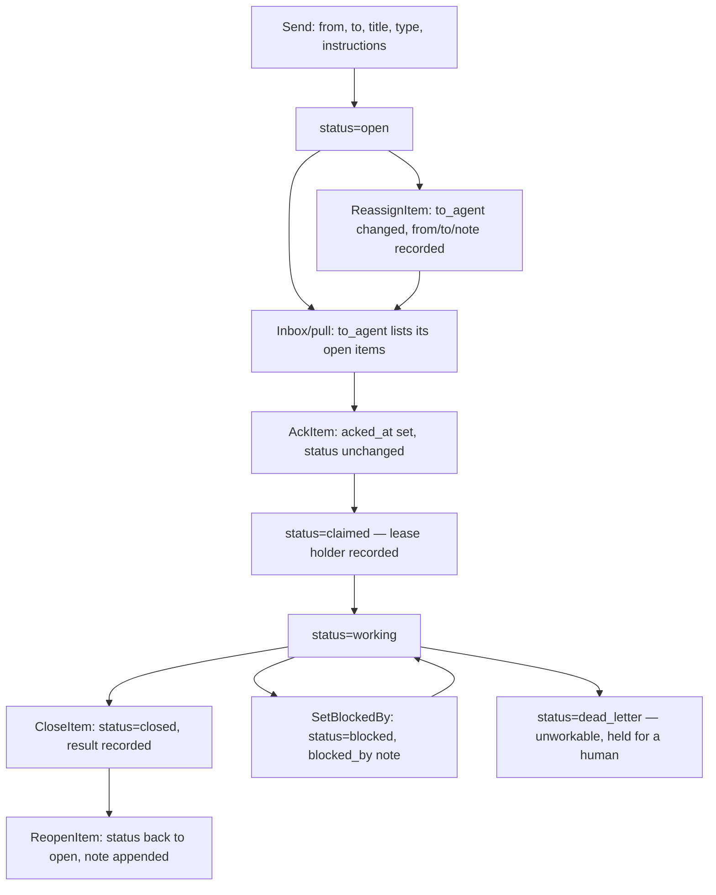

# RA-P06 — Item lifecycle: send, pull, acknowledge, claim, close, reopen, reassign, dismiss

Owner: Ra. Source: `internal/routerstore/items.go`, `internal/router` dispatch facade. Revision: main `b29778fc`.

## Logical view


## Data view
```mermaid
flowchart LR
  SENDER[sending lane] -->|Send| ROW[(items row: id, from_agent, to_agent, status, acked_at, blocked_by, result)]
  ROW -->|Inbox(to_agent)| RECEIVER[receiving lane]
  RECEIVER -->|AckItem / claim| ROW
  RECEIVER -->|CloseItem(id, result)| ROW
  ROW -->|ListActive / ListSince / CountClosed| DASHBOARDS[dashboard, ledger board]
```

## Failure and recovery
- An item stuck at `claimed`/`working` past its lease is a stranded task, not a dead item — `ReopenItem` returns it to `open` with a note so a different lane can pick it up.
- `ReassignItem` is the retired-lane path: a `to_agent` that no longer has a live loop gets its open items moved, never silently dropped (ADR-072 C5, RA-P16).
- `validStatus` is the single gate every write passes through — a status outside `{open, closed, claimed, working, blocked, dead_letter, completed}` is rejected at the store layer, so a bad status string never gets written and surfaces later as a phantom lifecycle.
