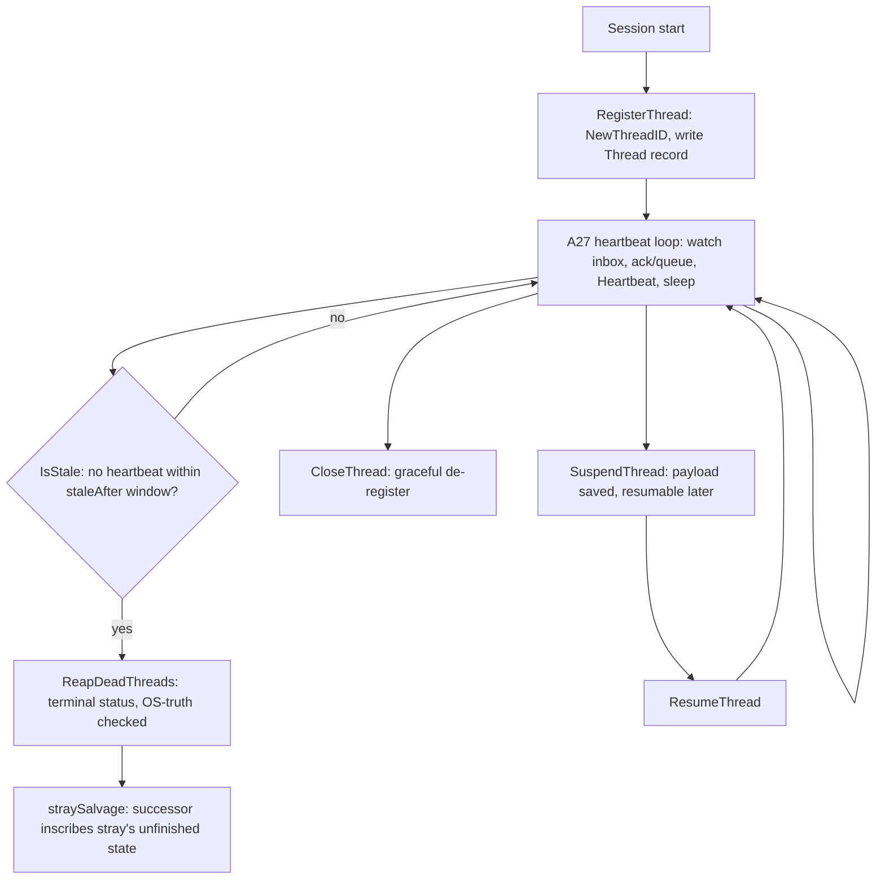

# RA-P07 — Thread registration and heartbeat (A27)

Owner: Ra. Source: `internal/router/threads.go` (`RegisterThread`, `Heartbeat`, `CloseThread`, `ReapDeadThreads`, `ReapStrayThreads`). Revision: main `b29778fc`.

## Logical view


## Data view
```mermaid
flowchart LR
  SELF[new process] -->|RegisterThread| REC[(Thread record: id, agent, pid, host, status)]
  REC -->|Heartbeat(threadID, upd)| REC
  REC -->|LoadThreadRegistry| CENSUS[thread census / workboard / node-status]
  REC -->|ReconcileExits| OSFACTS[(live PID facts on this host)]
```

## Failure and recovery
- Registered-but-not-looping is a node-health failure (A27): `IsLiveWatcher` and `StaleActiveSupervisors` are what `router node-status` reads to flag it — liveness is judged by heartbeat recency, not by registration existing.
- A dead PID with a stale record is reaped by `ReapDeadThreads`/`ReapStrayThreads`, OS-truth-checked (`ownsRecordHost`) so a record from a different host is never reaped on local PID reuse (ADR-022).
- `straySalvage` is the recovery path when a thread is reaped mid-work: a successor thread can inscribe the stray's unfinished state instead of losing it, per the ADR-057 six-lane-state model.
