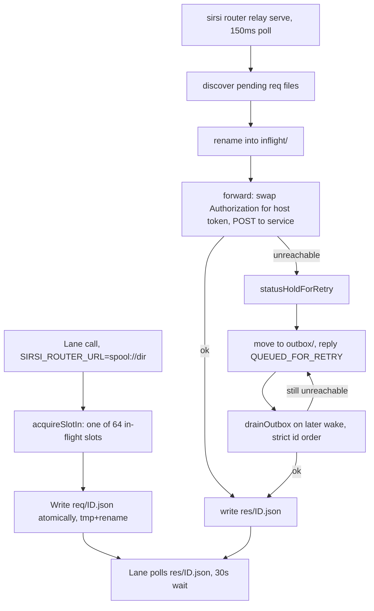
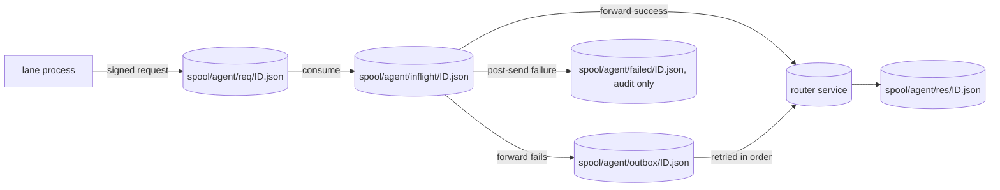

# RA-P08 — Spool relay forwarding

Owner: Ra. Source: `internal/routerstore/spool.go`, `cmd/sirsi/routerrelaycmd.go`. Revision: main `b29778fc`.

## Logical view

## Data view

## Failure and recovery
- The lane's 30s wait (`newSpoolTransport`) distinguishes "never picked up" (safe to retry) from "OUTCOME UNKNOWN — consumed but no response" (never auto-retried if it was a mutation) — the ambiguity is surfaced, not papered over.
- `spoolRefused` hard-blocks `MintHostToken`/`RevokeHostToken`/`ListHostTokens` from ever crossing the relay by name, regardless of caller.
- Unreachable-service forwards land in `outbox/` and drain in strict id order on a later wake (`outboxRetryBackoff = 30s`), stopping at the first still-unreachable item — an ordered-release guarantee, not a race of whichever retries first.
- A failure discovered only after the request was already sent is parked in `failed/` for audit — never silently retried (would double-apply a mutation) and never silently dropped (would lose it).
