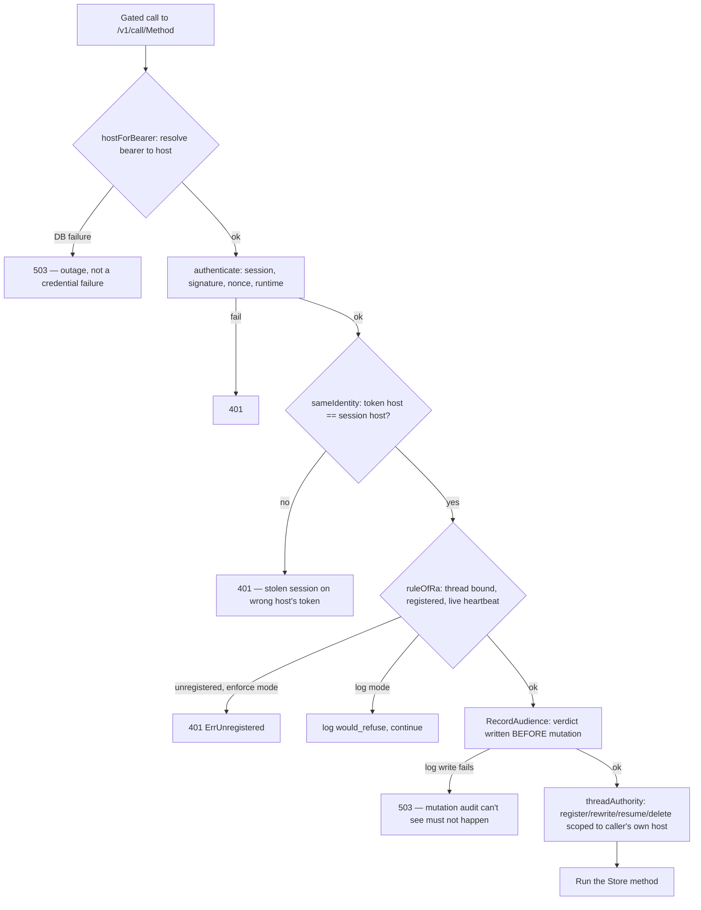
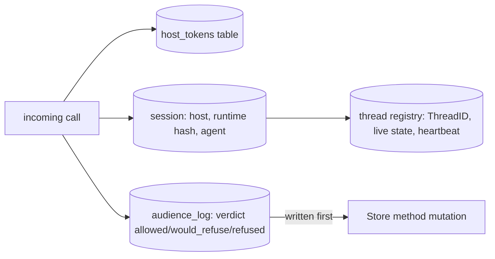

# RA-P09 — Router service authorization (host token, thread binding, audience log)

Owner: Ra. Source: `internal/routerstore/serve.go`, `server.call` (lines 343-498). Revision: main `b29778fc`.

## Logical view

## Data view

## Failure and recovery
- Every refusal branch names its failure mode distinctly (503 for infrastructure outage vs. 401 for a genuine credential/binding problem) so an outage is never misread as an attack, and vice versa.
- `sameIdentity` is the cross-check that stops a session secret stolen from host A from riding host B's legitimate token — host binding, not just session validity, is required.
- `RuleOfRa` has three modes (`off`/`log`/`enforce`); `enforce` is the only mode that actually refuses on `would_refuse` — operators can run `log` to observe before cutting over.
- The audience log write happens *before* the mutation runs, and a failed audit write refuses the call rather than letting an unaudited mutation through — audit-then-act, not act-then-audit.
