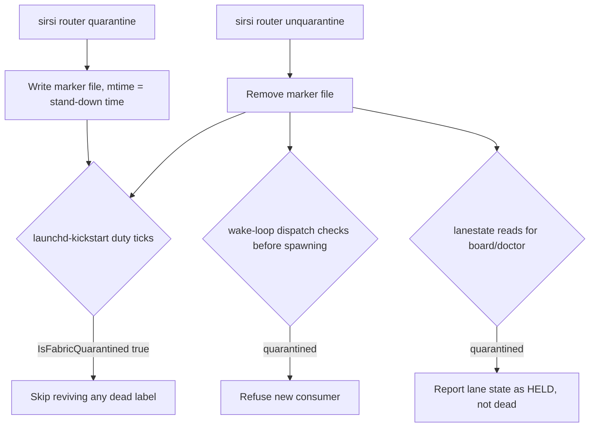

# RA-P10 — Quarantine stand-down and lift

Owner: owner or Ra. Source: `internal/router/fabricquarantine.go`, `cmd/sirsi/routercmd.go` (`router quarantine` / `unquarantine`), `internal/router/launchdkickstart.go`, `internal/router/lanestate.go`, `internal/router/wake.go`. Revision: main `0ed15ac9`.

Distinct from `quarantine-worker` (one-shot bootout + plist rename of `ai.sirsi.claude-worker.*` labels, ADR-035, the runaway-executor kill switch). This row is the fabric-wide operator OFF switch (R7/G6): a durable marker every dispatcher checks BEFORE reviving a dead launchd label or spawning a new inbox consumer — generalized from `gemma quarantine` after the 2026-08-06 incident where `bootout`/`disable` alone were defeated by three independent revival paths (liveness-watch re-bootstrap, print-disabled silently cleared, horus KeepAlive reinstalling all 24 lanes).

## Logical view

## Data view
```mermaid
flowchart LR
  OP[operator: owner or Ra] -->|quarantine / unquarantine| MARK[(~/.sirsi fabric-quarantine marker, RFC3339 stamp)]
  MARK -. os.Stat .-> KICK[launchdkickstart.go isFabricQuarantined]
  MARK -. os.Stat .-> WAKE[wake.go dispatch gate]
  MARK -. os.Stat .-> STATE[lanestate.go board read]
```

## Failure and recovery
- Marker write/remove is a plain file op (0600, parent 0700) — no lock; a concurrent quarantine+unquarantine race resolves to whichever write lands last, same as any other marker file in this fabric (registry pin, gemma quarantine).
- `unquarantine` on a missing marker is a no-op (`os.IsNotExist` tolerated) — never errors on an already-clear fabric.
- Quarantine does **not** stop anything already running; pairs with `quarantine-worker` for that. A supervisor restart does not clear the marker (the property it was built to hold against).
