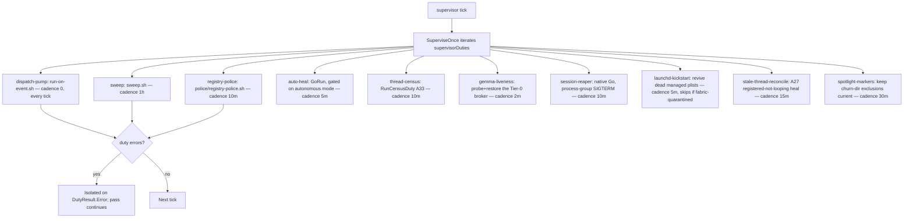
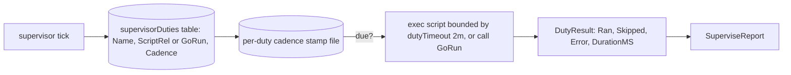

# RA-P11 — Horus supervisor duties: dispatch pump, hourly sweep, registry police, thread census

Owner: Ra (A33 — Horus / Work Board Overseer duties moved from claude-home 2026-09-28). Source: `internal/router/supervisorduties.go`, `internal/router/supervisor.go`. Revision: main `0ed15ac9`.

Single-backstop ruling (2026-06-29): the three legacy router LaunchAgents (`com.sirsi.idea-router` dispatch pump, `com.sirsi.idea-router-sweep` hourly sweep, `ai.sirsi.registry-police`) are folded into ONE resident supervisor loop instead of living as separate launchd jobs. `SuperviseOnce` runs every duty as a cadence-gated, bounded, error-isolated pass each tick — a missing script skips its duty cleanly, and a failing duty never fails the pass; its error is reported on the duty result and the loop moves on.

## Logical view

## Data view

## Failure and recovery
- Every duty is timeout-bounded (`dutyTimeout` = 2 min for script duties) so one hung script can never wedge the whole supervisor loop.
- A missing script (dev clones, test scaffolds without `.agents/idea-router/`) skips that duty cleanly rather than failing the pass.
- Native Go duties (census, session-reaper, launchd-kickstart, gemma-liveness, stale-thread-reconcile, spotlight-markers) are injected via the Rule A16/A21 accessor pattern (`getXFn`/`setXFn` under a mutex) so `internal/router` never cycles with the packages that implement them, and tests install mocks instead of shelling the real thing.
- `launchd-kickstart` explicitly checks `isFabricQuarantined` (RA-P10) before reviving anything — the one duty wired to respect the fabric-wide OFF switch.
