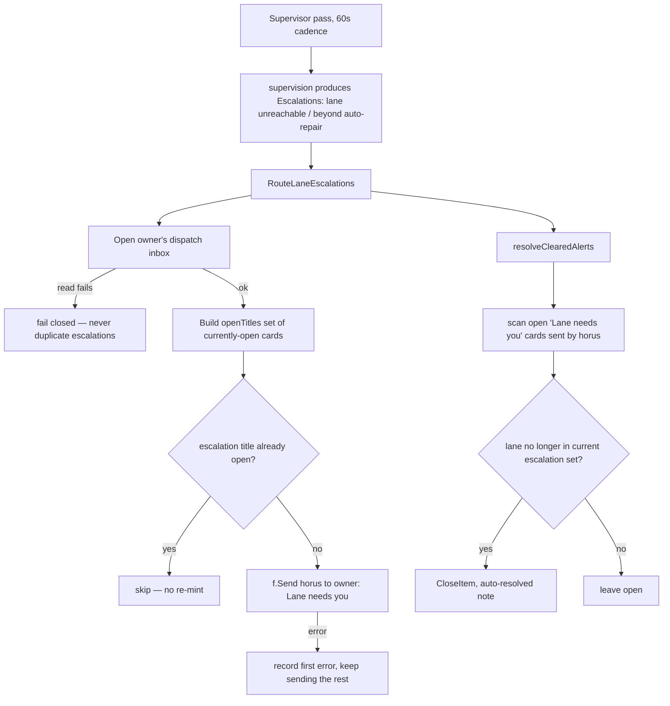

# RA-P12 — Lane escalation ("lane needs you" alert and auto-resolve)

Owner: Ra. Source: `internal/router/laneescalation.go`. Revision: main `b29778fc`.

## Logical view

## Data view

## Failure and recovery
- A dispatch-inbox read failure fails the whole pass closed rather than sending — duplicating the same "lane needs you" card on every retry would be worse than a missed escalation this cycle.
- Dedup is by exact title match against currently-open cards, so a lane that stays down across passes gets one card, not one per pass.
- One send failure does not stop the pass — the remaining escalations still get sent; only the first error is recorded.
- `resolveClearedAlerts` closes a card with an auto-resolved note the moment its lane drops out of the current escalation set — closure errors are ignored on purpose, since a stale card left open just reverts to the pre-auto-resolve behavior, never a reason to abort the pass.
