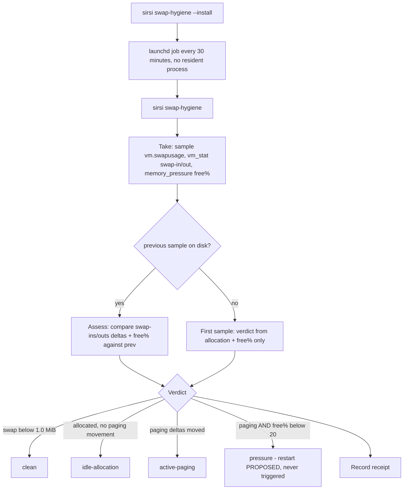
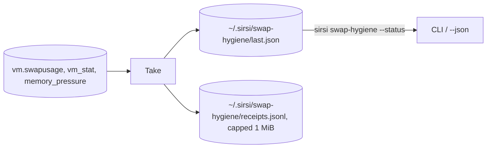

# RA-P13 — Swap hygiene sampling

Owner: Ra. Source: `internal/swaphygiene/swaphygiene.go`, `cmd/sirsi/swaphygiene.go`. Revision: main `0ed15ac9`. Owner directive 2026-10-04: "Cleaning stale swap regularly should be a pantheon priority."

Measures, classifies and records; it never deletes swap files, kills processes, or restarts a host. A nonzero swap ALLOCATION is not paging — the verdict comes from the swap-in/swap-out delta between two samples, not from the allocation number alone. A restart is only ever PROPOSED for the owner and workload owners, never triggered.

## Logical view

## Data view

## Failure and recovery
- Telemetry missing (vm_stat/memory_pressure unavailable) is reported honestly as `VerdictUnknown` — the code never claims a verdict it cannot support (A35: scope the check to the claim).
- The receipts log is bounded at `maxReceiptsBytes` (1 MiB); at the cap the oldest half is dropped rather than growing unbounded.
- `--install` uses a launchd `StartInterval` job, not a resident watcher — consistent with this fabric's general preference for event/cadence-driven duties over standing processes (A27/A29).
- Severity floors are named constants (`CorrectnessFreePct` 50%, `PressureFreePct` 20%, `PagingPagesPerSample` 64) — Apollo's release-performance clean-host rule owns the exact clean threshold (`CleanSwapMiB`); this file is the published default so the distinction between "allocated" and "paging" stays visible to any reader.
