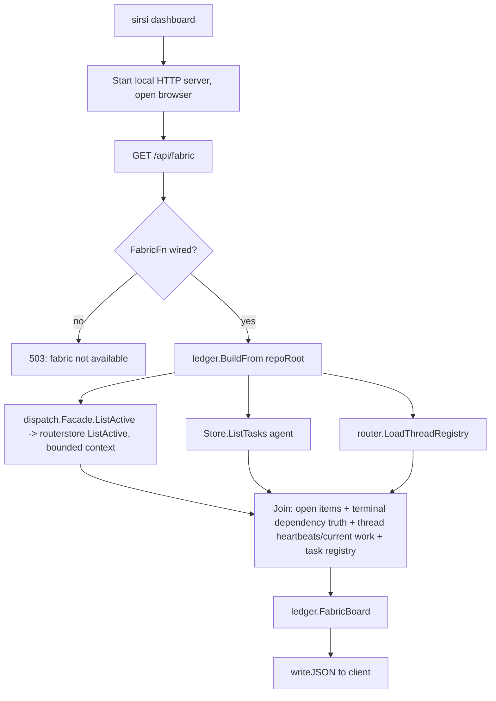
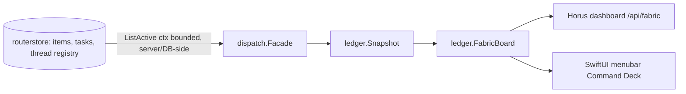

# RA-P14 — Dashboard read path

Owner: Ra. Source: `cmd/sirsi/dashboard.go`, `internal/dashboard/fabric.go`, `internal/ledger/{ledger.go,fabric.go}`, `internal/routerstore/items.go` (`ListActive`, `ListSince`, `CountClosed`, rs-26). Revision: main `0ed15ac9`.

`sirsi dashboard` is Horus — the local workstation monitor (zero telemetry, Rule A11). Its live cross-surface payload is the `FabricBoard` contract (`docs/design/FABRIC_SURFACE_UNIFICATION.md`): one producer, consumed identically by the dashboard's `/api/fabric` endpoint and by the SwiftUI menubar (Command Deck) — never two divergent read paths for the same board.

## Logical view

## Data view

## Failure and recovery
- `apiFabric` fails honestly: an unwired producer returns 503 ("fabric not available"), a production error returns 500 — consumers keep a labeled last-good payload instead of rendering fabricated zeroes (A35: never a false assurance of freshness).
- `ListActive`/`ListSince`/`CountClosed` thread a per-call context into the DB query iterators (`QueryContext`, not `db.Query` — rs-26) so a bounded read actually terminates at the caller's deadline instead of a server-side runaway scan.
- The index previously marked this row fully OPEN; the two consumer wiring points (dashboard `cmd/sirsi/dashboard.go` + menubar `cmd/sirsi-menubar/main.go`) and their shared test (`internal/dashboard/dashboard_test.go`) were already implemented per the fabric-surface-unification spec before this diagram was drawn (confirmed live by `retained-pantheon-ledger-prerequisites` on the router ledger) — this diagram documents, it does not newly build.
