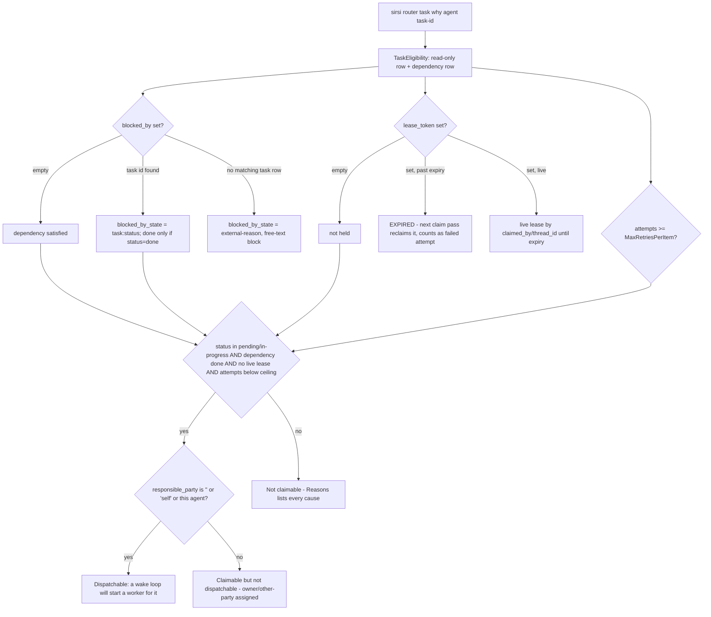
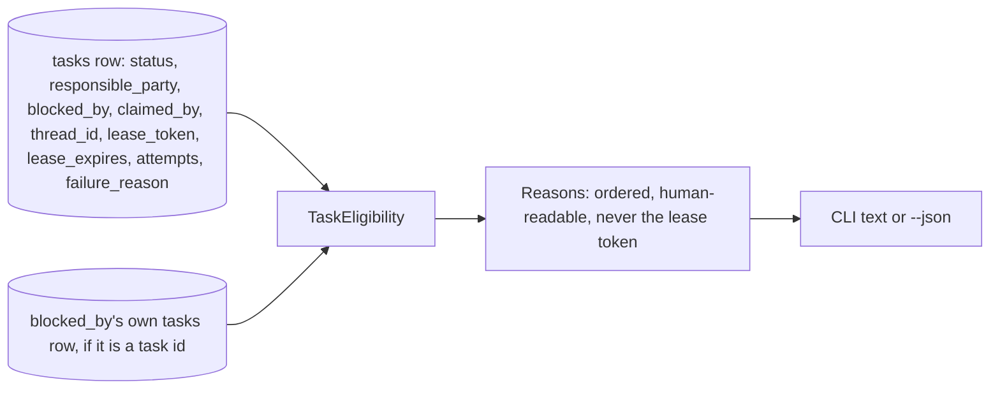

# RA-P15 — Claim eligibility (`router task why`)

Owner: Ra. Source: `internal/routerstore/taskeligibility.go`, `cmd/sirsi/routerledgercmd.go` (`routerTaskWhyCmd`). Revision: main `0ed15ac9`.

A read-only answer to "why would a claim of this task be refused?" It exposes the fields the plain task list omits — holder, lease expiry, attempts against the ceiling, failure reason, and the `blocked_by` dependency's own state — and names every cause that currently blocks a claim, most decisive first. Built so a worker or an auditor reads the refusal instead of probing it with live claim attempts (each of which counts as a failed attempt against the retry ceiling).

## Logical view

## Data view

## Failure and recovery
- Never mutates anything and never prints the lease token — a strictly read-only probe, safe to run speculatively instead of a real claim attempt.
- `blocked_by` pointing at a non-existent task id is **not** a validation defect (rs-39, A35-corrected): it is the designed external-reason form, cleared by hand with `task update --blocked-by ""` (no lease needed) once the real-world blocker clears.
- `Claimable` and `Dispatchable` are deliberately two different booleans: a task can be claimable (the state machine would allow it) yet not dispatchable (assigned to the owner or another party) — a wake loop only auto-starts a worker for the latter.
- An expired-but-still-recorded lease is reported distinctly from a live one; the next claim pass reclaims it and counts it as a failed attempt toward the retry ceiling, not a free retry.
