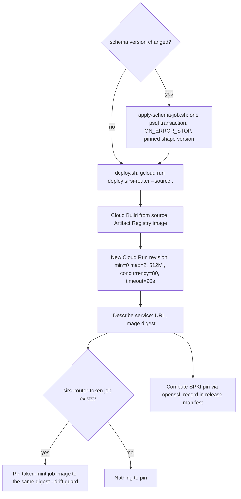
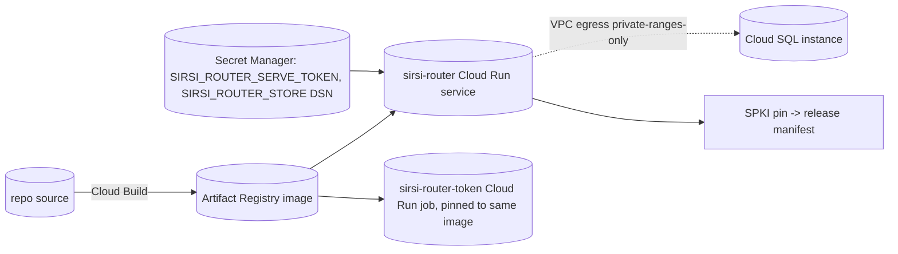

# RA-P17 — Router service deploy

Owner: Ra. Source: `scripts/router-service/{deploy.sh,apply-schema-job.sh,migrate-job.sh,provision.sh}`. Revision: main `0ed15ac9`. Related: RA-P04 (release train, CLI binaries) — this is the separate server-side leg: deploying the `sirsi-router` Cloud Run service itself whenever a release adds a new `Store` method or a schema version.

ADR-062 rs-16: direct `gcloud` deploy, no GitHub Actions (owner decision 2026-09-02) — the service has its own deploy path distinct from the CLI release train.

## Logical view

## Data view

## Failure and recovery
- `--allow-unauthenticated` on Cloud Run is deliberate: nodes authenticate with per-host bearer tokens *inside* the service (rs-10/rs-11); requiring a Google identity on every Mac was rejected by design.
- The token-mint job drifting behind the service's schema/binary was a live incident (claude-io, 2026-09-15: "postgres ledger schema_version 22, this binary expects 18" on a stale job image) — `deploy.sh` now re-pins the job's image to the service's image on every deploy specifically to close that gap.
- `apply-schema-job.sh`'s shape-version pin has itself gone stale once (rs-38: pinned at 20, executed mlccq applied v22 correctly then FAIL-shape'd) — the pin is a manual constant in the script, not derived from the schema files, and needs bumping by hand alongside every new migration.
- Rollback leg (gcloud traffic rollback against the live service) is documented in `docs/router-service/RUNBOOK.md` but has never been exercised live in production (g6, open on the router readiness ledger) — node-side rollback was rehearsed, the Cloud Run traffic leg was not.
