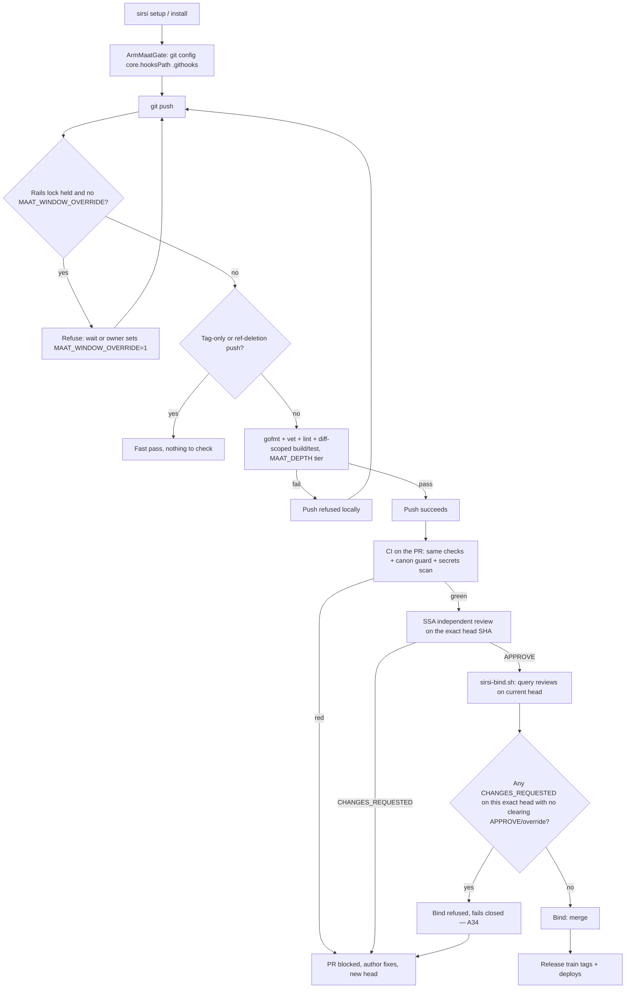
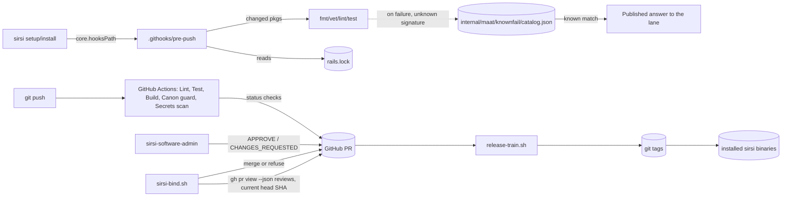
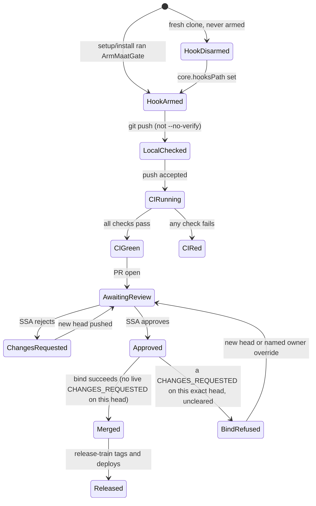

# RA-P18 — Ma'at pre-push gate and CI

Owner: claude-pantheon. Source: `.githooks/pre-push`, `internal/setup/maatgate.go`,
`scripts/bind/sirsi-bind.sh`, `internal/maat/knownfail/`. Revision: main `fd645827`.

## Logical view

Local hook is advisory (`--no-verify` skips it, `MAAT_WINDOW_OVERRIDE=1` bypasses the
rails-lock wait); CI + the bind script are the backstop that cannot be skipped by a
local flag (A28).

## Data view

## State view

## Failure and recovery
- Fresh clone with the hook never armed: pushes locally unchecked; CI is the only
  backstop until `sirsi setup`/installer runs (A28 — "armed, not just shipped").
- Rails-lock held during a measurement window: push refused unless the owner
  explicitly overrides with `MAAT_WINDOW_OVERRIDE=1` (deliberate bypass, not a bug).
- A known failure signature (local check or CI) is matched against
  `internal/maat/knownfail/catalog.json`; a match publishes the existing answer to
  the lane without a model call. An unknown signature is registered via
  `sirsi maat known-failures register` and stays open until a PR ships a fix with a
  guard test (`resolve` requires `fixed_in` + an existing guard test) — see RA-P02.
- A34 is the hard rule at bind time: a `CHANGES_REQUESTED` review on the current
  head SHA is never superseded by a standing bind directive. It clears only via (a)
  a new head + a new review resolving the finding, or (b) `--override-pr
  <n> --override-finding "<text>"` naming the exact PR and finding. The binder
  fails closed (treats an API error as uncleared) and escalates to the owner.
- Unsure (flagged by Ra, unresolved here): no model-backed Ma'at gate exists yet —
  the catalog match is signature-only, never a model judgment; no catalog entry
  applies its own fix; whether `--no-verify`/`MAAT_WINDOW_OVERRIDE` should exist at
  all (owner has kept them as deliberate, log-visible escape hatches, not removed
  them).
