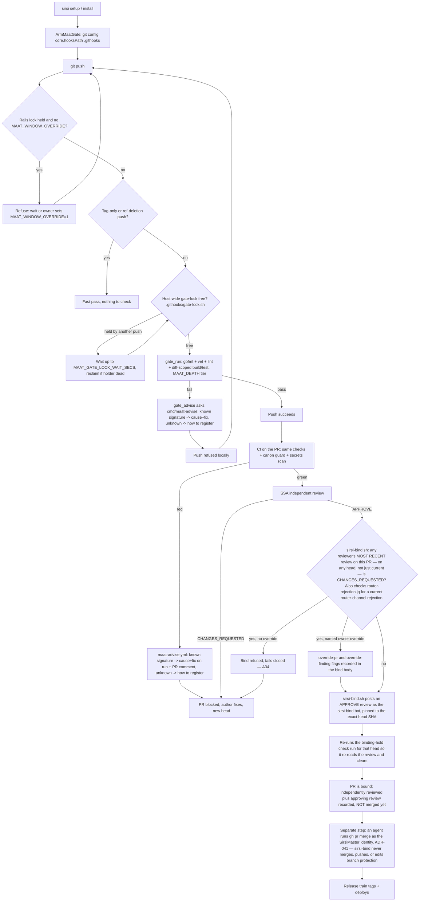
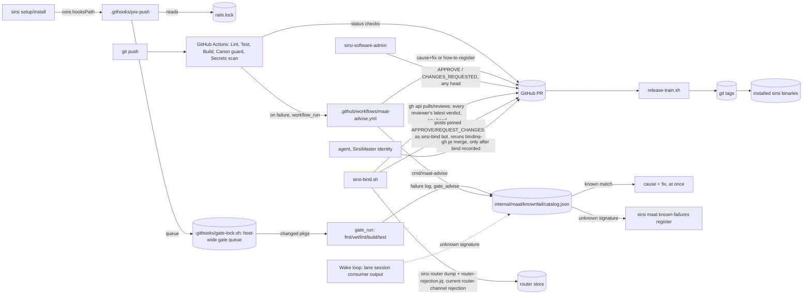
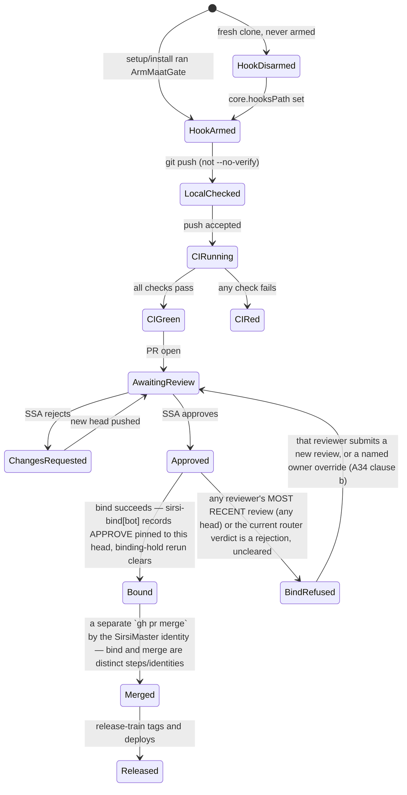

# RA-P18 — Ma'at pre-push gate and CI

Owner: claude-pantheon. Source: `.githooks/pre-push`, `.githooks/gate-lock.sh`,
`.githooks/gate-advise.sh`, `internal/setup/maatgate.go`, `scripts/bind/sirsi-bind.sh`,
`scripts/bind/router-rejection.jq`, `internal/maat/knownfail/`,
`.github/workflows/maat-advise.yml`.
Revision: main @ `5027fd7e` (#1015, merged 2026-10-06) or any later commit — the
#1015 catalog-consult wiring and `gate_run`/`gate_advise` are present from this
commit forward; reverify against the exact head you are reading, not this pin,
if main has moved (codex-pantheon review of an earlier draft, router item
20261007-040907: a revision note is a point-in-time claim, not a standing one).

## Logical view

Local hook is advisory (`--no-verify` skips it, `MAAT_WINDOW_OVERRIDE=1` bypasses the
rails-lock wait); CI + the bind script are the backstop that cannot be skipped by a
local flag (A28). The bind and the merge are two distinct steps performed by two
distinct identities (`sirsi-bind[bot]` reviews; `SirsiMaster` merges) — conflating
them documents an enforced end-to-end path that does not exist (codex-pantheon
review, router item 20261007-040907).

## Data view

## State view

## Failure and recovery
- Fresh clone with the hook never armed: pushes locally unchecked; CI is the only
  backstop until `sirsi setup`/installer runs (A28 — "armed, not just shipped").
- Rails-lock held during a measurement window: push refused unless the owner
  explicitly overrides with `MAAT_WINDOW_OVERRIDE=1` (deliberate bypass, not a bug).
- The pre-push hook and CI now consult the known-failure catalog on every failing
  gate step (#1015), before anyone — human or model — spends time or tokens on it.
  `gate_run`/`gate_advise` (`.githooks/gate-advise.sh`) wraps each hook step; on
  failure it asks `cmd/maat-advise`. A known signature prints cause + fix at once;
  an unknown one prints how to record it with `sirsi maat known-failures register`.
  CI gets the same advice via `.github/workflows/maat-advise.yml`, which runs on
  `workflow_run` failure and posts cause+fix (or the how-to-register prompt) as a
  PR comment, using only catalog text — never the PR's own code. The wake loop
  (RA-P02) and `sirsi maat known-failures match` remain a second, independent
  consumer for lane-session output outside the hook/CI path. An unknown signature
  stays open until a PR ships a fix with a guard test (`resolve` requires
  `fixed_in` + an existing guard test) — see RA-P02.
- A34 is the hard rule at bind time: the binder groups every review on the PR by
  reviewer, takes each reviewer's MOST RECENT verdict (regardless of which head it
  was submitted against — new commits alone do not clear a prior rejection), and
  refuses APPROVE if any of those latest verdicts is `CHANGES_REQUESTED`. It
  separately checks `sirsi router dump` + `router-rejection.jq` for a current
  router-channel rejection of the same PR (PR #927 merged past exactly this gap on
  2026-10-01). Either kind clears only via (a) that same reviewer/channel issuing a
  newer resolving verdict, or (b) `--override-pr <n> --override-finding "<text>"`
  naming the exact PR and finding. The binder fails closed (treats an API error as
  uncleared) and escalates to the owner.
- Unsure (flagged by Ra, unresolved here): no model-backed Ma'at gate exists yet —
  the catalog match is signature-only, never a model judgment; no catalog entry
  applies its own fix; whether `--no-verify`/`MAAT_WINDOW_OVERRIDE` should exist at
  all (owner has kept them as deliberate, log-visible escape hatches, not removed
  them).
