# Pantheon PT diagrams — Ma'at knowledge and local Stack Lab

These source-described workflows were absent from the first 28-row index.
They add ten Ma'at knowledge commands and four local Stack Lab commands to the
inventory. Local knowledge is private to `~/.sirsi/maat/knowledge/archive.sqlite3`;
search/detail/history/status are read-only, refresh is an explicit local ingest,
and local Stack Lab preferences record metadata only. None of these diagrams
claims release qualification or runtime operation.

## PT-P29 — Ma'at knowledge search and page projection

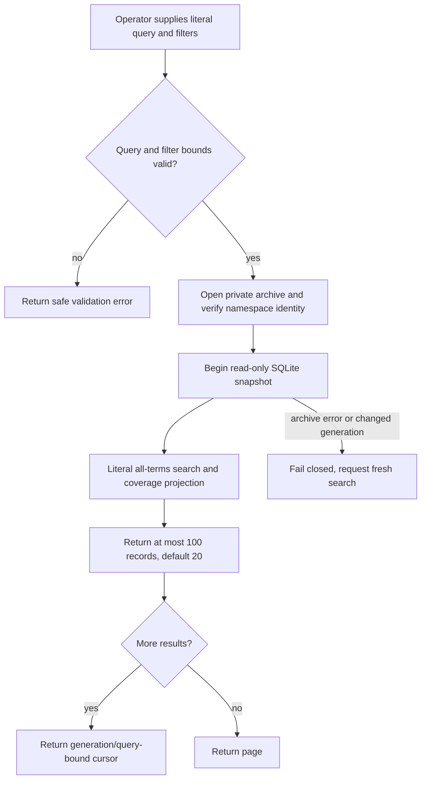
```mermaid
flowchart TD
  U[Operator supplies literal query and filters] --> V{Query and filter bounds valid?}
  V -->|no| REF[Return safe validation error]
  V -->|yes| OPEN[Open private archive and verify namespace identity]
  OPEN --> SNAP[Begin read-only SQLite snapshot]
  SNAP --> SEARCH[Literal all-terms search and coverage projection]
  SEARCH --> PAGE[Return at most 100 records, default 20]
  PAGE --> CURSOR{More results?}
  CURSOR -->|yes| NEXT[Return generation/query-bound cursor]
  CURSOR -->|no| DONE[Return page]
  SNAP -->|archive error or changed generation| ERR[Fail closed, request fresh search]
```

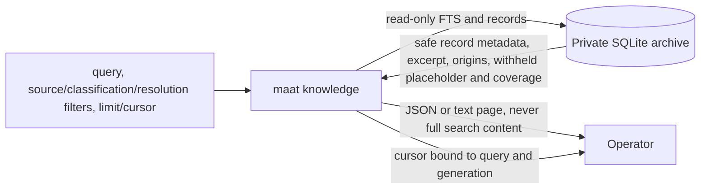
```mermaid
flowchart LR
  CLI[query, source/classification/resolution filters, limit/cursor] --> SEARCH[maat knowledge]
  SEARCH -->|read-only FTS and records| DB[(Private SQLite archive)]
  DB -->|safe record metadata, excerpt, origins, withheld placeholder and coverage| SEARCH
  SEARCH -->|JSON or text page, never full search content| OUT[Operator]
  SEARCH -->|cursor bound to query and generation| OUT
```

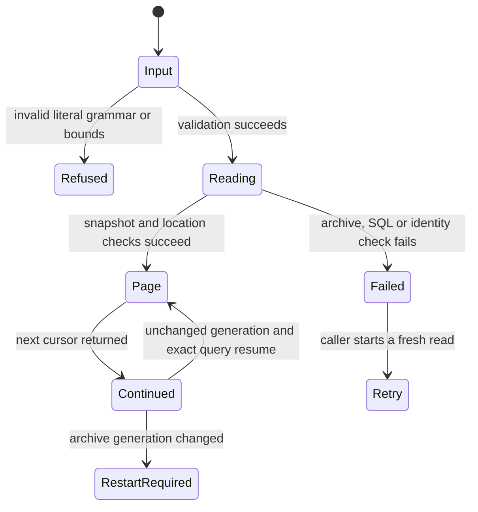
```mermaid
stateDiagram-v2
  [*] --> Input
  Input --> Refused: invalid literal grammar or bounds
  Input --> Reading: validation succeeds
  Reading --> Page: snapshot and location checks succeed
  Reading --> Failed: archive, SQL or identity check fails
  Page --> Continued: next cursor returned
  Continued --> RestartRequired: archive generation changed
  Continued --> Page: unchanged generation and exact query resume
  Failed --> Retry: caller starts a fresh read
```

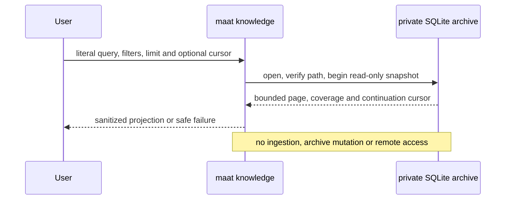
```mermaid
sequenceDiagram
  participant User
  participant CLI as maat knowledge
  participant Archive as private SQLite archive
  User->>CLI: literal query, filters, limit and optional cursor
  CLI->>Archive: open, verify path, begin read-only snapshot
  Archive-->>CLI: bounded page, coverage and continuation cursor
  CLI-->>User: sanitized projection or safe failure
  Note over CLI,Archive: no ingestion, archive mutation or remote access
```

Limits: query text 512 bytes; page maximum 100; invalid/stale cursors fail and
require restart. Existing test names include `TestArchiveLiteralSearch`,
`TestArchiveLiteralSearchCursorCountsAndPrivacy`,
`TestArchiveSearchAndHistoryCursorsAreStableAndBounded` and
`TestArchiveSearchSnapshotDoesNotMixConcurrentConnectionCommit`.

## PT-P30 — Explicit Ma'at local knowledge refresh / ingestion

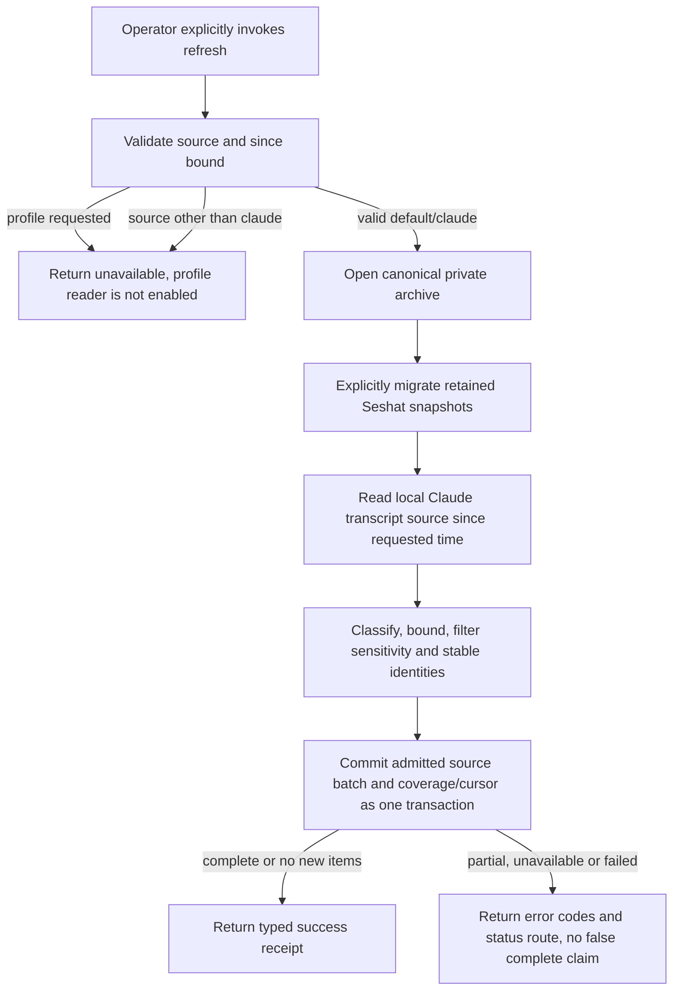
```mermaid
flowchart TD
  U[Operator explicitly invokes refresh] --> ARG[Validate source and since bound]
  ARG -->|profile requested| UNAV[Return unavailable, profile reader is not enabled]
  ARG -->|source other than claude| UNAV
  ARG -->|valid default/claude| OPEN[Open canonical private archive]
  OPEN --> LEGACY[Explicitly migrate retained Seshat snapshots]
  LEGACY --> CLAUDE[Read local Claude transcript source since requested time]
  CLAUDE --> FILTER[Classify, bound, filter sensitivity and stable identities]
  FILTER --> TX[Commit admitted source batch and coverage/cursor as one transaction]
  TX -->|complete or no new items| OK[Return typed success receipt]
  TX -->|partial, unavailable or failed| HOLD[Return error codes and status route, no false complete claim]
```

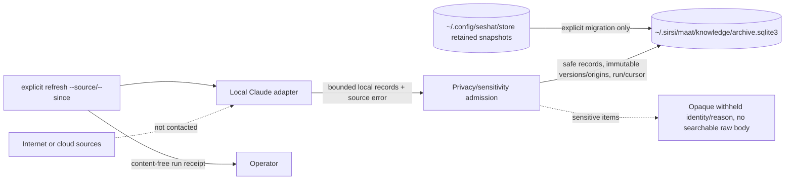
```mermaid
flowchart LR
  CLI[explicit refresh --source/--since] --> ADAPTER[Local Claude adapter]
  LEGACY[(~/.config/seshat/store retained snapshots)] -->|explicit migration only| ARCHIVE[(~/.sirsi/maat/knowledge/archive.sqlite3)]
  ADAPTER -->|bounded local records + source error| FILTER[Privacy/sensitivity admission]
  FILTER -->|safe records, immutable versions/origins, run/cursor| ARCHIVE
  FILTER -. sensitive items .-> WITHHELD[Opaque withheld identity/reason, no searchable raw body]
  REMOTE[Internet or cloud sources] -. not contacted .-> ADAPTER
  CLI -->|content-free run receipt| USER[Operator]
```

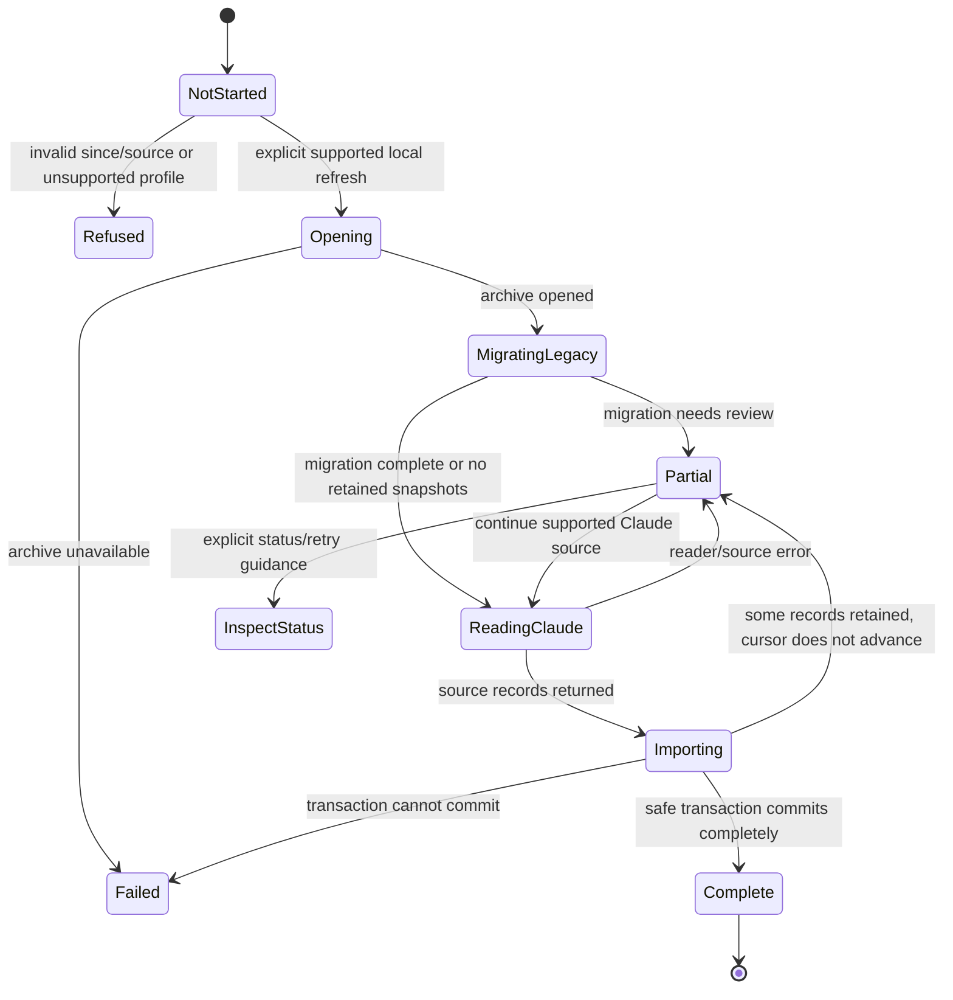
```mermaid
stateDiagram-v2
  [*] --> NotStarted
  NotStarted --> Refused: invalid since/source or unsupported profile
  NotStarted --> Opening: explicit supported local refresh
  Opening --> Failed: archive unavailable
  Opening --> MigratingLegacy: archive opened
  MigratingLegacy --> Partial: migration needs review
  MigratingLegacy --> ReadingClaude: migration complete or no retained snapshots
  Partial --> ReadingClaude: continue supported Claude source
  ReadingClaude --> Importing: source records returned
  ReadingClaude --> Partial: reader/source error
  Importing --> Complete: safe transaction commits completely
  Importing --> Partial: some records retained, cursor does not advance
  Importing --> Failed: transaction cannot commit
  Complete --> [*]
  Partial --> InspectStatus: explicit status/retry guidance
```

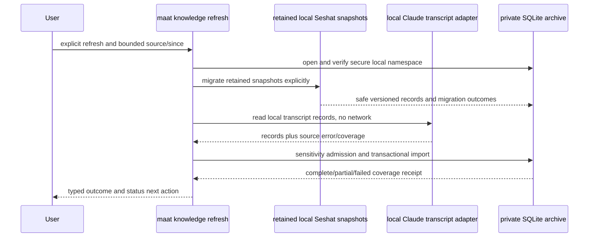
```mermaid
sequenceDiagram
  participant User
  participant CLI as maat knowledge refresh
  participant Legacy as retained local Seshat snapshots
  participant Claude as local Claude transcript adapter
  participant Archive as private SQLite archive
  User->>CLI: explicit refresh and bounded source/since
  CLI->>Archive: open and verify secure local namespace
  CLI->>Legacy: migrate retained snapshots explicitly
  Legacy-->>Archive: safe versioned records and migration outcomes
  CLI->>Claude: read local transcript records, no network
  Claude-->>CLI: records plus source error/coverage
  CLI->>Archive: sensitivity admission and transactional import
  Archive-->>CLI: complete/partial/failed coverage receipt
  CLI-->>User: typed outcome and status next action
```

Limits: only the local Claude reader is enabled. Chrome/profile flags are
explicitly unavailable; non-Claude source requests fail. Online ingestion,
export, remote decisions and implicit ingestion during search do not occur.
Known tests include `TestArchivePartialImportPreservesRowsWithoutAdvancingCursor`,
`TestArchiveSensitivityAdmissionPrecedesRecordAndFTSWrite`,
`TestArchiveSourceTransactionRollsBackAsAUnit`, and
`TestLegacyMigrationImportsAllSnapshotsIdempotentlyAndPreservesFiles`.

## PT-P31 — Ma'at private search-index rebuild

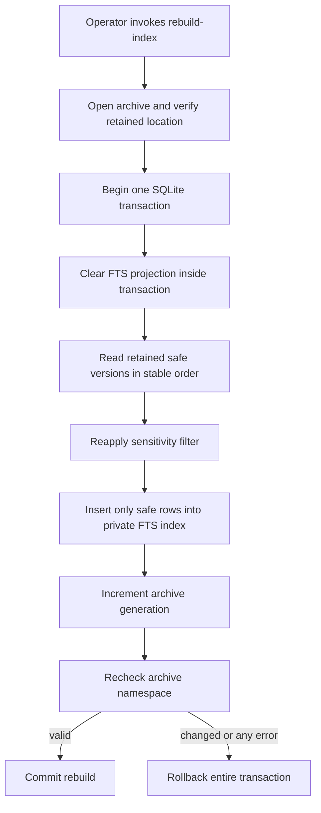
```mermaid
flowchart TD
  U[Operator invokes rebuild-index] --> OPEN[Open archive and verify retained location]
  OPEN --> TX[Begin one SQLite transaction]
  TX --> CLEAR[Clear FTS projection inside transaction]
  CLEAR --> SCAN[Read retained safe versions in stable order]
  SCAN --> FILTER[Reapply sensitivity filter]
  FILTER --> FTS[Insert only safe rows into private FTS index]
  FTS --> GEN[Increment archive generation]
  GEN --> VERIFY[Recheck archive namespace]
  VERIFY -->|valid| COMMIT[Commit rebuild]
  VERIFY -->|changed or any error| ROLLBACK[Rollback entire transaction]
```

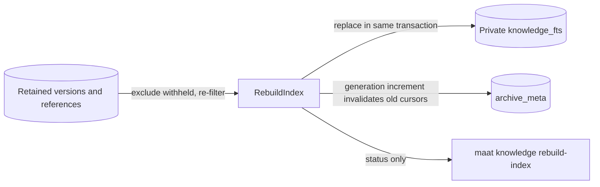
```mermaid
flowchart LR
  VERSIONS[(Retained versions and references)] -->|exclude withheld, re-filter| REBUILD[RebuildIndex]
  REBUILD -->|replace in same transaction| FTS[(Private knowledge_fts)]
  REBUILD -->|generation increment invalidates old cursors| META[(archive_meta)]
  REBUILD -->|status only| CLI[maat knowledge rebuild-index]
```

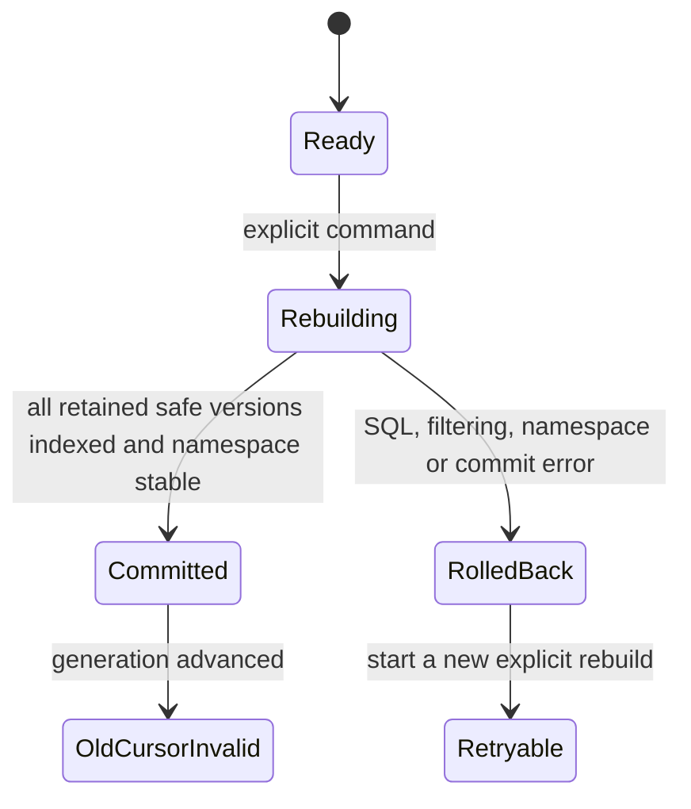
```mermaid
stateDiagram-v2
  [*] --> Ready
  Ready --> Rebuilding: explicit command
  Rebuilding --> Committed: all retained safe versions indexed and namespace stable
  Rebuilding --> RolledBack: SQL, filtering, namespace or commit error
  Committed --> OldCursorInvalid: generation advanced
  RolledBack --> Retryable: start a new explicit rebuild
```

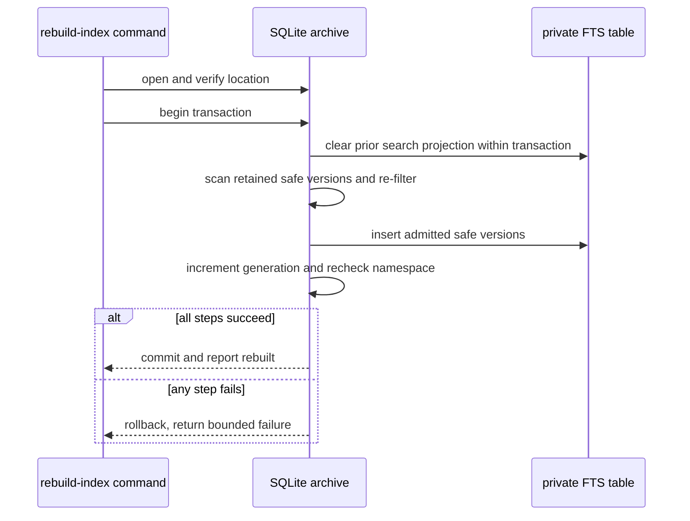
```mermaid
sequenceDiagram
  participant CLI as rebuild-index command
  participant Archive as SQLite archive
  participant FTS as private FTS table
  CLI->>Archive: open and verify location
  CLI->>Archive: begin transaction
  Archive->>FTS: clear prior search projection within transaction
  Archive->>Archive: scan retained safe versions and re-filter
  Archive->>FTS: insert admitted safe versions
  Archive->>Archive: increment generation and recheck namespace
  alt all steps succeed
    Archive-->>CLI: commit and report rebuilt
  else any step fails
    Archive-->>CLI: rollback, return bounded failure
  end
```

Rebuild does not ingest new source data and never indexes withheld bodies. Any
failure rolls back the transaction; old cursors become stale only after commit.

## PT-P32 — Ma'at knowledge record detail

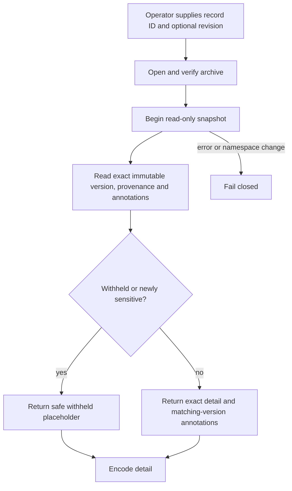
```mermaid
flowchart TD
  U[Operator supplies record ID and optional revision] --> OPEN[Open and verify archive]
  OPEN --> SNAP[Begin read-only snapshot]
  SNAP --> READ[Read exact immutable version, provenance and annotations]
  READ --> FILTER{Withheld or newly sensitive?}
  FILTER -->|yes| PLACE[Return safe withheld placeholder]
  FILTER -->|no| RECORD[Return exact detail and matching-version annotations]
  PLACE --> OUT[Encode detail]
  RECORD --> OUT
  SNAP -->|error or namespace change| ERR[Fail closed]
```

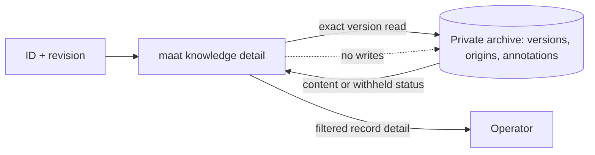
```mermaid
flowchart LR
  CLI[ID + revision] --> DETAIL[maat knowledge detail]
  DETAIL -->|exact version read| DB[(Private archive: versions, origins, annotations)]
  DB -->|content or withheld status| DETAIL
  DETAIL -->|filtered record detail| USER[Operator]
  DETAIL -. no writes .-> DB
```

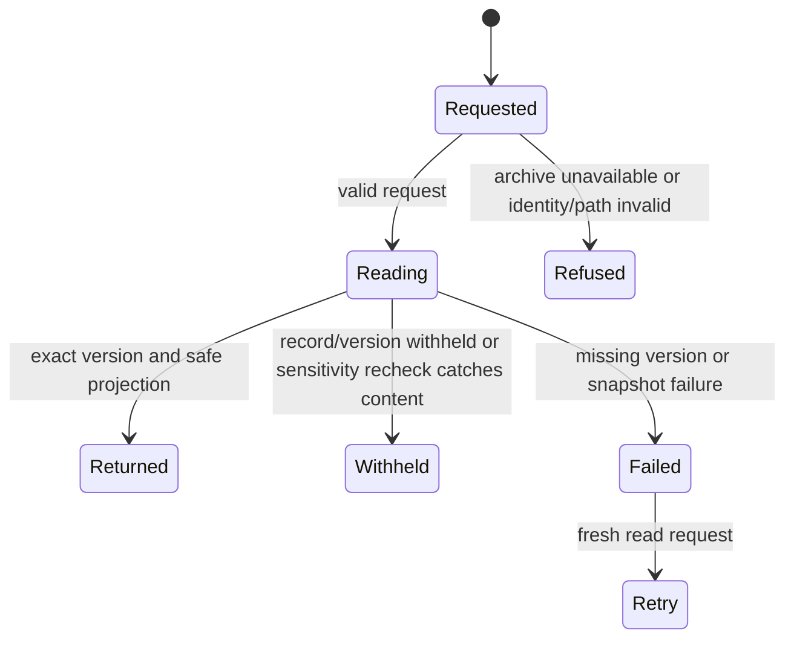
```mermaid
stateDiagram-v2
  [*] --> Requested
  Requested --> Reading: valid request
  Requested --> Refused: archive unavailable or identity/path invalid
  Reading --> Returned: exact version and safe projection
  Reading --> Withheld: record/version withheld or sensitivity recheck catches content
  Reading --> Failed: missing version or snapshot failure
  Failed --> Retry: fresh read request
```

Detail is read-only. A revision of zero resolves to current; a historical
revision gets resolution only from an annotation matching both revision and
content digest. Content of withheld items is omitted.

## PT-P33 — Ma'at immutable knowledge history

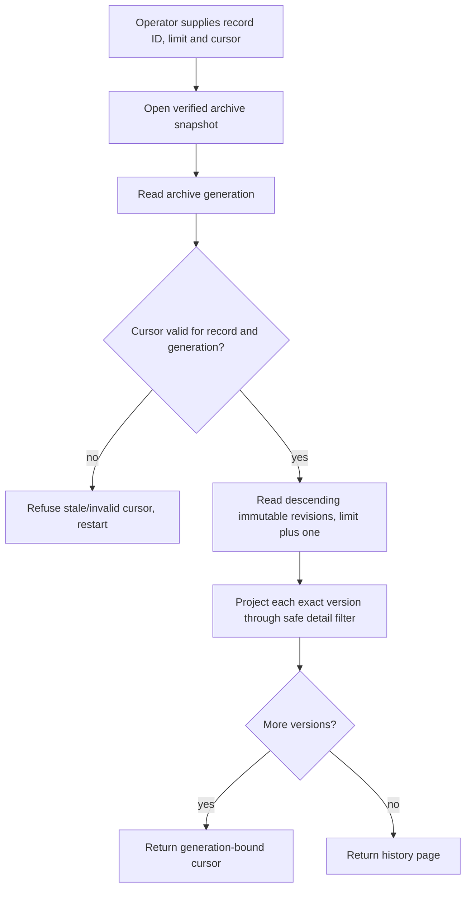
```mermaid
flowchart TD
  U[Operator supplies record ID, limit and cursor] --> OPEN[Open verified archive snapshot]
  OPEN --> GEN[Read archive generation]
  GEN --> CURSOR{Cursor valid for record and generation?}
  CURSOR -->|no| REF[Refuse stale/invalid cursor, restart]
  CURSOR -->|yes| PAGE[Read descending immutable revisions, limit plus one]
  PAGE --> DETAIL[Project each exact version through safe detail filter]
  DETAIL --> MORE{More versions?}
  MORE -->|yes| NEXT[Return generation-bound cursor]
  MORE -->|no| DONE[Return history page]
```

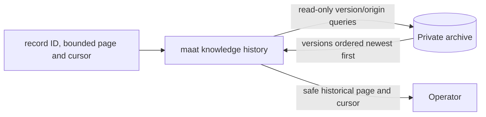
```mermaid
flowchart LR
  CLI[record ID, bounded page and cursor] --> HISTORY[maat knowledge history]
  HISTORY -->|read-only version/origin queries| DB[(Private archive)]
  DB -->|versions ordered newest first| HISTORY
  HISTORY -->|safe historical page and cursor| USER[Operator]
```

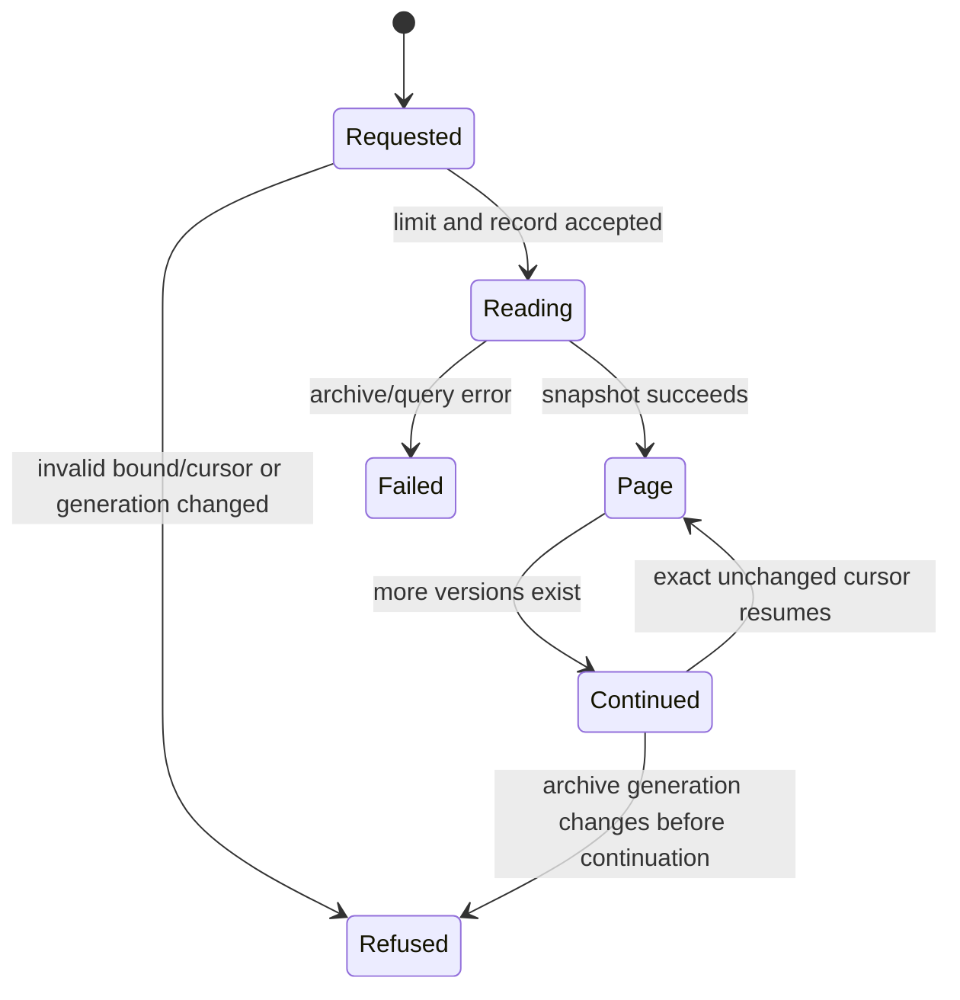
```mermaid
stateDiagram-v2
  [*] --> Requested
  Requested --> Reading: limit and record accepted
  Requested --> Refused: invalid bound/cursor or generation changed
  Reading --> Page: snapshot succeeds
  Reading --> Failed: archive/query error
  Page --> Continued: more versions exist
  Continued --> Refused: archive generation changes before continuation
  Continued --> Page: exact unchanged cursor resumes
```

History is read-only. Page size is at most 100 (default 20); compatibility
non-paginated reads refuse when more than 100 revisions exist. Existing shared
cursor/history tests are catalogued under PT-P29 and the source test names in
`internal/maat/knowledge/archive_test.go`.

## PT-P34 — Ma'at knowledge coverage/status

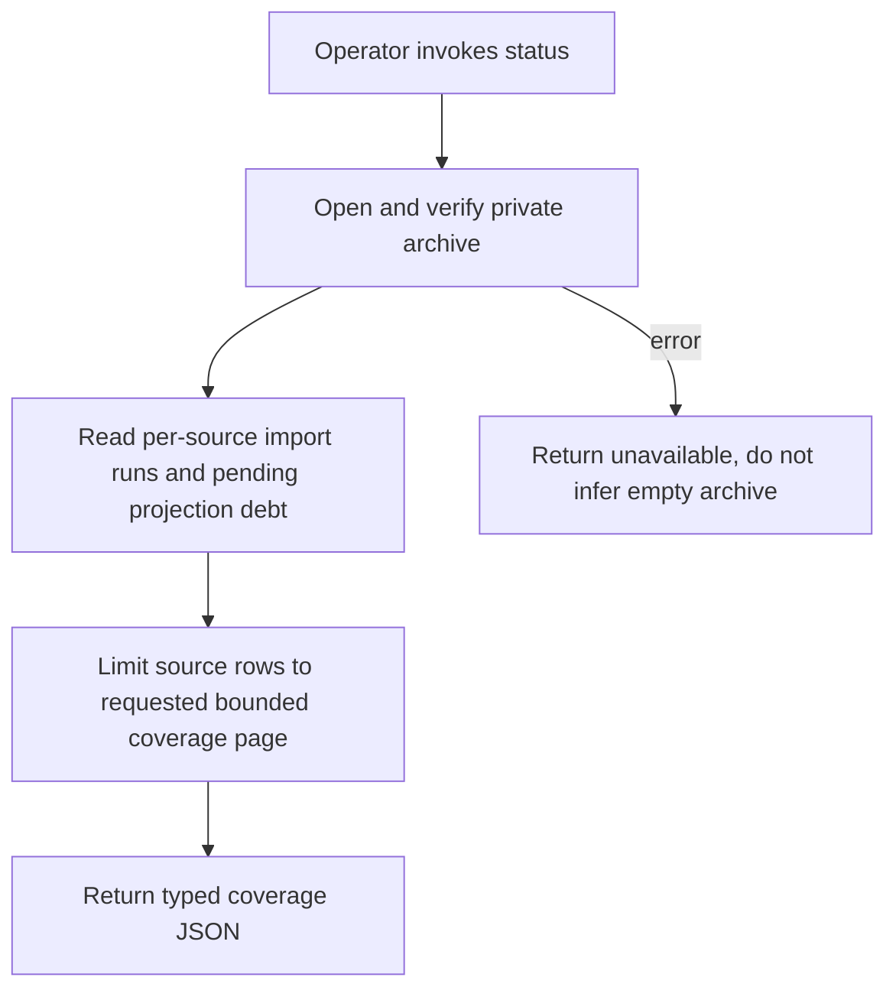
```mermaid
flowchart TD
  U[Operator invokes status] --> OPEN[Open and verify private archive]
  OPEN --> READ[Read per-source import runs and pending projection debt]
  READ --> BOUND[Limit source rows to requested bounded coverage page]
  BOUND --> OUT[Return typed coverage JSON]
  OPEN -->|error| ERR[Return unavailable, do not infer empty archive]
```

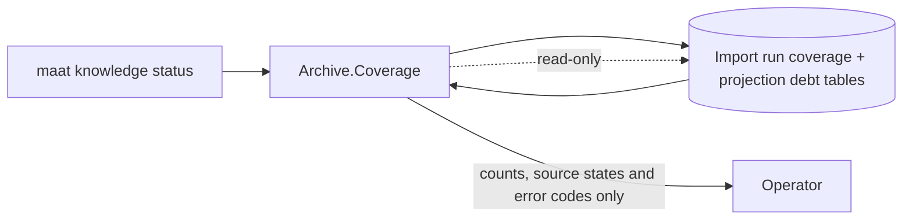
```mermaid
flowchart LR
  CLI[maat knowledge status] --> STATUS[Archive.Coverage]
  STATUS --> DB[(Import run coverage + projection debt tables)]
  DB --> STATUS -->|counts, source states and error codes only| USER[Operator]
  STATUS -. read-only .-> DB
```

```mermaid
stateDiagram-v2
  [*] --> Requested
  Requested --> Reading: archive opens
  Requested --> Failed: archive unavailable/corrupt
  Reading --> Complete: coverage page and debt count read
  Reading --> Failed: query/validation error
  Complete --> Retry: caller requests a fresh status read
```

Status is not proof of source content completeness: it reports recorded source
coverage and current projection debt only. The command requests up to 50 source
rows; unknown or failed source state stays visible.

## PT-P35 — Explicit Ma'at owner-resolution annotation

```mermaid
flowchart TD
  U[Owner reviews exact current detail] --> INPUT[Supply ID, revision, digest, state and note on stdin]
  INPUT --> VALID{Note bounded and valid state?}
  VALID -->|no| REF[Refuse, no archive mutation]
  VALID -->|yes| OPEN[Open and verify archive]
  OPEN --> PREF[Re-read current revision and digest]
  PREF --> MATCH{Still the reviewed version?}
  MATCH -->|no| STALE[Refuse, reopen current detail]
  MATCH -->|yes| FILTER[Reject sensitive annotation]
  FILTER --> TX[Transactionally append annotation, update resolution and create projection debt]
  TX --> OUT[Return annotation ID and pending Casebook projection state]
```

```mermaid
flowchart LR
  OWNER[Explicit owner note via stdin] --> CLI[maat knowledge resolve]
  CLI -->|ID, revision, digest, state, note| ARCHIVE[(Private knowledge archive)]
  ARCHIVE -->|annotation + resolution + pending debt in one transaction| ARCHIVE
  CLI -->|record ID, annotation ID, pending state| OWNER
  CLI -. note must not enter argv .-> ARGS[Command arguments]
```

```mermaid
stateDiagram-v2
  [*] --> Reviewing
  Reviewing --> Refused: unsupported state, missing note or bound exceeded
  Reviewing --> Refused: item withheld, sensitive note or unavailable item
  Reviewing --> Stale: revision/digest changed after review
  Reviewing --> Recording: exact revision and digest still current
  Recording --> PendingProjection: transaction commits
  Recording --> Failed: any write/identity/commit failure rolls back
  PendingProjection --> Reconciled: separate PT-P36 succeeds
```

```mermaid
sequenceDiagram
  participant Owner
  participant CLI as resolve command
  participant Archive as private SQLite archive
  Owner->>CLI: reviewed revision/digest plus bounded note on stdin
  CLI->>Archive: compare exact current revision and digest
  Archive-->>CLI: current identity or stale refusal
  CLI->>Archive: append annotation, update state, create debt transactionally
  Archive-->>CLI: annotation ID
  CLI-->>Owner: retained decision, projection still pending
```

Consent is the owner's explicit reviewed command and stdin note. Note max is
4000 bytes, sensitive text is refused, and a changed revision/digest cannot be
resolved from stale consent. The archive decision remains local until PT-P36
projects it to the existing Casebook journal.

## PT-P36 — Ma'at owner-review Casebook projection reconciliation

```mermaid
flowchart TD
  U[Operator explicitly invokes reconcile-projections] --> OPEN[Open archive, read up to 50 pending annotations]
  OPEN --> EMPTY{Any pending items?}
  EMPTY -->|no| ZERO[Return zero projected/debt counts]
  EMPTY -->|yes| JOURNAL[Open existing Ma'at decision journal]
  JOURNAL --> CAP{AppendOnce supported?}
  CAP -->|no| HOLD[Keep debt pending]
  CAP -->|yes| APPEND[Append each decision with annotation ID as idempotency evidence]
  APPEND --> ACK[Mark exact annotation projected in archive]
  ACK --> COVER[Read remaining debt and return counts]
  APPEND -->|failure| HOLD
  ACK -->|failure| HOLD
```

```mermaid
flowchart LR
  ARCHIVE[(Private annotations + pending projection_debts)] -->|bounded pending batch, max 50| CLI[reconcile-projections]
  CLI -->|AppendOnce decision| JOURNAL[(Existing Ma'at Casebook journal)]
  JOURNAL -->|append result/idempotency| CLI
  CLI -->|MarkProjected acknowledgement| ARCHIVE
  CLI -->|projected and remaining debt counts only| USER[Operator]
```

```mermaid
stateDiagram-v2
  [*] --> Pending
  Pending --> Empty: no debt found
  Pending --> Appending: journal available and AppendOnce supported
  Pending --> Held: journal unavailable or capability missing
  Appending --> Acknowledging: AppendOnce returns without error
  Appending --> Held: append error, debt remains pending
  Acknowledging --> Projected: archive acknowledgement succeeds
  Acknowledging --> Pending: ack error, retry is idempotent at journal
  Held --> Appending: later explicit retry
```

```mermaid
sequenceDiagram
  participant CLI as reconcile-projections
  participant Archive as knowledge archive
  participant Journal as existing Casebook journal
  CLI->>Archive: read bounded pending annotations
  Archive-->>CLI: annotations with stable IDs
  loop each pending annotation
    CLI->>Journal: AppendOnce decision keyed to annotation evidence
    Journal-->>CLI: appended/already present or error
    CLI->>Archive: mark exact annotation projected
    Archive-->>CLI: acknowledgement or retained debt
  end
  CLI->>Archive: read remaining debt
  Archive-->>CLI: typed counts
```

A journal append followed by a failed archive acknowledgement leaves debt; retry
uses `AppendOnce` so it does not duplicate a Casebook decision. This is a
projection workflow, not a new authority or journal. Sensitive annotation
content remains withheld; debt and failures remain visible.

## PT-P37 — Local Stack Lab preference inspection

```mermaid
flowchart TD
  U[Operator invokes stacklab local inspect] --> HOME[Resolve user home]
  HOME --> ROOT[Open private non-symlink Stack Lab directory]
  ROOT --> STATE{state.json exists?}
  STATE -->|no state/root absent| DEFAULT[Return default disabled local state]
  STATE -->|yes| READ[Read bounded exact schema and verify root continuity]
  READ -->|valid| OUT[Return enabled/provider metadata]
  READ -->|corrupt, linked or drifted| REF[Fail closed, show no fabricated state]
```

```mermaid
flowchart LR
  CLI[stacklab local inspect] -->|read only| PREF[(~/.sirsi/stacklab/state.json)]
  PREF -->|schema, enabled, provider| CLI --> USER[Operator]
  CLI -. does not invoke provider or read recipe payload .-> PROVIDER[No provider call]
```

```mermaid
stateDiagram-v2
  [*] --> Uninspected
  Uninspected --> DefaultOff: preference root/state absent
  Uninspected --> Read: private root exists
  Read --> KnownState: exact schema and continuity pass
  Read --> Unknown: corrupt, linked, unsafe or changed root
  KnownState --> Uninspected: next explicit inspection
  DefaultOff --> Uninspected: next explicit inspection
```

Inspection is read-only. Local state is a default-off preference projection;
it does not establish provider readiness.

## PT-P38 — Local Stack Lab enablement

```mermaid
flowchart TD
  U[Operator invokes enable with provider kind] --> VALID{provider is local/frontier/self-hosted?}
  VALID -->|no| REF[Refuse before preference write]
  VALID -->|yes| INSPECT[Inspect current state, refuse corrupt/unknown]
  INSPECT --> LOCK[Acquire private no-follow local lock]
  LOCK --> ROOT[Recheck root identity]
  ROOT --> WRITE[Write unique private temp state and fsync]
  WRITE --> RENAME[Atomic rename to state.json and fsync directory]
  RENAME --> READBACK[Read back exact enabled/provider state]
  READBACK -->|matches| DONE[Return local preference]
  READBACK -->|error/mismatch| DEBT[Return failure, retained temp/uncertainty is not success]
```

```mermaid
flowchart LR
  USER[Explicit local enable + provider metadata] --> CLI[stacklab local enable]
  CLI -->|private lock + temp + atomic rename| PREF[(~/.sirsi/stacklab/state.json)]
  PREF -->|readback enabled/provider fields| CLI --> USER
  CLI -. no network, model or provider invocation .-> EXT[External provider]
```

```mermaid
stateDiagram-v2
  [*] --> DisabledOrKnown
  DisabledOrKnown --> Validating: explicit enable
  Validating --> Refused: invalid provider or corrupt state
  Validating --> Locked: current preference valid
  Locked --> Writing: lock and root checks pass
  Writing --> Enabled: atomic write, fsync and exact readback pass
  Writing --> Uncertain: write/sync/rename/readback fails
  Uncertain --> Inspect: explicit fresh inspection/recovery
```

Enable records provider-kind metadata only. It grants no account, credential,
network or model authority. Errors do not justify deleting retained state.

## PT-P39 — Local Stack Lab disablement

```mermaid
flowchart TD
  U[Operator invokes disable] --> INSPECT[Read and validate current local state]
  INSPECT -->|missing| DEFAULT[Return default disabled state]
  INSPECT -->|corrupt/unsafe| REF[Refuse to overwrite unknown state]
  INSPECT -->|valid| LOCK[Acquire existing private lock]
  LOCK --> WRITE[Atomically write enabled=false, preserve provider metadata]
  WRITE --> VERIFY[Read back exact disabled state]
  VERIFY -->|matches| DONE[Return disabled preference]
  VERIFY -->|fails| DEBT[Report failure, do not claim disabled]
```

```mermaid
flowchart LR
  USER[Explicit disable request] --> CLI[stacklab local disable]
  CLI --> PREF[(Private state.json and lock)]
  PREF -->|disabled state readback| CLI --> USER
  CLI -. disable does not stop any external process .-> EXT[Provider/model/process state untouched]
```

```mermaid
stateDiagram-v2
  [*] --> CurrentState
  CurrentState --> Disabled: preference missing
  CurrentState --> Refused: corrupt, linked or unsafe state
  CurrentState --> Writing: valid known preference and lock acquired
  Writing --> Disabled: atomic replacement and readback pass
  Writing --> Unknown: filesystem or identity failure
  Unknown --> Inspect: explicit re-read, no fabricated result
```

Disable changes only the local preference. It does not revoke external
credentials or stop running provider/model processes.

## PT-P40 — Packaged Stack Lab catalog projection

```mermaid
flowchart TD
  U[Operator invokes stacklab local catalog] --> INSPECT[Inspect local preference]
  INSPECT -->|disabled| REF[Refuse, direct operator to Stack Lab workspace]
  INSPECT -->|enabled| RESOURCE[Resolve exact installed app/libexec StackLab resource path]
  RESOURCE -->|missing/unsupported install| ERR[Report payload unavailable, do not search checkout/PATH]
  RESOURCE --> LOAD[Read direct versioned recipe/wing JSON files]
  LOAD --> VALID{Each record regular, non-symlink and structurally valid?}
  VALID -->|yes| PROJECT[Sort/project entries and explicit unknowns]
  VALID -->|no| UNKNOWN[Retain malformed/missing contracts as Unknown]
  PROJECT --> OUT[Return local typed catalog]
  UNKNOWN --> OUT
```

```mermaid
flowchart LR
  CLI[stacklab local catalog] --> PREF[(Private local enablement metadata)]
  CLI -->|fixed installed resource resolution| RES[(App Resources/StackLab or protected libexec resource)]
  RES -->|direct recipe/wing JSON only| PROJECTOR[Local catalog projector]
  PROJECTOR -->|entries + unknown records| CLI --> USER[Operator]
  PROJECTOR -. structural completeness is not registry authority .-> REMOTE[No remote registry lookup]
```

```mermaid
stateDiagram-v2
  [*] --> PreferenceCheck
  PreferenceCheck --> Disabled: local Stack Lab disabled
  PreferenceCheck --> ResolvePayload: enabled
  ResolvePayload --> Unavailable: supported installed payload absent
  ResolvePayload --> Loading: fixed resource path found
  Loading --> Catalog: entries projected and contracts valid
  Loading --> Partial: malformed/unreadable contract retained under Unknown
  Loading --> Failed: directory cannot be read
  Catalog --> InspectAgain: explicit future catalog request
  Partial --> InspectAgain: repair/upgrade payload then re-read
```

```mermaid
sequenceDiagram
  participant User
  participant CLI as stacklab local catalog
  participant Pref as local preference store
  participant Resources as installed StackLab payload
  User->>CLI: explicit catalog request
  CLI->>Pref: inspect enabled state
  Pref-->>CLI: enabled/provider metadata or disabled
  CLI->>Resources: resolve fixed installed resource directory
  Resources-->>CLI: direct recipe/wing files or unavailable
  CLI->>CLI: reject links/non-regular files, validate and sort
  CLI-->>User: typed entries plus explicit unknowns
  Note over CLI,Resources: local structural projection only, no remote authority
```

Catalog completeness means only that discoverable local contracts were
structurally projected; it does not mean canonical registry pin, recipe
qualification, installed operation or release certification. Tests named in
`internal/stacklab/catalog_test.go` include deterministic projection,
malformed-contract visibility and missing-wing refusal.
