# Pantheon PT diagrams — release and evidence

The flows distinguish static/source checks from qualification, signing,
publication, installation and loaded adoption. An arrow ending at a receipt
means the implementation records or expects evidence; only the cited existing
receipt can prove an operation actually occurred.

## PT-P07 — Completion proof capture

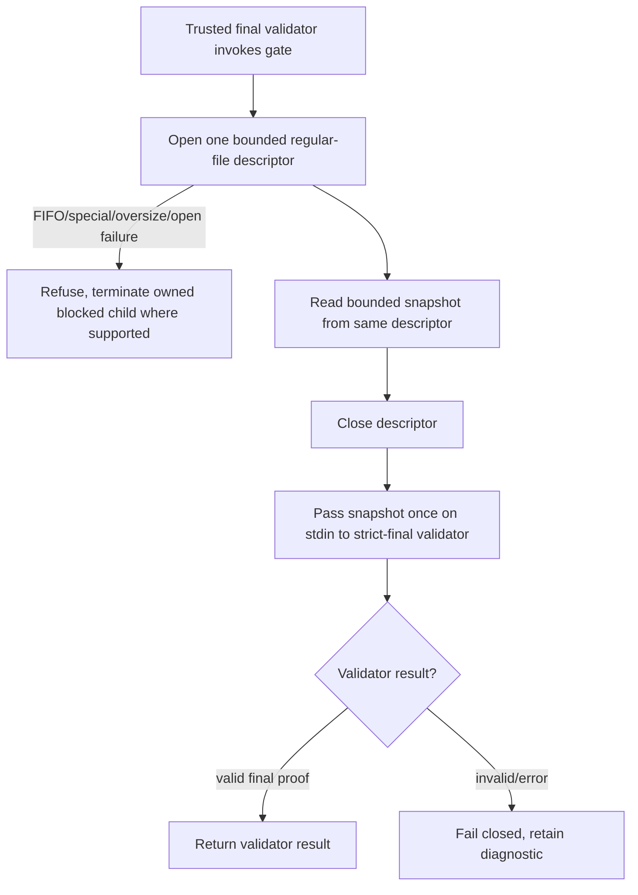
```mermaid
flowchart TD
  CALL[Trusted final validator invokes gate] --> OPEN[Open one bounded regular-file descriptor]
  OPEN -->|FIFO/special/oversize/open failure| REF[Refuse, terminate owned blocked child where supported]
  OPEN --> SNAP[Read bounded snapshot from same descriptor]
  SNAP --> CLOSE[Close descriptor]
  CLOSE --> PASS[Pass snapshot once on stdin to strict-final validator]
  PASS --> R{Validator result?}
  R -->|valid final proof| ACCEPT[Return validator result]
  R -->|invalid/error| REJECT[Fail closed, retain diagnostic]
```

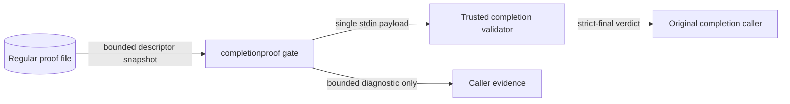
```mermaid
flowchart LR
  EVIDENCE[(Regular proof file)] -->|bounded descriptor snapshot| GATE[completionproof gate]
  GATE -->|single stdin payload| VALIDATOR[Trusted completion validator]
  VALIDATOR -->|strict-final verdict| CALLER[Original completion caller]
  GATE -->|bounded diagnostic only| LOG[Caller evidence]
```

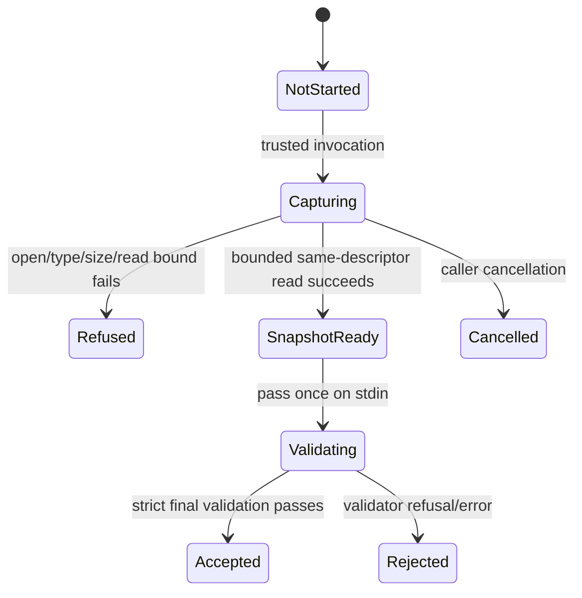
```mermaid
stateDiagram-v2
  [*] --> NotStarted
  NotStarted --> Capturing: trusted invocation
  Capturing --> Refused: open/type/size/read bound fails
  Capturing --> SnapshotReady: bounded same-descriptor read succeeds
  SnapshotReady --> Validating: pass once on stdin
  Validating --> Accepted: strict final validation passes
  Validating --> Rejected: validator refusal/error
  Capturing --> Cancelled: caller cancellation
```

Sequence: trusted caller → gate → descriptor/file → validator via stdin →
caller. Never reopen or reread a changed path between snapshot and validation.
The catalog cites FIFO correction `c0810bdd`/composition `44bb745d`, review
`de9a85f2` and race `46a9a356`; installed caller proof remains OPEN.

## PT-P21 — Package construction and inventory

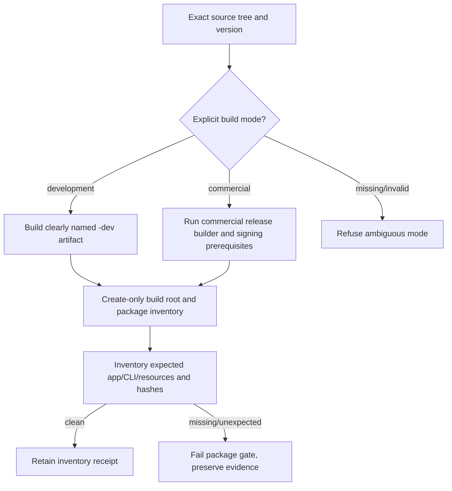
```mermaid
flowchart TD
  SRC[Exact source tree and version] --> MODE{Explicit build mode?}
  MODE -->|development| DEV[Build clearly named -dev artifact]
  MODE -->|commercial| COM[Run commercial release builder and signing prerequisites]
  MODE -->|missing/invalid| REF[Refuse ambiguous mode]
  DEV --> INV[Create-only build root and package inventory]
  COM --> INV
  INV --> SCAN[Inventory expected app/CLI/resources and hashes]
  SCAN -->|clean| OUT[Retain inventory receipt]
  SCAN -->|missing/unexpected| FAIL[Fail package gate, preserve evidence]
```

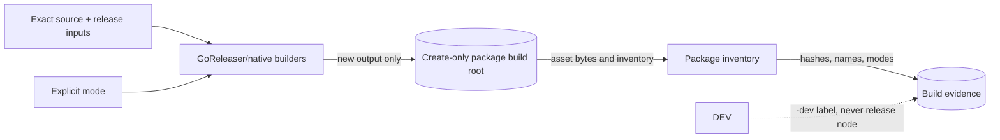
```mermaid
flowchart LR
  SRC[Exact source + release inputs] --> BUILDER[GoReleaser/native builders]
  MODE[Explicit mode] --> BUILDER
  BUILDER -->|new output only| ROOT[(Create-only package build root)]
  ROOT -->|asset bytes and inventory| INV[Package inventory]
  INV -->|hashes, names, modes| RECEIPT[(Build evidence)]
  DEV -. -dev label, never release node .-> RECEIPT
```

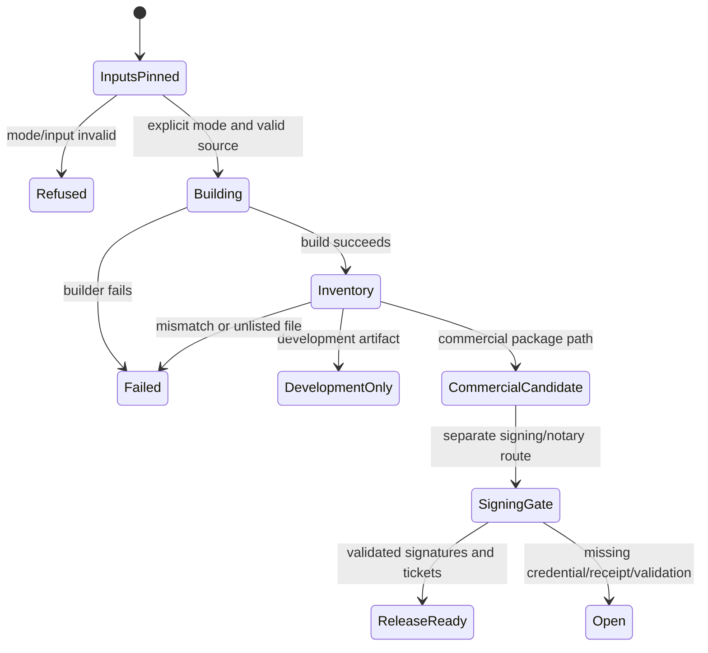
```mermaid
stateDiagram-v2
  [*] --> InputsPinned
  InputsPinned --> Refused: mode/input invalid
  InputsPinned --> Building: explicit mode and valid source
  Building --> Inventory: build succeeds
  Building --> Failed: builder fails
  Inventory --> DevelopmentOnly: development artifact
  Inventory --> CommercialCandidate: commercial package path
  Inventory --> Failed: mismatch or unlisted file
  CommercialCandidate --> SigningGate: separate signing/notary route
  SigningGate --> ReleaseReady: validated signatures and tickets
  SigningGate --> Open: missing credential/receipt/validation
```

Recovery: preserve the failed inventory and use a new clean build root for a
new attempt; development bytes cannot be relabelled commercial. Catalog says
unsigned inventory evidence exists; signed and packaged runtime proofs remain
separate.

## PT-P22 — Canonical cask rendering and SHA-conditioned publication

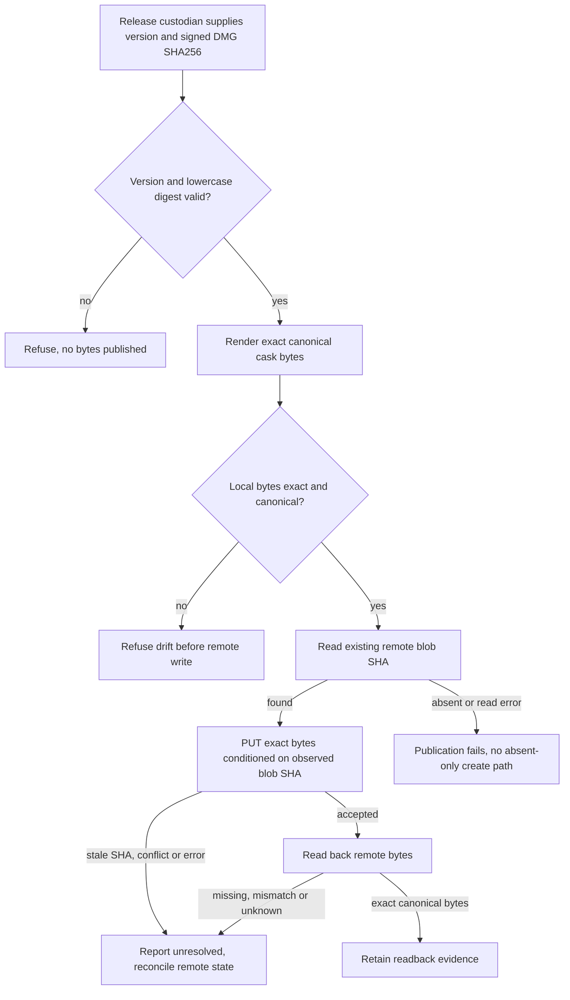
```mermaid
flowchart TD
  T[Release custodian supplies version and signed DMG SHA256] --> V{Version and lowercase digest valid?}
  V -->|no| REF[Refuse, no bytes published]
  V -->|yes| R[Render exact canonical cask bytes]
  R --> VERIFY{Local bytes exact and canonical?}
  VERIFY -->|no| STOP[Refuse drift before remote write]
  VERIFY -->|yes| GET[Read existing remote blob SHA]
  GET -->|found| PUT[PUT exact bytes conditioned on observed blob SHA]
  GET -->|absent or read error| ERR[Publication fails, no absent-only create path]
  PUT -->|stale SHA, conflict or error| OPEN[Report unresolved, reconcile remote state]
  PUT -->|accepted| READ[Read back remote bytes]
  READ -->|exact canonical bytes| DONE[Retain readback evidence]
  READ -->|missing, mismatch or unknown| OPEN
```

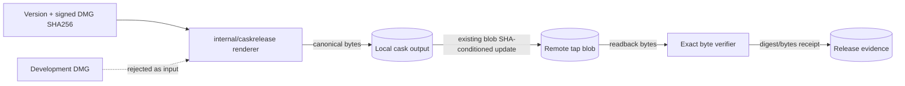
```mermaid
flowchart LR
  TUPLE[Version + signed DMG SHA256] --> RENDER[internal/caskrelease renderer]
  RENDER -->|canonical bytes| LOCAL[(Local cask output)]
  LOCAL -->|existing blob SHA-conditioned update| TAP[(Remote tap blob)]
  TAP -->|readback bytes| VERIFY[Exact byte verifier]
  VERIFY -->|digest/bytes receipt| EV[(Release evidence)]
  DEV[Development DMG] -. rejected as input .-> RENDER
```

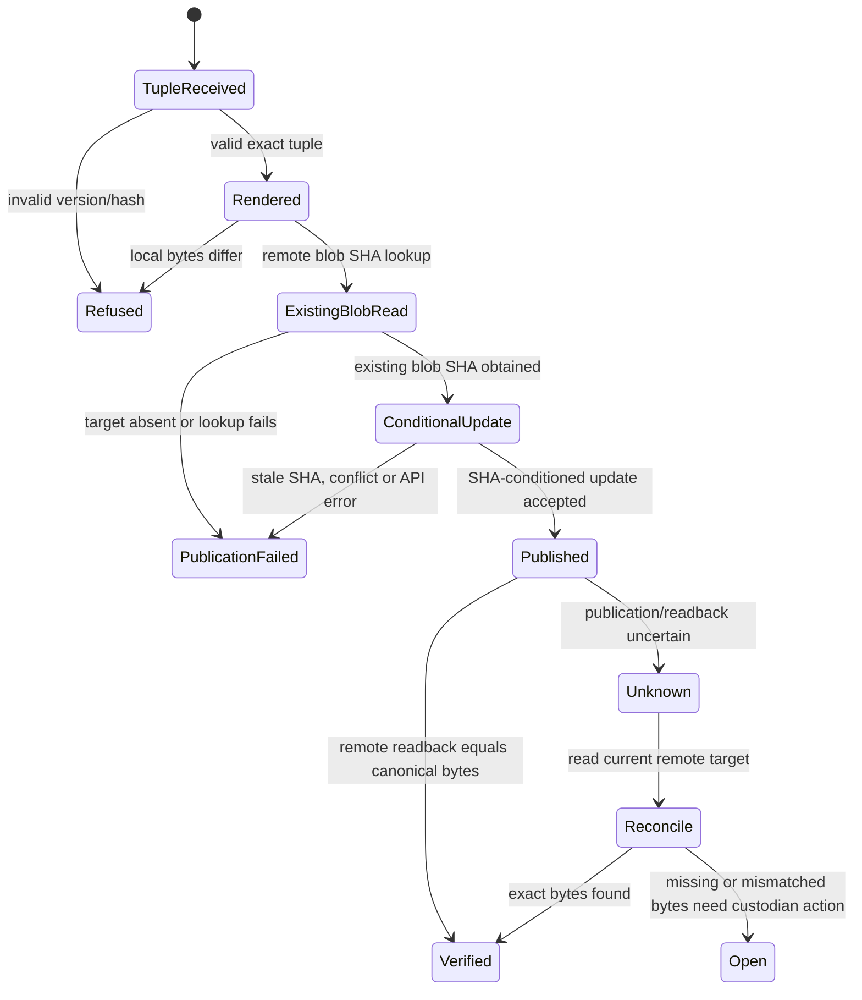
```mermaid
stateDiagram-v2
  [*] --> TupleReceived
  TupleReceived --> Refused: invalid version/hash
  TupleReceived --> Rendered: valid exact tuple
  Rendered --> Refused: local bytes differ
  Rendered --> ExistingBlobRead: remote blob SHA lookup
  ExistingBlobRead --> PublicationFailed: target absent or lookup fails
  ExistingBlobRead --> ConditionalUpdate: existing blob SHA obtained
  ConditionalUpdate --> PublicationFailed: stale SHA, conflict or API error
  ConditionalUpdate --> Published: SHA-conditioned update accepted
  Published --> Verified: remote readback equals canonical bytes
  Published --> Unknown: publication/readback uncertain
  Unknown --> Reconcile: read current remote target
  Reconcile --> Verified: exact bytes found
  Reconcile --> Open: missing or mismatched bytes need custodian action
```

Recovery is read/reconcile only after an uncertain conditional update; do not
blindly retry with a newly observed SHA or describe the API as create-only.

## PT-P23 — Commercial release publication boundary

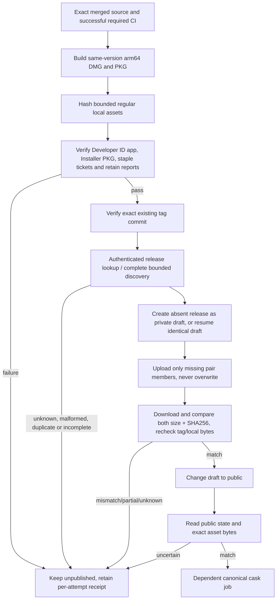
```mermaid
flowchart TD
  CI[Exact merged source and successful required CI] --> BUILD[Build same-version arm64 DMG and PKG]
  BUILD --> LOCAL[Hash bounded regular local assets]
  LOCAL --> SIGN[Verify Developer ID app, Installer PKG, staple tickets and retain reports]
  SIGN -->|failure| HOLD[Keep unpublished, retain per-attempt receipt]
  SIGN -->|pass| TAG[Verify exact existing tag commit]
  TAG --> LOOKUP[Authenticated release lookup / complete bounded discovery]
  LOOKUP -->|unknown, malformed, duplicate or incomplete| HOLD
  LOOKUP --> DRAFT[Create absent release as private draft, or resume identical draft]
  DRAFT --> PAIR[Upload only missing pair members, never overwrite]
  PAIR --> READ[Download and compare both size + SHA256, recheck tag/local bytes]
  READ -->|match| PUBLISH[Change draft to public]
  READ -->|mismatch/partial/unknown| HOLD
  PUBLISH --> PUBREAD[Read public state and exact asset bytes]
  PUBREAD -->|match| CASK[Dependent canonical cask job]
  PUBREAD -->|uncertain| HOLD
```

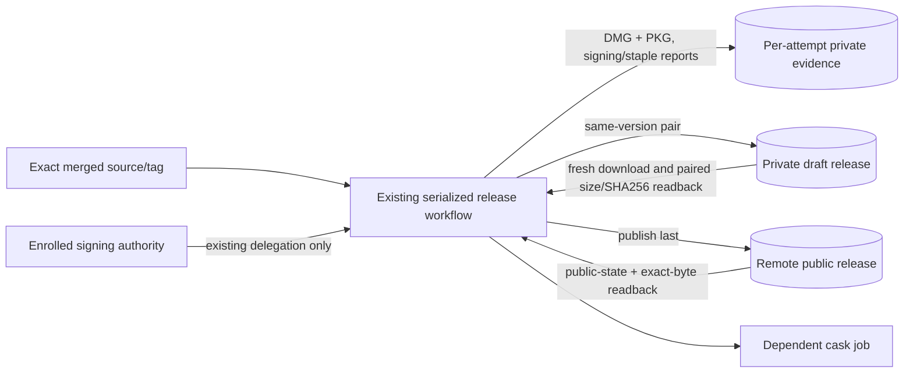
```mermaid
flowchart LR
  SRC[Exact merged source/tag] --> WF[Existing serialized release workflow]
  WF -->|DMG + PKG, signing/staple reports| PRIVATE[(Per-attempt private evidence)]
  WF -->|same-version pair| DRAFT[(Private draft release)]
  DRAFT -->|fresh download and paired size/SHA256 readback| WF
  WF -->|publish last| PUBLIC[(Remote public release)]
  PUBLIC -->|public-state + exact-byte readback| WF --> CASK[Dependent cask job]
  KEY[Enrolled signing authority] -->|existing delegation only| WF
```

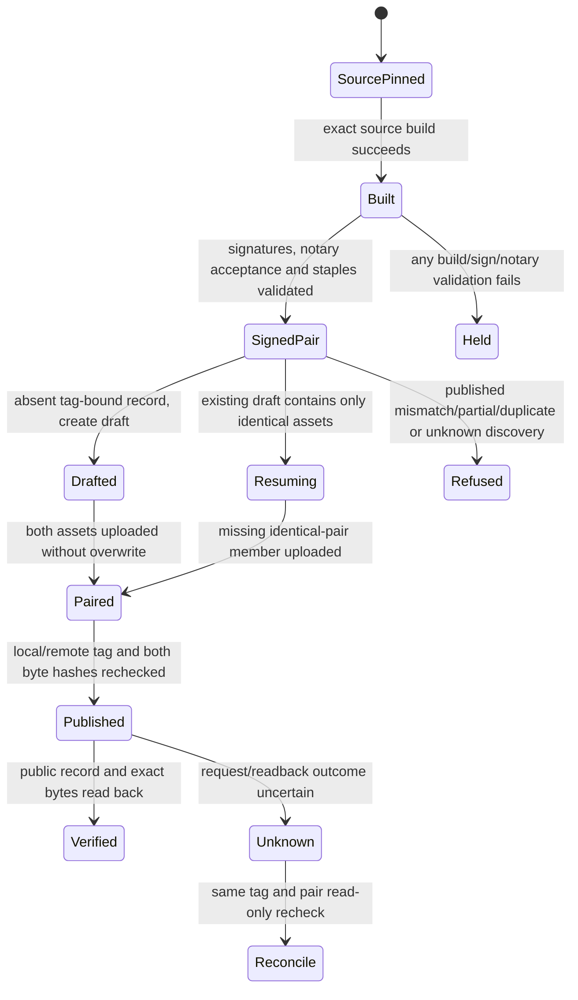
```mermaid
stateDiagram-v2
  [*] --> SourcePinned
  SourcePinned --> Built: exact source build succeeds
  Built --> SignedPair: signatures, notary acceptance and staples validated
  Built --> Held: any build/sign/notary validation fails
  SignedPair --> Drafted: absent tag-bound record, create draft
  SignedPair --> Resuming: existing draft contains only identical assets
  SignedPair --> Refused: published mismatch/partial/duplicate or unknown discovery
  Drafted --> Paired: both assets uploaded without overwrite
  Resuming --> Paired: missing identical-pair member uploaded
  Paired --> Published: local/remote tag and both byte hashes rechecked
  Published --> Verified: public record and exact bytes read back
  Published --> Unknown: request/readback outcome uncertain
  Unknown --> Reconcile: same tag and pair read-only recheck
```

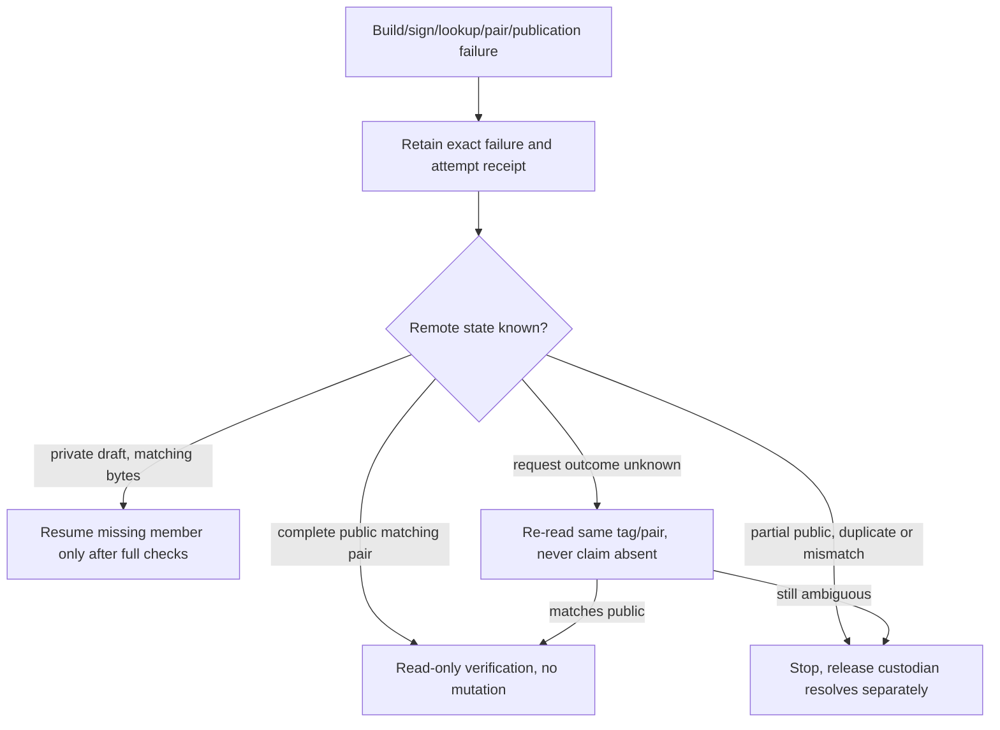
```mermaid
flowchart TD
  BAD[Build/sign/lookup/pair/publication failure] --> RETAIN[Retain exact failure and attempt receipt]
  RETAIN --> STATE{Remote state known?}
  STATE -->|private draft, matching bytes| RESUME[Resume missing member only after full checks]
  STATE -->|complete public matching pair| READONLY[Read-only verification, no mutation]
  STATE -->|partial public, duplicate or mismatch| REFUSE[Stop, release custodian resolves separately]
  STATE -->|request outcome unknown| RECHECK[Re-read same tag/pair, never claim absent]
  RECHECK -->|matches public| READONLY
  RECHECK -->|still ambiguous| REFUSE
```

The existing [RA-P04 release-train diagram](../../diagrams/RA-P04-release-train.md)
is related context only: it depicts the router service release-train script and
Cloud Run ordering, not this PT signed DMG/PKG publication transaction. It is
not used as a substitute for PT-P23. No existing Ma'at diagram in the shared
Stack Lab diagrams directory covers this PT publication process.

Recovery is deliberately non-destructive. A bad release source delta can be
reverted for a future reviewed workflow, but rollback does not delete a draft,
change a tag, replace public bytes or replay signing. See `RELEASE_PUBLICATION.md`.
Inert fake-gh/static contracts are not actual publication evidence.

## PT-P24 — Ma'at release-source observation

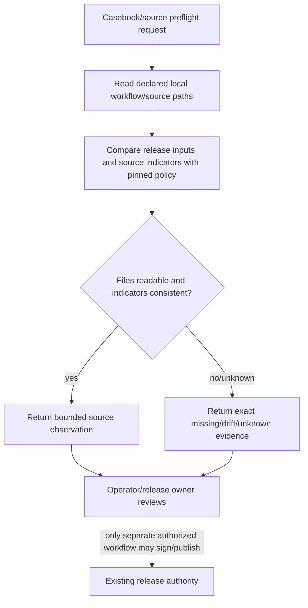
```mermaid
flowchart TD
  A[Casebook/source preflight request] --> READ[Read declared local workflow/source paths]
  READ --> P[Compare release inputs and source indicators with pinned policy]
  P --> D{Files readable and indicators consistent?}
  D -->|yes| OBS[Return bounded source observation]
  D -->|no/unknown| ISSUE[Return exact missing/drift/unknown evidence]
  OBS --> HUMAN[Operator/release owner reviews]
  ISSUE --> HUMAN
  HUMAN -. only separate authorized workflow may sign/publish .-> RELEASE[Existing release authority]
```

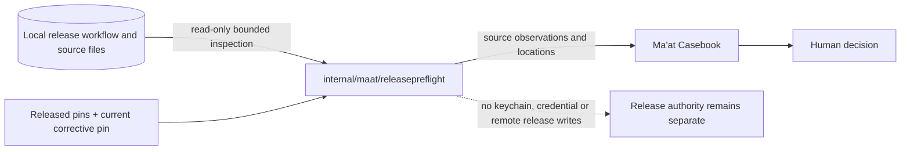
```mermaid
flowchart LR
  FILES[(Local release workflow and source files)] -->|read-only bounded inspection| PREFLIGHT[internal/maat/releasepreflight]
  POLICY[Released pins + current corrective pin] --> PREFLIGHT
  PREFLIGHT -->|source observations and locations| CASEBOOK[Ma'at Casebook]
  CASEBOOK --> USER[Human decision]
  PREFLIGHT -. no keychain, credential or remote release writes .-> AUTH[Release authority remains separate]
```

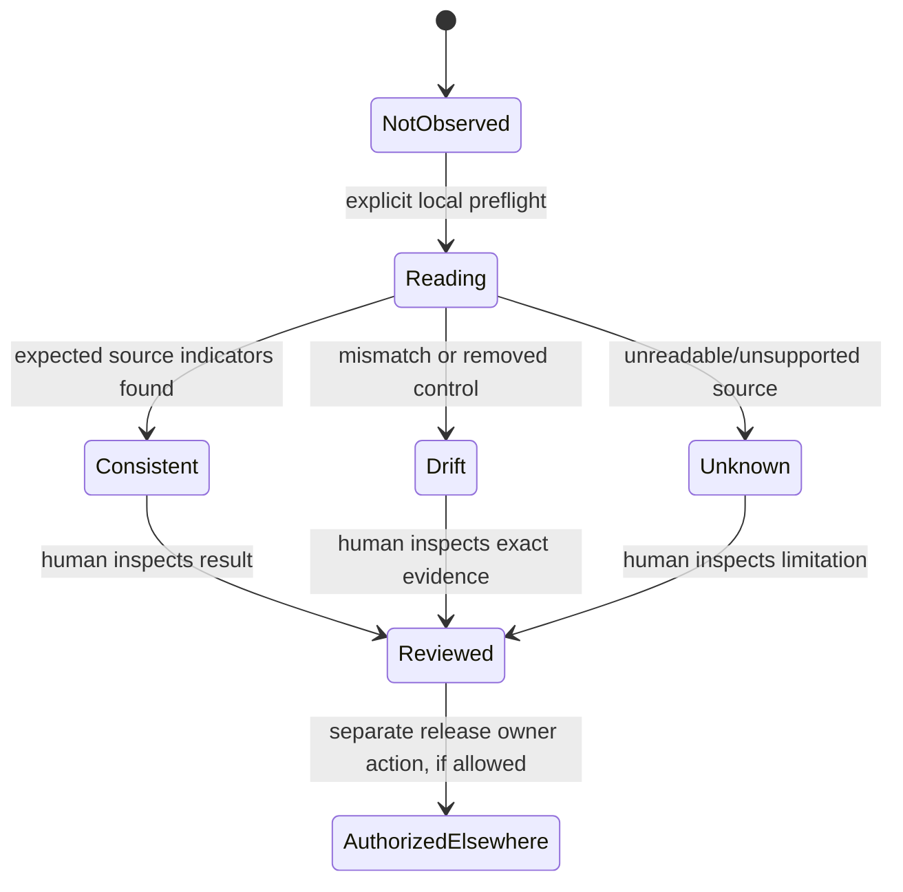
```mermaid
stateDiagram-v2
  [*] --> NotObserved
  NotObserved --> Reading: explicit local preflight
  Reading --> Consistent: expected source indicators found
  Reading --> Drift: mismatch or removed control
  Reading --> Unknown: unreadable/unsupported source
  Consistent --> Reviewed: human inspects result
  Drift --> Reviewed: human inspects exact evidence
  Unknown --> Reviewed: human inspects limitation
  Reviewed --> AuthorizedElsewhere: separate release owner action, if allowed
```

Recovery is to inspect/fix the exact source under its owner and rerun the
read-only observation. This process never diagnoses credentials or grants
release permission. Cataloged source pins/fixtures do not qualify signing.

## PT-P25 — Managed updater and exact-version rollback

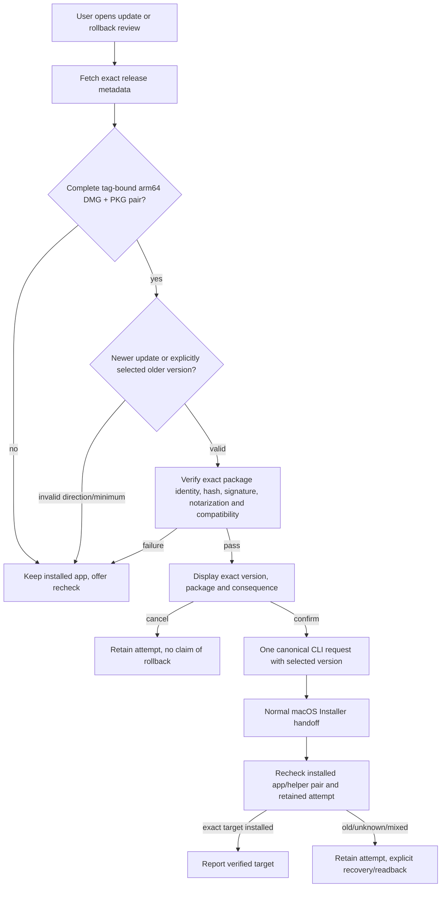
```mermaid
flowchart TD
  U[User opens update or rollback review] --> SEL[Fetch exact release metadata]
  SEL --> PAIR{Complete tag-bound arm64 DMG + PKG pair?}
  PAIR -->|no| REF[Keep installed app, offer recheck]
  PAIR -->|yes| DIR{Newer update or explicitly selected older version?}
  DIR -->|invalid direction/minimum| REF
  DIR -->|valid| CHECK[Verify exact package identity, hash, signature, notarization and compatibility]
  CHECK -->|failure| REF
  CHECK -->|pass| REVIEW[Display exact version, package and consequence]
  REVIEW -->|cancel| CANCEL[Retain attempt, no claim of rollback]
  REVIEW -->|confirm| SUBMIT[One canonical CLI request with selected version]
  SUBMIT --> INSTALL[Normal macOS Installer handoff]
  INSTALL --> READ[Recheck installed app/helper pair and retained attempt]
  READ -->|exact target installed| DONE[Report verified target]
  READ -->|old/unknown/mixed| REC[Retain attempt, explicit recovery/readback]
```

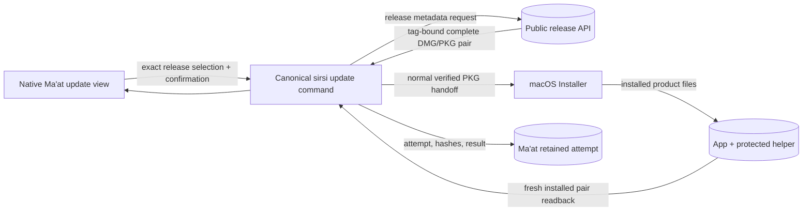
```mermaid
flowchart LR
  UI[Native Ma'at update view] -->|exact release selection + confirmation| CLI[Canonical sirsi update command]
  CLI -->|release metadata request| GH[(Public release API)]
  GH -->|tag-bound complete DMG/PKG pair| CLI
  CLI -->|normal verified PKG handoff| INST[macOS Installer]
  INST -->|installed product files| DISK[(App + protected helper)]
  CLI -->|attempt, hashes, result| CASE[(Ma'at retained attempt)]
  DISK -->|fresh installed pair readback| CLI --> UI
```

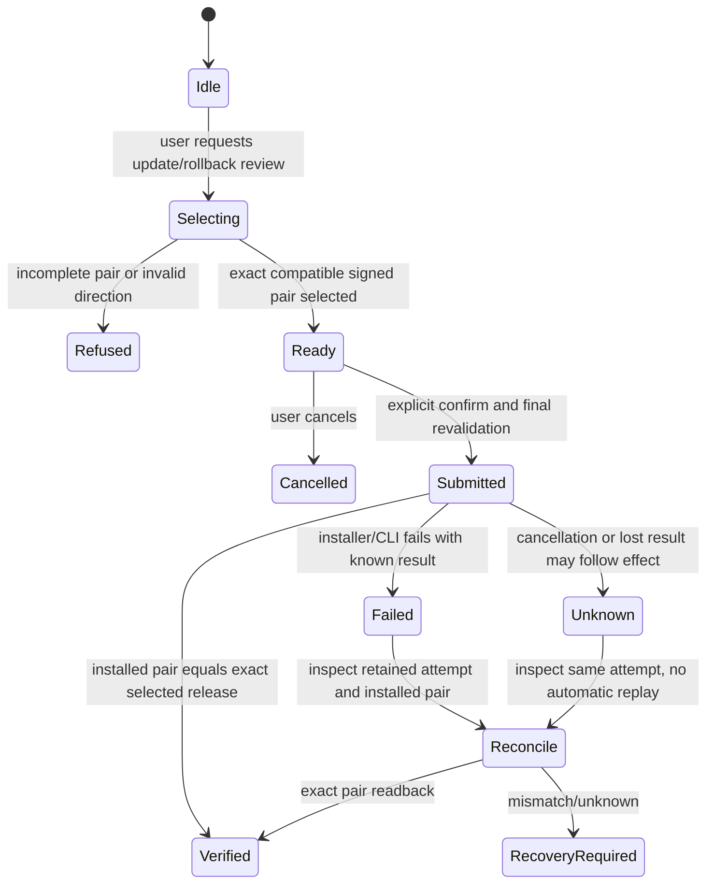
```mermaid
stateDiagram-v2
  [*] --> Idle
  Idle --> Selecting: user requests update/rollback review
  Selecting --> Refused: incomplete pair or invalid direction
  Selecting --> Ready: exact compatible signed pair selected
  Ready --> Cancelled: user cancels
  Ready --> Submitted: explicit confirm and final revalidation
  Submitted --> Verified: installed pair equals exact selected release
  Submitted --> Failed: installer/CLI fails with known result
  Submitted --> Unknown: cancellation or lost result may follow effect
  Failed --> Reconcile: inspect retained attempt and installed pair
  Unknown --> Reconcile: inspect same attempt, no automatic replay
  Reconcile --> Verified: exact pair readback
  Reconcile --> RecoveryRequired: mismatch/unknown
```

Sequence crosses UI, CLI, public release metadata and Installer. Recovery is
readback of the same retained attempt; uncertain install/cancel never proves
rollback. Catalog/changelog record source tests and corrective additions, but
actual signed installed rollback remains OPEN.

## PT-P26 — Install, upgrade, rollback and uninstall lifecycle

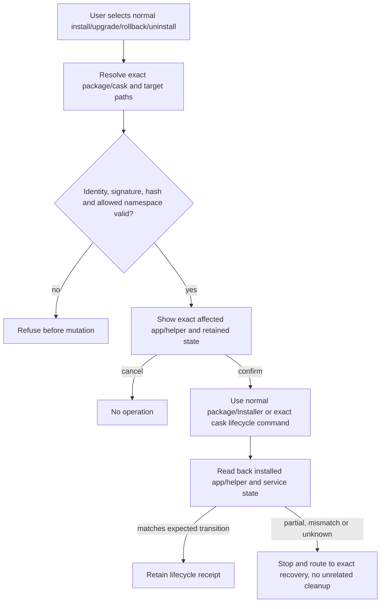
```mermaid
flowchart TD
  U[User selects normal install/upgrade/rollback/uninstall] --> SCOPE[Resolve exact package/cask and target paths]
  SCOPE --> VALID{Identity, signature, hash and allowed namespace valid?}
  VALID -->|no| REF[Refuse before mutation]
  VALID -->|yes| REVIEW[Show exact affected app/helper and retained state]
  REVIEW -->|cancel| STOP[No operation]
  REVIEW -->|confirm| APPLY[Use normal package/Installer or exact cask lifecycle command]
  APPLY --> READ[Read back installed app/helper and service state]
  READ -->|matches expected transition| OK[Retain lifecycle receipt]
  READ -->|partial, mismatch or unknown| REC[Stop and route to exact recovery, no unrelated cleanup]
```

```mermaid
flowchart LR
  USER[Operator confirmation] -->|selected lifecycle action| OWNER[Existing package/updater/cask owner]
  PACKAGE[(Signed DMG/PKG or canonical cask tuple)] --> OWNER
  OWNER -->|authorized system installer or cask action| OS[macOS/Homebrew]
  OS -->|installed app/helper/service state| READBACK[Fresh exact readback]
  READBACK -->|before/after identities + outcome| RECEIPT[(Retained evidence)]
  OWNER -. never broad delete or unrelated-state mutation .-> OTHER[Unselected state]
```

```mermaid
stateDiagram-v2
  [*] --> InstalledOrAbsent
  InstalledOrAbsent --> Reviewed: exact action selected
  Reviewed --> Refused: identity/namespace/package invalid
  Reviewed --> Cancelled: no consent
  Reviewed --> Applying: explicit confirmation
  Applying --> Verified: fresh readback matches requested transition
  Applying --> Partial: known partial transition
  Applying --> Unknown: lost/cancelled result after possible effect
  Partial --> Recovery: exact recovery contract available
  Unknown --> Reconcile: inspect same attempt and current pair
  Recovery --> Verified: recovery readback passes
  Recovery --> Open: no supported rollback/recovery path
```

The catalog's install/upgrade/rollback/uninstall installed-host evidence is
OPEN. This is a map of required lifecycle proof, not a claim every action has
automated rollback. Exact capability varies by selected owner and package.

### Disposable-host commercial lifecycle qualification

This is the bounded source design for the same PT-P26 lifecycle, not another
installer. The proposed `qualify-hosted-commercial-lifecycle` shell/controller,
manual workflow and inert fixture file use an existing GitHub-hosted macOS15
ARM64 executor. They remain unexecuted until exact source review, fixture
qualification and SSA's single supported dispatch. Development Python does not
enter the signed Pantheon payload. Temporary HOME/appdir alone never isolates
canonical bundle-ID quit or launchctl uninstall hooks.

```mermaid
flowchart TD
  SSA[SSA dispatches exact reviewed published workflow once] --> GUARD[Verify actual hosted runner account UID home OS and architecture]
  GUARD --> NS[Read complete cask inventory and exact app CLI bundle label plist namespace]
  NS -->|occupied unreadable or unknown| REFUSE[Refuse before lifecycle mutation and retain evidence]
  NS -->|demonstrated absent| TAP[Record original tap state and introduced-tap intent]
  TAP --> BACKUP[Create-only verified durable original-cask backup]
  BACKUP --> PINS[Fetch exact tap commits and verify both canonical cask blob and SHA identities]
  PINS --> INSTALL[Normal Homebrew install140]
  INSTALL --> VERIFY[Trust and byte identity before actual PATH caller version clean commit check]
  VERIFY --> UPGRADE[Normal Homebrew upgrade141 and same verification]
  UPGRADE --> ROLLBACK[Normal Homebrew reinstall140 and original digest equality]
  ROLLBACK --> CLEAN[Normal uninstall plus exact absence inventory readback]
  INSTALL -->|failure or cancel after owned child joined| CLEAN
  UPGRADE -->|failure or cancel after owned child joined| CLEAN
  ROLLBACK -->|failure or cancel after owned child joined| CLEAN
  CLEAN --> BARRIER{Every owned child joined and recovery safe?}
  BARRIER -->|unknown or unjoined| DEBT[Stop further mutations retain cleanup debt and failed terminal]
  BARRIER -->|known safe| RESTORE[Restore only verified original cask and reconcile introduced tap]
  RESTORE --> END[Retain original exit cleanup exit identities and namespace outcome]
  END -->|missing terminal or forced job teardown| UNKNOWN[Interrupted or unknown never PASS]
```

```mermaid
flowchart LR
  SOURCE[(Exact source script workflow and fixture hashes)] --> JOB[Existing disposable hosted job]
  CASKS[(Published140 and141 tap commit path blob SHA)] --> JOB
  PAYLOAD[(Signed immutable release assets)] --> BREW[Unmodified canonical Homebrew lifecycle]
  JOB --> BREW
  BREW --> APP[Disposable runner app and CLI namespace]
  APP --> TRUST[Apple trust hash link target and actual installed caller readback]
  ORIGINAL[(Original tap cask digest HEAD and worktree)] --> BACKUP[Verified retained backup authority]
  BACKUP --> RECOVERY[Exact safe recovery only after joined-child barrier]
  TRUST --> RECEIPTS[(Per-phase logs identities original and cleanup outcomes)]
  RECOVERY --> RECEIPTS
  RECEIPTS --> SSA[SSA terminal review and Main independent readback]
  LIMIT[No claim of host teardown proof fleet drain or loaded GUI] -. scope .-> SSA
```

```mermaid
stateDiagram-v2
  [*] --> Preflight
  Preflight --> Refused: account platform namespace or exact pin unknown
  Preflight --> Ready: complete safe baseline and verified backup
  Ready --> Applying: exact normal Homebrew phase
  Applying --> Checking: owned child joined
  Checking --> Applying: exact identity matches next selected transition
  Applying --> Joining: cancellation or timeout flag
  Joining --> Recovering: child and owned group joined
  Joining --> Debt: child ownership or join unknown
  Checking --> Recovering: transition failed but child custody known
  Recovering --> Debt: any later child becomes unknown or recovery fails
  Recovering --> Terminal: original state and selected absence read back
  Debt --> Terminal: failed outcome retains explicit debt no more mutations
  Terminal --> Accepted: all original and cleanup results pass and evidence exists
  Terminal --> Failed: original or cleanup result fails
  Terminal --> Unknown: terminal evidence incomplete
```

The controller must register child ownership without an asynchronous throwing
signal gap. Cancellation is observed in the owned wait/join path; recovery cannot
race a possibly live installer or cleanup child. An unknown group is sticky and
stops later restore/untap operations. Inert whole-driver fixtures exercise these
branches without real Brew, launchctl, installed binaries or signals. Actual
hosted lifecycle and cleanup evidence remain C07 work; executor teardown and
fleet-wide behavior are separate claims.

## Additional evidence/custody subflows

Evidence custody is represented above in PT-P05 and PT-P07. The native
review-bound trash operation is not a component-catalog row but is a
source-described PT hygiene workflow linked by PT-REQ-06/PT-US-06 in the index.
It is included separately so its destructive boundary is not hidden inside the
word “hygiene.”

### PT-P28 — Review-bound native Empty Trash

```mermaid
flowchart TD
  U[User opens Trash review] --> B[Bounded browse pages and retained container list]
  B -->|read/access failure| ERR[Show typed failure, never empty result]
  B -->|valid| SEL[Select exact entries/directories]
  SEL --> PLAN[Capture full selected manifest and preflight identities]
  PLAN --> REVIEW[Show count, paths, bytes and skipped/retained entries]
  REVIEW -->|cancel| END[No deletion]
  REVIEW -->|confirm| RECHECK[Fresh authority and full selected manifest revalidation]
  RECHECK -->|drift/unsupported/limit| REF[Refuse, retain evidence]
  RECHECK -->|match| APPLY[Delete only selected leaves / selected empty directories]
  APPLY --> RECEIPT[Return bounded result and deletion prefix]
  RECEIPT -->|partial/failure| KEEP[Preserve receipt and retry only after fresh review]
```

```mermaid
flowchart LR
  TRASH[(User Trash directory)] -->|bounded no-follow browse| BROWSE[Native browse adapter]
  BROWSE -->|entry IDs/metadata/cursor| VIEW[Review UI]
  VIEW -->|confirmed frozen manifest| CLI[Anubis empty-trash apply]
  CLI -->|fresh selected-scope validation| FS[Filesystem]
  FS -->|deleted-prefix + per-item result| CLI -->|typed receipt| VIEW
  VIEW -->|receipt/evidence| LOCAL[(Native operation receipt)]
  VIEW -. unselected siblings untouched .-> TRASH
```

```mermaid
stateDiagram-v2
  [*] --> Browsing
  Browsing --> BrowseFailed: invalid/incomplete envelope
  Browsing --> Selecting: complete page evidence
  Selecting --> Reviewed: exact manifest captured
  Reviewed --> Cancelled: user cancels
  Reviewed --> Refused: bounds or type/owner/device check fails
  Reviewed --> Applying: confirm and fresh preflight match
  Applying --> Succeeded: complete result matches manifest
  Applying --> Partial: prefix plus per-item failures retained
  Applying --> Unknown: malformed/timeout/cancelled response
  Partial --> Reviewed: fresh browse and new selection required
  Unknown --> Reconcile: inspect retained receipt and current Trash
```

Sequence crosses filesystem, canonical CLI, native review and receipt. No
unrestricted `--yes` fallback or recursive deletion is represented. `TRASH_RECEIPT.md`
records the source contract and explicitly leaves native image/installed UX
qualification open.

## Sequence views for evidence and distribution boundaries

### PT-P07 — Proof capture

```mermaid
sequenceDiagram
  participant Caller as trusted final caller
  participant Gate as completionproof gate
  participant File as one regular-file descriptor
  participant Validator as strict-final validator
  Caller->>Gate: invoke with proof path
  Gate->>File: open once and read bounded snapshot
  File-->>Gate: exact snapshot or failure
  Gate->>Validator: pass snapshot once on stdin
  Validator-->>Gate: strict result
  Gate-->>Caller: accept/refuse plus diagnostic
```

### PT-P21 — Package and inventory

```mermaid
sequenceDiagram
  participant Release as release owner
  participant Builder as selected package builder
  participant Root as create-only build root
  participant Inventory as package inventory
  Release->>Builder: exact source and explicit development/commercial mode
  Builder->>Root: create artifact bytes
  Root-->>Inventory: enumerate assets, resources and hashes
  Inventory-->>Release: inventory receipt or mismatch
  Note over Release,Inventory: commercial signing/notary and installed runtime are separate gates
```

### PT-P22 — Cask publish/readback

```mermaid
sequenceDiagram
  participant Custodian
  participant Renderer as canonical Go renderer
  participant Tap as remote tap
  participant Verifier as byte verifier
  Custodian->>Renderer: accepted release version and signed DMG SHA256
  Renderer-->>Custodian: canonical bytes or validation error
  Custodian->>Tap: read existing blob SHA
  Custodian->>Tap: PUT canonical bytes conditioned on that SHA
  Tap-->>Verifier: remote cask readback
  Verifier-->>Custodian: exact match or unresolved mismatch / conditional-write failure
```

### PT-P23 — Paired commercial publication

```mermaid
sequenceDiagram
  participant Workflow as serialized release workflow
  participant Signer as existing enrolled signing client
  participant GitHub as tag/release API
  participant Readback as fresh paired asset download
  Workflow->>GitHub: resolve exact tag and release state
  Workflow->>Signer: sign/notarize existing exact app/DMG/PKG inputs
  Signer-->>Workflow: signatures, tickets and validation reports
  Workflow->>GitHub: create private draft or resume identical draft
  Workflow->>GitHub: upload only missing pair members
  GitHub-->>Readback: download both exact assets
  Readback-->>Workflow: sizes and SHA256 match
  Workflow->>GitHub: publish draft last
  GitHub-->>Workflow: public state and exact-byte readback
  Workflow-->>Workflow: run dependent canonical cask job after success
```

### PT-P24 — Source-only Ma'at observation

```mermaid
sequenceDiagram
  participant User
  participant Casebook as Ma'at Casebook
  participant Preflight as release source observer
  participant Files as local workflow/source files
  User->>Casebook: request source preflight
  Casebook->>Preflight: selected local observation
  Preflight->>Files: read declared source paths and pinned indicators
  Files-->>Preflight: bytes or read error
  Preflight-->>Casebook: bounded findings and unknowns
  Casebook-->>User: evidence for human review
  Note over Preflight,Files: no keychain, credential diagnosis, signing or release mutation
```

### PT-P25 — Managed update and rollback

```mermaid
sequenceDiagram
  participant User
  participant UI as Ma'at update UI
  participant CLI as canonical sirsi command
  participant API as public release API
  participant Installer as normal macOS Installer
  participant Disk as installed app/helper
  User->>UI: request exact update or rollback review
  UI->>CLI: resolve exact release and compatibility
  CLI->>API: read tag-bound complete DMG/PKG pair
  API-->>CLI: release metadata and asset identity
  CLI-->>UI: exact review plan
  User->>UI: confirm selected version
  UI->>CLI: one typed confirmed request
  CLI->>Installer: open verified normal package flow
  Installer->>Disk: apply package
  Disk-->>CLI: fresh app/helper identity readback
  CLI-->>UI: verified target or retained uncertain attempt
  UI-->>User: truthful final state and recovery path
```

### PT-P26 — Lifecycle operation

```mermaid
sequenceDiagram
  participant User
  participant Owner as selected package/updater/cask owner
  participant OS as macOS/Homebrew
  participant Disk as installed product state
  User->>Owner: select exact lifecycle action and confirm
  Owner->>OS: invoke allowed install/upgrade/rollback/uninstall path
  OS->>Disk: apply selected package transition
  Disk-->>OS: operation result
  OS-->>Owner: exit/result
  Owner->>Disk: independently read back app/helper/service state
  Disk-->>Owner: exact current identities and status
  Owner-->>User: receipt or unresolved recovery state
  Note over Owner,Disk: no inferred universal rollback, unrelated state remains out of scope
```

### PT-P28 — Empty Trash

```mermaid
sequenceDiagram
  participant User
  participant UI as native review UI
  participant CLI as Anubis CLI
  participant FS as selected Trash filesystem entries
  User->>UI: browse, select entries and review manifest
  UI->>CLI: request bounded browse/preflight
  CLI->>FS: no-follow metadata reads for selected scope
  FS-->>CLI: identities, metadata and bounded cursor
  CLI-->>UI: complete review evidence or typed failure
  User->>UI: explicitly confirm frozen manifest
  UI->>CLI: apply exact selected manifest
  CLI->>FS: revalidate and delete selected leaves only
  FS-->>CLI: per-item result and deleted prefix
  CLI-->>UI: bounded receipt
```
