# Pantheon PT diagrams — router, worker and maintenance

These are the Pantheon-facing paths. Ra's existing diagrams are reused only
where the same Ra-owned subflow is present; they do not stand in for client,
release or installed-host proof. Source candidate and qualification labels are
as recorded in `COMPONENT_CATALOG.md` and `TRACEABILITY_MATRIX.md`.

## PT-P02 — Optional legacy Gemma resolver

The worker installer may still copy this legacy script. Its flow is separate
from the native bounded Apollo worker. WEDGE blocks both prefetch and probe;
non-WEDGE probe/swap behavior is an existing legacy path.

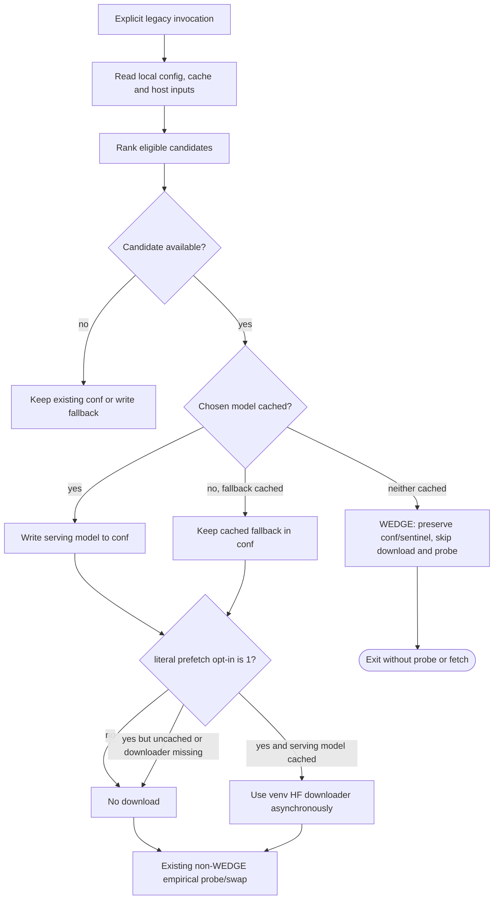
```mermaid
flowchart TD
  A[Explicit legacy invocation] --> B[Read local config, cache and host inputs]
  B --> C[Rank eligible candidates]
  C --> D{Candidate available?}
  D -->|no| E[Keep existing conf or write fallback]
  D -->|yes| F{Chosen model cached?}
  F -->|yes| G[Write serving model to conf]
  F -->|no, fallback cached| H[Keep cached fallback in conf]
  F -->|neither cached| W[WEDGE: preserve conf/sentinel, skip download and probe]
  G --> I{literal prefetch opt-in is 1?}
  H --> I
  I -->|no| J[No download]
  I -->|yes and serving model cached| K[Use venv HF downloader asynchronously]
  I -->|yes but uncached or downloader missing| J
  J --> P[Existing non-WEDGE empirical probe/swap]
  K --> P
  W --> X([Exit without probe or fetch])
```

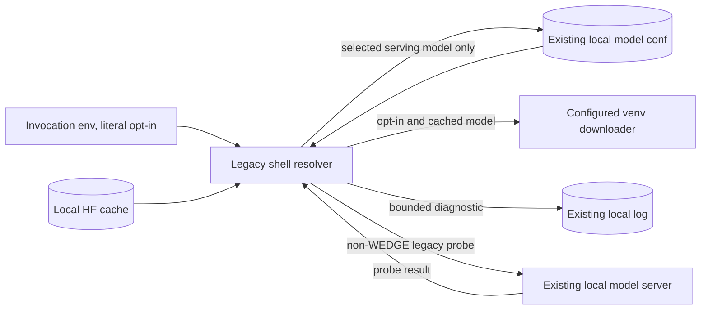
```mermaid
flowchart LR
  ENV[Invocation env, literal opt-in] --> RESOLVER[Legacy shell resolver]
  CONF[(Existing local model conf)] --> RESOLVER
  CACHE[(Local HF cache)] --> RESOLVER
  RESOLVER -->|selected serving model only| CONF
  RESOLVER -->|opt-in and cached model| HF[Configured venv downloader]
  RESOLVER -->|bounded diagnostic| LOG[(Existing local log)]
  RESOLVER -->|non-WEDGE legacy probe| SERVER[Existing local model server]
  SERVER -->|probe result| RESOLVER
```

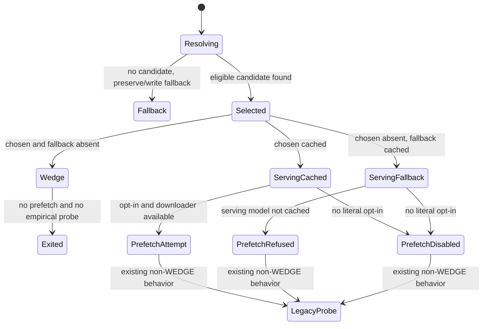
```mermaid
stateDiagram-v2
  [*] --> Resolving
  Resolving --> Fallback: no candidate, preserve/write fallback
  Resolving --> Selected: eligible candidate found
  Selected --> ServingCached: chosen cached
  Selected --> ServingFallback: chosen absent, fallback cached
  Selected --> Wedge: chosen and fallback absent
  Wedge --> Exited: no prefetch and no empirical probe
  ServingCached --> PrefetchDisabled: no literal opt-in
  ServingFallback --> PrefetchDisabled: no literal opt-in
  ServingCached --> PrefetchAttempt: opt-in and downloader available
  ServingFallback --> PrefetchRefused: serving model not cached
  PrefetchAttempt --> LegacyProbe: existing non-WEDGE behavior
  PrefetchRefused --> LegacyProbe: existing non-WEDGE behavior
  PrefetchDisabled --> LegacyProbe: existing non-WEDGE behavior
```

Recovery: preserve configuration and return; the script does not invent a
weight restore when WEDGE is detected. A missing downloader is a warning. The
existing related Ra process is [RA-P02 known-failure registration](../../diagrams/RA-P02-known-failure-loop.md);
that diagram covers recognition/catalog promotion only. The resolver's own
source fixture and remaining qualification are recorded in the catalog.

## PT-P03 — Selected legacy router MCP migration

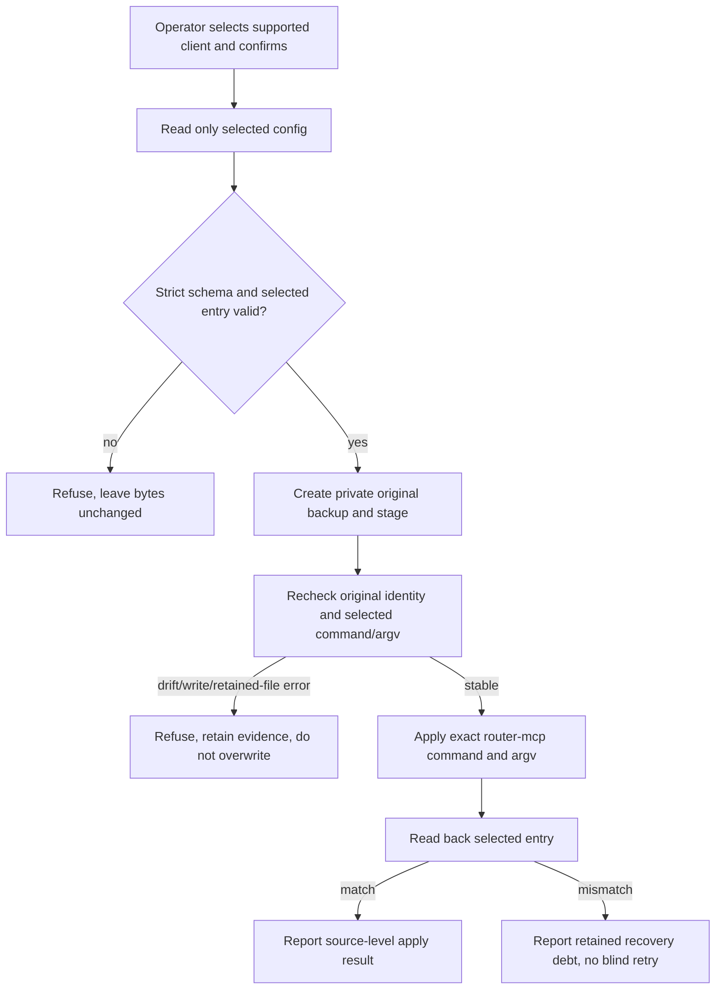
```mermaid
flowchart TD
  U[Operator selects supported client and confirms] --> R[Read only selected config]
  R --> V{Strict schema and selected entry valid?}
  V -->|no| X[Refuse, leave bytes unchanged]
  V -->|yes| B[Create private original backup and stage]
  B --> C[Recheck original identity and selected command/argv]
  C -->|drift/write/retained-file error| Y[Refuse, retain evidence, do not overwrite]
  C -->|stable| W[Apply exact router-mcp command and argv]
  W --> Q[Read back selected entry]
  Q -->|match| OK[Report source-level apply result]
  Q -->|mismatch| DEBT[Report retained recovery debt, no blind retry]
```

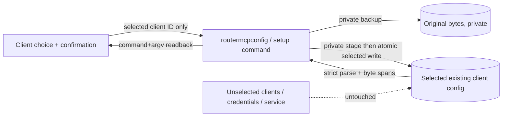
```mermaid
flowchart LR
  USER[Client choice + confirmation] -->|selected client ID only| SETUP[routermcpconfig / setup command]
  CFG[(Selected existing client config)] -->|strict parse + byte spans| SETUP
  SETUP -->|private backup| BACKUP[(Original bytes, private)]
  SETUP -->|private stage then atomic selected write| CFG
  SETUP -->|command+argv readback| USER
  OTHER[Unselected clients / credentials / service] -. untouched .-> CFG
```

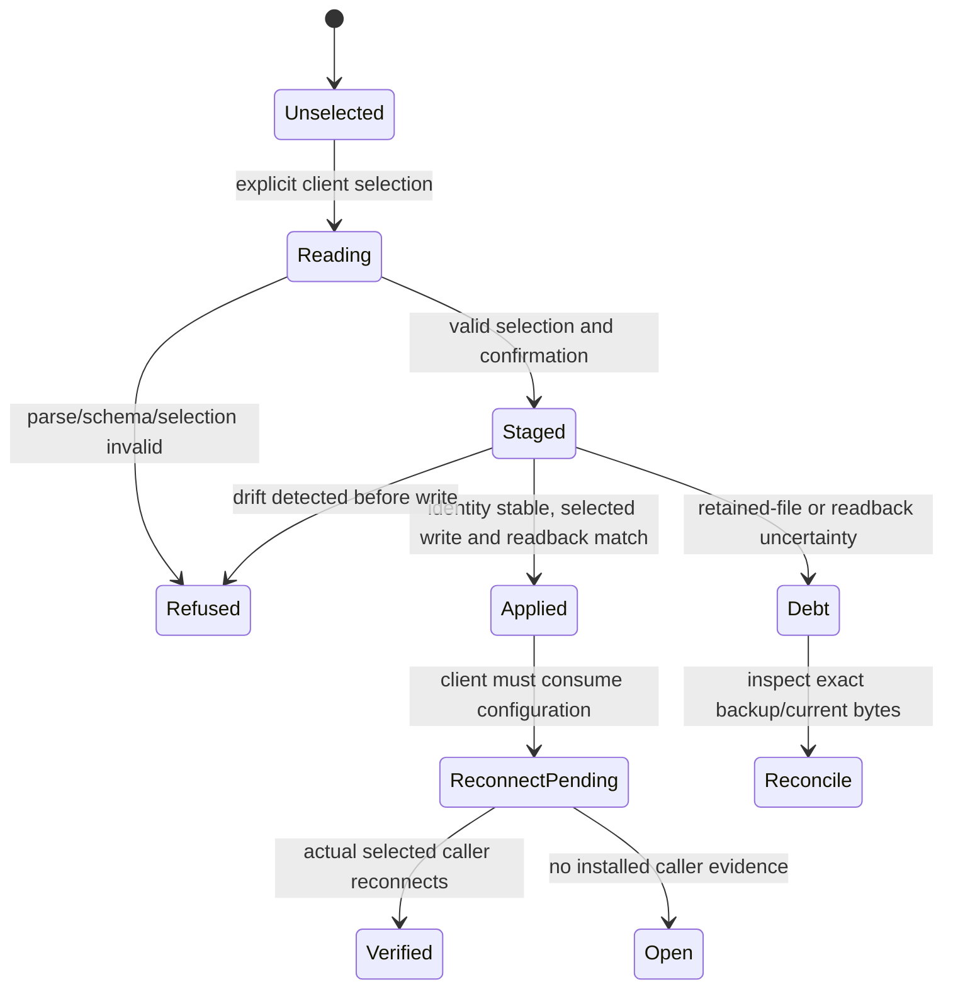
```mermaid
stateDiagram-v2
  [*] --> Unselected
  Unselected --> Reading: explicit client selection
  Reading --> Refused: parse/schema/selection invalid
  Reading --> Staged: valid selection and confirmation
  Staged --> Applied: identity stable, selected write and readback match
  Staged --> Debt: retained-file or readback uncertainty
  Staged --> Refused: drift detected before write
  Applied --> ReconnectPending: client must consume configuration
  ReconnectPending --> Verified: actual selected caller reconnects
  ReconnectPending --> Open: no installed caller evidence
  Debt --> Reconcile: inspect exact backup/current bytes
```

Sequence: operator → setup command → selected client file → backup/stage →
readback → operator. Actual client consumption, signed distribution and
reconnect/caller evidence remain OPEN.

## PT-P04 — Router A2A MCP shared core

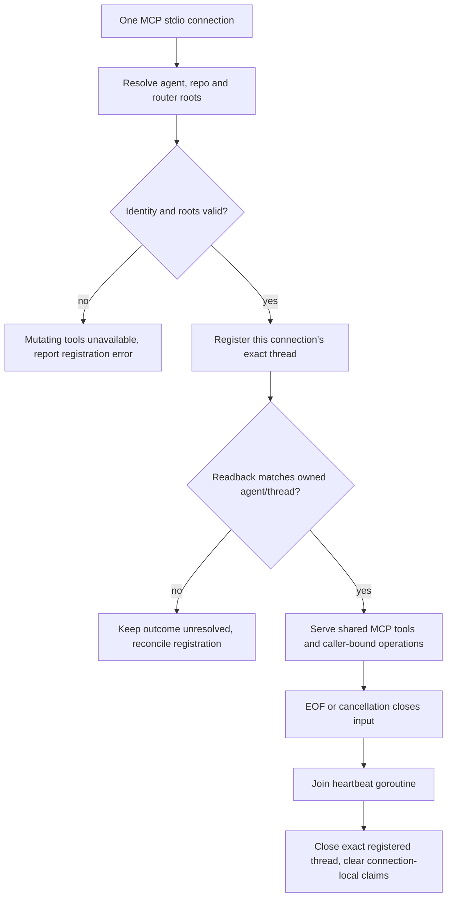
```mermaid
flowchart TD
  A[One MCP stdio connection] --> I[Resolve agent, repo and router roots]
  I --> V{Identity and roots valid?}
  V -->|no| REF[Mutating tools unavailable, report registration error]
  V -->|yes| REG[Register this connection's exact thread]
  REG --> R{Readback matches owned agent/thread?}
  R -->|no| REC[Keep outcome unresolved, reconcile registration]
  R -->|yes| TOOLS[Serve shared MCP tools and caller-bound operations]
  TOOLS --> END[EOF or cancellation closes input]
  END --> JOIN[Join heartbeat goroutine]
  JOIN --> CLOSE[Close exact registered thread, clear connection-local claims]
```

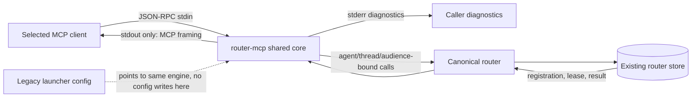
```mermaid
flowchart LR
  CLIENT[Selected MCP client] -->|JSON-RPC stdin| SERVER[router-mcp shared core]
  SERVER -->|stdout only: MCP framing| CLIENT
  SERVER -->|stderr diagnostics| LOG[Caller diagnostics]
  SERVER -->|agent/thread/audience-bound calls| ROUTER[Canonical router]
  ROUTER --> DB[(Existing router store)]
  DB -->|registration, lease, result| ROUTER --> SERVER
  CFG[Legacy launcher config] -. points to same engine, no config writes here .-> SERVER
```

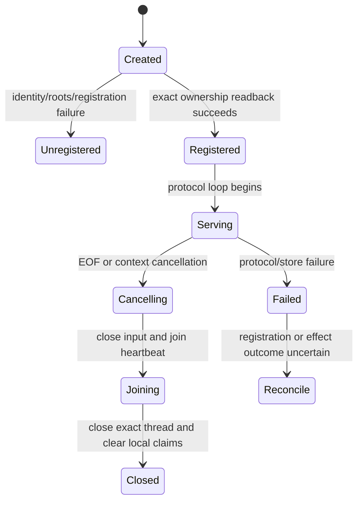
```mermaid
stateDiagram-v2
  [*] --> Created
  Created --> Unregistered: identity/roots/registration failure
  Created --> Registered: exact ownership readback succeeds
  Registered --> Serving: protocol loop begins
  Serving --> Cancelling: EOF or context cancellation
  Cancelling --> Joining: close input and join heartbeat
  Joining --> Closed: close exact thread and clear local claims
  Serving --> Failed: protocol/store failure
  Failed --> Reconcile: registration or effect outcome uncertain
```

Recovery: reconnect creates a new connection and registration. In-flight
synchronous calls are bounded by existing store behavior; cancellation is not
an atomic abort. Catalogued fixtures are not execution or installed-caller
proof.

## PT-P05 — Own-task preserved evidence relocation

The offline planner reads and hashes files that the caller has already
preserved. It checks a bounded map and stable no-follow file identity; it does
not move or create evidence files. An admitted server apply transactionally
updates only the exact task evidence references and provenance. The server
cannot independently inspect the caller's filesystem or verify the file bytes.

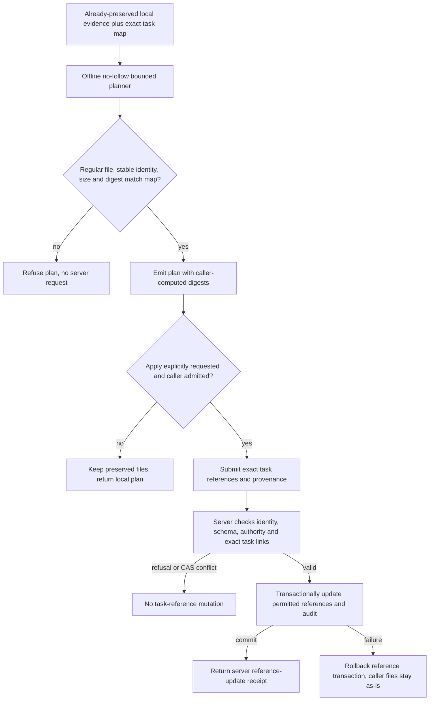
```mermaid
flowchart TD
  A[Already-preserved local evidence plus exact task map] --> B[Offline no-follow bounded planner]
  B --> C{Regular file, stable identity, size and digest match map?}
  C -->|no| X[Refuse plan, no server request]
  C -->|yes| P[Emit plan with caller-computed digests]
  P --> D{Apply explicitly requested and caller admitted?}
  D -->|no| OUT[Keep preserved files, return local plan]
  D -->|yes| E[Submit exact task references and provenance]
  E --> F[Server checks identity, schema, authority and exact task links]
  F -->|refusal or CAS conflict| STOP[No task-reference mutation]
  F -->|valid| TX[Transactionally update permitted references and audit]
  TX -->|commit| R[Return server reference-update receipt]
  TX -->|failure| RB[Rollback reference transaction, caller files stay as-is]
```

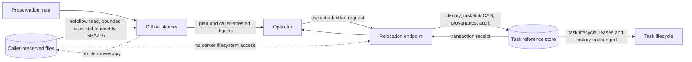
```mermaid
flowchart LR
  FILES[(Caller-preserved files)] -->|nofollow read, bounded size, stable identity, SHA256| PLAN[Offline planner]
  MAP[Preservation map] --> PLAN
  PLAN -->|plan and caller-attested digests| OP[Operator]
  OP -->|explicit admitted request| API[Relocation endpoint]
  API -->|identity, task-link CAS, provenance, audit| DB[(Task reference store)]
  DB -->|transaction receipt| API --> OP
  FILES -. no server filesystem access .-> API
  PLAN -. no file move/copy .-> FILES
  DB -. task lifecycle, leases and history unchanged .-> LEDGER[Task lifecycle]
```

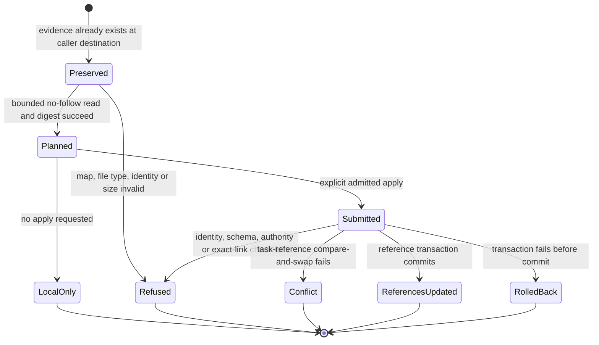
```mermaid
stateDiagram-v2
  [*] --> Preserved: evidence already exists at caller destination
  Preserved --> Planned: bounded no-follow read and digest succeed
  Preserved --> Refused: map, file type, identity or size invalid
  Planned --> LocalOnly: no apply requested
  Planned --> Submitted: explicit admitted apply
  Submitted --> Refused: identity, schema, authority or exact-link check fails
  Submitted --> Conflict: task-reference compare-and-swap fails
  Submitted --> ReferencesUpdated: reference transaction commits
  Submitted --> RolledBack: transaction fails before commit
  LocalOnly --> [*]
  Refused --> [*]
  Conflict --> [*]
  ReferencesUpdated --> [*]
  RolledBack --> [*]
```

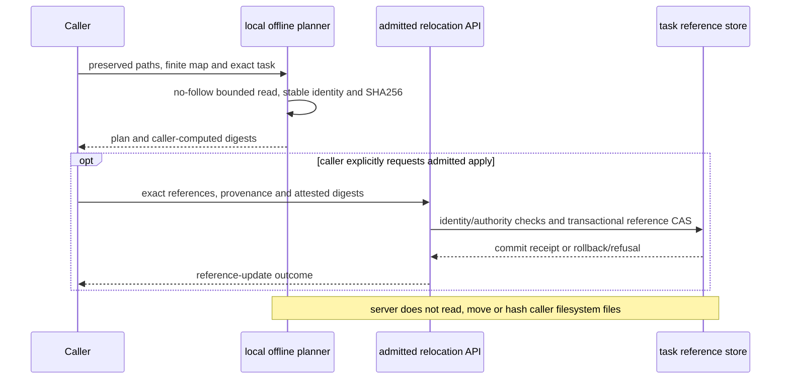
```mermaid
sequenceDiagram
  participant Caller
  participant Planner as local offline planner
  participant API as admitted relocation API
  participant Store as task reference store
  Caller->>Planner: preserved paths, finite map and exact task
  Planner->>Planner: no-follow bounded read, stable identity and SHA256
  Planner-->>Caller: plan and caller-computed digests
  opt caller explicitly requests admitted apply
    Caller->>API: exact references, provenance and attested digests
    API->>Store: identity/authority checks and transactional reference CAS
    Store-->>API: commit receipt or rollback/refusal
    API-->>Caller: reference-update outcome
  end
  Note over Planner,Store: server does not read, move or hash caller filesystem files
```

Recovery retries only the exact reference transaction after re-reading current
task state; uncertain outcomes are reconciled from the task store. Caller files
remain untouched throughout. Source tests named `TestTaskEvidence*` include
offline no-follow/map/hash fixtures, but do not establish a server-side artifact
integrity check or qualification of an external apply.

## PT-P06 — Horus selected configuration refresh

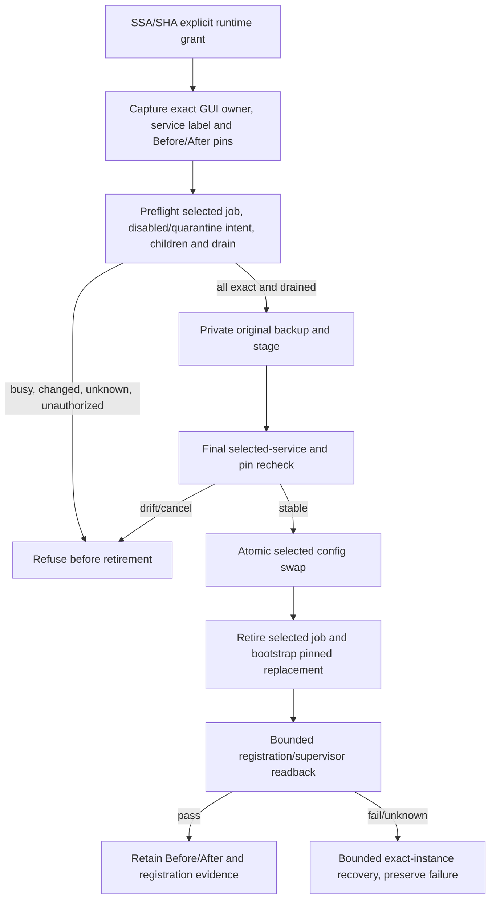
```mermaid
flowchart TD
  U[SSA/SHA explicit runtime grant] --> PIN[Capture exact GUI owner, service label and Before/After pins]
  PIN --> PREF[Preflight selected job, disabled/quarantine intent, children and drain]
  PREF -->|busy, changed, unknown, unauthorized| STOP[Refuse before retirement]
  PREF -->|all exact and drained| BACK[Private original backup and stage]
  BACK --> AGAIN[Final selected-service and pin recheck]
  AGAIN -->|drift/cancel| STOP
  AGAIN -->|stable| SWAP[Atomic selected config swap]
  SWAP --> BOOT[Retire selected job and bootstrap pinned replacement]
  BOOT --> READ[Bounded registration/supervisor readback]
  READ -->|pass| DONE[Retain Before/After and registration evidence]
  READ -->|fail/unknown| REC[Bounded exact-instance recovery, preserve failure]
```

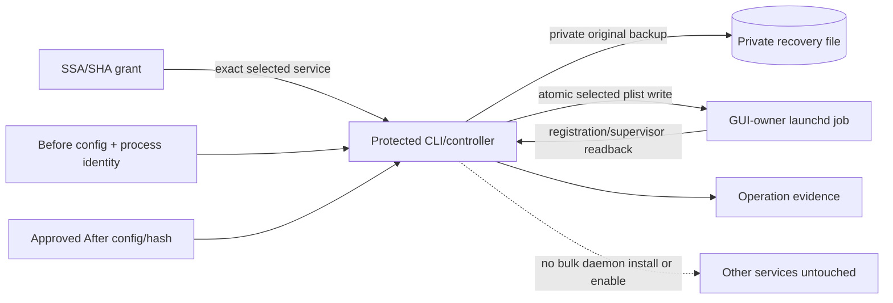
```mermaid
flowchart LR
  GRANT[SSA/SHA grant] -->|exact selected service| CLI[Protected CLI/controller]
  BEFORE[Before config + process identity] --> CLI
  AFTER[Approved After config/hash] --> CLI
  CLI -->|private original backup| BK[(Private recovery file)]
  CLI -->|atomic selected plist write| JOB[GUI-owner launchd job]
  JOB -->|registration/supervisor readback| CLI --> RECEIPT[Operation evidence]
  CLI -. no bulk daemon install or enable .-> OTHER[Other services untouched]
```

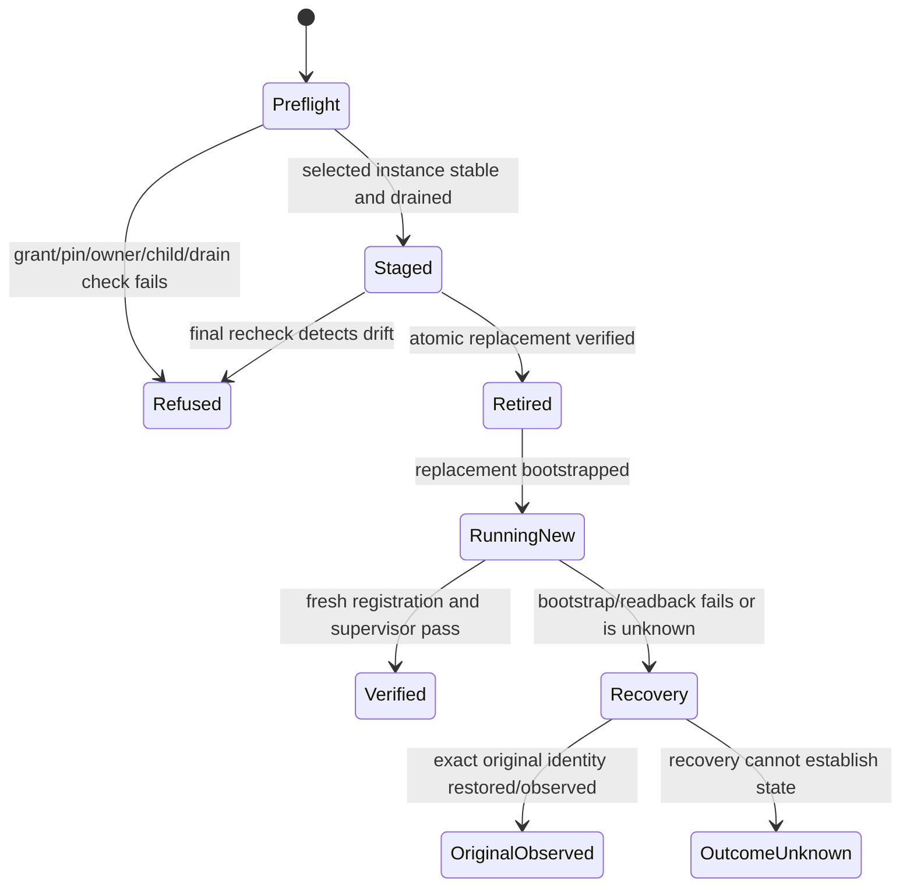
```mermaid
stateDiagram-v2
  [*] --> Preflight
  Preflight --> Refused: grant/pin/owner/child/drain check fails
  Preflight --> Staged: selected instance stable and drained
  Staged --> Refused: final recheck detects drift
  Staged --> Retired: atomic replacement verified
  Retired --> RunningNew: replacement bootstrapped
  RunningNew --> Verified: fresh registration and supervisor pass
  RunningNew --> Recovery: bootstrap/readback fails or is unknown
  Recovery --> OriginalObserved: exact original identity restored/observed
  Recovery --> OutcomeUnknown: recovery cannot establish state
```

Sequence crosses operator grant, protected CLI, launchd and readback. Recovery
uses only the selected service; absence of process output is not proof that a
job is absent. `HORUS_SELECTED_REFRESH.md` and the catalog identify installed
receipts still OPEN.

## PT-P08 — Root relay loaded-client refresh

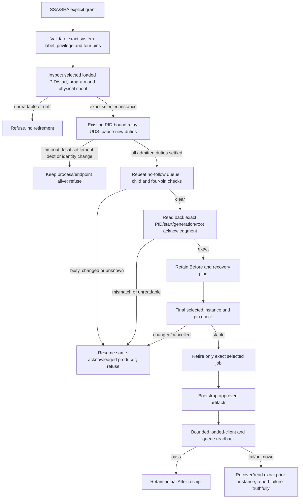
```mermaid
flowchart TD
  U[SSA/SHA explicit grant] --> A[Validate exact system label, privilege and four pins]
  A --> P[Inspect selected loaded PID/start, program and physical spool]
  P -->|unreadable or drift| STOP[Refuse, no retirement]
  P -->|exact selected instance| C[Existing PID-bound relay UDS: pause new duties]
  C -->|timeout, local settlement debt or identity change| LIVE[Keep process/endpoint alive; refuse]
  C -->|all admitted duties settled| Q[Repeat no-follow queue, child and four-pin checks]
  Q -->|busy, changed or unknown| RESUME[Resume same acknowledged producer; refuse]
  Q -->|clear| ACK[Read back exact PID/start/generation/root acknowledgment]
  ACK -->|mismatch or unreadable| RESUME
  ACK -->|exact| B[Retain Before and recovery plan]
  B --> R[Final selected instance and pin check]
  R -->|changed/cancelled| RESUME
  R -->|stable| RET[Retire only exact selected job]
  RET --> NEW[Bootstrap approved artifacts]
  NEW --> CHECK[Bounded loaded-client and queue readback]
  CHECK -->|pass| OK[Retain actual After receipt]
  CHECK -->|fail/unknown| REC[Recover/read exact prior instance, report failure truthfully]
```

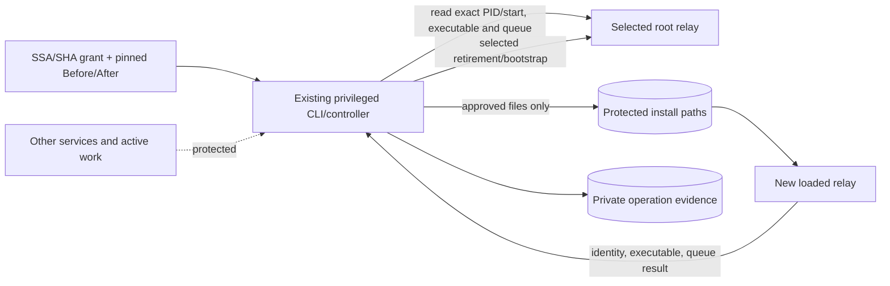
```mermaid
flowchart LR
  GRANT[SSA/SHA grant + pinned Before/After] --> CLI[Existing privileged CLI/controller]
  CLI -->|read exact PID/start, executable and queue| OLD[Selected root relay]
  CLI -->|selected retirement/bootstrap| OLD
  CLI -->|approved files only| DISK[(Protected install paths)]
  DISK --> NEW[New loaded relay]
  NEW -->|identity, executable, queue result| CLI --> EV[(Private operation evidence)]
  FOREIGN[Other services and active work] -. protected .-> CLI
```

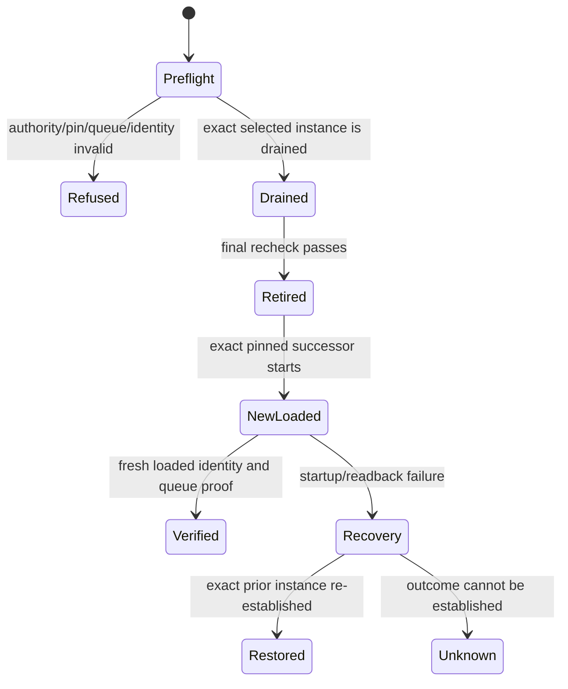
```mermaid
stateDiagram-v2
  [*] --> Preflight
  Preflight --> Refused: authority/pin/queue/identity invalid
  Preflight --> Drained: exact selected instance is drained
  Drained --> Retired: final recheck passes
  Retired --> NewLoaded: exact pinned successor starts
  NewLoaded --> Verified: fresh loaded identity and queue proof
  NewLoaded --> Recovery: startup/readback failure
  Recovery --> Restored: exact prior instance re-established
  Recovery --> Unknown: outcome cannot be established
```

Recovery is bounded and reports the original failure even if restoration works.
No actual loaded-client or rollback receipt is claimed here; see
`ROOT_RELAY_REFRESH.md` and traceability.

The endpoint is the existing relay maintenance UDS, bound to its current
kernel PID/start and spool-root inode. It is activated by ordinary successor
startup; it is not present in the old 0.24.147 process used by the one-time
legacy transition. Unknown historical outcomes remain separate and are never
replayed or certified by an empty queue sample. `Serve` retains its unbounded
join; the lifecycle caller uses the endpoint's bounded admitted-duty control.

## PT-P09 — Legacy root relay maintenance fallback

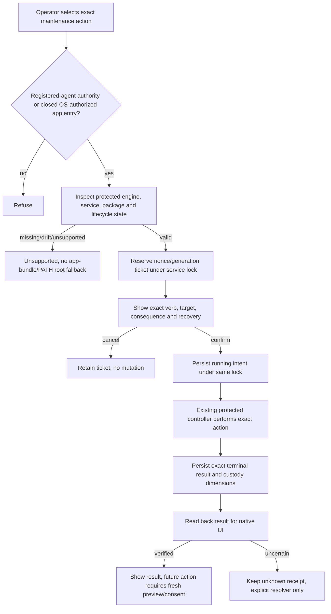
```mermaid
flowchart TD
  U[Operator selects exact maintenance action] --> AUTH{Registered-agent authority or closed OS-authorized app entry?}
  AUTH -->|no| REF[Refuse]
  AUTH -->|yes| PRE[Inspect protected engine, service, package and lifecycle state]
  PRE -->|missing/drift/unsupported| STOP[Unsupported, no app-bundle/PATH root fallback]
  PRE -->|valid| RES[Reserve nonce/generation ticket under service lock]
  RES --> PREVIEW[Show exact verb, target, consequence and recovery]
  PREVIEW -->|cancel| CANCEL[Retain ticket, no mutation]
  PREVIEW -->|confirm| RUN[Persist running intent under same lock]
  RUN --> EFFECT[Existing protected controller performs exact action]
  EFFECT --> RESULT[Persist exact terminal result and custody dimensions]
  RESULT --> READ[Read back result for native UI]
  READ -->|verified| DONE[Show result, future action requires fresh preview/consent]
  READ -->|uncertain| UNKNOWN[Keep unknown receipt, explicit resolver only]
```

```mermaid
flowchart LR
  APP[Unprivileged native app] -->|closed request, captured consent| BRIDGE[One-shot protected bridge]
  AGENT[Registered CLI caller] -->|existing authority| ENGINE[Protected installed engine]
  BRIDGE --> ENGINE
  ENGINE -->|ticket/nonce/generation + intent| JOURNAL[(Existing maintenance journal/state)]
  ENGINE -->|lock-held exact operation| SERVICE[Selected legacy root relay]
  SERVICE -->|result| ENGINE -->|receipt| JOURNAL
  ENGINE -->|bounded public result| APP
  APP -->|exact public binding| PREF[(Native local preference)]
```

```mermaid
stateDiagram-v2
  [*] --> Unrequested
  Unrequested --> Reserved: exact preview admitted
  Reserved --> Running: exact ticket + fresh consent
  Reserved --> Fenced: explicit check-result fence wins lock
  Running --> Succeeded: terminal result durably recorded
  Running --> Failed: terminal failure recorded
  Running --> Unknown: cancellation/lost reply after effect may start
  Unknown --> Resolving: inspect matching ticket/result
  Resolving --> Fenced: durable exact fence, no replay
  Resolving --> RetryDebt: corrupt/busy/unverified persistence
  Succeeded --> NewPreview: fresh request only
  Failed --> NewPreview: fresh request only
  Fenced --> NewPreview: lifecycle debt clear and new consent
```

Sequence crosses native app/CLI, protected engine, journal, OS authorization
and service. Recovery resolves the exact ticket; empty status alone never
clears an unknown result or authorizes replay. `LEGACY_RELAY_APP_OPERATION_FENCE.md`
explicitly says native image/installed recovery is OPEN and the source successor
is not installed evidence.

## PT-P10 — Shared host-pressure gate

```mermaid
flowchart TD
  D[Dispatch asks host pressure] --> C{Fresh v2 cache record?}
  C -->|yes| VAL[Validate age, type and known/unknown bit]
  C -->|no| LOCK[Acquire persistent flock within bound]
  LOCK -->|busy/error| UNKNOWN[Return unknown, do not duplicate probe]
  LOCK -->|acquired| C2{Another reader published fresh record?}
  C2 -->|yes| VAL
  C2 -->|no| PROBE[Bound aggregate native probe, fallback sysctl if needed]
  PROBE -->|valid| WRITE[Atomically publish v2 record]
  PROBE -->|invalid/unavailable| WU[Publish unknown when possible]
  WRITE --> VAL
  WU --> UNKNOWN
  VAL --> G{Known and threshold says saturated?}
  G -->|yes| DEFER[Defer new dispatch]
  G -->|no or unknown by policy| ADMIT[Return policy result to caller]
```

```mermaid
flowchart LR
  LOOP[Dispatch consumers] -->|read aggregate pressure| CACHE[(~/.sirsi/host-pressure-v2.cache)]
  LOOP -->|persistent inode lock| LOCK[(host-pressure cache.lock)]
  PROBE[iostat aggregate, sysctl fallback] -->|CPU observation or unknown| CACHE
  CACHE -->|timestamp, known flag, value| LOOP
  LOOP -->|admit/defer only| QUEUE[(No message/task authority in gate)]
```

```mermaid
stateDiagram-v2
  [*] --> CacheCheck
  CacheCheck --> KnownFresh: fresh valid observation
  CacheCheck --> LockWait: absent/stale/invalid
  LockWait --> Unknown: lock timeout/error
  LockWait --> Probe: lock acquired
  Probe --> KnownFresh: valid aggregate observation
  Probe --> Unknown: probe invalid/unavailable
  KnownFresh --> Deferred: saturation threshold met
  KnownFresh --> Admitted: threshold not met
  Unknown --> PolicyResult: apply explicit unknown policy
  PolicyResult --> Admitted: documented policy permits
  PolicyResult --> Deferred: documented policy holds
```

Recovery: stale/unknown causes bounded re-observation on a later request; never
remove the shared lock inode. A persistent-cache write failure removes the
one-probe-per-TTL guarantee but does not invent pressure. M1 sampling and loaded
consumer continuity remain OPEN per catalog.

## PT-P27 — Bounded worker lifecycle

```mermaid
flowchart TD
  D[Router dispatch nominates exact item] --> DECL[Read lead-owned answer-role declaration]
  DECL -->|absent/false| REF[Refuse before claim]
  DECL -->|present| REG[Register worker thread with stamped role]
  REG --> READ[Read back exact agent/thread/role]
  READ -->|mismatch| REF
  READ -->|match| CLAIM[Claim only nominated item]
  CLAIM -->|eligibility/lease refusal| HOLD[No fallback to another item]
  CLAIM -->|fenced lease| TOOL[One bounded observe-tier tool offer]
  TOOL --> RESULT[Typed read-only result]
  RESULT --> ANSWER[One answer retaining factual evidence]
  ANSWER --> CHECK[Router verifies live lease and stamped role]
  CHECK -->|accepted| DONE[Draft/reply and fenced completion]
  CHECK -->|denied| OPEN[Retain retryable unresolved evidence]
```

```mermaid
flowchart LR
  LEAD[Lead declaration] -->|role stamp| REG[(Router thread registry)]
  ITEM[(Nominated queue item)] -->|exact ID| CLAIM[ClaimItem / lease store]
  WORKER[Worker] --> CLAIM
  CLAIM -->|lease token, item context| WORKER
  WORKER -->|one tool request| TOOL[Declared provider tool]
  TOOL -->|typed read-only result| WORKER
  WORKER -->|answer + evidence + lease identity| ROUTER[Router completion verifier]
  ROUTER -->|accepted/rejected result| ITEM
```

```mermaid
stateDiagram-v2
  [*] --> Undeclared
  Undeclared --> Refused: no lead-owned answer role
  Undeclared --> Registered: declaration present
  Registered --> Verified: exact role readback
  Registered --> Refused: registration mismatch
  Verified --> Claimed: exact nominated item lease
  Verified --> Refused: item unavailable or gate denies
  Claimed --> Offered: one bounded tool offer
  Offered --> Answered: typed result returned
  Offered --> Retryable: tool/transport failure
  Answered --> Completed: router verifies live lease and role
  Answered --> Retryable: router rejects completion
  Retryable --> Verified: explicit fresh dispatch, no fallback claim
```

The exact worker path reuses [APOLLO-P01](../../diagrams/APOLLO-P01-exact-item-worker.md)
for its one nominated item and answer-role gate. Related Ra paths are
[RA-P01 wake loop](../../diagrams/RA-P01-wake-loop.md) for inbox wake,
[RA-P03 origin-pinned registry](../../diagrams/RA-P03-registry-pin.md) for
registry source, and [RA-P05 review and bind](../../diagrams/RA-P05-review-and-bind.md)
for review authority. They are complementary flows, not substitutes for
Pantheon's selected-caller or runtime evidence.

## Sequence views for multi-actor processes

### PT-P02 — Legacy resolver and local serving path

```mermaid
sequenceDiagram
  participant Scheduler as legacy invocation
  participant Resolver as shell resolver
  participant Files as local conf/cache/log
  participant Server as existing local server
  participant HF as optional venv downloader
  Scheduler->>Resolver: invoke with local environment
  Resolver->>Files: read cache/config, write selected conf/log
  alt WEDGE
    Resolver-->>Scheduler: exit without fetch or probe
  else non-WEDGE
    opt literal opt-in and serving model cached
      Resolver->>HF: background prefetch
    end
    Resolver->>Server: existing serving-model probe
    Server-->>Resolver: probe result or unreachable
    Resolver->>Files: existing legacy swap/diagnostic behavior
    Resolver-->>Scheduler: completion
  end
```

### PT-P03 — Selected MCP config migration

```mermaid
sequenceDiagram
  participant User
  participant Setup as setup command
  participant Config as selected client config
  participant Client as selected MCP client
  User->>Setup: select client and confirm
  Setup->>Config: read/strictly parse selected entry
  Setup->>Config: retain private backup and stage exact argv change
  Setup->>Config: recheck identity, apply, read back
  Setup-->>User: source-level result and remaining reconnect requirement
  Note over Client: client consumption/reconnect is separate and remains OPEN
```

### PT-P04 — MCP shared core lifecycle

```mermaid
sequenceDiagram
  participant Client as selected MCP client
  participant Server as shared router-mcp core
  participant Router as canonical router/store
  Client->>Server: open stdio JSON-RPC connection
  Server->>Router: register exact agent/thread/surface
  Router-->>Server: registration readback
  loop while connection is active
    Server->>Router: heartbeat and authorized tool operation
    Router-->>Server: result/lease outcome
    Server-->>Client: MCP response on stdout
  end
  Client-->>Server: EOF or cancellation
  Server->>Server: close input and join heartbeat
  Server->>Router: close exact registered thread
```

### PT-P05 — Evidence plan and reference update

```mermaid
sequenceDiagram
  participant Caller
  participant Planner as local offline planner
  participant API as admitted relocation API
  participant Store as task reference store
  Caller->>Planner: already-preserved files, finite map and exact task
  Planner->>Planner: no-follow bounded read, stable identity and SHA256
  Planner-->>Caller: local plan and caller-computed digests
  opt explicit admitted apply
    Caller->>API: exact task references and attested provenance
    API->>Store: validate authority and transactionally CAS references
    Store-->>API: commit receipt or refusal/rollback
    API-->>Caller: reference-update outcome
  end
  Note over Planner,Store: server cannot inspect, move or verify caller-side evidence bytes
```

### PT-P06 — Horus selected refresh

```mermaid
sequenceDiagram
  participant Operator as SSA/SHA operator
  participant CLI as protected lifecycle CLI
  participant Launchd as selected GUI launchd job
  participant Files as pinned Before/After files
  Operator->>CLI: grant, selected identity, drain and pins
  CLI->>Launchd: inspect exact job, children and disabled intent
  Launchd-->>CLI: current selected state
  CLI->>Files: retain original and stage approved replacement
  CLI->>Launchd: final check, retire exact job, bootstrap selected replacement
  Launchd-->>CLI: registration/supervisor readback
  CLI-->>Operator: success or retained failure and bounded recovery
```

### PT-P08 — Root relay loaded-client refresh

```mermaid
sequenceDiagram
  participant Operator as SSA/SHA operator
  participant CLI as privileged existing controller
  participant Relay as exact system relay
  participant Disk as protected install paths
  Operator->>CLI: explicit grant, pinned artifacts and drained assertion
  CLI->>Relay: read PID/start, executable, queue and identity
  Relay-->>CLI: selected loaded state
  CLI->>Disk: stage and verify approved files
  CLI->>Relay: retire exact job and bootstrap pinned successor
  Relay-->>CLI: fresh loaded identity, queue and result
  CLI-->>Operator: retained After proof or bounded recovery status
```

### PT-P09 — Legacy maintenance request and receipt

```mermaid
sequenceDiagram
  participant User
  participant App as unprivileged Pantheon app
  participant Engine as protected installed engine
  participant Journal as existing maintenance journal
  participant OS as macOS authorization
  participant Relay as exact legacy relay
  User->>App: review exact action and confirm
  App->>Engine: one-shot closed request with captured consent
  Engine->>Journal: reserve ticket and persist running intent under lock
  Engine->>OS: request narrowly scoped authorization where required
  OS-->>Engine: authorized/denied
  Engine->>Relay: invoke existing lock-held operation if authorized
  Relay-->>Engine: terminal result or uncertain outcome
  Engine->>Journal: persist exact receipt/custody state
  Engine-->>App: bounded result and exact ticket
  App-->>User: outcome, unknown requires explicit resolution
```

### PT-P10 — Pressure observation shared by dispatchers

```mermaid
sequenceDiagram
  participant D1 as dispatcher A
  participant D2 as dispatcher B
  participant Cache as shared v2 record + persistent lock
  participant Probe as bounded native CPU probe
  D1->>Cache: check fresh record
  D2->>Cache: check fresh record
  D1->>Cache: acquire persistent flock
  D2->>Cache: wait only within bound
  D1->>Probe: sample aggregate CPU
  Probe-->>D1: value or unknown
  D1->>Cache: atomically publish record
  Cache-->>D1: pressure result
  Cache-->>D2: fresh shared result or bounded unknown
```

### PT-P27 — Exact-item worker lifecycle

```mermaid
sequenceDiagram
  participant Lead
  participant Router
  participant Worker
  participant Tool as declared read-only tool
  Lead->>Router: publish answer-role declaration
  Worker->>Router: register exact thread and read back role
  Router-->>Worker: exact ownership/role
  Worker->>Router: claim nominated item only
  Router-->>Worker: fenced lease or refusal
  Worker->>Tool: one bounded offer when lease accepted
  Tool-->>Worker: typed result
  Worker->>Router: answer with factual evidence and lease identity
  Router-->>Worker: accepted completion or retryable rejection
```
