# Pantheon PT diagrams — engine and native runtime

All paths below are **source-described** at the index pin; test and installed
states remain those stated in `COMPONENT_CATALOG.md` and
`TRACEABILITY_MATRIX.md`. `unknown` remains an output, never coerced to healthy.

## PT-P01 — Go engine and CLI

One command path owns product behavior: a surface resolves an invocation, the
CLI dispatches to `cmd/sirsi` and `internal`, then formats the result. Diagram
arrows show call/data direction, not proof of equal behavior on every surface.

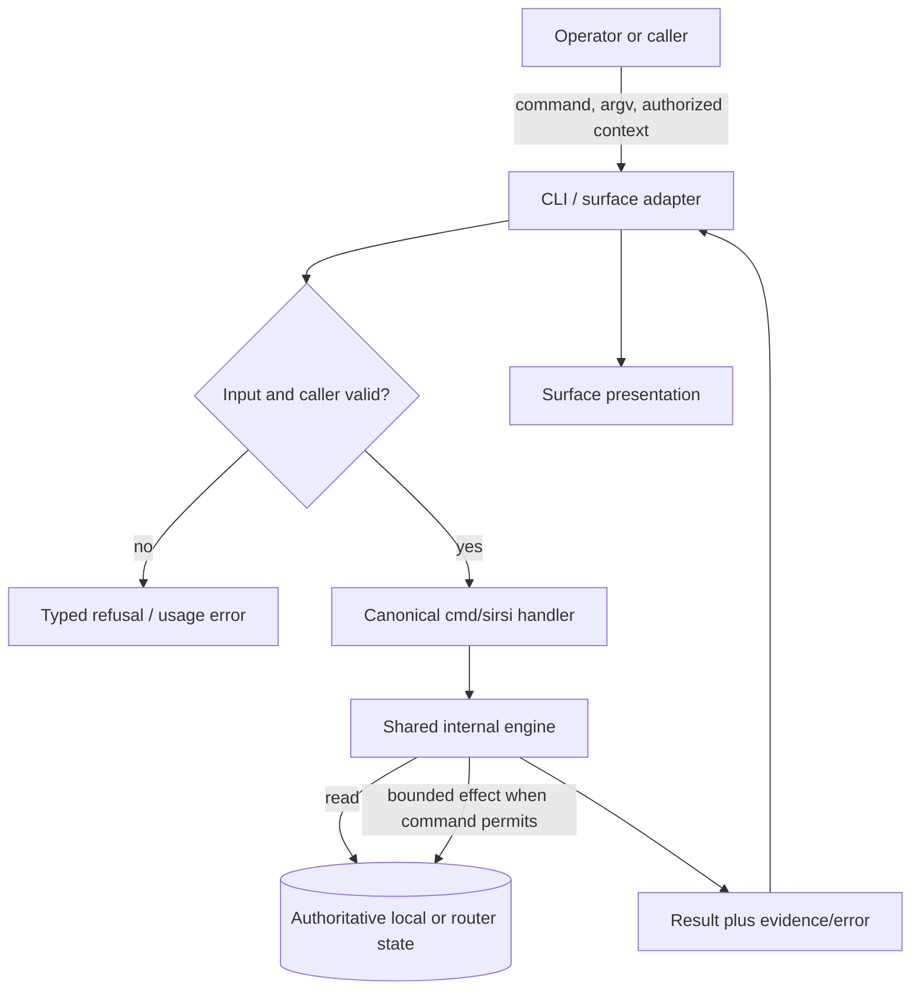
```mermaid
flowchart TD
  U[Operator or caller] -->|command, argv, authorized context| S[CLI / surface adapter]
  S --> V{Input and caller valid?}
  V -->|no| E[Typed refusal / usage error]
  V -->|yes| C[Canonical cmd/sirsi handler]
  C --> D[Shared internal engine]
  D -->|read| A[(Authoritative local or router state)]
  D -->|bounded effect when command permits| A
  D --> R[Result plus evidence/error]
  R --> S --> O[Surface presentation]
```

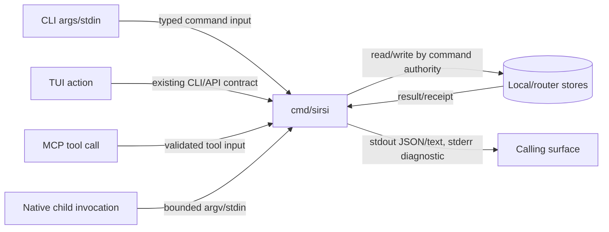
```mermaid
flowchart LR
  CLI[CLI args/stdin] -->|typed command input| CMD[cmd/sirsi]
  TUI[TUI action] -->|existing CLI/API contract| CMD
  MCP[MCP tool call] -->|validated tool input| CMD
  APP[Native child invocation] -->|bounded argv/stdin| CMD
  CMD -->|read/write by command authority| STORE[(Local/router stores)]
  STORE -->|result/receipt| CMD -->|stdout JSON/text, stderr diagnostic| CALLER[Calling surface]
```

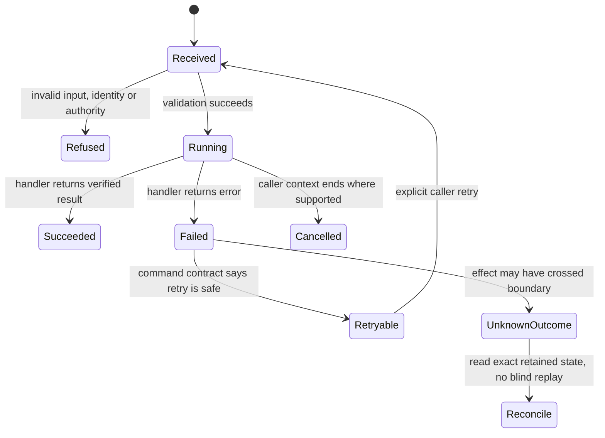
```mermaid
stateDiagram-v2
  [*] --> Received
  Received --> Refused: invalid input, identity or authority
  Received --> Running: validation succeeds
  Running --> Succeeded: handler returns verified result
  Running --> Failed: handler returns error
  Running --> Cancelled: caller context ends where supported
  Failed --> Retryable: command contract says retry is safe
  Failed --> UnknownOutcome: effect may have crossed boundary
  Retryable --> Received: explicit caller retry
  UnknownOutcome --> Reconcile: read exact retained state, no blind replay
```

Recovery rule: commands with effects must use their own idempotency/receipt
contract; no generic replay or rollback is inferred. Cross-surface runtime
identity is still OPEN in the catalog.

## PT-P11 — Native surfaces and bounded child I/O

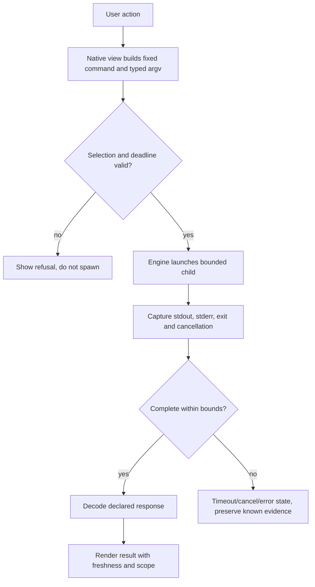
```mermaid
flowchart TD
  A[User action] --> B[Native view builds fixed command and typed argv]
  B --> C{Selection and deadline valid?}
  C -->|no| X[Show refusal, do not spawn]
  C -->|yes| D[Engine launches bounded child]
  D --> E[Capture stdout, stderr, exit and cancellation]
  E --> F{Complete within bounds?}
  F -->|yes| G[Decode declared response]
  F -->|no| H[Timeout/cancel/error state, preserve known evidence]
  G --> I[Render result with freshness and scope]
```

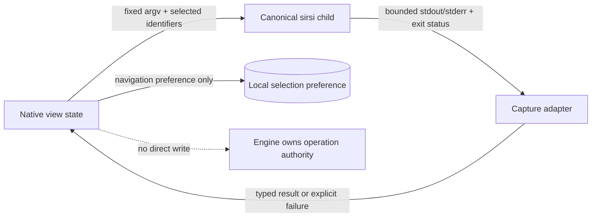
```mermaid
flowchart LR
  UI[Native view state] -->|fixed argv + selected identifiers| CHILD[Canonical sirsi child]
  CHILD -->|bounded stdout/stderr + exit status| CAP[Capture adapter]
  CAP -->|typed result or explicit failure| UI
  UI -->|navigation preference only| PREF[(Local selection preference)]
  UI -. no direct write .-> AUTH[Engine owns operation authority]
```

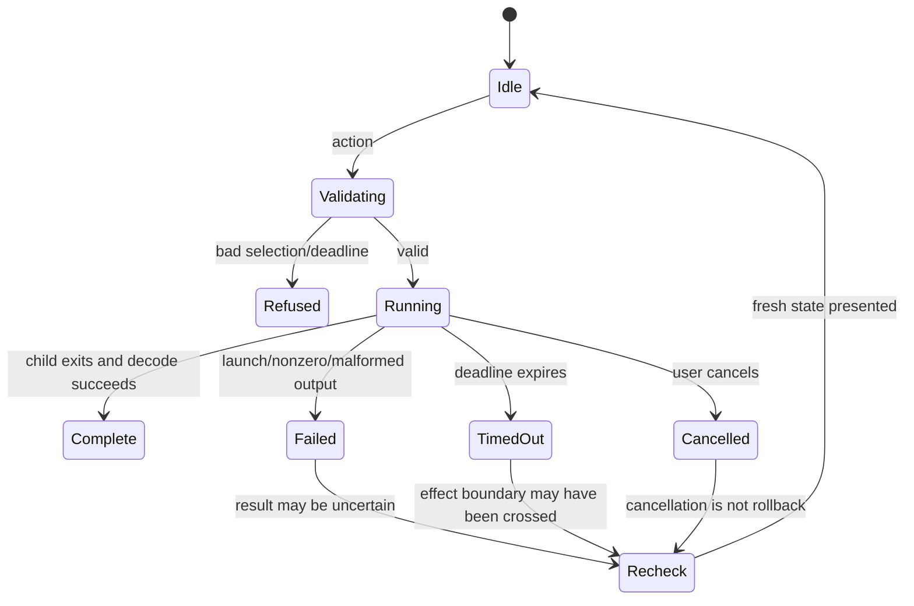
```mermaid
stateDiagram-v2
  [*] --> Idle
  Idle --> Validating: action
  Validating --> Refused: bad selection/deadline
  Validating --> Running: valid
  Running --> Complete: child exits and decode succeeds
  Running --> Failed: launch/nonzero/malformed output
  Running --> TimedOut: deadline expires
  Running --> Cancelled: user cancels
  Failed --> Recheck: result may be uncertain
  TimedOut --> Recheck: effect boundary may have been crossed
  Cancelled --> Recheck: cancellation is not rollback
  Recheck --> Idle: fresh state presented
```

Sequence: native UI → capture adapter → canonical CLI → existing store → adapter
→ UI; bounded waits and caller cancellation govern return. No child output is
interpreted as success without the declared exit/result contract.

## PT-P12 — Native application Quit

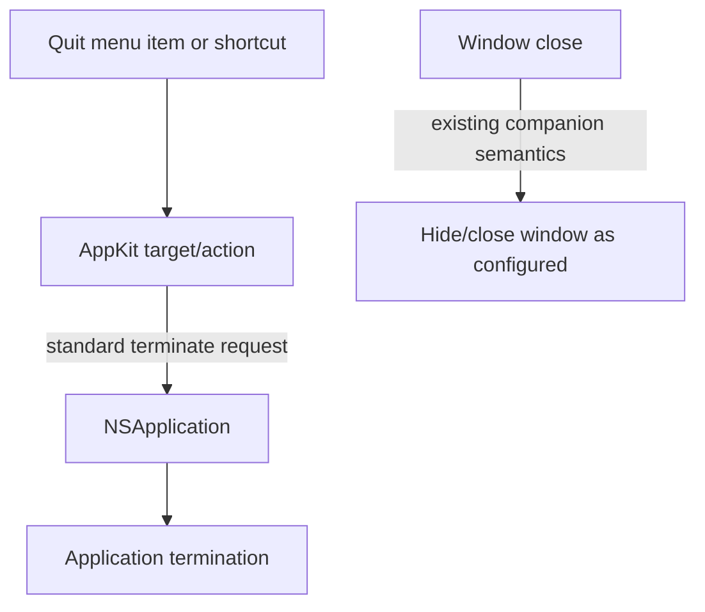
```mermaid
flowchart TD
  K[Quit menu item or shortcut] --> T[AppKit target/action]
  T -->|standard terminate request| APP[NSApplication]
  APP --> STOP[Application termination]
  W[Window close] -->|existing companion semantics| H[Hide/close window as configured]
```

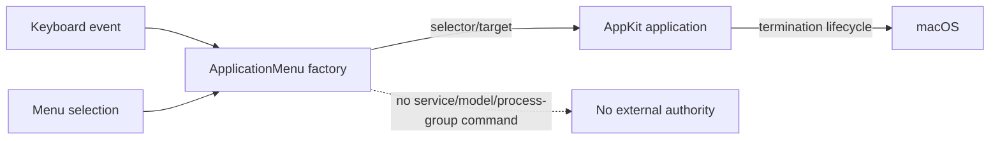
```mermaid
flowchart LR
  KEY[Keyboard event] --> MENU[ApplicationMenu factory]
  ITEM[Menu selection] --> MENU -->|selector/target| APP[AppKit application]
  APP -->|termination lifecycle| OS[macOS]
  MENU -. no service/model/process-group command .-> X[No external authority]
```

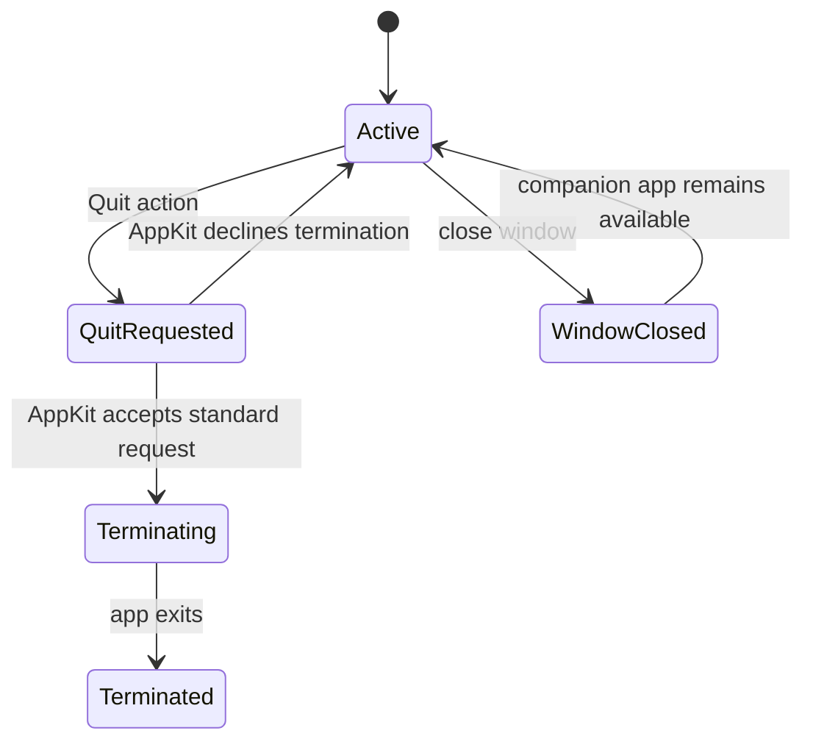
```mermaid
stateDiagram-v2
  [*] --> Active
  Active --> QuitRequested: Quit action
  QuitRequested --> Terminating: AppKit accepts standard request
  Terminating --> Terminated: app exits
  Active --> WindowClosed: close window
  WindowClosed --> Active: companion app remains available
  QuitRequested --> Active: AppKit declines termination
```

Recovery is reopening the application through the normal user route. No daemon,
model, service or process group is terminated. Installed shortcut acceptance
remains OPEN.

## PT-P13 — Native workspace shell

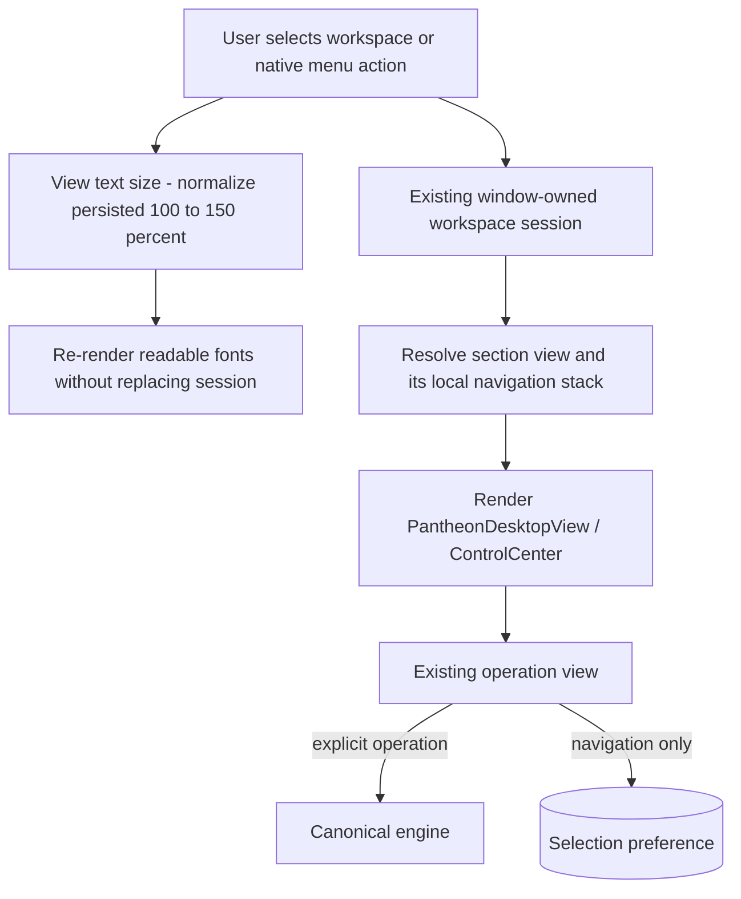
```mermaid
flowchart TD
  U[User selects workspace or native menu action] --> S[Existing window-owned workspace session]
  U --> T[View text size - normalize persisted 100 to 150 percent]
  T --> R[Re-render readable fonts without replacing session]
  S --> N[Resolve section view and its local navigation stack]
  N --> V[Render PantheonDesktopView / ControlCenter]
  V --> A[Existing operation view]
  A -->|explicit operation| E[Canonical engine]
  A -->|navigation only| P[(Selection preference)]
```

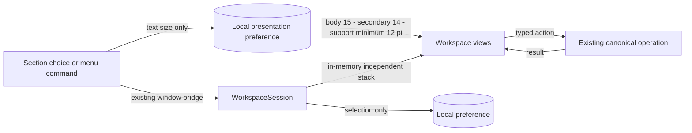
```mermaid
flowchart LR
  USER[Section choice or menu command] -->|existing window bridge| SESSION[WorkspaceSession]
  USER -->|text size only| TYPE[(Local presentation preference)]
  TYPE -->|body 15 - secondary 14 - support minimum 12 pt| VIEW[Workspace views]
  SESSION -->|in-memory independent stack| VIEW[Workspace views]
  SESSION -->|selection only| PREF[(Local preference)]
  VIEW -->|typed action| ENGINE[Existing canonical operation]
  ENGINE -->|result| VIEW
```

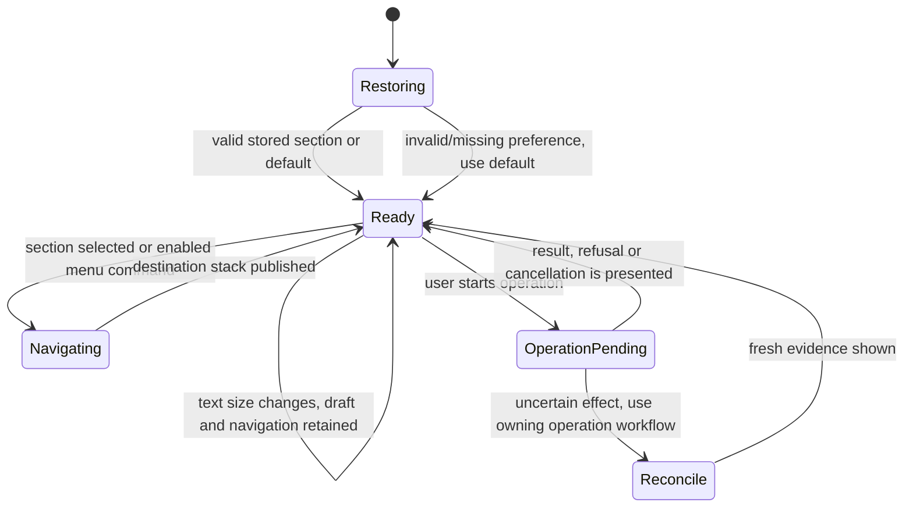
```mermaid
stateDiagram-v2
  [*] --> Restoring
  Restoring --> Ready: valid stored section or default
  Restoring --> Ready: invalid/missing preference, use default
  Ready --> Ready: text size changes, draft and navigation retained
  Ready --> Navigating: section selected or enabled menu command
  Navigating --> Ready: destination stack published
  Ready --> OperationPending: user starts operation
  OperationPending --> Ready: result, refusal or cancellation is presented
  OperationPending --> Reconcile: uncertain effect, use owning operation workflow
  Reconcile --> Ready: fresh evidence shown
```

Native File/Edit/View/Window/Help commands reuse the current workspace and
AppKit first-responder editing. Unavailable actions disable; menu actions never
create a second engine, operation authority, or workspace session.

Recovery: invalid preference falls back to the documented default; it does not
restore operation consent or authority. Tests and fixture renders are listed in
the catalog; signed installed behavior remains separate.

## PT-P14 — Mercury native observer

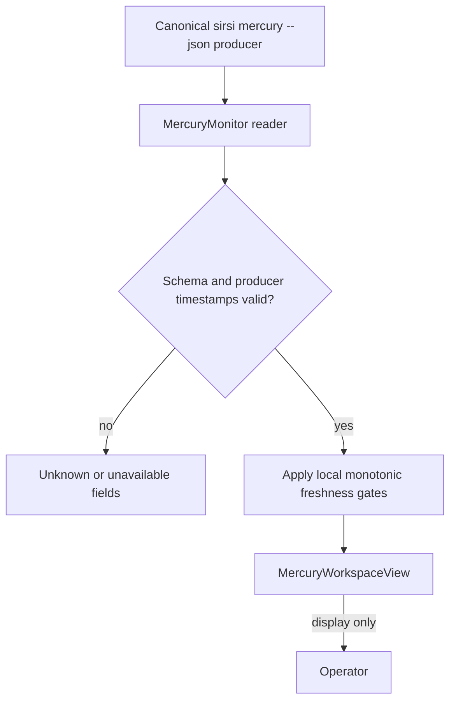
```mermaid
flowchart TD
  SRC[Canonical sirsi mercury --json producer] --> READ[MercuryMonitor reader]
  READ --> VALID{Schema and producer timestamps valid?}
  VALID -->|no| UNKNOWN[Unknown or unavailable fields]
  VALID -->|yes| AGE[Apply local monotonic freshness gates]
  AGE --> VIEW[MercuryWorkspaceView]
  VIEW -->|display only| USER[Operator]
```

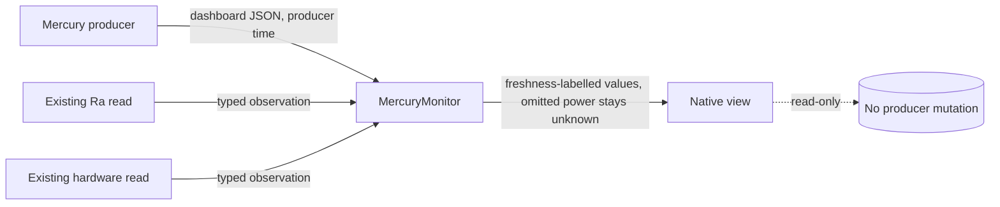
```mermaid
flowchart LR
  ENGINE[Mercury producer] -->|dashboard JSON, producer time| MON[MercuryMonitor]
  RA[Existing Ra read] -->|typed observation| MON
  HW[Existing hardware read] -->|typed observation| MON
  MON -->|freshness-labelled values, omitted power stays unknown| VIEW[Native view]
  VIEW -. read-only .-> SOURCES[(No producer mutation)]
```

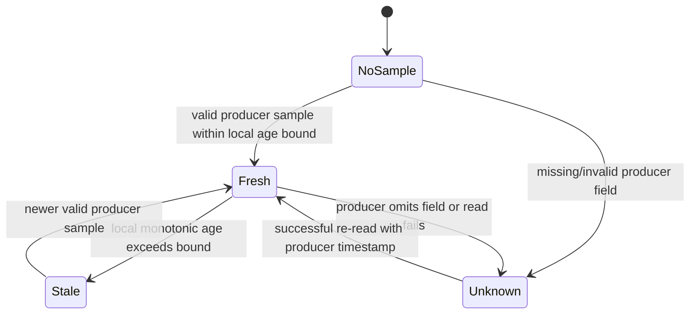
```mermaid
stateDiagram-v2
  [*] --> NoSample
  NoSample --> Fresh: valid producer sample within local age bound
  NoSample --> Unknown: missing/invalid producer field
  Fresh --> Stale: local monotonic age exceeds bound
  Stale --> Fresh: newer valid producer sample
  Fresh --> Unknown: producer omits field or read fails
  Unknown --> Fresh: successful re-read with producer timestamp
```

Sequence is producer → JSON read → freshness gate → view. Recovery is re-read;
failed or omitted data stays unknown. Power omission in dashboard v1 is
intentional and not imputed.

## PT-P15 — Apollo/Ma'at plan continuity

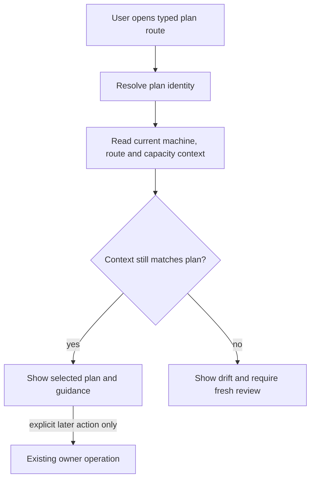
```mermaid
flowchart TD
  U[User opens typed plan route] --> R[Resolve plan identity]
  R --> O[Read current machine, route and capacity context]
  O --> D{Context still matches plan?}
  D -->|yes| P[Show selected plan and guidance]
  D -->|no| G[Show drift and require fresh review]
  P -->|explicit later action only| A[Existing owner operation]
```

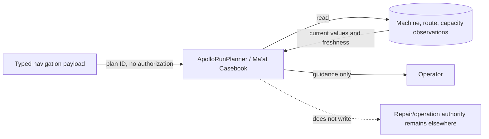
```mermaid
flowchart LR
  ROUTE[Typed navigation payload] -->|plan ID, no authorization| VIEW[ApolloRunPlanner / Ma'at Casebook]
  VIEW -->|read| OBS[(Machine, route, capacity observations)]
  OBS -->|current values and freshness| VIEW
  VIEW -->|guidance only| USER[Operator]
  VIEW -. does not write .-> ENGINE[Repair/operation authority remains elsewhere]
```

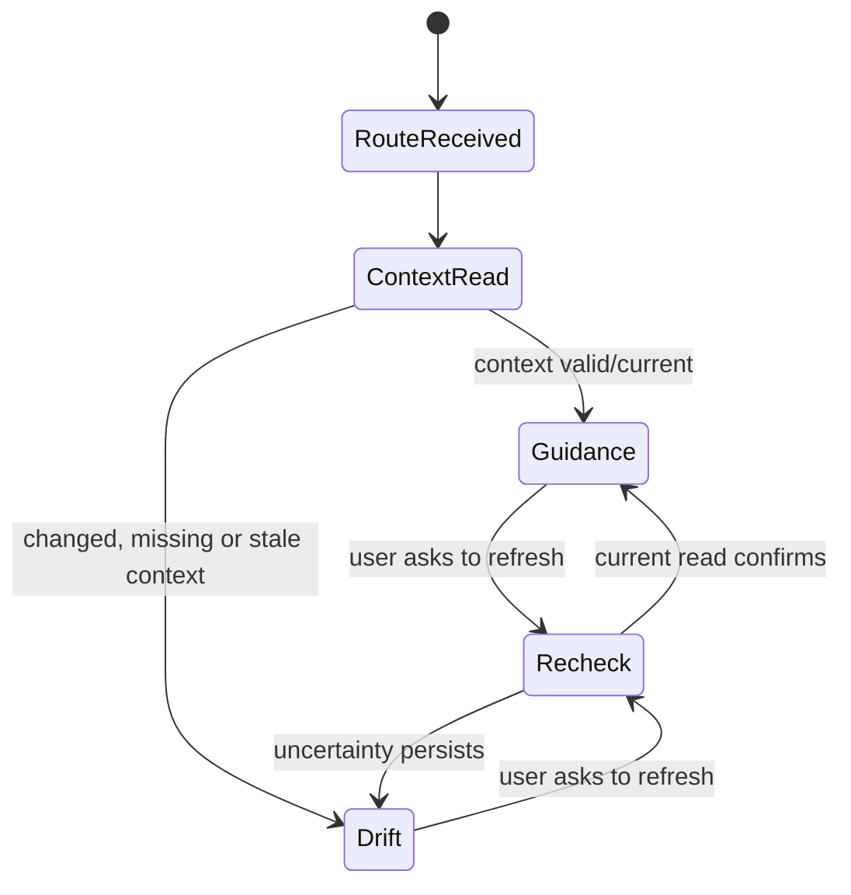
```mermaid
stateDiagram-v2
  [*] --> RouteReceived
  RouteReceived --> ContextRead
  ContextRead --> Guidance: context valid/current
  ContextRead --> Drift: changed, missing or stale context
  Guidance --> Recheck: user asks to refresh
  Drift --> Recheck: user asks to refresh
  Recheck --> Guidance: current read confirms
  Recheck --> Drift: uncertainty persists
```

Recovery is fresh observation and renewed user review; a plan route never
replays repair or silently selects a new machine.

## PT-P16 — Native workspace identity

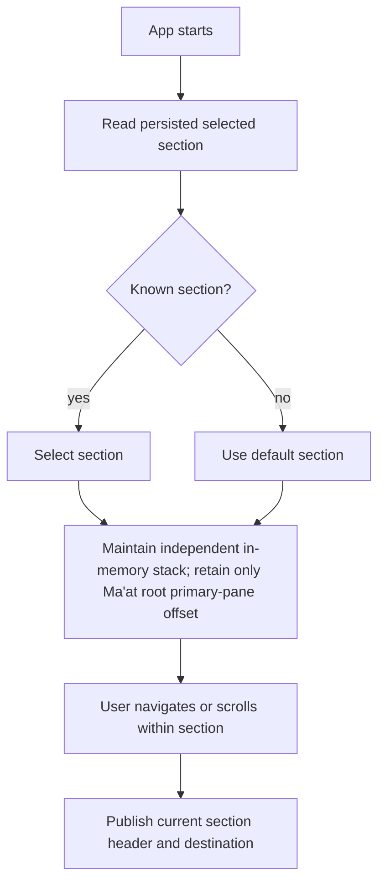
```mermaid
flowchart TD
  START[App starts] --> LOAD[Read persisted selected section]
  LOAD --> VALID{Known section?}
  VALID -->|yes| SEL[Select section]
  VALID -->|no| DEF[Use default section]
  SEL --> STACK[Maintain independent in-memory stack; retain only Ma'at root primary-pane offset]
  DEF --> STACK
  STACK --> NAV[User navigates or scrolls within section]
  NAV --> HEAD[Publish current section header and destination]
```

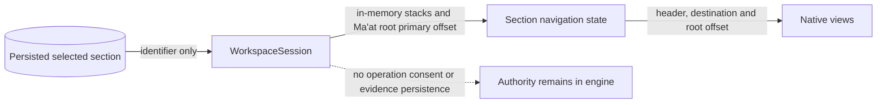
```mermaid
flowchart LR
  PREF[(Persisted selected section)] -->|identifier only| SESSION[WorkspaceSession]
  SESSION -->|in-memory stacks and Ma'at root primary offset| SECTIONS[Section navigation state]
  SECTIONS -->|header, destination and root offset| VIEW[Native views]
  SESSION -. no operation consent or evidence persistence .-> X[Authority remains in engine]
```

```mermaid
stateDiagram-v2
  [*] --> RestoreSelection
  RestoreSelection --> Selected: recognized value
  RestoreSelection --> Defaulted: missing/invalid value
  Selected --> StackA: section A active
  StackA --> StackB: select section B, preserve A stack
  StackB --> StackA: return to A, restore A stack
  Defaulted --> StackA: default section selected
```

Recovery: invalid selection defaults; stacks and the Ma'at root primary-pane
offset are window-session-local. Recovery and detail panes have separate
unbound scroll ownership. Only the selected section persists, and no operation
or confirmation is restored.

## PT-P17 — Native observation freshness

```mermaid
flowchart TD
  REQ[View requests observation] --> CACHE{Explicit live refresh?}
  CACHE -->|no| AGE[Evaluate producer timestamp and monotonic age]
  CACHE -->|yes| READ[Bypass observation cache and read producer]
  AGE -->|fresh| SHOW[Show fresh]
  AGE -->|stale/missing/future| UNK[Show stale/unknown]
  READ -->|valid sample| STORE[Store sample with producer time]
  READ -->|failed read| FAIL[Show failure, do not refresh timestamp]
  STORE --> SHOW
```

```mermaid
flowchart LR
  PROD[Producer] -->|value + producer timestamp| ENGINE[SirsiEngine]
  ENGINE -->|cache keyed to source, freshness metadata| CACHE[(Local observation cache)]
  CACHE -->|age from producer time| VIEW[Native view]
  ENGINE -->|failed read/error| VIEW
  VIEW -. read time never replaces producer time .-> CACHE
```

```mermaid
stateDiagram-v2
  [*] --> Missing
  Missing --> Fresh: valid producer timestamp and value
  Fresh --> Stale: age bound exceeded
  Fresh --> Unknown: timestamp future or invalid
  Stale --> Fresh: newer successful sample
  Stale --> Failed: attempted refresh fails, old sample remains stale
  Failed --> Fresh: later successful refresh
  Failed --> Unknown: no valid prior observation
```

Recovery: retry with a live read; never relabel stale cached data as fresh after
a failed read. Catalog lists regression tests.

## PT-P18 — Native Ra bounded board read

```mermaid
flowchart TD
  U[User opens or refreshes Ra board] --> B[Native adapter starts bounded canonical read]
  B --> P[Optional auth probe capped at 1000 ms]
  P --> R[Existing node-status read under existing 12 s total UI deadline]
  R --> D{Read complete and decodable?}
  D -->|yes| BOARD[Render board with evidence/freshness]
  D -->|no| ERR[Show explicit failure, retain prior evidence]
  ERR --> RETRY[User may explicitly retry]
  RETRY --> B
```

```mermaid
flowchart LR
  VIEW[Board view] -->|bounded args, optional auth probe| ENGINE[SirsiEngine]
  ENGINE -->|canonical read request| CLI[sirsi node-status]
  CLI -->|board data and observation metadata| ENGINE --> VIEW
  CLI -->|stderr/exit/error| ENGINE -->|failure with prior evidence retained| VIEW
```

```mermaid
stateDiagram-v2
  [*] --> Idle
  Idle --> Reading: open/explicit refresh
  Reading --> Loaded: complete valid response
  Reading --> Failed: timeout, cancellation or invalid response
  Failed --> Reading: explicit retry
  Failed --> LoadedStale: prior observation retained but marked old
  Loaded --> Reading: explicit refresh
```

Recovery: retry only by user action; timeout is not an empty-fabric claim.
`RouterBoardReadTests` and the exact installed129 timing observations are
catalogued; successor installation remains OPEN.

## PT-P19 — Ma'at case operation session

```mermaid
flowchart TD
  U[User selects case/action] --> G[Engine-lifetime duplicate/remount guard]
  G -->|already pending| X[Return pending state, do not start second effect]
  G -->|available| PRE[Fresh exact case/action/evidence preflight]
  PRE -->|changed/invalid/partial| REF[Refuse and retain evidence]
  PRE -->|valid| REVIEW[Show exact action and consequence]
  REVIEW -->|explicit consent| GO[Canonical Go effect authority]
  REVIEW -->|cancel| CANCEL[Retain cancelled/review state]
  GO --> OUT[Read exact operation result/receipt]
```

```mermaid
flowchart LR
  CASE[(Ma'at case and evidence)] -->|fresh exact lookup| NATIVE[MaatOperationState / Casebook]
  NATIVE -->|confirmed typed request| CLI[Canonical Go command]
  CLI -->|authorized effect + receipt| STORE[(Canonical local store)]
  STORE -->|exact result| CLI --> NATIVE
  NATIVE -. no native duplicate effect .-> X[Go owns effect authority]
```

```mermaid
stateDiagram-v2
  [*] --> Idle
  Idle --> Preflight: action selected
  Preflight --> Refused: changed/invalid evidence
  Preflight --> Review: exact preflight passes
  Review --> Cancelled: user cancels
  Review --> Running: explicit consent
  Running --> Succeeded: exact receipt confirms
  Running --> Failed: command fails
  Running --> Unknown: result cannot establish outcome
  Failed --> Preflight: reviewed retry with fresh evidence
  Unknown --> Reconcile: inspect same retained operation
  Reconcile --> Succeeded: matching receipt
  Reconcile --> Review: proven no operation, new consent required
```

Recovery uses same operation evidence and fresh preflight. A retry is not
implicit, and changed evidence blocks reuse. Catalog lists duplicate/remount,
changed-evidence and reviewed-retry fixtures.

## PT-P20 — Native project selection

```mermaid
flowchart TD
  U[User chooses repository in Finder] --> C[Capture selected path]
  C --> V{Path is a Git root/worktree?}
  V -->|yes| APPLY[Set current project root]
  V -->|no/error| KEEP[Retain prior root and show retry guidance]
  APPLY --> VIEW[Project-scoped workflows use selected root]
```

```mermaid
flowchart LR
  FINDER[Finder selection] -->|explicit path| VIEW[Native view]
  VIEW -->|validate Git root/worktree| ENGINE[SirsiEngine]
  ENGINE -->|valid root| STATE[(Current project root)]
  ENGINE -->|error| VIEW
  VIEW -. no arbitrary home scan .-> HOME[Other repositories remain untouched]
```

```mermaid
stateDiagram-v2
  [*] --> ExistingRoot
  ExistingRoot --> Selecting: explicit user selection
  Selecting --> Selected: validation passes
  Selecting --> Rejected: invalid root or read error
  Rejected --> ExistingRoot: previous root remains active
  Rejected --> Selecting: user retries
  Selected --> ExistingRoot: user selects another valid root
```

Recovery is explicit reselection; no default scan or destructive cleanup occurs.

## Sequence views for surface-crossing processes

### PT-P01 — Shared engine call ordering

```mermaid
sequenceDiagram
  participant Surface as CLI/TUI/MCP/Native surface
  participant Command as cmd/sirsi adapter
  participant Engine as internal engine
  participant Store as authoritative store
  Surface->>Command: typed command, identity and bounded input
  Command->>Engine: validated operation
  Engine->>Store: authorized read or effect
  Store-->>Engine: result and receipt
  Engine-->>Command: typed result/error
  Command-->>Surface: stdout response, diagnostics on stderr
```

### PT-P11 — Native child I/O

```mermaid
sequenceDiagram
  participant User
  participant UI as Native UI
  participant Capture as bounded child capture
  participant CLI as canonical sirsi CLI
  User->>UI: explicit action and selection
  UI->>Capture: fixed argv, deadline and cancellation scope
  Capture->>CLI: spawn selected command
  CLI-->>Capture: bounded stdout/stderr and exit status
  Capture-->>UI: typed result or timeout/error
  UI-->>User: result with scope and freshness
```

### PT-P13 — Workspace navigation and operation handoff

```mermaid
sequenceDiagram
  participant User
  participant Session as WorkspaceSession
  participant View as selected workspace view
  participant Engine as existing operation engine
  User->>Session: select section/destination
  Session-->>View: independent section stack and header
  User->>View: choose an explicit operation
  View->>Engine: typed operation request
  Engine-->>View: result or refusal
  View-->>User: truthful operation state
```

### PT-P14 — Mercury observation

```mermaid
sequenceDiagram
  participant Producer as sirsi mercury --json / existing sources
  participant Monitor as MercuryMonitor
  participant Fresh as freshness gate
  participant View as MercuryWorkspaceView
  Producer-->>Monitor: payload and producer timestamps
  Monitor->>Fresh: typed fields and source times
  Fresh-->>View: fresh, stale or unknown projection
  View-->>View: omitted power remains unknown
```

### PT-P15 — Plan context refresh

```mermaid
sequenceDiagram
  participant User
  participant Route as typed route
  participant View as Apollo/Ma'at plan view
  participant Observations as machine/route/capacity sources
  User->>Route: open selected plan
  Route-->>View: plan identity only
  View->>Observations: read current context
  Observations-->>View: values, freshness and drift
  View-->>User: guidance or re-review request, no repair replay
```

### PT-P18 — Ra board read

```mermaid
sequenceDiagram
  participant User
  participant View as Ra board view
  participant Engine as SirsiEngine
  participant CLI as node-status
  User->>View: open or explicitly refresh
  View->>Engine: bounded read request
  Engine->>CLI: bounded auth probe then canonical read
  CLI-->>Engine: board data, evidence or failure
  Engine-->>View: result, preserve prior evidence on failure
  View-->>User: board or explicit error/retry
```

### PT-P19 — Ma'at operation

```mermaid
sequenceDiagram
  participant User
  participant Native as Casebook + operation guard
  participant CLI as canonical Go command
  participant Store as authoritative case/effect store
  User->>Native: select case/action
  Native->>CLI: fresh exact preflight
  CLI->>Store: read current case/evidence
  Store-->>CLI: exact preflight result
  CLI-->>Native: reviewable plan or refusal
  User->>Native: explicit confirmation
  Native->>CLI: one typed confirmed request
  CLI->>Store: authorized effect and receipt
  Store-->>CLI: exact result
  CLI-->>Native: receipt or unresolved status
```

### PT-P20 — Project selection

```mermaid
sequenceDiagram
  participant User
  participant Finder
  participant View as Native project selector
  participant Engine as SirsiEngine
  User->>Finder: choose repository
  Finder-->>View: selected path
  View->>Engine: validate Git root/worktree
  alt valid
    Engine-->>View: accepted root
    View-->>User: project context updated
  else invalid or unreadable
    Engine-->>View: error
    View-->>User: previous root retained, retry guidance
  end
```

### PT-P16 — Workspace identity sequence

```mermaid
sequenceDiagram
  participant App as Pantheon app
  participant Pref as selected-workspace preference
  participant Session as WorkspaceSession
  participant View as section view
  App->>Pref: read selected section
  Pref-->>Session: valid identifier or missing/invalid value
  Session->>Session: select known section or documented default
  Session-->>View: independent in-memory destination stack; Ma'at root primary offset at depth zero
  View-->>Session: navigation event
  Session-->>View: updated destination/header
```

### PT-P17 — Observation freshness sequence

```mermaid
sequenceDiagram
  participant View
  participant Engine as SirsiEngine
  participant Cache as local observation cache
  participant Producer
  View->>Engine: request observation
  Engine->>Cache: inspect sample and producer timestamp
  alt no explicit live refresh and sample fresh
    Cache-->>Engine: fresh observation
  else stale/missing or explicit refresh
    Engine->>Producer: perform bounded live read
    Producer-->>Engine: sample and producer timestamp or error
    Engine->>Cache: store only successful sample with producer time
  end
  Engine-->>View: fresh/stale/unknown/error projection
```
